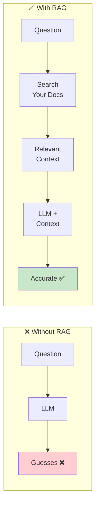
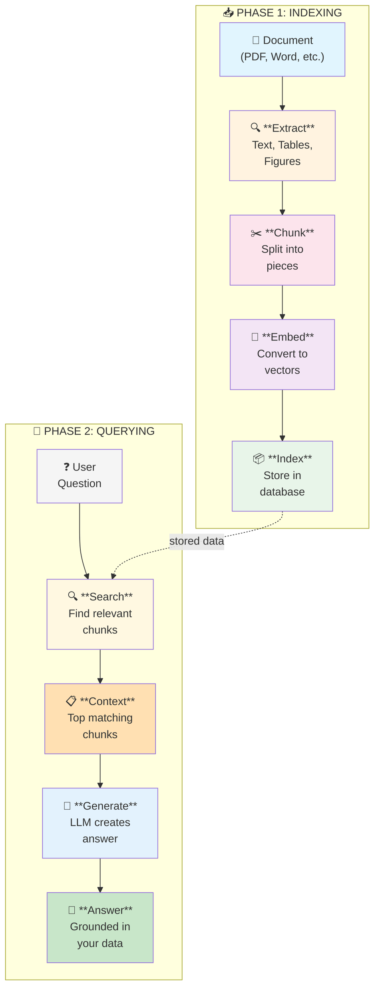

# RAG & Multimodal Knowledge Workshop

> Learn to build production-grade RAG systems that actually work on real documents.

---

## 🤔 What is RAG?

**RAG** stands for **Retrieval-Augmented Generation**. 

In simple terms: **Give the AI your documents as a "cheat sheet" so it answers from YOUR data, not from its imagination.**

### The Problem RAG Solves

Large Language Models (LLMs) like GPT-4 are incredibly smart, but they have a big problem:

> **They don't know YOUR stuff!**

LLMs are trained on public internet data. They've never seen:
- 📄 Your company's internal documents
- 📊 Your product specifications  
- 📋 Your policies and procedures
- 🗺️ Your project plans

**When you ask about YOUR documents, the LLM guesses... and often gets it wrong (hallucination).**

```
┌─────────────────────────────────────────────────────────────────────┐
│  YOU: "How many entrances does Metro Station 36 have?"              │
│                                                                     │
│  ❌ LLM WITHOUT RAG:                                                │
│     "Typical metro stations have 2-4 entrances..."                  │
│     (WRONG - it's guessing based on general knowledge!)             │
│                                                                     │
│  ✅ LLM WITH RAG:                                                   │
│     "According to the Station 36 specification document,            │
│     the station has 3 entrances: North, South, and West."           │
│     (CORRECT - from YOUR actual data!)                              │
└─────────────────────────────────────────────────────────────────────┘
```

### The RAG Solution

Instead of hoping the LLM knows the answer, we:

1. **📦 Store** your documents in a searchable database
2. **🔍 Search** for relevant parts when a user asks a question
3. **📋 Give** those parts to the LLM as context
4. **💬 Generate** an answer based on YOUR data



---

## 🔄 The RAG Pipeline

RAG has two main phases:

### Phase 1: Indexing (Done Once)
Process your documents and store them in a searchable format.

### Phase 2: Querying (Every Question)
Search for relevant content and generate an answer.



---

## 🗺️ Workshop Journey Map

This workshop teaches you to build RAG systems step by step. Each module covers one part of the pipeline:

```mermaid
flowchart LR
    subgraph M0["Module 0"]
        S0["⚙️ Setup<br/>Azure Resources"]
    end
    
    subgraph M1["Module 1"]
        S1["❌ Naive RAG<br/>(See it fail!)"]
    end
    
    subgraph M2["Module 2"]
        S2["🔍 Document<br/>Intelligence"]
    end
    
    subgraph M3["Module 3"]
        S3["🧠 Content<br/>Understanding"]
    end
    
    subgraph M4["Module 4"]
        S4["✂️ Smart<br/>Chunking"]
    end
    
    subgraph M5["Module 5"]
        S5["🔎 Search<br/>& Retrieval"]
    end
    
    subgraph M6["Module 6"]
        S6["🕸️ GraphRAG<br/>Advanced"]
    end
    
    subgraph M7["Module 7"]
        S7["🚀 Full<br/>Pipeline"]
    end
    
    M0 --> M1 --> M2 --> M3 --> M4 --> M5 --> M6 --> M7
    
    style M1 fill:#ffcdd2
    style M2 fill:#fff3e0
    style M3 fill:#fff3e0
    style M4 fill:#fce4ec
    style M5 fill:#e8f5e9
    style M6 fill:#e3f2fd
    style M7 fill:#c8e6c9
```



---

## 📚 What Each Module Covers

| Module | What You Learn | Pipeline Stage |
|--------|----------------|----------------|
| **Module 0** | [Setup Azure Resources](modules/module-0-setup/README.md) | Prerequisites |
| **Module 1** | [Why Naive RAG Fails](modules/module-1-naive-rag/README.md) | See the problem first! |
| **Module 2** | [Document Intelligence](modules/module-2-doc-intelligence/README.md) | 📄 → Extract text, tables, figures |
| **Module 3** | [Content Understanding](modules/module-3-content-understanding/README.md) | 📄 → AI-powered semantic extraction |
| **Module 4** | [Chunking Strategies](modules/module-4-chunking/README.md) | ✂️ Smart splitting (critical!) |
| **Module 5** | [Search & Retrieval](modules/module-5-search/README.md) | 🧮📦🔍 Embeddings, indexing, search |
| **Module 6** | [GraphRAG](modules/module-6-graphrag/README.md) | 🕸️ Cross-document reasoning |
| **Module 7** | [Full Production Pipeline](modules/module-7-pipeline/README.md) | 🚀 End-to-end system with UI |

---

## ⏱️ Workshop Duration

**Full Workshop**: ~10 hours  
**Essential Path** (Modules 0-2, 4-5): ~5.5 hours  
**With Production Demo** (Essential + Module 7): ~7.5 hours

> 💡 Modules 3 and 6 are optional but recommended for advanced scenarios.

---

## 🛠️ Technology Stack

| What | Technology | Why |
|------|------------|-----|
| Extract text from documents | Azure AI Document Intelligence | Preserves tables, figures, structure |
| AI content understanding | Azure AI Content Understanding | Semantic field extraction |
| Store & search | Azure AI Search | Vector + keyword + semantic search |
| Generate answers | Azure OpenAI GPT-4.1 | Best reasoning capability |
| Create vectors | Azure OpenAI text-embedding-3-large | Best embedding model |
| Graph reasoning | Microsoft GraphRAG | Cross-document relationships |

---

## 🚀 Quick Start

### Prerequisites
- Azure subscription (Owner or Contributor access)
- Python 3.11+
- VS Code with Python extension
- Git

**Ready to begin?** Head to **[Module 0 - Setup](modules/module-0-setup/README.md)** for complete setup instructions.

---

## ➡️ Start Here

Ready to begin? Start with **[Module 0: Setup](modules/module-0-setup/README.md)**

---

## � Credits

### Created By

**[Roie Ben Haim](https://www.linkedin.com/in/roie9876/)** - Solution Specialist Azure at Microsoft

With over 20 years of experience in data center technologies and over 6 years at Microsoft, Roie focuses on helping public sector and regulated customers adopt cutting-edge AI and cloud solutions. His expertise includes delivering demos and PoCs using Azure OpenAI, RAG, and Cognitive Services, and facilitating discussions around security, compliance, and data governance.

At Microsoft, he collaborates with engineering, product, and executive teams to deliver workshops and technical enablement sessions, accelerating AI decision-making and cloud modernization initiatives. With certifications such as VCDX-NV and CCIE and a deep focus on Generative AI and LLM integration, Roie is committed to driving transformative innovation in sensitive and regulated environments.

### Reviewed By

**[Maayan Luxemburg](https://www.linkedin.com/in/maayan-luxemburg-0374a882/)** - Cloud Solution Architect at Microsoft

Special thanks to Maayan for her thorough technical review, valuable feedback, and dedication to ensuring this workshop meets the highest quality standards. Her expertise in AI and cloud solutions helped shape the content into a truly comprehensive learning experience.

---

## �📄 License

MIT License
