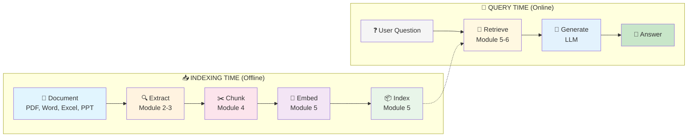

# RAG & Multimodal Knowledge Workshop

> Build production-grade RAG systems for complex technical documents using Microsoft AI technologies.

## 🎯 What You'll Learn

Move from:
> "RAG = embeddings + vector search"

To:
> "RAG = document understanding + chunking strategy + retrieval orchestration"

## 🔄 The RAG Pipeline



## 📚 Workshop Modules

| Module | Topic | Pipeline Stage | Duration |
|--------|-------|----------------|----------|
| **Module 0** | [Environment Setup](modules/module-0-setup/README.md) | Setup | 20 min |
| **Module 1** | [The Problem with Naive RAG](modules/module-1-naive-rag/README.md) | 📄 → ✂️ (Failure!) | 1 hour |
| **Module 2** | [Document Intelligence](modules/module-2-doc-intelligence/README.md) | 🔍 Extract | 1 hour |
| **Module 3** | [Content Understanding](modules/module-3-content-understanding/README.md) | 🔍 Extract (Semantic) | 1.25 hours |
| **Module 4** | [Chunking Strategies](modules/module-4-chunking/README.md) | ✂️ Chunk | 1.5 hours |
| **Module 5** | [Embeddings, Indexing & Retrieval](modules/module-5-search/README.md) | 🧮 📦 🔎 | 4 hours |
| **Module 6** | [GraphRAG](modules/module-6-graphrag/README.md) | 🔎 Advanced | 2 hours |

**Total Duration**: ~11 hours (full workshop) or select modules for shorter sessions.

## 🛠️ Technology Stack

| Component | Technology |
|-----------|------------|
| Document Processing | Azure AI Document Intelligence |
| Semantic Extraction | Azure AI Content Understanding |
| Search & Retrieval | Azure AI Search (vector + hybrid + semantic) |
| LLM Orchestration | Azure AI Foundry |
| Text & Vision | Azure OpenAI GPT-4.1 |
| Embeddings | Azure OpenAI text-embedding-3-large |
| Graph Processing | Microsoft GraphRAG |

## 🚀 Quick Start

### Prerequisites
- Azure subscription with Owner or Contributor access
- Python 3.11+ 
- VS Code with Python extension
- Git

### 1. Clone the Repository
```bash
git clone https://github.com/your-org/RAG-WorkShop.git
cd RAG-WorkShop
```

### 2. Deploy Azure Resources
```bash
cd infra
chmod +x deploy.sh
./deploy.sh
```

### 3. Install Dependencies
```bash
pip install -r requirements.txt
```

### 4. Validate Setup
Open `modules/module-0-setup/health-check.ipynb` and run all cells.

## 📁 Project Structure

```
RAG-WorkShop/
├── modules/           # Workshop modules (0-6)
│   ├── module-0-setup/
│   ├── module-1-naive-rag/
│   ├── module-2-doc-intelligence/
│   ├── module-3-content-understanding/
│   ├── module-4-chunking/
│   ├── module-5-search/
│   └── module-6-graphrag/
├── src/               # Shared Python utilities
├── data/              # Sample documents
│   ├── sample-pdfs/
│   └── sample-office/
├── infra/             # Azure Bicep templates
├── .dev/              # PRD and progress tracking
├── .env.template      # Environment variable template
└── requirements.txt   # Python dependencies
```

## 🌍 Supported Regions

**Recommended**: `swedencentral` (EU data residency, full feature support)

| Service | swedencentral | westus | australiaeast |
|---------|--------------|--------|---------------|
| Content Understanding (GA) | ✅ | ✅ | ✅ |
| Azure AI Search | ✅ | ✅ | ✅ |
| Azure OpenAI GPT-4.1 | ✅ | ✅ | ✅ |
| Document Intelligence | ✅ | ✅ | ✅ |

## 📖 Documentation

- [Full PRD](.dev/PRD.md) - Complete workshop specification (internal)
- [API Reference Links](.dev/PRD.md#appendix-c-api-reference-quick-links)

## 🤝 Contributing

Contributions welcome! Please read the PRD for architectural guidelines.

## 📄 License

MIT License - see LICENSE file for details.
