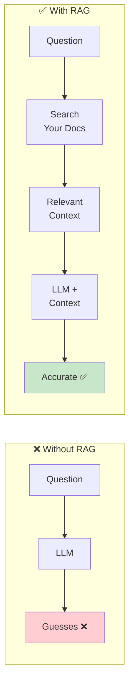
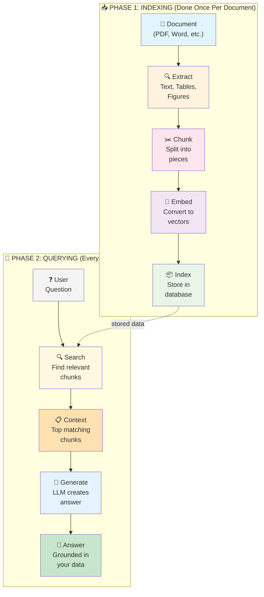
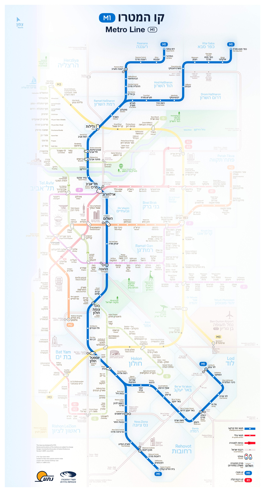

# RAG & Multimodal Knowledge Workshop

> Learn to build production-grade RAG systems that actually work on real documents.

---

## 🤔 What is RAG?

**RAG** stands for **Retrieval-Augmented Generation**. 

In simple terms: **Give the AI your documents as a "cheat sheet" so it answers from YOUR data, not from its imagination.**

### The Problem RAG Solves

Large Language Models (LLMs) like GPT-4 are incredibly smart, but they have a big problem:

> **They don't know YOUR stuff!**

LLMs are trained on public internet data. They've never seen:
- 📄 Your company's internal documents
- 📊 Your product specifications  
- 📋 Your policies and procedures
- 🗺️ Your project plans

**When you ask about YOUR documents, the LLM guesses... and often gets it wrong (hallucination).**

```
┌─────────────────────────────────────────────────────────────────────┐
│  YOU: "How many entrances does Metro Station 36 have?"              │
│                                                                     │
│  ❌ LLM WITHOUT RAG:                                                │
│     "Typical metro stations have 2-4 entrances..."                  │
│     (WRONG - it's guessing based on general knowledge!)             │
│                                                                     │
│  ✅ LLM WITH RAG:                                                   │
│     "According to the Station 36 specification document,            │
│     the station has 3 entrances: North, South, and West."           │
│     (CORRECT - from YOUR actual data!)                              │
└─────────────────────────────────────────────────────────────────────┘
```

### The RAG Solution

Instead of hoping the LLM knows the answer, we:

1. **📦 Store** your documents in a searchable database
2. **🔍 Search** for relevant parts when a user asks a question
3. **📋 Give** those parts to the LLM as context
4. **💬 Generate** an answer based on YOUR data



---

## 🔄 The RAG Pipeline

RAG has two main phases:

### Phase 1: Indexing (Done Once)
Process your documents and store them in a searchable format.

### Phase 2: Querying (Every Question)
Search for relevant content and generate an answer.



---

## 🗺️ Workshop Journey Map

This workshop teaches you to build RAG systems step by step. Each module covers one part of the pipeline:

```mermaid
flowchart LR
    subgraph M0["Module 0"]
        S0["⚙️ Setup<br/>Azure Resources"]
    end
    
    subgraph M1["Module 1"]
        S1["❌ Naive RAG<br/>(See it fail!)"]
    end
    
    subgraph M2["Module 2"]
        S2["🔍 Document<br/>Intelligence"]
    end
    
    subgraph M3["Module 3"]
        S3["🧠 Content<br/>Understanding"]
    end
    
    subgraph M4["Module 4"]
        S4["✂️ Smart<br/>Chunking"]
    end
    
    subgraph M5["Module 5"]
        S5["🔎 Search<br/>& Retrieval"]
    end
    
    subgraph M6["Module 6"]
        S6["🕸️ GraphRAG<br/>Advanced"]
    end
    
    subgraph M7["Module 7"]
        S7["🚀 Full<br/>Pipeline"]
    end
    
    M0 --> M1 --> M2 --> M3 --> M4 --> M5 --> M6 --> M7
    
    style M1 fill:#ffcdd2
    style M2 fill:#fff3e0
    style M3 fill:#fff3e0
    style M4 fill:#fce4ec
    style M5 fill:#e8f5e9
    style M6 fill:#e3f2fd
    style M7 fill:#c8e6c9
```



---

## 📚 What Each Module Covers

| Module | What You Learn | Pipeline Stage |
|--------|----------------|----------------|
| **Module 0** | [Setup Azure Resources](modules/module-0-setup/README.md) | Prerequisites |
| **Module 1** | [Why Naive RAG Fails](modules/module-1-naive-rag/README.md) | See the problem first! |
| **Module 2** | [Document Intelligence](modules/module-2-doc-intelligence/README.md) | 📄 → Extract text, tables, figures |
| **Module 3** | [Content Understanding](modules/module-3-content-understanding/README.md) | 📄 → AI-powered semantic extraction |
| **Module 4** | [Chunking Strategies](modules/module-4-chunking/README.md) | ✂️ Smart splitting (critical!) |
| **Module 5** | [Search & Retrieval](modules/module-5-search/README.md) | 🧮📦🔍 Embeddings, indexing, search |
| **Module 6** | [GraphRAG](modules/module-6-graphrag/README.md) | 🕸️ Cross-document reasoning |
| **Module 7** | [Full Production Pipeline](modules/module-7-pipeline/README.md) | 🚀 End-to-end system with UI |

### Module Details

#### Module 0: Setup
Get your Azure environment ready. Deploy Document Intelligence, Azure OpenAI, and Azure AI Search.

#### Module 1: The Problem (Naive RAG)
**Why start with failure?** Because you need to see WHY the techniques in Modules 2-6 matter.
- Try basic text extraction + fixed-size chunking
- Watch it fail on tables, figures, and complex layouts
- Understand what we need to fix

#### Module 2: Document Intelligence  
Extract structured content from documents:
- Text with reading order (not just OCR dump)
- Tables with rows and columns preserved
- Figure locations (bounding boxes)

#### Module 3: Content Understanding
Use AI to understand document semantics:
- Automatic field extraction
- Figure descriptions
- Semantic structure

#### Module 4: Chunking Strategies
**This is where most RAG systems fail!** Learn to chunk smartly:
- Don't split tables in half
- Keep figures with their context
- Preserve section structure

#### Module 5: Search & Retrieval
Build your search system:
- Create embeddings (convert text to vectors)
- Index in Azure AI Search
- Hybrid search (vector + keyword)
- Semantic ranking

#### Module 6: GraphRAG
Advanced: Cross-document reasoning
- Build knowledge graphs
- Answer questions that span multiple documents
- "What depends on X?" queries

#### Module 7: Full Production Pipeline
Put it all together in a working application:
- Complete document processing pipeline
- Dual indexing (Vector + GraphRAG)
- Iterative entity-aware retrieval
- Answer validation
- React frontend with real-time chat

---

## ⏱️ Workshop Duration

| Module | Duration | Can Skip? |
|--------|----------|-----------|
| Module 0 | 20 min | No (required setup) |
| Module 1 | 45 min | No (important motivation) |
| Module 2 | 1 hour | No |
| Module 3 | 1 hour | Yes (optional) |
| Module 4 | 1.5 hours | No (critical!) |
| Module 5 | 2 hours | No |
| Module 6 | 2 hours | Yes (advanced) |
| Module 7 | 2 hours | Yes (production demo) |

**Full Workshop**: ~10 hours  
**Essential Path** (Modules 0-2, 4-5): ~5.5 hours  
**With Production Demo** (Essential + Module 7): ~7.5 hours

---

## 🛠️ Technology Stack

| What | Technology | Why |
|------|------------|-----|
| Extract text from documents | Azure AI Document Intelligence | Preserves tables, figures, structure |
| AI content understanding | Azure AI Content Understanding | Semantic field extraction |
| Store & search | Azure AI Search | Vector + keyword + semantic search |
| Generate answers | Azure OpenAI GPT-4.1 | Best reasoning capability |
| Create vectors | Azure OpenAI text-embedding-3-large | Best embedding model |
| Graph reasoning | Microsoft GraphRAG | Cross-document relationships |

---

## 🚀 Quick Start

### Prerequisites
- Azure subscription (Owner or Contributor access)
- Python 3.11+ 
- VS Code with Python extension
- Git

### Step 1: Clone the Repository
```bash
git clone https://github.com/your-org/RAG-WorkShop.git
cd RAG-WorkShop
```

### Step 2: Install Python Dependencies
```bash
pip install -r requirements.txt
```

### Step 3: Setup Azure Resources & Validate
Open **[Module 0 - Setup](modules/module-0-setup/README.md)** and follow the interactive notebooks:

1. `setup.ipynb` - Deploy Azure resources and configure environment
2. `health-check.ipynb` - Validate all connections

> 💡 **Advanced users**: You can also run `./infra/deploy.sh` directly from the command line.

---

## 📁 Project Structure

```
RAG-WorkShop/
├── modules/                    # Workshop modules
│   ├── module-0-setup/         # Azure setup & validation
│   ├── module-1-naive-rag/     # See RAG fail (motivation)
│   ├── module-2-doc-intelligence/  # Extract content
│   ├── module-3-content-understanding/  # Semantic extraction
│   ├── module-4-chunking/      # Chunking strategies
│   ├── module-5-search/        # Embeddings & search
│   ├── module-6-graphrag/      # Graph reasoning
│   └── module-7-pipeline/      # Full production pipeline
├── data/                       # Sample documents
│   ├── sample-pdfs/            # Metro station PDFs
│   └── sample-office/          # Word, Excel, PowerPoint
├── src/                        # Shared Python utilities
├── infra/                      # Azure deployment (Bicep)
└── requirements.txt            # Python dependencies
```

---

## � Sample Dataset: Israel M1 Metro Line

Throughout this workshop, we use real planning documents from the **Israel M1 Metro Line** project as our example dataset.



### Why This Dataset?

The M1 Metro Line documents are perfect for learning RAG because they contain:

| Content Type | Example | RAG Challenge |
|--------------|---------|---------------|
| **Tables** | Station passenger counts, construction timelines | Structure gets destroyed in naive extraction |
| **Figures** | Metro maps, station layouts, architectural diagrams | Visual info is completely lost |
| **Hebrew + English** | Bilingual content throughout | Multilingual handling |
| **Cross-references** | "See Station 36 details on page 12" | Context fragmentation |

### Sample Documents

| File | Format | Contains |
|------|--------|----------|
| `metro-s35.pdf` - `metro-s41.pdf` | PDF | Individual station specifications (7 stations) |
| `m1s-s35-s41.pdf` | PDF | Combined document with all 7 stations |
| `Metro_M1_Rishon_Stations_Detailed.pptx` | PowerPoint | Station overview slides with images |
| `m1-map.docx` | Word | Metro line route descriptions |

### Where to Find Them

```
data/
├── sample-pdfs/                    # PDF documents
│   ├── metro-s35.pdf               # Station 35 - קפלן
│   ├── metro-s36.pdf               # Station 36 - שדרות הציונות
│   ├── metro-s37.pdf               # Station 37 - יוסף בורג
│   ├── metro-s38.pdf               # Station 38 - הרצוג
│   ├── metro-s39.pdf               # Station 39 - שבזי
│   ├── metro-s40.pdf               # Station 40 - הרא״ה
│   ├── metro-s41.pdf               # Station 41 - סוקולוב
│   ├── m1s-s35-s41.pdf             # All stations combined (~40 pages)
│   └── m1.png                      # Metro line map
└── sample-office/                  # Office documents
    ├── Metro_M1_Rishon_Stations_Detailed.pptx
    └── m1-map.docx
```

> 💡 **Tip**: Open `metro-s36.pdf` and look at pages with tables and diagrams. In Module 1, you'll see how naive RAG completely fails to extract this information correctly.

---

## 🌍 Azure Region

**Recommended**: `swedencentral`

All required services are available in this region with full feature support.

---

## ➡️ Start Here

Ready to begin? Start with **[Module 0: Setup](modules/module-0-setup/README.md)**

---

## 📄 License

MIT License
