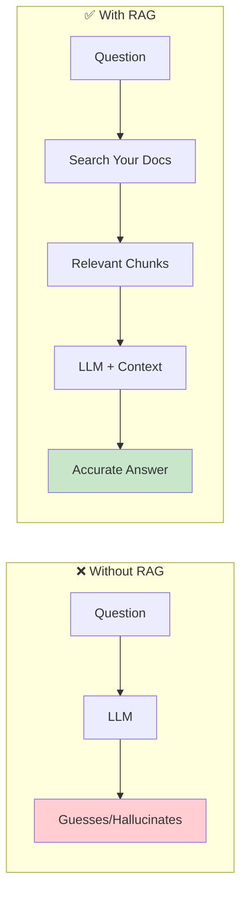
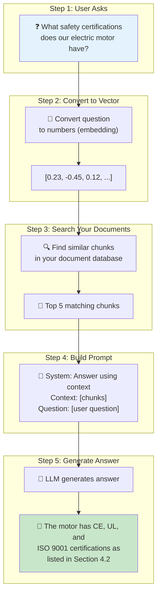
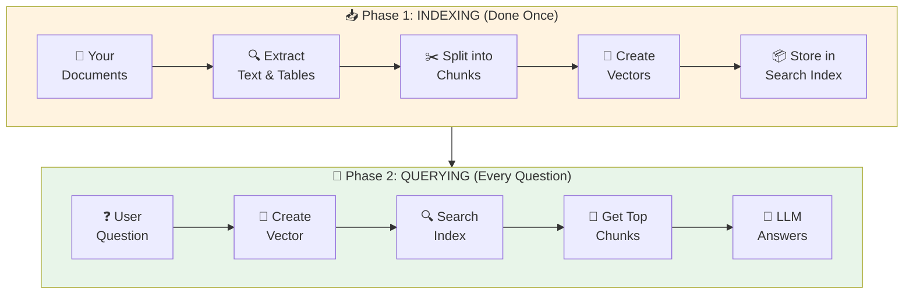
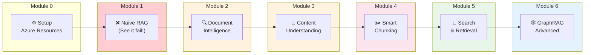

# Module 1 – What is RAG & Why Simple Approaches Fail

## 🎯 What You'll Learn

Before diving into code, let's understand **what RAG is** and **why we need it**. By the end of this module, you'll:
- Understand what RAG is (in plain English!)
- See how RAG works step-by-step
- Watch a naive implementation fail on real documents
- Know why we need the techniques taught in Modules 2-6

---

## 🧠 What is RAG? (The Simple Explanation)

### The Problem: LLMs Don't Know Your Stuff

Imagine you hire a brilliant consultant (the LLM). They know everything published on the internet up to 2023. But they've never seen:

- 📄 Your company's internal documentation
- 📊 Your product specifications
- 📋 Your policies and procedures
- 🔧 Your technical manuals

**When you ask about YOUR documents, they make things up (hallucinate)!**

```
┌─────────────────────────────────────────────────────────────────┐
│  YOU: "What's the voltage rating for our Model X motor?"       │
│                                                                 │
│  LLM WITHOUT RAG: "Based on typical motors, it's probably      │
│  220V..." ❌ (WRONG - it's guessing!)                          │
│                                                                 │
│  LLM WITH RAG: "According to your specifications document,     │
│  the Model X motor is rated at 380V AC, 50Hz, as shown in      │
│  Table 3.2 on page 45." ✅ (CORRECT - from YOUR data!)         │
└─────────────────────────────────────────────────────────────────┘
```

### The Solution: Give the LLM a Cheat Sheet

**RAG = Retrieval-Augmented Generation**

Instead of asking the LLM to remember everything, we:
1. **Store** your documents in a searchable database
2. **Search** for relevant parts when a user asks a question  
3. **Give** those parts to the LLM as context
4. **Generate** an answer based on YOUR data



---

## 🎬 RAG in Action: A Real Example

Let's trace through a real question:

### User Question: *"What safety certifications does our electric motor have?"*



### What the LLM Actually Sees:

```
SYSTEM: You are a helpful assistant. Answer questions based ONLY 
on the provided context. If you can't find the answer, say so.

CONTEXT:
[Chunk 1 from page 45]: "The Model X motor meets the following 
safety standards: CE marking (EN 60034-1), UL certification 
(UL 1004), and ISO 9001:2015 quality management..."

[Chunk 2 from page 12]: "All motors undergo rigorous testing 
at our certified laboratory before shipment..."

[Chunk 3 from page 3]: "Table of Contents... 4.2 Safety 
Certifications... page 45"

USER: What safety certifications does our electric motor have?
```

---

## 🏗️ The Two Phases of RAG

RAG has two distinct phases:



| Phase | When | Cost | Time |
|-------|------|------|------|
| **Indexing** | Once per document (or when updated) | Higher (process all docs) | Minutes to hours |
| **Querying** | Every user question | Lower (search + 1 LLM call) | Seconds |

---

## 🗺️ Workshop Journey Map

Each module in this workshop teaches one part of the RAG pipeline:



| Module | What You Learn | Pipeline Stage |
|--------|----------------|----------------|
| **0** | Set up Azure resources | Prerequisites |
| **1** | Why simple RAG fails | Motivation |
| **2** | Extract text from PDFs/Office docs | 📄 → 📝 |
| **3** | AI-powered content understanding | 📝 → 🧠 |
| **4** | Chunking strategies (critical!) | 🧠 → ✂️ |
| **5** | Embeddings, indexing, search | ✂️ → 🔍 |
| **6** | Cross-document reasoning | 🔍 → 🕸️ |

---

## 😱 The Problem: Naive RAG Fails Badly

Now let's see what happens when we take shortcuts...

### What is "Naive" RAG?

Naive RAG means:
- ❌ Read PDF as plain text (losing tables, figures, structure)
- ❌ Split every 500 characters (breaking sentences, equations)
- ❌ Hope for the best

### Real Failure Examples

| User Question | Expected Answer | Naive RAG Answer | Why It Failed |
|---------------|-----------------|------------------|---------------|
| "What's the motor voltage?" | "380V AC" | "380" or wrong value | Table structure lost |
| "Show the wiring diagram" | [Image + description] | "I don't have that info" | Figure not indexed |
| "Explain the current formula" | "I = dQ/dt where Q is charge..." | "...dt Where Q is..." | Equation split mid-way |

> 💡 **The detailed analysis of WHY chunking fails is covered in [Module 4 – Chunking Strategies](../module-4-chunking/README.md)**

---

## 🧪 Lab Preview: See the Failures Yourself

In the hands-on lab, you will:

1. **Load a real technical PDF** with tables, figures, and equations
2. **Run naive RAG** using simple text extraction + fixed chunks
3. **Ask questions** and watch it fail
4. **Document the failures** to understand what went wrong

### Sample Questions We'll Test

```python
questions = [
    "What is the voltage rating of the motor?",      # Tests: Table retrieval
    "Show me the wiring diagram",                     # Tests: Figure handling  
    "What does the variable Q represent?",            # Tests: Equation context
    "List all safety certifications",                 # Tests: Cross-page content
]
```

---

## 🎯 Module Objectives

By completing this module, you will:

| Objective | How We'll Achieve It |
|-----------|---------------------|
| Understand what RAG is | Diagrams + examples above |
| See why naive RAG fails | Hands-on lab with real failures |
| Know what problems to solve | Document failures, discuss fixes |
| Be motivated for Modules 2-6 | "Aha! That's why we need proper extraction!" |

---

## ⏱️ Estimated Time

| Activity | Duration |
|----------|----------|
| Read this README | 10 minutes |
| Hands-on Lab | 30 minutes |
| Discussion | 15 minutes |
| **Total** | **~55 minutes** |

---

## 📁 Files in This Module

| File | Description |
|------|-------------|
| `README.md` | This document (concepts + motivation) |
| `lab.ipynb` | Hands-on lab demonstrating naive RAG failures |
| `solution.ipynb` | Complete reference with annotations |
| `failure-examples/` | Additional failure case studies |

---

## ➡️ Next Steps

After seeing naive RAG fail, you're ready to learn how to fix it!

**Next Module**: [Module 2 – Document Intelligence Fundamentals](../module-2-doc-intelligence/README.md)

> *"Now that we've seen it break, let's learn to build it right!"*
