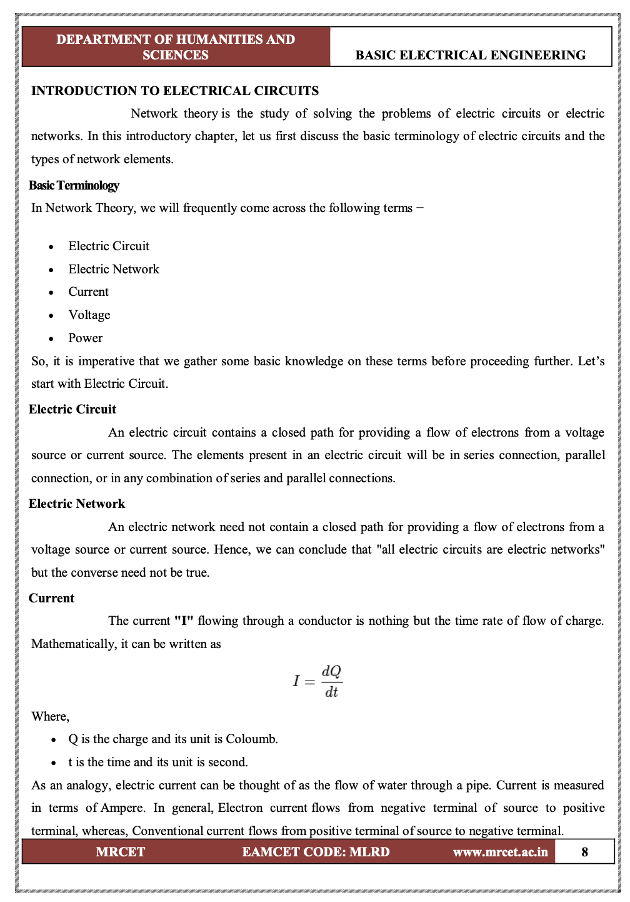

# Module 1 – The Problem with Naive RAG

## Objective
Demonstrate why simple RAG approaches fail on real technical documents.

## Learning Outcomes
By the end of this module, participants will be able to:
- Explain why page-based and fixed-size chunking fail for technical documents
- Identify retrieval failures caused by lost table structure
- Recognize when figure context is missing from RAG results
- Articulate why smarter document ingestion is required

## Key Message
> Before we can fix RAG, we need to see it break.

## Topics Covered
1. What is "naive RAG"?
2. Page-based chunking and its limitations
3. Fixed-size chunking and mid-sentence breaks
4. Table flattening and lost structure
5. Figure references and missing visual context
6. Discussion: "What information did we lose?"

## Core Concepts

### 1. What is RAG? (Retrieval-Augmented Generation)
**RAG** is a pattern used to give Large Language Models (LLMs) access to your private data. Because LLMs are frozen in time and don't know your specific documents, we use RAG to "teach" them on the fly.

The pipeline works in three steps:
1.  **Retrieve**: Find the most relevant excerpts from your document store based on the user's question.
2.  **Augment**: Paste those excerpts into the prompt as "Context".
3.  **Generate**: Ask the LLM to answer the question using *only* that context.

### 2. The Role of Chunking
You cannot simply feed a 500-page PDF into an LLM prompt (due to token limits and costs). You must first break the document down into smaller pieces. This process is called **Chunking**.

Chunking determines the **unit of information** that will be:
*   Converted into a vector (Embedding).
*   Retrieved when a user searches.
*   Fed to the LLM as context.

If you chunk poorly (e.g., splitting a sentence in half), the "unit of information" is broken. The embedding becomes meaningless, search fails to find it, and the LLM gets incomplete context.

### 3. What is "Naive" Chunking?
In this module, we explore the baseline approach known as **Naive Chunking**. This method treats a document as a simple string of text and splits it based on arbitrary rules:
*   **Fixed Size**: "Split every 500 characters."
*   **Page-Based**: "Treat every PDF page as one chunk."

We will see why this approach, while easy to implement, is disastrous for technical documentation containing tables, figures, and complex layouts.

## Hands-on Labs
| Lab | Description |
|-----|-------------|
| Lab 1.1 | Run naive RAG on a complex technical PDF |
| Lab 1.2 | Observe table retrieval failures |
| Lab 1.3 | Test figure-related questions |
| Lab 1.4 | Document the failure modes |

## Expected Failures to Demonstrate
| Content Type | What Breaks | Why |
|--------------|-------------|-----|
| Tables | Wrong values returned | Structure lost when flattened |
| Figures | "I don't have that information" | Figure content not indexed |
| Cross-page content | Incomplete answers | Arbitrary page boundaries |
| Technical specs | Missing context | Fixed chunks break mid-section |

### 🔍 Deep Dive: Why Naive Chunks Fail (Page 8 Case Study)
We analyze **Page 8** of the Electrical Engineering textbook to see exactly how data is lost.

#### Failure 1: The "Split Equation"
In the original page, the equation $I = \frac{dQ}{dt}$ is immediately followed by its variable definitions:
- **Original**:
  > $I = \frac{dQ}{dt}$
  > Where, Q is the charge...

- **Naive Chunking Result**:
  > **Chunk 1**: "...Mathematically, it can be written as I= dQ dt Where, · Q is the charge and its unit is Coloum"  
  > **Chunk 2**: "b. · t is the time and its unit is second..."

**The Impact**: The LLM receiving Chunk 2 sees "t is time" but lacks the context that $t$ acts as the denominator in the derivative of charge. The knowledge is effectively destroyed.

#### Failure 2: Footer Pollution
The bottom of every page contains administrative metadata that has nothing to do with the content.

- **Naive Chunking Result**:
  > "...Conventional current flows from positive terminal of source to negative terminal. MRCET EAMCET CODE: MLRD www.mrcet.ac.in 8"

**The Impact**: If a user asks "What is the EAMCET CODE for current?", the LLM might hallucinate a relationship between standard physics and this college-specific code because they share a chunk.

## Discussion Questions
1. What information did the embedding capture?
2. What information was lost?
3. How would you fix each failure mode?

## Estimated Time
- Concepts: 15 minutes
- Hands-on: 30 minutes
- Discussion: 15 minutes
- **Total: ~1 hour**

## Files in This Module
| File | Description |
|------|-------------|
| `lab.ipynb` | Guided lab with intentional failures |
| `solution.ipynb` | Complete reference with annotations |
| `failure-examples/` | Additional failure case notebooks |

---

**Previous Module**: [Module 0 – Environment Setup](../module-0-setup/README.md)  
**Next Module**: [Module 2 – Document Intelligence Fundamentals](../module-2-doc-intelligence/README.md)
