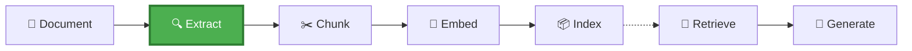

# Module 2 – Document Intelligence Fundamentals

## 📍 Where We Are in the Pipeline



**This module focuses on EXTRACTION** – converting raw documents (PDF, Word, Excel, PowerPoint) into structured text with tables, figures, and metadata. This is the foundation for everything that follows.

---

## Objective
Understand what Azure AI Document Intelligence does and how to use its outputs.

## Learning Outcomes
By the end of this module, participants will be able to:
- Explain the difference between OCR, Document Intelligence, and Content Understanding
- Use the prebuilt-layout model to extract structured content
- Process multiple document formats (PDF, Word, Excel, PowerPoint)
- Leverage markdown output and reading order preservation
- Extract tables and figures with their bounding boxes

## Key Message
> Document Intelligence gives you structure, not just text.

## Topics Covered
1. What Document Intelligence does vs traditional OCR
2. Prebuilt-layout model capabilities
3. Document Intelligence output structure:
   - Text content with reading order
   - Tables with cell structure
   - Figures with bounding boxes
   - Markdown formatting
4. Supported file formats and processing
5. Handling multi-page documents
6. Bounding box extraction for figure cropping

## Hands-on Labs
| Lab | Description |
|-----|-------------|
| Lab 2.1 | Extract structured output from a complex PDF |
| Lab 2.2 | Process a Word document with embedded tables |
| Lab 2.3 | Analyze an Excel file with Document Intelligence |
| Lab 2.4 | Process a PowerPoint presentation |
| Lab 2.5 | Compare DI output to raw text extraction |
| Lab 2.6 | Extract figure bounding boxes |

## Document Intelligence Output Structure
```
AnalyzeResult
├── content (full text)
├── pages[]
│   ├── pageNumber
│   ├── lines[]
│   └── words[]
├── tables[]
│   ├── rowCount, columnCount
│   ├── cells[]
│   └── boundingRegions[]
├── figures[]
│   ├── boundingRegions[]
│   └── caption
└── paragraphs[]
    ├── content
    └── role (title, sectionHeading, etc.)
```

## Comparison: OCR vs DI vs Content Understanding
| Capability | OCR | Document Intelligence | Content Understanding |
|------------|-----|----------------------|----------------------|
| Text extraction | ✅ | ✅ | ✅ |
| Table structure | ❌ | ✅ | ✅ |
| Figure detection | ❌ | ✅ | ✅ |
| Reading order | ❌ | ✅ | ✅ |
| Semantic understanding | ❌ | ❌ | ✅ |
| Custom entity extraction | ❌ | ❌ | ✅ |

## Estimated Time
- Concepts: 20 minutes
- Hands-on: 45 minutes
- **Total: ~1 hour**

## Files in This Module
| File | Description |
|------|-------------|
| `lab.ipynb` | Guided lab for Document Intelligence |
| `solution.ipynb` | Complete reference solution |
| `failure-examples/` | Edge cases and limitations |

---

**Previous Module**: [Module 1 – The Problem with Naive RAG](../module-1-naive-rag/README.md)  
**Next Module**: [Module 3 – Content Understanding](../module-3-content-understanding/README.md)
