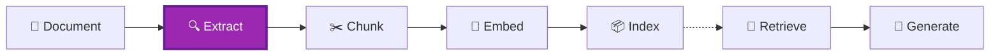

# Module 3 – Content Understanding

## 📍 Where We Are in the Pipeline



**This module advances EXTRACTION** – while Module 2 gave us structure, Content Understanding adds **semantic intelligence**. It uses AI to describe figures, interpret charts, and understand document meaning.

---

## Objective
Master advanced document understanding and semantic extraction using Azure AI Content Understanding.

## Learning Outcomes
By the end of this module, participants will be able to:
- Explain what Content Understanding is and when to use it
- Configure a Content Understanding analyzer
- Extract content from documents with AI-generated descriptions
- Choose the right analyzer for different scenarios

## Key Message
> Content Understanding enables **semantic extraction** – understanding meaning, not just layout.

---

## 🧠 What is Azure AI Content Understanding?

**Azure AI Content Understanding** is a unified service for extracting and analyzing content from documents, images, audio, and video. It's part of Azure AI Foundry and provides a single API for multimodal content processing.

### What CU Does

```
┌─────────────────────────────────────────────────────────────────┐
│                    Content Understanding                        │
│                                                                 │
│   INPUT: PDF, Word, Excel, PowerPoint, Images, Audio, Video    │
│                                                                 │
│   OUTPUT:                                                       │
│   ├── Extracted text (OCR)                                      │
│   ├── Document structure (headers, paragraphs, tables)          │
│   ├── Figures with bounding boxes                               │
│   ├── AI-generated descriptions (for figures/charts/diagrams)   │
│   ├── Chart.js code (for charts)                                │
│   ├── Mermaid.js syntax (for diagrams)                          │
│   └── Document/audio/video summaries                            │
│                                                                 │
└─────────────────────────────────────────────────────────────────┘
```

### Why Use CU for RAG?

In a RAG pipeline, you need to:
1. **Extract** content from documents (text, tables, figures)
2. **Understand** what figures and charts mean (not just detect them)
3. **Chunk** the content into searchable units
4. **Index** the chunks for retrieval

CU handles steps 1 and 2. It gives you the **raw material** (extracted content with AI descriptions) that you then chunk and index.

### CU Prebuilt Analyzers for RAG

| Analyzer | Use Case |
|----------|----------|
| `prebuilt-documentSearch` | Documents (PDF, Word, Excel, PowerPoint) |
| `prebuilt-imageSearch` | Standalone images |
| `prebuilt-audioSearch` | Audio files (calls, podcasts, meetings) |
| `prebuilt-videoSearch` | Video content with scene segmentation |

---

## 📊 Comparison: OCR vs Document Intelligence vs Content Understanding

Now that you've learned Document Intelligence in Module 2, let's see how Content Understanding compares:

| Capability | Simple OCR | Document Intelligence | Content Understanding |
|------------|------------|----------------------|----------------------|
| Text extraction | ✅ Raw characters | ✅ With reading order | ✅ With reading order |
| Table structure | ❌ Flattened | ✅ Rows/columns preserved | ✅ Rows/columns preserved |
| Figure detection | ❌ Ignored | ✅ Bounding boxes | ✅ Bounding boxes + **AI descriptions** |
| Reading order | ❌ Lost | ✅ Preserved | ✅ Preserved |
| Semantic understanding | ❌ None | ❌ None | ✅ **AI-powered** |
| Chart → Code | ❌ No | ❌ No | ✅ **Chart.js output** |
| Diagram → Code | ❌ No | ❌ No | ✅ **Mermaid.js output** |
| Document summary | ❌ No | ❌ No | ✅ **One-paragraph summary** |
| Audio/Video support | ❌ No | ❌ No | ✅ **Full support** |
| LLM Required | ❌ No | ❌ No | ✅ Yes (GPT-4.1-mini) |
| Cost | 💰 Lowest | 💰 Low | 💰💰 Higher |

> 📖 **Official comparison**: [Choosing the Right AI Tool](https://learn.microsoft.com/en-us/azure/ai-services/content-understanding/choosing-right-ai-tool)

## 🔑 CU vs Document Intelligence: What's the Real Difference?

This is a common source of confusion! Let's clarify once and for all.

### The Truth: CU Contains DI

Content Understanding (CU) is **not a replacement** for Document Intelligence (DI) — it **includes** DI as its foundation and adds AI-powered semantic analysis on top.

```
┌─────────────────────────────────────────────────────────────────┐
│               Content Understanding (CU) Service                │
├─────────────────────────────────────────────────────────────────┤
│                                                                 │
│  prebuilt-layout        │  No LLM required  │  = Same as DI    │
│  prebuilt-read          │  No LLM required  │  = Same as DI    │
│  prebuilt-documentSearch│  GPT-4.1-mini     │  = DI + AI magic │
│                                                                 │
└─────────────────────────────────────────────────────────────────┘
```

### The Analyzer Hierarchy

| CU Analyzer | LLM Required? | What It Does |
|-------------|---------------|--------------|
| `prebuilt-read` | ❌ No | Basic OCR only |
| `prebuilt-layout` | ❌ No | OCR + layout (figures, tables, paragraphs) — **identical to DI** |
| `prebuilt-documentSearch` | ✅ Yes (GPT-4.1-mini) | Layout + **AI descriptions** + **Chart.js** + **Mermaid.js** + **summary** |

### So What's the Real Decision?

You're **NOT** choosing between "DI vs CU" — you're choosing between:

| Option | What You Get | Cost |
|--------|--------------|------|
| `prebuilt-layout` (via DI or CU) | Structure only (bounding boxes, tables, paragraphs) | 💰 Lower |
| `prebuilt-documentSearch` (CU only) | Structure + AI-generated figure descriptions + summaries | 💰💰 Higher (includes GPT-4.1-mini) |

### What `prebuilt-documentSearch` Adds Over `prebuilt-layout`

- **AI-generated figure descriptions**: Every image/chart/diagram gets a semantic description
- **Chart → Chart.js**: Charts are converted to executable code
- **Diagram → Mermaid.js**: Diagrams are converted to renderable syntax
- **Document summary**: One-paragraph summary of the entire document
- **Handwritten annotations**: Captures markup on documents

### The Key Insight
| Capability | `prebuilt-layout` (DI/CU) | `prebuilt-documentSearch` (CU) |
|------------|---------------------------|-------------------------------|
| Text extraction | ✅ OCR + reading order | ✅ Same |
| Table detection | ✅ Structure + markdown | ✅ Same |
| Figure detection | ✅ Bounding box + URL | ✅ Bounding box + URL + **AI description** |
| Chart analysis | ❌ Just an image | ✅ Converts to **Chart.js code** |
| Diagram analysis | ❌ Just an image | ✅ Converts to **Mermaid.js syntax** |
| Document summary | ❌ Not available | ✅ One-paragraph summary |
| Audio/Video | ❌ Not supported | ✅ Use `prebuilt-audioSearch` / `prebuilt-videoSearch` |
| LLM Required | ❌ No | ✅ Yes (GPT-4.1-mini) |
| Cost | 💰 Lower | 💰💰 Higher |

> **Important**: Both options give you the **extracted figure image** (via URL). The difference is whether you get an AI-generated description automatically or need to call GPT-4o yourself.

### When to Use Each

**Use `prebuilt-layout` (DI or CU) when:**
- You want lower cost per document
- You're building your own multimodal pipeline with GPT-4o
- You need maximum control over figure description prompts
- You only need structure, not AI interpretation

**Use `prebuilt-documentSearch` (CU) when:**
- You want turnkey semantic descriptions of figures/charts
- You need Chart.js or Mermaid.js output directly
- You want a one-paragraph document summary
- Simplicity matters more than cost optimization

> **Key Insight**: With `prebuilt-documentSearch`, CU extracts the cropped figure image AND generates the description. You get both the `figures/12.1` URL (the actual image) and the semantic description in the markdown output.

---

## 📋 The `prebuilt-documentSearch` Analyzer

The `prebuilt-documentSearch` analyzer is optimized for RAG (Retrieval-Augmented Generation) and automated workflows. It transforms unstructured documents into structured, machine-readable data while preserving semantic relationships.

### Key Capabilities

#### 1. Content Analysis
- **Text**: Printed and handwritten text extraction
- **Selection marks**: Checkboxes, radio buttons
- **Barcodes**: 12+ barcode types supported
- **Mathematical formulas**: Converted to LaTeX syntax
- **Hyperlinks and annotations**: Preserved in output

#### 2. Figure Analysis (The Game Changer!)
- **AI-generated descriptions**: Every image/chart/diagram gets a semantic description
- **Chart → Chart.js**: Charts are converted to executable Chart.js syntax
- **Diagram → Mermaid.js**: Diagrams are converted to Mermaid.js syntax
- This is what enables RAG systems to "understand" visual content!

#### 3. Structure Analysis
- **Paragraphs with roles**: Title, section heading, page header/footer
- **Complex tables**: Merged cells, multi-page tables, nested headers
- **Hierarchical sections**: Document outline with parent-child relationships

#### 4. Output Format
- **GitHub Flavored Markdown**: Rich formatting preserved
- **LLM-optimized**: Structure helps LLMs understand document context
- **Figures as markdown images**: ``

#### 5. Supported File Formats
| Category | Formats |
|----------|---------|
| Documents | PDF, TIFF, JPEG, PNG, BMP |
| Office | Word (.docx), Excel (.xlsx), PowerPoint (.pptx) |
| Text | HTML, Markdown, plain text |
| Structured | XML, JSON, CSV |
| Email | EML, MSG |

---

## Topics Covered
1. What Content Understanding adds beyond Document Intelligence
2. Schema-driven semantic extraction
3. Custom entity and field extraction
4. Semantic chunking: topic-based vs layout-based
5. Analyzer configuration and customization
6. Decision framework: DI vs CU

## Decision Framework: When to Use What
| Scenario | Recommended Analyzer |
|----------|---------------------|
| Basic text + table extraction (low cost) | `prebuilt-layout` |
| Need figure bounding boxes only | `prebuilt-layout` |
| Want AI-generated figure descriptions | `prebuilt-documentSearch` |
| Chart → Chart.js conversion | `prebuilt-documentSearch` |
| Diagram → Mermaid.js conversion | `prebuilt-documentSearch` |
| Audio transcription + analysis | `prebuilt-audioSearch` |
| Video segmentation + descriptions | `prebuilt-videoSearch` |
| Domain-specific extraction (invoices, IDs) | `prebuilt-invoice`, `prebuilt-idDocument`, etc. |

> **Remember**: All these analyzers give you **extracted content**. Chunking is a separate step you implement in Module 4.

## Hands-on Labs
| Lab | Description |
|-----|-------------|
| Lab 3.1 | Configure a Content Understanding analyzer |
| Lab 3.2 | Extract domain-specific entities from technical docs |
| Lab 3.3 | Compare extraction quality: DI vs CU on same document |
| Lab 3.4 | Build semantic chunks based on topic boundaries |
| Lab 3.5 | Create a custom schema for your domain |

## Content Understanding Capabilities
- **Semantic chunking**: Split by topic, not layout
- **Entity extraction**: Custom schemas for your domain
- **Field extraction**: Structured data from unstructured text
- **Relationship detection**: Links between entities
- **Classification**: Document and section categorization

## API Version
- **GA API**: `2025-11-01`
- **Supported Regions**: `westus`, `swedencentral`, `australiaeast`

## Required Model Deployments
The `prebuilt-documentSearch` analyzer requires specific Azure OpenAI model deployments:

| Model | Purpose |
|-------|---------|
| `gpt-4.1-mini` | Multimodal analysis (figure descriptions, chart conversion) |
| `text-embedding-3-large` | Semantic embeddings for search optimization |

> ⚠️ **Important**: Other prebuilt analyzers (like `prebuilt-document`) require `gpt-4.1` instead. Check the [official samples](https://github.com/Azure-Samples/azure-ai-content-understanding-python) for model requirements per analyzer.

## Semantic Chunking vs Layout Chunking
| Approach | Boundary | Example |
|----------|----------|---------|
| Layout-based | "Section 2.1" header | DI paragraph/section |
| Semantic | "Now let's discuss pricing..." | CU topic shift |

## Estimated Time
- Concepts: 25 minutes
- Hands-on: 50 minutes
- **Total: ~1.25 hours**

## Files in This Module
| File | Description |
|------|-------------|
| `lab.ipynb` | Guided lab for Content Understanding |
| `solution.ipynb` | Complete reference solution |
| `failure-examples/` | Edge cases and limitations |

---

**Previous Module**: [Module 2 – Document Intelligence Fundamentals](../module-2-doc-intelligence/README.md)  
**Next Module**: [Module 4 – Chunking Strategies](../module-4-chunking/README.md)
