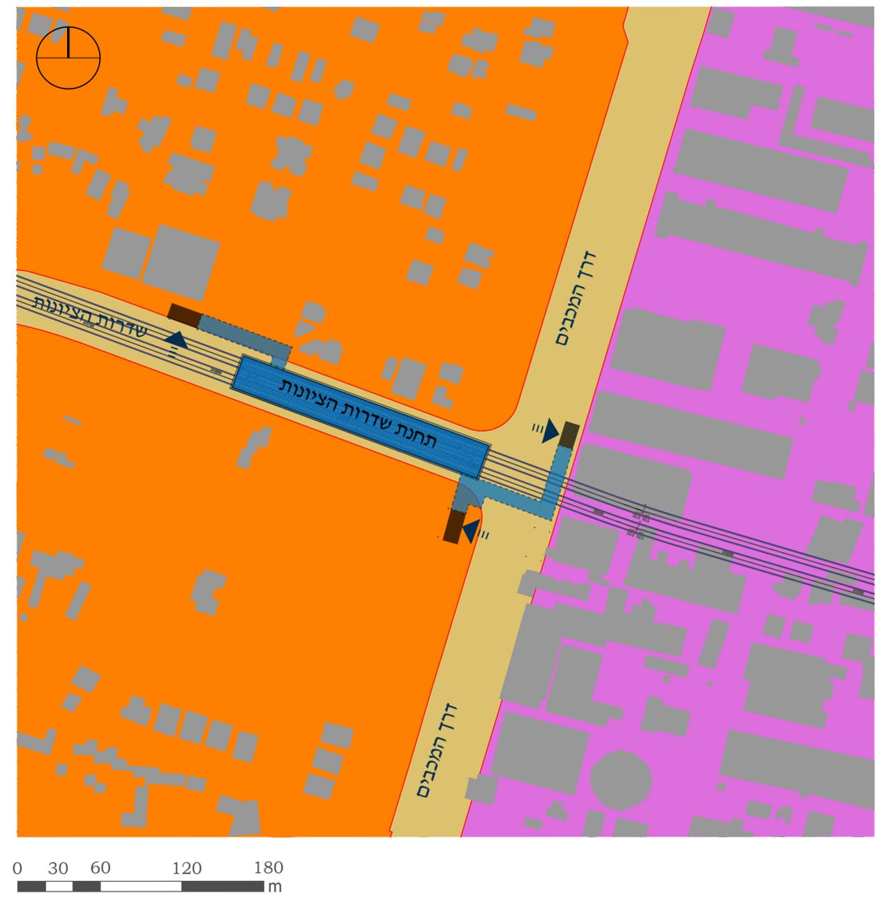
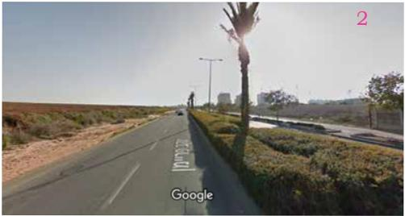

# אפיון התחנה

תחנה מס׳ 36 | שדרות הציונות

מיקום התחנה

ראשון לציון, ממוקמת על רחוב שד׳ הציונות, ממערב לצומת
שד׳ הציונות/דרך המכבים.

התחנה ממוקמת בחלקה המזרחי של שכונת נחלת יהודה.
מצפון דרום ומערב לתחנה שכונת נחלת יהודה.
ממזרח לתחנה איזור תעסוקה מב״ת צפון.

סוג תחנה

תחנה רגילה

אפיון פיסי | סביבת התחנה

שכונת נחלת יהודה היא שכונת מגורים מתחדשת.
בחלק מהשכונה מבנים צמודי קרקע ובחלק האחר בניינים
רבי קומות. איזור תעסוקה מב״ת צפון הוא איזור תעסוקה
ומסחר ובו מבנים בני 2-4 קומות
תכניות עתידיות באיזור:

ממזרח - אנ״מ צפוני, מתוכנן - 1,500 יח״ד

ממערב - נחלת עילית, מתוכנן - 4,000 יח״ד

מוקדי עניין
(במרחק של עד 800 מ׳
מהתחנה)

מרכז ספורט ונופש (500 מ׳), מרכז מסחרי (200 מ׳),
בריכה עירונית (400 מ׳).

קיבולת נוסעים צפויה

תחזית נוסעים לשנת 2040 צופה כ- 2400 נוסעים עולים
ויורדים בשעת שיא.

קישוריות ונגישות

נגישות הולכי רגל בצירים ראשיים שד׳ הציונות,
דרך המכבים ושדרות היובל אל מרכז הספורט והבריכה
העירונית ובצירים משניים אל מב״ת צפון.

שביל אופניים מתוכנן בשדרות הציונות (מזרח מערב)
וברחובות דרך המכבים, שדרות היובל והעצמאות
(צפון דרום) ושביל מתוכנן ברחוב הרצל (דרומית לתחנה)
קישוריות לתחנות אוטובוס על דרך המכבים.

![המחקר מבון - זולקס govmorf שגזי שלום חו דרך המכב -100 וסריגרי בורי החמר בן צבי יצחק 800 m ה שדרות הציונות אשרד 2 נחלת יהודה איזור תעשיה מבת צפון 412 4 אונר m שדרות היוגל 3 800 גבין משה שמוטקין בנימין המכבים הלימון וינגרן ברהם העצמאות אחיירם אלישע עחל לצ פרימן יעקב האפרסמון העינב תחנת בנות חיל פרימן יעקב cei arua קווטנב הברהם המכבים הברושים הבנין ההדר בקר המייסדים האורגים ut riail לאה רבין שדרות בן טריון הצופים נרטנסק מילר צבי תוואי קו M1S קרל בטר אמיל זולא בר יוחאי בנות חיל תחנת יוסף בורג נעורים תגועות הגועל פיק״א סגל מרדכי יואל משמר הירד 412 גרוזנברג פרגי יק״א יעקובזון ויצבון a.ட்ส תוואי קו MS1 קרן היסוד בורג יוסף קרן קישת לישראל על כנפי נשרים פרנק צבי קידוש השם וייז סטפן פינק פרי יעקב שרה שדרות מנחם בגין עп פופל מרדני דגניה ברנדיס . טמריהו לוין אבן полея שושן גרץ ונטטיין מרדם אלרואי דרור பரดยட עמח הגריגדר מרגולי הגדוד ה יהודה ? אברמוביץ דובנוב ניחקין שפינוזה חנ״ד m ש בן ציון גולומב נורוטב מעיי גורג יי הבו הברון הירש שושר ניחו בסקי](figures/1.1.png "- Map showing a region with roads and neighborhoods labeled in Hebrew.
- Two large circles with radius labeled as "800 m" centered on different points.
- Roads labeled with numbers "4" and "412".
- Various Hebrew text labels indicating locations and streets.
- A compass rose in the top left corner.
- A diagonal arrow inside the top right circle indicating the 800 m radius.
- Pink handwritten numbers "2" and "3" near the center of the map.
- The map background includes detailed street layouts and building outlines.
- The label "govmap" appears faintly in the top right corner.")

M1S

ת.שדרות הציונות

# אפיון תחנה

1\. מבט לכיוון מזרח
2\. מבט לכיוון דרום
3\. מבט לכיוון צפון

<!-- PageFooter: נ.ת.ע | נתיבי תחבורה עירוניים להסעת המונים בע״מ -->
<!-- PageFooter: מטרו -->
<!-- PageFooter: M1S -->
<!-- PageFooter: מנספלד- קהת אדריכלים בע״מ -->
<!-- PageNumber: 161 -->
<!-- PageBreak -->

סביבת התחנה:
מיפוי אגן
היקוות התחנה

תחנה מס׳ 36 | שדרות הציונות

עוגן ציבורי ברדיוס 800m

עוגן מסחרי ברדיוס 800m

מתחם ציבורי פתוח/גן/פארק

M1S

ת.שדרות הציונות

סביבת התחנה

1:7500

<!-- PageNumber: 162 -->
<!-- PageFooter: נ.ת.ע | נתיבי תחבורה עירוניים להסעת המונים בע״מ -->
<!-- PageFooter: מטרו -->
<!-- PageFooter: M1S -->
<!-- PageFooter: מנספלד- קהת אדריכלים בע״מ -->
<!-- PageBreak -->

# תכניות בהכנה

תחנה מס׳ 36 | שדרות הציונות

תכניות בהכנה
בסביבת התחנה

# לא מקודמות תכניות ברדיוס 800m

M1S
ת.שדרות הציונות

תכניות בהכנה

1:7500

<!-- PageFooter: נ.ת.ע | נתיבי תחבורה עירוניים להסעת המונים בע״מ -->
<!-- PageFooter: מטרו -->
<!-- PageFooter: M1S -->
<!-- PageFooter: מנספלד- קהת אדריכלים בע״מ -->
<!-- PageNumber: 163 -->
<!-- PageBreak -->

# מפת ייעודי קרקע

תחנה מס׳ 36 | שדרות הציונות

ייעודי קרקע
מתכנית המתאר

מגורים

דרך מאושרת

תעסוקה

תחנת מטרו

תוואי מטרו

תחנת מטרו תת״ק

מעברים תת קרקעיים

מבנה כניסה לתחנה

כניסה לתחנה

M1S

ת.שדרות הציונות

ייעודי קרקע

1:2500

<!-- PageNumber: 164 -->
<!-- PageFooter: נ.ת.ע | נתיבי תחבורה עירוניים להסעת המונים בע״מ -->
<!-- PageFooter: מטרו -->
<!-- PageFooter: M1S -->
<!-- PageFooter: מנספלד- קהת אדריכלים בע״מ -->
<!-- PageBreak -->

<!-- PageHeader: פיתוח קיים ומתוכנן -->
<!-- PageHeader: עוגנים למיקום הכניסות -->
<!-- PageHeader: קישוריות ונגישות -->

התחנה ממוקמת על רחוב שדרות הציונות בצומת עם דרך
המכבים ציר ראשי המתחבר להרצל וחוצה את כל העיר
מצפון לדרום. בשדרות הציונות 4 נתיבי תנועה המופרדים
באי תנועה עם נטיעות של עצי הדר. בדרך המכבים 6 נתיבים,
שניים מתוכם נת״צ, הנתיבים מופרדים באי תנועה מגונן.
ממזרח תכנית לאנ״מ צפוני, במסגרתו מתוכננות- 1,500
יח״ד. ממערב תכנית נחלת עילית, במסגרתה מתוכננות
4,000 יח״ד.

התחנה ממוקמת באיזור מגורים, שכונות חדשות בראשון
לציון וממערב לאיזור תעסוקה.
תוכננו שלוש כניסות.

הכניסה המערבית ממוקמת על שדרות הציונות ומשרתת את
שכונת המגורים ממערב.

ממזרח תוכננו שתי כניסות משני צידי דרך המכבים, המהווה
ציר ראשי (כביש 412). הכניסות משרתות את שכונת המגורים
ואת איזור התעסוקה ממזרח.

נגישות להולכי רגל במערך הרחובות הקיימים בשדרות
הציונות, דרך המכבים והעצמאות המקשרים אל גן האירועים
ובתי הספר הנמצאים דרום מערבית לתחנה. שבילי אופניים
מתוכננים בשדרות הציונות ובדרך המכבים אשר ממשיכה
למתחברת לרחוב הרצל.

קישוריות לתחנת אוטובוס על דרך המכבים.

## תחנת מטרו

תוואי מטרו

תחנת מטרו תת״ק

מעברים תת קרקעיים

מבנה כניסה לתחנה

כניסה לתחנה

מבנים

שצ״פ סטטוטורי

מבנים ומוסדות
ציבור סטטוטוריים

שביל אופניים קיים

שביל אופניים מתוכנן

ציר הולכי רגל ראשי

1
ציר הולכי רגל משני

, 'בית ספר' (School).
Two colored dots: red dot labeled 'בית ספר' (School) on left side, purple dot labeled 'גן אירועים' (Event Garden) on right side.
Roads shown with various colors and line styles including solid, dashed, and dotted lines.
Arrows on roads indicating traffic direction.
Buildings and blocks shown in gray and brown shades.
Green areas representing parks or green spaces.
Dashed blue lines outlining certain areas or paths.")

M1S

ת.שדרות הציונות

<!-- PageFooter: המרחב הציבורי -->
<!-- PageFooter: 1: 2500 -->
<!-- PageFooter: נ.ת.ע | נתיבי תחבורה עירוניים להסעת המונים בע״מ -->
<!-- PageFooter: מטרו -->
<!-- PageFooter: M1S -->
<!-- PageFooter: מנספלד- קהת אדריכלים בע״מ -->
<!-- PageNumber: 165 -->

### המרחב הציבורי

תחנה מס׳ 36 | שדרות הציונות

<!-- PageBreak -->

### מצב מאושר

תחנה מס׳ 36 | שדרות הציונות

ייעודי קרקע
מאושרים

דרך משולבת

דרך מאושרת

שטח ציבורי פתוח

מגורים א׳

מגורים ב׳

מגורים ג׳

תעשייה

מסחר ותעשייה

תעשייה

מבנים ומוסדות ציבור

שטח המוכרז כאתר
עתיקות

כניסה לתחנה

תחנת מטרו תת״ק

מעברים תת קרקעיים

166

<!-- PageFooter: מטרו -->
<!-- PageFooter: M1S -->
<!-- PageFooter: מנספלד- קהת אדריכלים בע״מ -->
<!-- PageFooter: נ.ת.ע | נתיבי תחבורה עירוניים להסעת המונים בע״מ -->

<!-- PageBreak -->

השתלבות במערך
הסביבתי
תחנה מס׳ 36 | שדרות הציונות

עץ קיים
עץ מתוכנן

גינון
מדרכה

זכות הדרך

תחנת מטרו תת״ק

מעברים תת קרקעיים

תוואי מטרו

כניסה לתחנה

מבנה להריסה

תחנת אוטובוס

נ.ת.ע | נתיבי תחבורה עירוניים להסעת המונים בע״מ

L

43

60

49

50

51

52

50

33

54

24

55

46

56

שכונת

34

נחלת יהודה

57

46

59

M1S

דרך המכבים

26

חניב

קו חשמל

NOGCO

ע19

£1

DV V

עפו

4190

MAICA

8717$

7
.

S 43109

45

62

43+92

39189

8516

48129

12

44120

ת.שדרות הציונות

44+79

10

9

43.01

402

חניה

D10n

44:67

4657

o

חניה

72

LJO

42:52

2187

39168

S

66

בריכם

OS

41:99

4481

,

4402

2

42+18

41.80

ת.א

4

12:59

מ.

24/8

39:98

39198

H61

42-27

41:30

42+34

43+30

40192

41+56

41-32
מ. ברזל

שד׳ הציונות

0F45

¥0109

מניה

א אי תמעה

58

41*34

41+78

41.06

41:94

40.71

4679

השתלבות במערך הסביבתי

41+70

40:50

40+24

Or

41.85

42109

5

43+14

5

92159

39:58

43+17

42984

96

9FF

70

42,61

99

00

42+46

40:23

40128

43+20

8o

כביש אספרן

מב״ת
צפון

439.31

42+83

CL.M NOGCO
41:98

42185

181

.

42186 142L1D

42:44

42185

42+06

40+13

40+18

6,3

43+56

41:69 元

09 צO

40+1,3

149

115

11

3:87

117

118

119

43+16

102

a

44:53

41,99

41+97

41:60

40:38

1

122

103

123

124

40147

121

57

120

104

1:1250

מטרו

126

127

M1S

90

60

m

15

30

0

מנספלד- קהת אדריכלים בע״מ

167

<!-- PageBreak -->

<!-- PageFooter: נ.ת.ע | נתיבי תחבורה עירוניים להסעת המונים בע״מ -->
<!-- PageFooter: מטרו -->
<!-- PageFooter: M1S -->
<!-- PageFooter: מנספלד- קהת אדריכלים בע״מ -->
<!-- PageBreak -->

תחנת מטרו תת״ק

כניסה לתחנה

# מסקנות והמלצות תחנה מס׳ 36 | שדרות הציונות

1\. התחנה משרתת איזור של פיתוח שכונות מגורים ממערב ואיזור תעסוקה ממזרח.

2\. מתוכננות שלוש כניסות. כניסה מערבית המשרתת את השכונות ממערב. הכניסות המזרחיות מתוכננות משני עברי דרך המכבים.

הכניסות ישמשו כמעבר הולכי רגל תת-קרקעי גם ללא כניסה לתחנת המטרו שיקשר את השכונה לאיזור התעסוקה ולפיתוח האנ״מ העתידי ממזרח לו.

3\. מומלץ, במסגרת פיתוח האנ״מ, להמשיך את שדרות הציונות מזרחה בתוך איזור התעסוקה וכך לקשור את שטחי הפיתוח העתידיים באנ״מ לתחנת המטרו.

<!-- PageFooter: נ.ת.ע | נתיבי תחבורה עירוניים להסעת המונים בע״מ -->
<!-- PageFooter: מטרו -->
<!-- PageFooter: M1S -->
<!-- PageFooter: מנספלד- קהת אדריכלים בע״מ -->

M1S

<!-- PageFooter: ת.שדרות הציונות -->

|

<!-- PageFooter: מסקנות והמלצות -->
<!-- PageNumber: 169 -->
<!-- PageBreak -->

## אפיון התחנה

תחנה מס׳ 37 | יוסף בורג

מיקום התחנה

ראשון לציון, ממוקמת על רחוב יעקב פריימן מערב לצומת

ד״ר יוסף בורג/מנחם גינדי.

מצפון שטחים חקלאיים

מדרום לתחנה בית העלמין הישן ראשון לציון.

ממזרח לתחנה כביש 44 הראשי.

מדרום מערב לתחנה שכונת המגורים נעורים.

מדרום מזרח שכונת מרום ראשון.

### סוג תחנה

תחנה רגילה

#### אפיון פיסי | סביבת התחנה

שכונת המגורים נעורים היא שכונה חדשה ובה מבנים
דו משפחתיים צמודי קרקע ומבני מגורים עד 12 קומות.
שכונת מרום ראשון היא שכונה חדשה עם מבנים עד 12
קומות.

מצפון שטחים חקלאיים - באיזור זה תכנית בהכנה אנ״מ
צפוני – רצ/1/130, בה מתוכננים- 1,500 יח״ד.

מוקדי עניין
(במרחק של עד 800 מ׳
מהתחנה)

בית העלמין הישן ראשון לציון. כמו כן, תכנית האנ״מ המ־
תוכננת מצפון תתאים עצמה ע״י עירוב שימושים ומוקדי
עניין עפ״י למיקום התחנה.

קישוריות ונגישות

נגישות הולכי רגל המחברת בין גנים ציבוריים ברחובות
יעקב פריימן, ד״ר יוסף בורג וכתריאל רפפורט.
שביל אופניים מתוכנן ברחוב יעקב פריימן (מזרח מערב),
בדרך חיים הרצוג (צפון דרום), שביל אופניים מתוכנן
המוביל לאזור האנ״מ העתידי (צפונה) ושביל אופניים
מתוכנן המוביל דרומה לאורך בית העלמין אל תוך העיר.
קישוריות לתחנות אוטובוס על רחוב פריימן.

קיבולת נוסעים צפויה

תחזית נוסעים לשנת 2040 צופה כ- 1430 נוסעים עולים
ויורדים בשעת שיא.

![תוואי קו M1S 412 800 m duato Ntica המכבים Tיסן cul urua ימין בקר בים ברשבשקי 2 0 800 m 3 פריימן יעקב הצזפים נעורים תנוענת הגועל פיק״א משמר הירדן פרנק צב תחנת הרצוג יק״א 1 על כנהי נשרים סגל מרדכי יואל нл עקובזון פופל מו־רבי פרנק צב דרך חיים הרצוג מנחם גינדי בורג יוסף תישנות קידוש השם דגניה נייץ סטפן ברנדים מרום ונשטיין מרד אלרואי מרגולין ראשון הנדוד העברי יהודה אייב חב״ד דרך חיים הרשוג נחלם בורג יוסף יהודה גבעתי הבובש גוש עציון עסרזת נהריים יהודה הלני רש״ רמבי אבידן שמעון איידנבנד הרב קוק אלירז שלחה אברבנאל הרב ברוק יהורה ניהושע אולגה ד אלעזר רמב״ם רבובים בוקלף மடாி בית יוסף נחמה הרב סזבהי הנח״ל חולבו שלמה אלקלעי הא חים סוליח בלפור תוואי הקו החום ATLOch אחד העם נורדאו שלמה יאיר πα щε החשמונאים מוריעין נית לחם ירושלים אלון יגאל ULTLA DUING התור האבות השומר לבונסין CCLU האפל டளை טביב בלקינד שמשון בילי לובמך חביב הורד הצבר הדובדנן זולג שדרות יעקב נווה מהדרים ברנשטיין נורדאן ההדס התות הפיקוס הדקל אלון יגאל שיבת ציון מוסאל יצחק החצב החבצלת בזה ציון אירוביץ הערמון ינשפן הרשל VดUட עלוטקיו מצב הכלנית](figures/10.1.png "Map with labeled roads and areas.
- Road labeled '412' in green box.
- Brown line labeled 'M1S תוואי קו' running horizontally.
- Two overlapping circles with radius labeled '800 m'.
- Black arrow pointing from center of right circle to circumference labeled '800 m'.
- Pink line segment labeled with numbers '1', '2', '3' along the brown line near the center.
- Various Hebrew place names and street names scattered across the map.
- North direction indicated by a compass rose in the top left corner.
- Red line labeled 'תוואי הקו החום' running near bottom of map.")

M1S

ת. יוסף בורג

אפיון תחנה

1\. מבט מכיוון דרום
2\. מבט מכיוון צפון
3\. מבט מערבה

.
- Clear sky with no clouds.
- Number "1" in pink color at the top right corner of the image.
- Surrounding area: open land with sparse vegetation and no buildings nearby except distant structures on the horizon.")

<!-- PageNumber: 170 -->
<!-- PageFooter: נ.ת.ע | נתיבי תחבורה עירוניים להסעת המונים בע״מ -->
<!-- PageFooter: מטרו -->
<!-- PageFooter: M1S -->
<!-- PageFooter: מנספלד- קהת אדריכלים בע״מ -->
