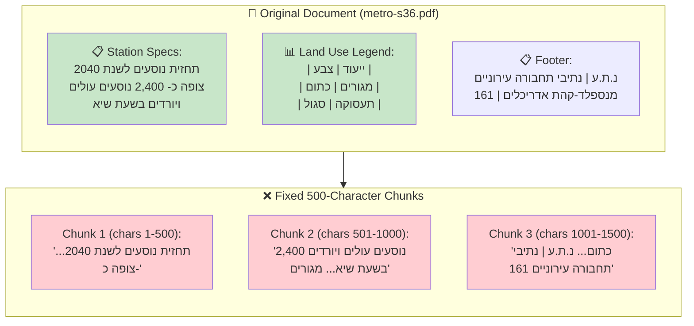

# Module 4 – Chunking Strategies & Multimodal Content (Core Module)

## 📍 Where We Are in the Pipeline


**This module focuses on CHUNKING** – the critical architectural decision that determines what "unit of information" gets embedded, indexed, and retrieved. Poor chunking = broken RAG.

---

## Objective
Master the art and science of document chunking for RAG systems, including advanced handling of tables, figures, and charts.

## Learning Outcomes
By the end of this module, participants will be able to:
- Explain why chunking is an architectural decision, not a parameter
- Implement multiple chunking strategies (page, fixed, header, semantic)
- Choose the right strategy for different document types
- Design a hybrid chunking pipeline for production
- Handle large tables with header repetition
- Extract data points from charts (beyond just descriptions)
- Justify their chunking choices with clear tradeoffs

## Key Message
> Chunking is an **architectural decision**, not a parameter.

---

## 🔑 Critical Clarification: Extraction vs Chunking

**Content Understanding (CU) does NOT automatically chunk your documents!**

CU (via `prebuilt-documentSearch`) gives you **extracted content** — markdown text, tables, figures with descriptions. **YOU** still need to implement the chunking logic.

---

## 🧠 Semantic Chunking vs Layout Chunking: The Full Picture

This is one of the most misunderstood concepts in RAG. Let's clarify exactly what each means and what DI/CU provide.

### Two Fundamentally Different Approaches

| Aspect | Layout Chunking | Semantic Chunking |
|--------|-----------------|-------------------|
| **Boundary based on** | Visual structure (how it **looks**) | Topic shifts (what it **means**) |
| **Triggers** | Headers, page breaks, paragraphs, tables | Topic change, conceptual shift |
| **Example** | "I see `## Section 2.1`, start new chunk" | "Text shifted from 'architecture' to 'pricing', start new chunk" |
| **Intelligence needed** | Pattern matching (regex) | AI/embeddings to detect meaning |

### Real Example: Same Paragraph, Different Results

Consider this paragraph from a metro document:
> "The M1 Metro uses regenerative braking to improve energy efficiency by 30%. **Moving on to passenger experience,** the stations feature real-time arrival displays and air conditioning."

| Chunking Type | What Happens | Result |
|---------------|--------------|--------|
| **Layout** | No split (it's one paragraph) | ❌ Engineering + passenger experience mixed |
| **Semantic** | Split at "Moving on to passenger experience" | ✅ Separate chunks for engineering and UX |

### What Document Intelligence (DI) Provides

DI (`prebuilt-layout`) gives you **structural elements** for layout chunking:

| DI Output | Use for Layout Chunking |
|-----------|------------------------|
| `paragraphs[]` with `role: "sectionHeading"` | Split at headers |
| `paragraphs[]` with bounding boxes | Split by visual position |
| `tables[]` with cell structure | Keep tables atomic |
| `figures[]` with polygons | Keep figures as units |
| Page numbers | Split by page |

**DI does NOT give you**: Topic detection, semantic boundaries, meaning shifts

### What Content Understanding (CU) Provides

CU (`prebuilt-documentSearch`) gives you **everything DI gives** plus **semantic enhancements**:

| CU Output | Use for Chunking |
|-----------|------------------|
| Everything from DI (structure) | Layout chunking ✅ |
| `paragraphs[].role` (sectionHeading, title, pageHeader, pageFooter) | **Semantic hints** for smart layout chunking |
| AI-generated figure descriptions | Semantic understanding of visuals |
| Document summary | High-level context |

**CU does NOT give you**: Automatic topic-boundary detection for semantic chunking

### The Truth: Neither DI nor CU Do "Semantic Chunking" Automatically

```
┌─────────────────────────────────────────────────────────────────┐
│                    WHAT THE SERVICES PROVIDE                    │
├─────────────────────────────────────────────────────────────────┤
│                                                                 │
│  Document Intelligence (prebuilt-layout):                       │
│  └── Structure for LAYOUT chunking ✅                           │
│      (headers, paragraphs, tables, figures with bounding boxes) │
│                                                                 │
│  Content Understanding (prebuilt-documentSearch):               │
│  └── Structure for LAYOUT chunking ✅ (same as DI)              │
│  └── Paragraph ROLES for smarter layout chunking ✅             │
│  └── AI descriptions for figures/charts ✅                      │
│  └── Automatic SEMANTIC chunking? ❌ NO!                        │
│                                                                 │
├─────────────────────────────────────────────────────────────────┤
│                    WHAT YOU MUST IMPLEMENT                      │
├─────────────────────────────────────────────────────────────────┤
│                                                                 │
│  Layout Chunking (using DI or CU output):                       │
│  └── Parse markdown headers (#, ##, ###)                        │
│  └── Detect table boundaries (|col|col|)                        │
│  └── Extract figure patterns ()                         │
│                                                                 │
│  Semantic Chunking (YOU build this):                            │
│  └── Use embeddings to detect topic shifts                      │
│  └── Compare consecutive paragraph similarities                 │
│  └── Split when similarity drops below threshold                │
│                                                                 │
└─────────────────────────────────────────────────────────────────┘
```

### Implementing Semantic Chunking (Advanced)

Since neither DI nor CU provide automatic semantic chunking, here's how you implement it:

```python
from openai import AzureOpenAI

def semantic_chunk(paragraphs: list[str], threshold: float = 0.7) -> list[list[str]]:
    """
    Split paragraphs into chunks based on topic similarity.
    When similarity between consecutive paragraphs drops below threshold,
    start a new chunk.
    """
    # 1. Get embeddings for each paragraph
    embeddings = get_embeddings(paragraphs)  # Call Azure OpenAI
    
    chunks = []
    current_chunk = [paragraphs[0]]
    
    for i in range(1, len(paragraphs)):
        # 2. Compare similarity with previous paragraph
        similarity = cosine_similarity(embeddings[i-1], embeddings[i])
        
        if similarity < threshold:
            # Topic shift detected! Start new chunk
            chunks.append(current_chunk)
            current_chunk = [paragraphs[i]]
        else:
            # Same topic, continue chunk
            current_chunk.append(paragraphs[i])
    
    chunks.append(current_chunk)
    return chunks
```

### When to Use Each

| Use Case | Chunking Type | Why |
|----------|---------------|-----|
| Technical docs with clear headers | Layout (header-based) | Structure already defines topics |
| Legal documents with sections | Layout (header-based) | Formal structure matches meaning |
| Transcripts, conversations | Semantic | No visual structure, topics shift mid-paragraph |
| Poorly structured PDFs | Semantic | Headers don't reflect actual topics |
| Mixed content | Hybrid | Layout for structure, semantic for long text sections |

### Summary: The Complete Picture

| Capability | Document Intelligence | Content Understanding | You Implement |
|------------|----------------------|----------------------|---------------|
| Text extraction | ✅ | ✅ | - |
| Headers/paragraphs | ✅ | ✅ | - |
| Tables with structure | ✅ | ✅ | - |
| Figures with bounding boxes | ✅ | ✅ | - |
| Paragraph roles (hints) | ❌ | ✅ | - |
| AI figure descriptions | ❌ | ✅ | - |
| **Layout chunking** | Provides data | Provides data | ✅ Your code |
| **Semantic chunking** | ❌ | ❌ | ✅ Your code + embeddings |

> **Key Insight**: CU makes **layout chunking smarter** (via paragraph roles and AI descriptions), but **semantic chunking is always your responsibility** to implement using embeddings.

---

```
┌─────────────────────────────────────────────────────────────────┐
│            CU prebuilt-documentSearch OUTPUT                    │
│                                                                 │
│  INPUT: PDF / Word / Excel / PowerPoint                         │
│                                                                 │
│  OUTPUT:                                                        │
│  ├── markdown (full document as one markdown string)            │
│  ├── tables (as markdown |col|col| syntax)                      │
│  ├── figures (with URLs + AI descriptions)                      │
│  ├── paragraphs (with roles: sectionHeading, title, etc.)       │
│  └── summary (one-paragraph document summary)                   │
│                                                                 │
│  ⚠️ THIS IS NOT CHUNKED! It's the raw extraction.               │
└─────────────────────────────────────────────────────────────────┘
                              │
                              ▼
┌─────────────────────────────────────────────────────────────────┐
│              YOUR CHUNKING LOGIC (This Module!)                 │
│                                                                 │
│  You decide HOW to split the extracted content:                 │
│  ├── By headers? (#, ##, ###)           → Header-based          │
│  ├── Keep tables whole?                 → Table-atomic          │
│  ├── Pair figures with captions?        → Figure+caption        │
│  ├── Fixed character count?             → Fixed-size (avoid!)   │
│  └── Combine strategies?                → Hybrid pipeline       │
└─────────────────────────────────────────────────────────────────┘
                              │
                              ▼
┌─────────────────────────────────────────────────────────────────┐
│                    SEARCH INDEX                                 │
│                                                                 │
│  Each chunk becomes a searchable unit with:                     │
│  ├── content (the chunk text)                                   │
│  ├── content_type ("text" | "table" | "figure")                 │
│  ├── embedding (vector)                                         │
│  └── metadata (page, section, source_doc)                       │
└─────────────────────────────────────────────────────────────────┘
```

---

## Topics Covered

### Chunking Strategies Landscape

| Strategy | Best For | What YOU Implement |
|----------|----------|-------------------|
| Page-based | Simple docs, compliance | Split markdown at page boundaries |
| Fixed-size | Quick demos only ⚠️ | Split every N characters (avoid!) |
| Paragraph-based | Narrative text | Split at `\n\n` boundaries |
| Header-based | Technical docs with structure | Split at `#`, `##`, `###` markers |
| Table-atomic | Spreadsheet-like data | Detect `\|` tables, keep them whole |
| Figure + caption | Visual content | Extract `` patterns |
| Semantic (topic) | Mixed content, poor structure | Use paragraph roles from CU |
| Parent-child | Hierarchical retrieval | Create summary + detail chunks |

> **Note**: The "Tool" column from before was misleading. CU extracts the content; **you** implement all chunking strategies by parsing CU's markdown/JSON output.

---

## 🔍 Why Naive Chunking Fails: Case Study

Before learning the right strategies, let's understand **exactly** why naive chunking destroys information.

### Case Study: Metro Station 36 Document



### Failure 1: The "Split Passenger Count" Problem

**Original content:**
> קיבולת נוסעים צפויה  
> תחזית נוסעים לשנת 2040 צופה כ- 2,400 נוסעים עולים ויורדים בשעת שיא.

**After naive chunking:**
- **Chunk 1**: "...קיבולת נוסעים צפויה תחזית נוסעים לשנת 2040 צופה כ-"
- **Chunk 2**: "2,400 נוסעים עולים ויורדים בשעת שיא..."

**The disaster**: If the user asks *"How many passengers does Station 36 serve?"*, Chunk 2 has the number "2,400" but NO CONTEXT about what station or what metric! The critical information is split.

### Failure 2: The "Footer Pollution" Problem

Every page contains metadata that has nothing to do with the station content:

**Naive chunk includes:**
> "...נגישות הולכי רגל בצירים ראשיים. נ.ת.ע | נתיבי תחבורה עירוניים להסעת המונים בע״מ מטרו M1S מנספלד-קהת אדריכלים בע״מ 161"

**The disaster**: If a user asks *"What is the page number?"*, the LLM might respond with "161" even though this is irrelevant document metadata mixed with actual station information about pedestrian access.

### Failure 3: The "Table Destruction" Problem

**Original table (Land Use Legend):**
| ייעוד קרקע | צבע במפה |
|------------|----------|
| מגורים א׳  | כתום     |
| תעסוקה     | סגול     |
| מסחר       | כחול     |

**After naive text extraction:**
> "ייעוד קרקע צבע במפה מגורים א׳ כתום תעסוקה סגול מסחר כחול"

**The disaster**: The structure is gone. When the user asks *"What color represents residential areas (מגורים)?"*, the LLM might return "סגול" (purple) because it can't understand the table relationships.

### Summary: What Naive Chunking Destroys

| Content Type | What Gets Destroyed | Impact |
|--------------|---------------------|--------|
| **Passenger Stats** | Numbers separated from context | Wrong station data retrieved |
| **Tables** | Row-column relationships flattened | Wrong land use colors |
| **Maps/Figures** | Not indexed at all | "I don't have that information" |
| **Sections** | Headers separated from content | Missing station context |
| **Bilingual Text** | Hebrew/English mixed incorrectly | Garbled responses |

---

### Strategy Deep-Dives
1. **Page-Based Chunking**: When and why it fails
2. **Fixed-Size Chunking**: The baseline to avoid
3. **Header-Based Chunking**: Respecting document structure (split at `#` headers)
4. **Table-Atomic Chunking**: Preserving tabular meaning (keep tables whole)
5. **Figure + Caption Chunking**: Visual content handling (extract `` patterns)
6. **Semantic Chunking**: Using paragraph roles for topic boundaries
7. **Parent-Child Chunking**: Hierarchical retrieval for long documents

---

## 📊 What CU Gives You for Each File Type

| File Type | CU Output | Your Chunking Decision |
|-----------|-----------|------------------------|
| **PDF** | Markdown with `#` headers, `\|` tables, `` images | Split by headers, keep tables atomic |
| **Word (.docx)** | Same as PDF | Same as PDF |
| **Excel (.xlsx)** | Tables as markdown, sheets as sections | One chunk per sheet? Per table? |
| **PowerPoint (.pptx)** | Slides as sections with content | One chunk per slide? |
| **Images** | AI-generated description | Usually one chunk per image |

### Example: Excel File Processing

```markdown
## Sheet 1: Sales Data

| Product | Q1 | Q2 | Q3 |
|---------|----|----|-----|
| Widget A | 100 | 150 | 200 |
| Widget B | 50 | 75 | 100 |

## Sheet 2: Inventory

| Item | Stock | Reorder |
|------|-------|---------|
| Widget A | 500 | 100 |
```

**Your chunking options:**
- **Option A**: One chunk per sheet (header-based) ✅
- **Option B**: One chunk per table (table-atomic) ✅
- **Option C**: Fixed 500 characters (DON'T!) ❌

---

### Decision Framework
```
What content type?
├── Text with headers → Split at # markers (header-based)
├── Tables → Keep whole, maybe repeat headers for large tables
├── Figures → Extract , one chunk per figure
├── Mixed document → Route by content type (hybrid pipeline)
└── Very long sections → Parent-child (summary + details)
```

---

## 🔧 The Hybrid Chunking Pipeline

This is the production pattern — route by content type:

```python
def chunk_document(cu_output):
    """
    CU gives us the extraction.
    WE implement the chunking strategy.
    """
    chunks = []
    
    # 1. Extract tables → keep atomic
    for table in extract_tables(cu_output.markdown):
        chunks.append({
            "content": table,
            "content_type": "table"
        })
    
    # 2. Extract figures → pair with description
    for figure in extract_figures(cu_output.markdown):
        chunks.append({
            "content": f"{figure.caption}\n{figure.description}",
            "content_type": "figure",
            "image_url": figure.url
        })
    
    # 3. Remaining text → chunk by headers
    for section in split_by_headers(cu_output.markdown):
        chunks.append({
            "content": section.text,
            "content_type": "text",
            "section_header": section.header
        })
    
    return chunks
```

---

## Hands-on Labs
| Lab | Description |
|-----|-------------|
| Lab 4.1 | Implement fixed-size chunking (observe failures) |
| Lab 4.2 | Header-based chunking (split CU markdown at `#` headers) |
| Lab 4.3 | Table-atomic chunking (detect and preserve tables) |
| Lab 4.4 | Figure chunking (extract `` patterns) |
| Lab 4.5 | Build a hybrid chunking pipeline (route by content type) |
| Lab 4.6 | Header repetition for large tables |
| Lab 4.7 | Chart data extraction (extract values, not just descriptions) |

---

## 🔧 Advanced: Large Tables & Charts

### Header Repetition for Large Tables

When a table spans multiple pages or is very long, splitting it creates chunks without headers:

```
❌ WITHOUT Header Repetition:
Chunk 1: | Product | Price | Stock |    Chunk 2: | Widget B | $20 | 50 |
         |---------|-------|-------|             | Widget C | $30 | 25 |
         | Widget A | $10  | 100   |             (No headers! Context lost)

✅ WITH Header Repetition:
Chunk 1: | Product | Price | Stock |    Chunk 2: | Product | Price | Stock |
         |---------|-------|-------|             |---------|-------|-------|
         | Widget A | $10  | 100   |             | Widget B | $20 | 50 |
```

### Chart Data Extraction

CU's `prebuilt-documentSearch` gives you AI-generated **descriptions** for charts. But for analytical queries, you may need the actual **data points**.

```
CU Description: "A bar chart showing quarterly sales for 2024"
Extracted Data: {"Q1": 150, "Q2": 200, "Q3": 175, "Q4": 225}
```

This enables queries like: *"What was the highest sales quarter?"* → `Q4: 225`

---

## Key Metrics to Compare
- Retrieval accuracy (does it find the right chunk?)
- Context completeness (does the chunk have enough info?)
- Chunk size distribution (are chunks consistent?)
- Cross-boundary handling (are sentences/tables split?)

## Estimated Time
- Concepts: 30 minutes
- Hands-on: 75 minutes
- **Total: ~1.75 hours**

## Files in This Module
| File | Description |
|------|-------------|
| `lab.ipynb` | Guided lab for chunking strategies |
| `solution.ipynb` | Complete reference solution |
| `failure-examples/` | Chunking failures to avoid |

---

**Previous Module**: [Module 3 – Content Understanding](../module-3-content-understanding/README.md)  
**Next Module**: [Module 5 – Azure AI Search & Retrieval](../module-5-search/README.md)
