# Module 5 – Embeddings, Indexing & Retrieval

## Where We Are in the Pipeline

In a RAG (Retrieval-Augmented Generation) system, we process documents through a series of stages. After extracting content (Module 2-3) and chunking it (Module 4), we now need to make that content **searchable**. This module covers the three critical stages highlighted in blue:

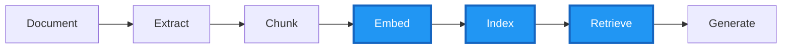

**Figure 1: RAG Pipeline Overview** - The blue-highlighted stages (Embed, Index, Retrieve) are covered in this module. These stages transform text chunks into searchable vectors and enable intelligent retrieval.

| Stage | What Happens | Output |
|-------|--------------|--------|
| **EMBED** | Convert text chunks to 3072-dimensional vectors using Azure OpenAI | Numeric representations that capture semantic meaning |
| **INDEX** | Store vectors and metadata in Azure AI Search | A searchable index optimized for vector similarity |
| **RETRIEVE** | Find the most relevant chunks for a user's question | Top-K results ranked by relevance |

---

## Learning Outcomes

By completing this module, you will be able to:

- Generate embeddings using `text-embedding-3-large` (3072 dimensions)
- Understand how semantic similarity works across languages (Hebrew ↔ English)
- Design index schemas for RAG workloads with vector fields
- Implement text, vector, and hybrid search modes
- Configure semantic ranking (L2 reranker) for improved relevance
- Select the right retrieval pattern for different use cases
- Use Agentic Retrieval for complex multi-part questions (Preview)

---

## Part 1: What are Embeddings?

### The Core Concept

**Embeddings** are the foundation of semantic search. Instead of matching keywords literally, embeddings allow us to find content based on **meaning**. 

Here's the key insight: An embedding model converts any text into a fixed-size array of numbers (a "vector"). Texts with similar meanings produce vectors that are mathematically close together, even if they use completely different words or languages.

The diagram below shows how four different texts are converted to vectors by the `text-embedding-3-large` model:

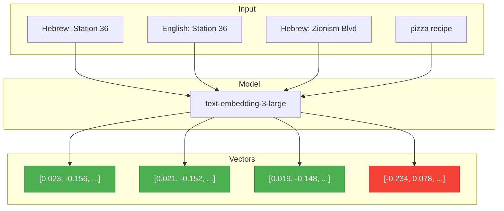

**Figure 2: Embedding Generation Process** - Notice how the first three inputs (all related to Metro Station 36) produce similar vectors (green), while "pizza recipe" (red) produces a completely different vector. The model understands semantic relationships even across languages!

### Why This Matters for Our Metro Documents

Our workshop uses Israel M1 Metro Line documents written primarily in Hebrew. Without embeddings, searching for "passenger capacity" would never find content written as "קיבולת נוסעים". But with embeddings:

- **Hebrew "תחנה 36"** ≈ **English "Station 36"** ≈ **"שדרות הציונות"** (the station name)
- All three produce nearly identical vectors because they refer to the same concept!

This enables **cross-lingual search**: A user can ask questions in English and find relevant Hebrew content automatically.

### Measuring Similarity: Cosine Similarity

How do we determine if two vectors are "close"? We use **cosine similarity**, which measures the angle between two vectors. The result ranges from -1 to 1:

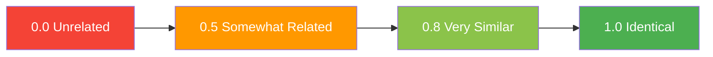

**Figure 3: Cosine Similarity Scale** - In practice, scores above 0.8 indicate strong semantic similarity. When searching, we find chunks with the highest cosine similarity to the query embedding.

**Practical example from our Metro documents:**
- Query: "How many passengers at Station 36?" → embedding Q
- Chunk: "קיבולת נוסעים צפויה 2,400 נוסעים בשעת שיא" → embedding C
- Cosine similarity (Q, C) ≈ 0.85 → **Strong match!**

---

## Part 2: Azure AI Search Architecture

### Understanding the Service Components

Azure AI Search is more than a simple database—it's a complete search platform. Before diving into code, let's understand its architecture:

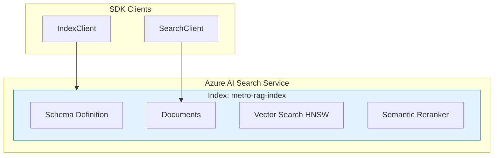

**Figure 4: Azure AI Search Architecture** - The service contains one or more **indexes** (like database tables). Each index has a schema, stores documents, and supports both vector search (HNSW algorithm) and semantic reranking. We interact with it using two SDK clients.

**Key Components Explained:**

| Component | Purpose | Analogy |
|-----------|---------|---------|
| **Search Service** | Container for all your indexes | A database server |
| **Index** | Schema + stored documents | A database table |
| **Schema** | Field definitions (types, attributes) | Table columns |
| **HNSW** | Algorithm for fast vector similarity search | A spatial index |
| **Semantic Reranker** | Neural model that improves result relevance | A smart filter |

### Designing the Index Schema for RAG

A well-designed schema is critical. Each field serves a specific purpose in our RAG pipeline:

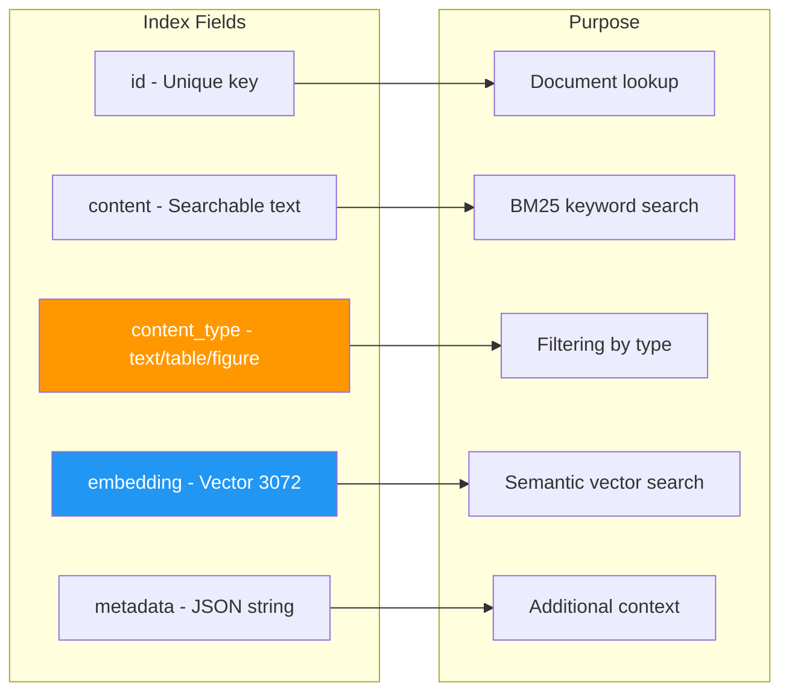

**Figure 5: Index Schema Design** - Each field maps to a specific retrieval capability. The `embedding` field (blue) enables semantic search, while `content_type` (orange) allows filtering by chunk type (text, table, or figure).

**Why each field matters:**

| Field | Type | Why It's Important |
|-------|------|-------------------|
| `id` | string (key) | Uniquely identifies each chunk for updates/deletes |
| `content` | string (searchable) | Enables keyword search with BM25 algorithm |
| `content_type` | string (filterable) | Filter results to only tables, figures, or text |
| `embedding` | vector[3072] | Enables semantic similarity search |
| `metadata` | string | Stores page numbers, section headers, source info |

### Push vs Pull: Two Ways to Populate an Index

Azure AI Search offers two ingestion patterns. We use **Push** in this workshop because we pre-compute embeddings:

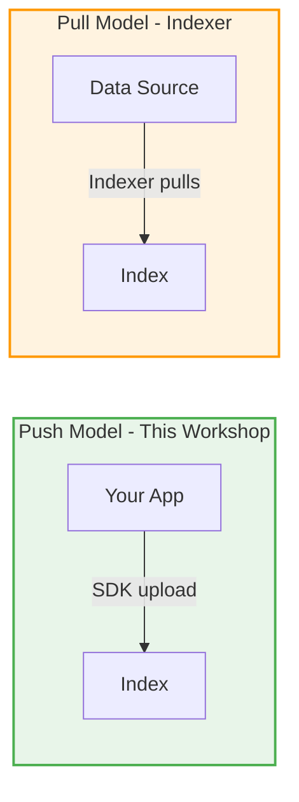

**Figure 6: Ingestion Patterns** - Push (green) gives you full control—you compute embeddings yourself and upload documents. Pull (orange) uses Azure's built-in indexers to automatically fetch and process data from sources like Blob Storage.

| Model | When to Use | Pros | Cons |
|-------|-------------|------|------|
| **Push** | Pre-computed embeddings, real-time updates, full control | Flexibility, any embedding model | More code to write |
| **Pull** | Large datasets in Azure storage, scheduled refresh | Less code, built-in skills | Less control over processing |

---

## Part 3: Search Modes Explained

### The Four Search Modes

Azure AI Search supports multiple search modes. Choosing the right one significantly impacts RAG quality. Here's how they differ:

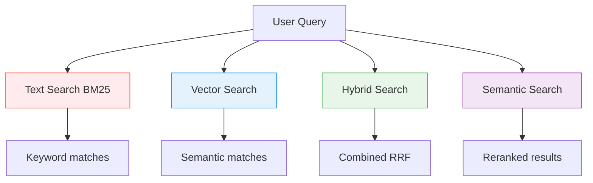

**Figure 7: Search Mode Comparison** - The same query can be processed four different ways. Text search (red) matches keywords. Vector search (blue) finds semantic matches. Hybrid (green) combines both. Semantic (purple) adds neural reranking.

**Detailed Comparison:**

| Mode | How It Works | Best For | Limitations |
|------|--------------|----------|-------------|
| **Text (BM25)** | Matches exact keywords using TF-IDF statistics | Exact terms like "Station 36", product codes | Misses synonyms, no cross-lingual capability |
| **Vector** | Finds semantically similar content via embeddings | Conceptual queries, cross-lingual search | May miss exact keyword matches |
| **Hybrid** | Runs both BM25 and vector, combines with RRF | General RAG—recommended baseline | Slightly more compute |
| **Semantic** | Hybrid + L2 neural reranking | Production RAG requiring high quality | Higher latency and cost |

### How Hybrid Search Works: RRF Fusion

**Reciprocal Rank Fusion (RRF)** is the algorithm that combines BM25 and vector results. Here's the intuition:

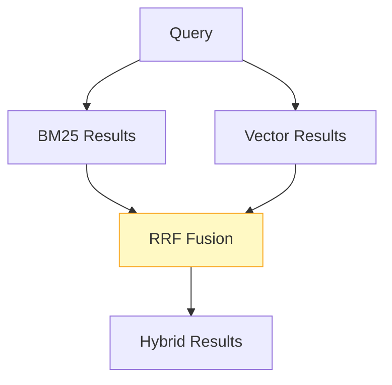

**Figure 8: RRF Fusion Process** - Both BM25 and vector search produce ranked lists. RRF combines them by considering each document's rank in both lists, not just raw scores.

**The RRF Formula:**
```
RRF_score(doc) = 1/(k + rank_BM25) + 1/(k + rank_Vector)
```

Where `k` is typically 60. This means:
- A document ranked #1 in both lists gets: 1/61 + 1/61 = 0.033
- A document ranked #1 in BM25 but #10 in vector gets: 1/61 + 1/70 = 0.031
- A document only in BM25 (not in vector top-K): 1/61 + 0 = 0.016

**Why RRF works well:** It balances precision (BM25 exact matches) with recall (vector semantic matches), and documents that appear in both lists naturally rank higher.

---

## Part 4: Semantic Ranking (L2 Reranker)

### The Two-Stage Retrieval Pattern

For production RAG, we use a **two-stage** approach. Stage 1 is fast but approximate. Stage 2 is slower but much more precise:

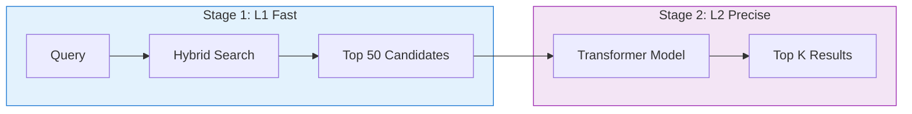

**Figure 9: Two-Stage Retrieval** - Stage 1 (L1, blue) quickly retrieves 50 candidates using hybrid search. Stage 2 (L2, purple) uses a transformer neural network to carefully score each candidate and select the final top-K.

**Why two stages?**
- Running a transformer over millions of documents is too slow
- Hybrid search efficiently narrows to ~50 candidates
- The L2 reranker then does deep semantic analysis on just those 50
- Result: High quality with acceptable latency

### Understanding Reranker Scores

The L2 reranker returns a score from **0 to 4** (not 0 to 1 like cosine similarity):

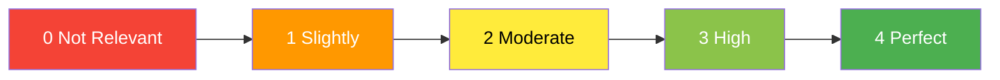

**Figure 10: Reranker Score Scale** - The 0-4 scale indicates how well a document answers the query. Scores below 2 indicate weak relevance; scores above 3 indicate strong relevance.

**Practical Guidance:**

| Score Range | Interpretation | Action |
|-------------|----------------|--------|
| 0 - 1.0 | Not relevant or tangentially related | Exclude from context |
| 1.0 - 2.0 | Slightly relevant, may contain useful background | Include cautiously |
| 2.0 - 3.0 | Moderately relevant, good supporting content | Include in context |
| 3.0 - 4.0 | Highly relevant, directly answers the query | Prioritize in context |

**Tip:** Filter results with `reranker_score >= 2.0` to ensure quality. In our Metro documents, a query about "passenger capacity" should score 3+ on chunks containing actual capacity numbers.

---

## Part 5: Retrieval Patterns for RAG

### Choosing the Right Pattern

Not all RAG scenarios are the same. Use this decision tree to select the appropriate retrieval pattern:

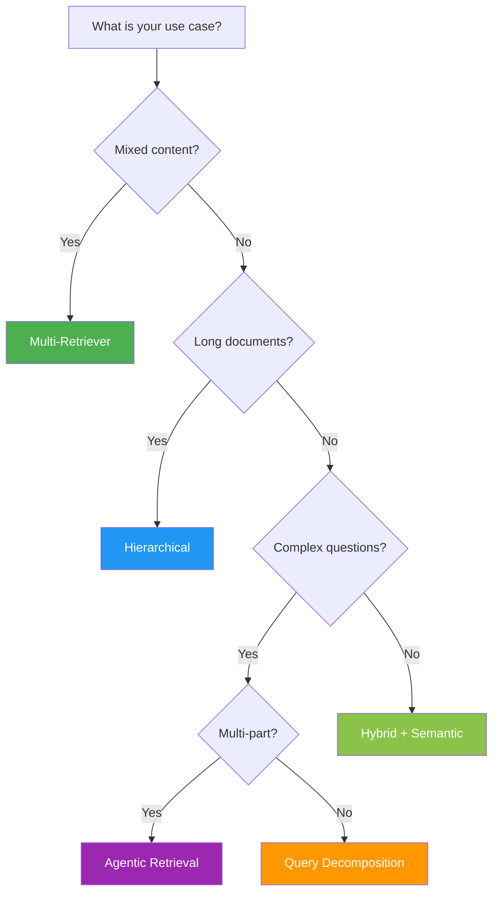

**Figure 11: Retrieval Pattern Selection** - Start at the top and follow the decision path. For our Metro documents (mixed text/tables/figures), **Multi-Retriever** (green) is often the best choice.

**Pattern Summary:**

| Pattern | Use When | Example |
|---------|----------|---------|
| **Hybrid + Semantic** | Simple factual queries | "What is Station 36's address?" |
| **Multi-Retriever** | Documents have text, tables, AND figures | Metro station specs (our workshop) |
| **Hierarchical** | Very long documents with clear sections | Legal contracts, technical manuals |
| **Query Decomposition** | Complex but single-topic questions | "Compare stations 36 and 37" |
| **Agentic Retrieval** | Multi-part questions needing different info | "Location, capacity, AND nearby attractions" |

### The Multi-Retriever Pattern (Recommended for This Workshop)

Our Metro documents contain text descriptions, specification tables, and maps/figures. A single retrieval might return only text chunks, missing crucial tabular data. The **Multi-Retriever** pattern solves this:

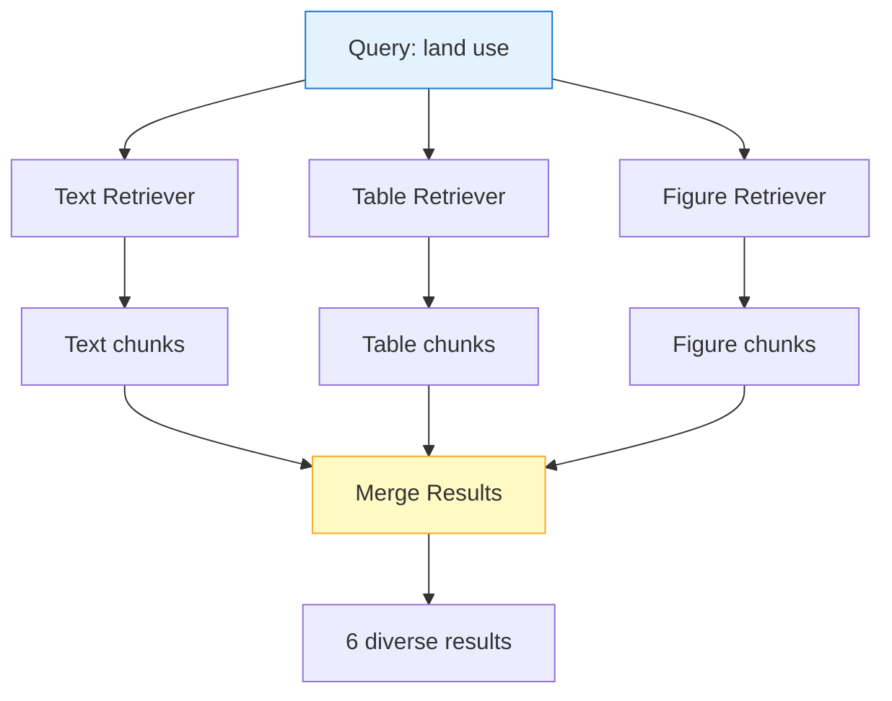

**Figure 12: Multi-Retriever Pattern** - The query runs three times with different `content_type` filters. Each retriever returns top-2 results of its type. The merge step combines them into a diverse context with 6 chunks (2 text + 2 table + 2 figure).

**Why this matters for Metro documents:**
- Query: "What are the land use types near Station 36?"
- Text chunks: Might describe land use in prose
- Table chunks: Contains the actual land use breakdown with percentages
- Figure chunks: Shows a map with land use zones

Without Multi-Retriever, you might only get text descriptions and miss the detailed table!

### Intent Detection for Smart Filtering

Sometimes users explicitly want a specific content type. We can detect this from their query:

| User Says | Detected Intent | Filter Applied |
|-----------|-----------------|----------------|
| "Show me the **table** of land uses" | TABLE | `content_type eq 'table'` |
| "Where is the **map** of entrances?" | FIGURE | `content_type eq 'figure'` |
| "How many passengers..." | GENERAL | No filter (search all) |

Hebrew keywords also work: "טבלה" (table), "מפה" (map), "תרשים" (diagram).

---

## Part 6: Agentic Retrieval (Preview)

### The Problem with Traditional RAG

Traditional RAG sends one query to the search engine. For simple questions, this works fine. But for complex, multi-part questions, a single query often fails to retrieve all necessary information:

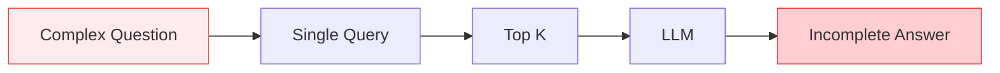

**Figure 13: Traditional RAG Limitation** - When a user asks "Tell me about Station 36: its location, passenger capacity, and nearby attractions," a single query might only retrieve location information, leading to an incomplete answer.

**Example failure:**
- **User Question:** "What is Station 36's location, how many passengers does it handle, and what attractions are nearby?"
- **Single Query Result:** Retrieves chunks about location only
- **LLM Answer:** Only describes location, says "I don't have information about passengers or attractions"

### Agentic Retrieval: The Solution

**Agentic Retrieval** uses an LLM to decompose complex questions into focused subqueries, runs each separately, and merges the results:

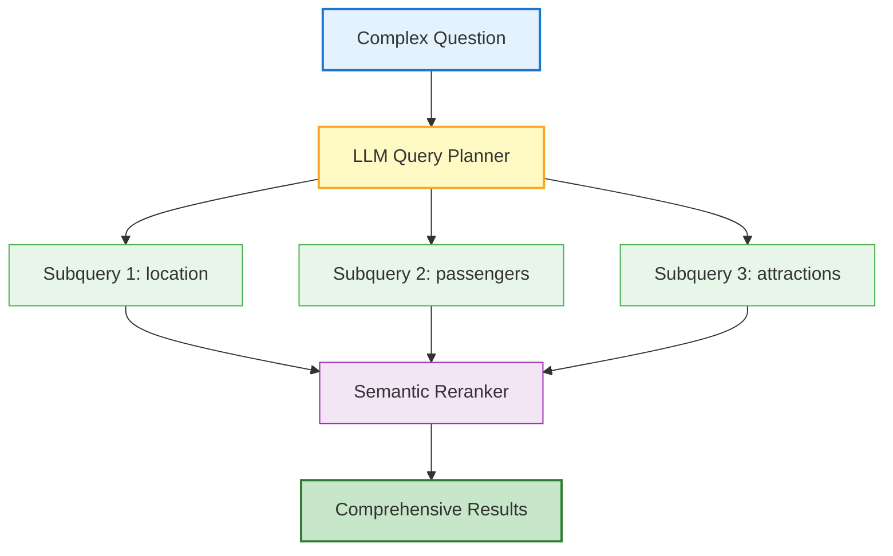

**Figure 14: Agentic Retrieval Flow** - The LLM Query Planner (yellow) analyzes the question and generates focused subqueries (green). Each subquery retrieves specific content. The Semantic Reranker (purple) merges and deduplicates results for comprehensive coverage.

**How it works step-by-step:**

1. **User asks:** "Tell me about Station 36: location, passengers, attractions"
2. **LLM Planner generates:**
   - Subquery 1: "Station 36 location address Zionism Boulevard"
   - Subquery 2: "Station 36 passenger capacity peak hour volume"
   - Subquery 3: "Station 36 nearby attractions points of interest"
3. **Each subquery retrieves** top-3 relevant chunks
4. **Semantic reranker** removes duplicates and ranks by overall relevance
5. **Result:** 6-9 diverse chunks covering all three aspects

### When to Use Agentic Retrieval

| Scenario | Use Agentic? | Why |
|----------|--------------|-----|
| "What is Station 36's address?" | No | Simple, single-topic query |
| "Tell me about Station 36's location, capacity, AND attractions" | **Yes** | Multi-part, needs different information |
| Follow-up: "What about Station 37?" | **Yes** | Context-aware, builds on previous query |
| Cost-sensitive batch processing | No | Higher cost per query |
| Ambiguous questions needing clarification | **Yes** | Planner can expand ambiguous terms |

**Note:** Agentic Retrieval is currently in **public preview** and requires Azure AI Search **Standard tier or higher**.

---

## Complete RAG Pipeline

Putting all the pieces together, here's the end-to-end flow when a user asks a question:

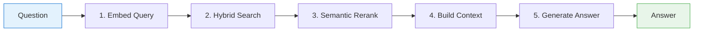

**Figure 15: Complete RAG Pipeline** - From user question to final answer in 5 steps: (1) Embed the query, (2) Run hybrid search, (3) Rerank results, (4) Build prompt context, (5) Generate answer with LLM.

**Detailed breakdown:**

| Step | Component | What Happens |
|------|-----------|--------------|
| 1. Embed Query | Azure OpenAI | Convert question to 3072-dim vector |
| 2. Hybrid Search | Azure AI Search | BM25 + vector search with RRF fusion |
| 3. Semantic Rerank | Azure AI Search | L2 transformer scores top candidates |
| 4. Build Context | Your code | Format chunks into prompt context |
| 5. Generate Answer | Azure OpenAI GPT-4.1 | LLM produces final answer |

---

## Summary Tables

### Search Mode Comparison

| Mode | Text Search | Vector Search | Ranking | Best For |
|------|:-----------:|:-------------:|---------|----------|
| **BM25 only** | Yes | No | BM25 | Exact keyword matches |
| **Vector only** | No | Yes | kNN | Pure semantic similarity |
| **Hybrid** | Yes | Yes | RRF | General RAG workloads |
| **Hybrid + Semantic** | Yes | Yes | RRF + L2 | Production RAG |

### Retrieval Pattern Summary

| Pattern | Best For | Complexity |
|---------|----------|------------|
| Single Hybrid | Simple factual queries | Low |
| Multi-Retriever | Mixed content (text/table/figure) | Medium |
| Hierarchical | Long structured documents | Medium |
| Query Decomposition | Complex single-topic questions | Medium |
| Agentic Retrieval | Multi-part questions | High |

---

## Estimated Time

| Section | Duration |
|---------|----------|
| Part 0: Setup and Load Chunks | 10 min |
| Part 1: Embeddings | 25 min |
| Part 2: Index Creation | 25 min |
| Part 3: Search Modes | 35 min |
| Part 4: Retrieval Patterns | 35 min |
| Part 5: Agentic Retrieval | 30 min |
| **Total** | **~2.5 hours** |

---

## Files in This Module

| File | Description |
|------|-------------|
| `lab.ipynb` | Main hands-on lab notebook |
| `lab.ipynb.backup` | Backup of previous version |
| `README.md` | This documentation |
| `failure-examples/` | Common retrieval failures to learn from |

---

## Navigation

**Previous**: [Module 4 – Chunking Strategies](../module-4-chunking/README.md)  
**Next**: [Module 6 – GraphRAG](../module-6-graphrag/README.md)

---

## Key Takeaways

1. **Embeddings enable semantic search** – They capture meaning, not just keywords, and work across languages (English queries find Hebrew content)

2. **Hybrid search is your baseline** – Combines BM25 keyword precision with vector semantic understanding via RRF fusion

3. **Semantic ranking dramatically improves quality** – The L2 reranker uses a transformer to score relevance; filter by `reranker_score >= 2.0`

4. **Schema design matters** – Include `content_type` field to enable filtering by text/table/figure

5. **Multi-Retriever for mixed content** – Query each content type separately to ensure diverse results

6. **Agentic Retrieval for complex questions** – Let the LLM decompose multi-part questions into focused subqueries
