# Module 5 – Embeddings, Indexing & Retrieval

## Where We Are in the Pipeline

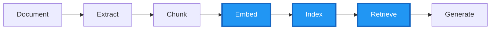

**This module covers THREE critical pipeline stages:**

| Stage | What Happens | Output |
|-------|--------------|--------|
| **EMBED** | Convert text chunks to 3072-dimensional vectors | Numeric representations |
| **INDEX** | Store vectors in Azure AI Search | Searchable index |
| **RETRIEVE** | Find relevant chunks for user queries | Top-K results |

---

## Learning Outcomes

By completing this module, you will be able to:

- Generate embeddings using `text-embedding-3-large` (3072 dimensions)
- Understand how semantic similarity works across languages (Hebrew - English)
- Design index schemas for RAG workloads with vector fields
- Implement text, vector, and hybrid search modes
- Configure semantic ranking (L2 reranker) for improved relevance
- Select the right retrieval pattern for different use cases
- Use Agentic Retrieval for complex multi-part questions (Preview)

---

## Part 1: What are Embeddings?

### The Core Concept

Embeddings convert text into **dense vector representations** that capture semantic meaning. Similar concepts have vectors that are close together in high-dimensional space.

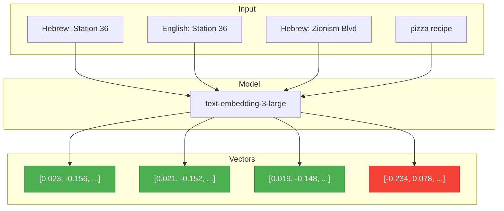

**Key insight**: V1, V2, V3 are similar (all about Metro Station 36), while V4 (pizza) is very different!

### Why This Matters for Metro Documents

The embedding model understands that:
- **Hebrew "Station 36"** ≈ **English "Station 36"** ≈ **"Zionism Boulevard"** (station name)
- These are all semantically related to the same Metro station!

This enables **cross-lingual search**: An English query can find Hebrew content.

### Cosine Similarity Scale

We measure how similar two vectors are using **cosine similarity** (range: -1 to 1):

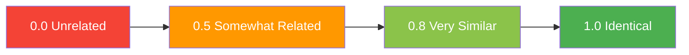

---

## Part 2: Azure AI Search Architecture

### Service Components

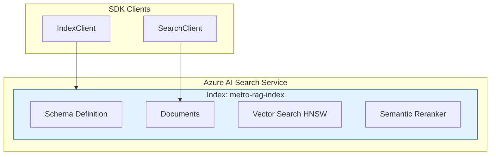

### Index Schema for RAG

Our index includes these key fields:

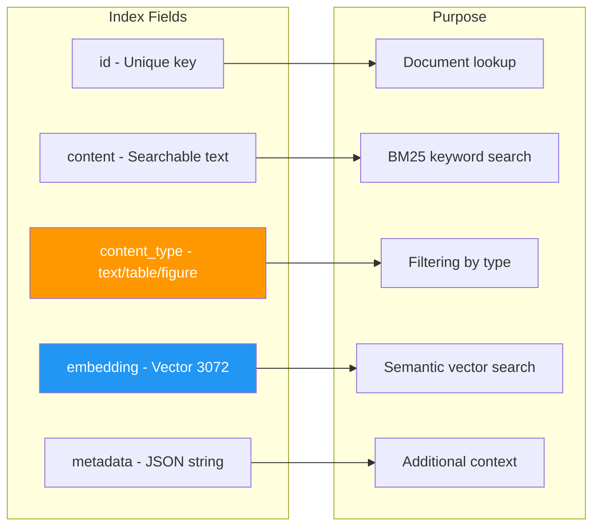

### Push vs Pull Ingestion

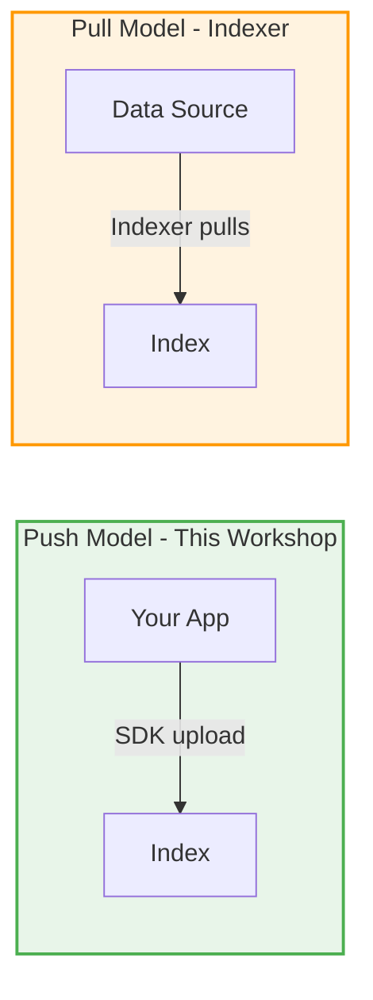

| Model | Pros | Cons |
|-------|------|------|
| **Push** | Full control, Pre-computed embeddings, Real-time | More code |
| **Pull** | Scheduled refresh, Built-in skills | Less control |

---

## Part 3: Search Modes Explained

Azure AI Search supports multiple search modes. Understanding when to use each is critical for RAG quality.

### Mode Comparison

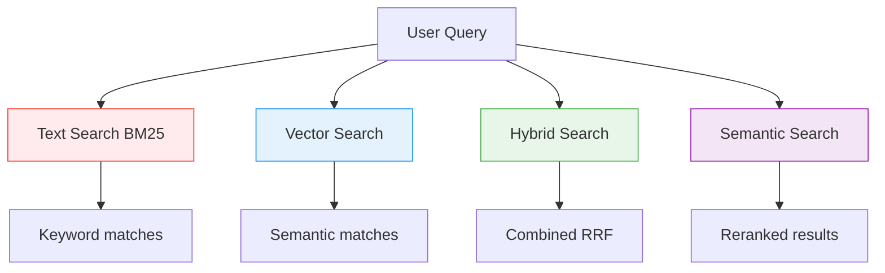

### When to Use Each Mode

| Mode | Best For | Limitations |
|------|----------|-------------|
| **Text (BM25)** | Exact terms, station numbers | Misses synonyms, no cross-lingual |
| **Vector** | Semantic meaning, cross-lingual queries | May miss exact matches |
| **Hybrid** | General RAG workloads | Good balance |
| **Semantic** | Production RAG with high quality needs | Higher latency, cost |

### Hybrid Search: RRF Fusion

**Reciprocal Rank Fusion** combines BM25 and vector results:

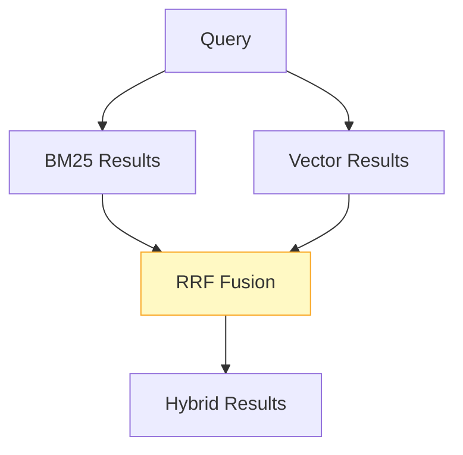

**Formula**: `score = 1/(k + rank_bm25) + 1/(k + rank_vector)`

---

## Part 4: Semantic Ranking (L2 Reranker)

### Two-Stage Retrieval

Semantic ranking is a **two-stage** process that dramatically improves relevance:

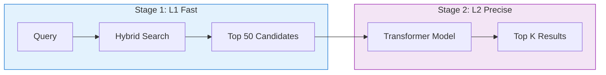

### Reranker Score Scale (0-4)

The L2 reranker returns a **relevance score from 0 to 4**:

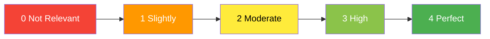

**Tip**: Filter results with `reranker_score >= 2.0` for quality answers.

---

## Part 5: Retrieval Patterns for RAG

Different use cases require different retrieval strategies:

### Pattern Selection Guide

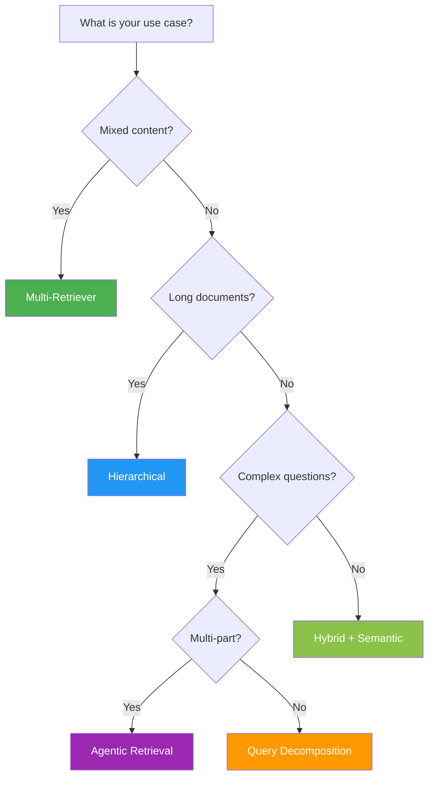

### Multi-Retriever Pattern

For Metro documents with mixed content (text, tables, figures), we query each type separately:

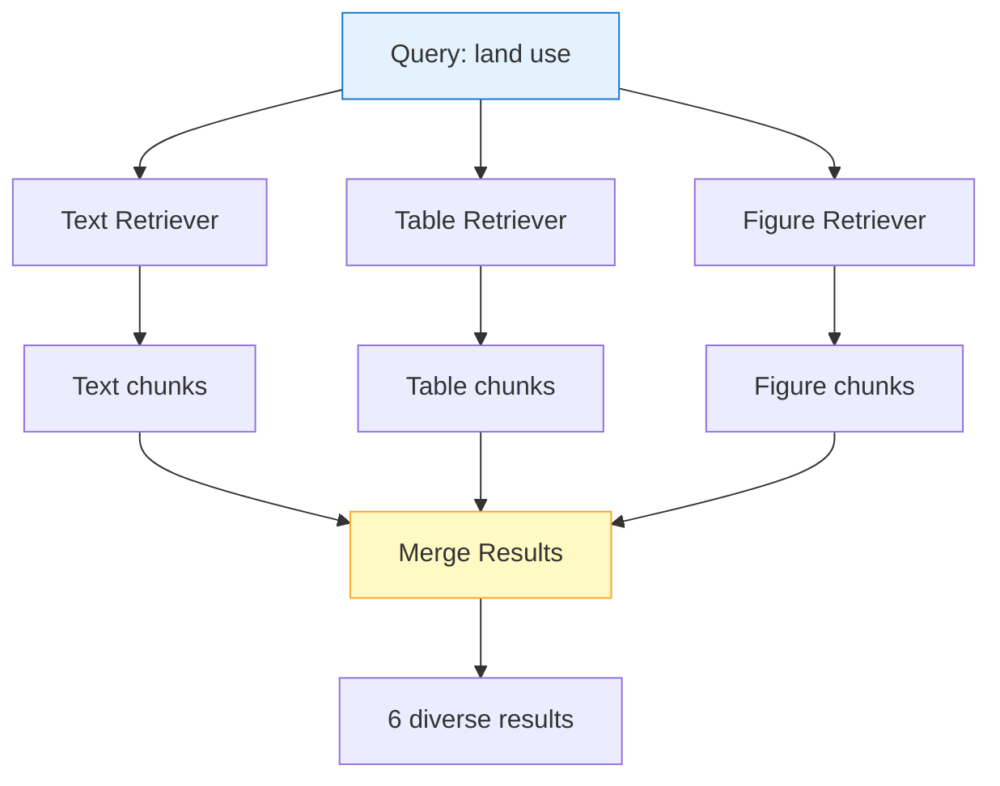

### Intent Detection for Filtered Retrieval

Detect user intent to apply smart filters:

| Intent Keywords | Filter Applied |
|-----------------|----------------|
| table, data, specifications | `content_type eq 'table'` |
| map, diagram, image | `content_type eq 'figure'` |
| General questions | No filter |

---

## Part 6: Agentic Retrieval (Preview)

### Traditional RAG: Single Query Approach

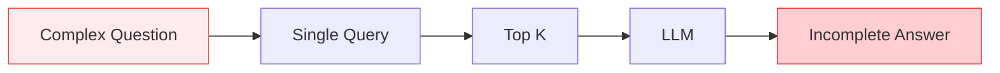

**Problem**: A single query cannot fully address multi-part questions.

---

### Agentic Retrieval: Multi-Query Approach

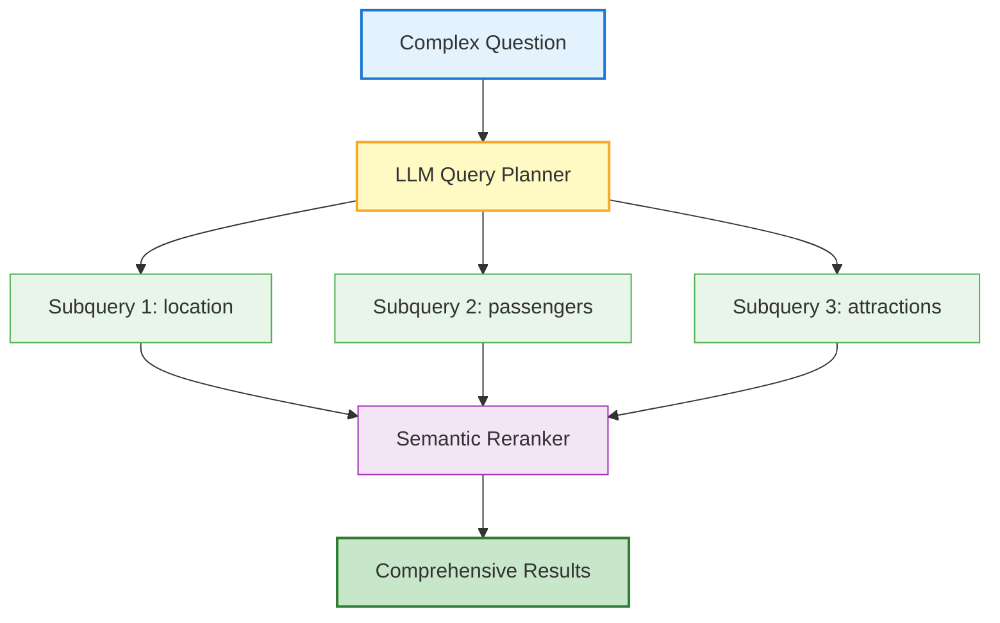

### Benefits of Agentic Retrieval

| Benefit | Description |
|---------|-------------|
| **Handles compound questions** | Automatically breaks down multi-part questions |
| **Better coverage** | Each subquery finds specific relevant content |
| **Context-aware** | Maintains conversation context for follow-ups |
| **Semantic fusion** | Reranker ensures high-quality merged results |

### When to Use Agentic Retrieval

| Scenario | Use Agentic? |
|----------|--------------|
| Simple factual question | No (overkill) |
| Multi-part question | Yes |
| Follow-up questions in conversation | Yes |
| Cost-sensitive application | No (higher cost) |
| Ambiguous questions needing clarification | Yes |

---

## Complete RAG Pipeline

Putting it all together:

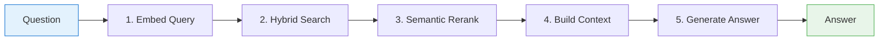

---

## Search Mode Comparison Table

| Mode | Text Search | Vector Search | Ranking | Best For |
|------|:-----------:|:-------------:|---------|----------|
| **BM25 only** | Yes | No | BM25 | Exact keyword matches |
| **Vector only** | No | Yes | kNN | Pure semantic similarity |
| **Hybrid** | Yes | Yes | RRF | General RAG workloads |
| **Hybrid + Semantic** | Yes | Yes | RRF + L2 | Production RAG |

---

## Estimated Time

| Section | Duration |
|---------|----------|
| Part 0: Setup and Load Chunks | 10 min |
| Part 1: Embeddings | 25 min |
| Part 2: Index Creation | 25 min |
| Part 3: Search Modes | 35 min |
| Part 4: Retrieval Patterns | 35 min |
| Part 5: Agentic Retrieval | 30 min |
| **Total** | **~2.5 hours** |

---

## Files in This Module

| File | Description |
|------|-------------|
| `lab.ipynb` | Main hands-on lab notebook |
| `lab.ipynb.backup` | Backup of previous version |
| `README.md` | This documentation |
| `failure-examples/` | Common retrieval failures to learn from |

---

## Navigation

**Previous**: [Module 4 – Chunking Strategies](../module-4-chunking/README.md)  
**Next**: [Module 6 – GraphRAG](../module-6-graphrag/README.md)

---

## Key Takeaways

1. **Embeddings are magical** – They enable cross-lingual search (English to Hebrew)
2. **Hybrid search is your baseline** – Combines keyword precision with semantic understanding
3. **Semantic ranking boosts quality** – Filter by reranker_score >= 2.0
4. **Content-type filtering matters** – Tables and figures need special handling
5. **Agentic retrieval for complex questions** – Let the LLM decompose multi-part queries
