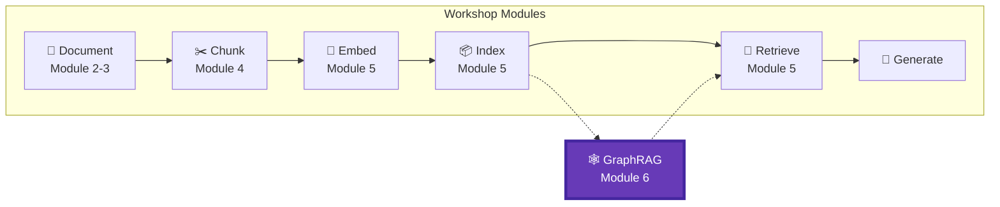
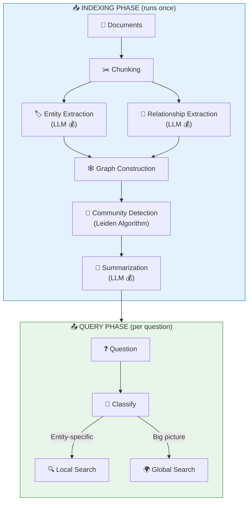
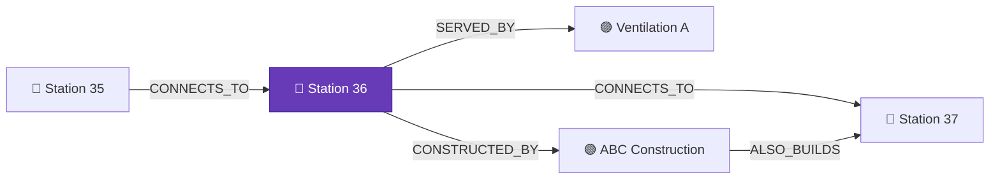
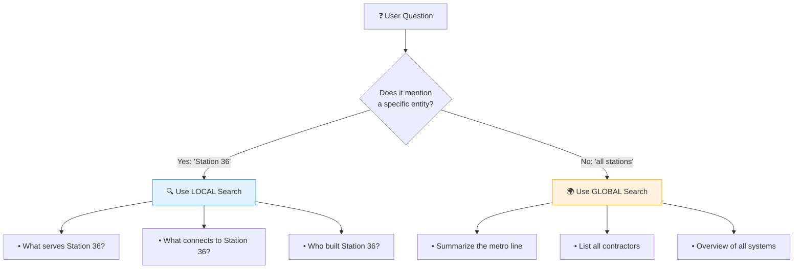
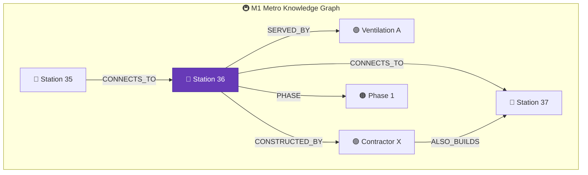

# Module 6 – GraphRAG: Cross-Document Reasoning

## 📍 Where We Are in the Pipeline



**This module adds GRAPH-BASED RETRIEVAL** – when classic vector search fails on "connect the dots" questions, GraphRAG adds relationship-aware retrieval using knowledge graphs.

---

## 🎯 The Problem GraphRAG Solves

Regular RAG (Modules 1-5) finds **similar** content. GraphRAG finds **connected** content.

### Metro M1 Example: Why Regular RAG Fails

Imagine asking about the **Israel M1 Metro Line** documents:

```
┌─────────────────────────────────────────────────────────────────┐
│                     REGULAR RAG                                 │
├─────────────────────────────────────────────────────────────────┤
│   Question: "What stations are affected if Station 36 closes?" │
│   Process:  Search for chunks about "Station 36"               │
│   Result:   ⚠️ Only finds chunks directly mentioning Station 36│
│            ❌ Misses connected stations on the same line       │
│            ❌ Doesn't know Station 35 and 37 are adjacent      │
└─────────────────────────────────────────────────────────────────┘

┌─────────────────────────────────────────────────────────────────┐
│                     GRAPHRAG                                    │
├─────────────────────────────────────────────────────────────────┤
│   Question: "What stations are affected if Station 36 closes?" │
│   Process:  Find Station 36 → Follow CONNECTS_TO edges         │
│   Result:   ✅ Station 35 connects to Station 36               │
│            ✅ Station 36 connects to Station 37                │
│            ✅ Passengers from 35 & 37 would need alternatives  │
│            ✅ Full impact chain identified!                    │
└─────────────────────────────────────────────────────────────────┘
```

### More Metro Examples Where GraphRAG Shines

| Question | Regular RAG | GraphRAG |
|----------|-------------|----------|
| "Which stations share ventilation systems?" | ❌ Can't connect | ✅ Follows SHARES_SYSTEM edges |
| "Summarize all underground stations" | ⚠️ Partial | ✅ Uses community summaries |
| "What's the passenger flow from Station 36?" | ❌ No relationships | ✅ Traverses FEEDS_INTO edges |
| "Which contractors work on multiple stations?" | ❌ Can't aggregate | ✅ Entity-relationship query |

---

## Objective
Master graph-based retrieval for cross-document reasoning using Microsoft GraphRAG.

## Learning Outcomes
By the end of this module, participants will be able to:
- ✅ **Identify** when classic RAG fails and GraphRAG is needed
- ✅ **Explain** the GraphRAG architecture (entities, relationships, communities)
- ✅ **Set up** Microsoft GraphRAG with Azure OpenAI
- ✅ **Execute** local queries (entity-centric) and global queries (community-based)
- ✅ **Build** a hybrid RAG + GraphRAG pipeline with automatic query routing
- ✅ **Choose** the right approach based on question type and cost considerations

## Key Message
> When classic RAG fails on "connect the dots" questions, GraphRAG amplifies retrieval with relationships.

---

## 🏗️ GraphRAG Architecture



---

## 📖 GraphRAG Concepts & Terminology

Understanding GraphRAG requires learning a few key concepts. Let's break them down with Metro examples.

### 🏷️ What are Entities?

**Entities** are the "nouns" in your documents – the important things, places, people, or concepts that you want to track.

```
┌─────────────────────────────────────────────────────────────────┐
│                    ENTITIES = GRAPH NODES                       │
├─────────────────────────────────────────────────────────────────┤
│                                                                 │
│   In a Metro document, entities might be:                      │
│                                                                 │
│   🔵 STATION:     "Station 36", "Station 35", "Central Hub"    │
│   🟣 SYSTEM:      "Ventilation A", "Power Grid B"              │
│   🟢 CONTRACTOR:  "ABC Construction", "XYZ Engineering"        │
│   🟠 PERSON:      "Project Manager Sarah", "Chief Engineer"    │
│   🔴 TIMELINE:    "Phase 1", "2026 Opening"                    │
│                                                                 │
│   The LLM reads your documents and extracts these entities     │
│   automatically based on the entity types you configure.       │
│                                                                 │
└─────────────────────────────────────────────────────────────────┘
```

**How entities are extracted:**
1. You define entity types (STATION, SYSTEM, etc.)
2. GraphRAG sends each chunk to the LLM
3. LLM identifies entities matching those types
4. Each entity gets a name and description

### 🔗 What are Relationships?

**Relationships** are the "verbs" connecting entities – how things relate to each other.



**Common relationship types:**

| Relationship | Meaning | Metro Example |
|-------------|---------|---------------|
| `CONNECTS_TO` | Physical/logical connection | Station 35 → Station 36 |
| `DEPENDS_ON` | One needs the other | Station depends on Power Grid |
| `SERVED_BY` | Provides service to | Station served by Ventilation |
| `CONSTRUCTED_BY` | Built by | Station constructed by Contractor |
| `LOCATED_IN` | Geographic containment | Station located in District |
| `PART_OF` | Component relationship | Ventilation part of HVAC System |

### 🏘️ What are Communities?

**Communities** are clusters of related entities that GraphRAG groups together using the **Leiden algorithm**.

```
┌─────────────────────────────────────────────────────────────────┐
│                 COMMUNITIES = ENTITY CLUSTERS                   │
├─────────────────────────────────────────────────────────────────┤
│                                                                 │
│  ┌─────────────────────┐    ┌─────────────────────┐            │
│  │ 🏘️ Community 1:     │    │ 🏘️ Community 2:     │            │
│  │ "Northern Stations" │    │ "Southern Stations" │            │
│  │                     │    │                     │            │
│  │  • Station 35       │    │  • Station 40       │            │
│  │  • Station 36       │    │  • Station 41       │            │
│  │  • Station 37       │    │  • Station 42       │            │
│  │  • Ventilation A    │    │  • Ventilation B    │            │
│  │  • Power Grid North │    │  • Power Grid South │            │
│  └─────────────────────┘    └─────────────────────┘            │
│                                                                 │
│  GraphRAG generates a SUMMARY for each community:              │
│  "The Northern Stations cluster includes Stations 35-37,       │
│   sharing Ventilation System A and connected to Power Grid     │
│   North. These stations serve the downtown business district." │
│                                                                 │
└─────────────────────────────────────────────────────────────────┘
```

**Why communities matter:**
- Enable **global queries** ("Summarize all stations")
- Group related entities for efficient retrieval
- Pre-computed summaries speed up answers

### 🔬 What is the Leiden Algorithm?

The **Leiden algorithm** is a community detection algorithm that groups densely connected nodes.

```
HOW LEIDEN WORKS (simplified):

1. Start: Every entity is its own community
2. Move: Try moving each entity to a neighboring community
3. Check: Does the move improve "modularity" (connectivity density)?
4. Repeat: Keep optimizing until stable
5. Result: Entities in the same community are highly connected

Metro Example:
- Station 35, 36, 37 are highly connected (same line segment)
- They form Community "Northern Stations"
- Station 40, 41, 42 form Community "Southern Stations"
- The algorithm detected these clusters automatically!
```

### 🔍 Local Search vs 🌍 Global Search

GraphRAG has two query modes for different question types:

```
┌─────────────────────────────────────────────────────────────────┐
│                    🔍 LOCAL SEARCH                              │
├─────────────────────────────────────────────────────────────────┤
│                                                                 │
│  Best for: Questions about SPECIFIC entities                   │
│                                                                 │
│  Question: "What systems serve Station 36?"                    │
│                                                                 │
│  How it works:                                                 │
│  1. Find entity "Station 36" in the graph                      │
│  2. Follow edges: SERVED_BY, CONNECTS_TO, etc.                 │
│  3. Gather connected entities and their descriptions           │
│  4. Send context to LLM for final answer                       │
│                                                                 │
│  ✅ Fast (targeted search)                                     │
│  ✅ Accurate for entity-specific questions                     │
│  ❌ Can't answer big-picture questions                         │
│                                                                 │
└─────────────────────────────────────────────────────────────────┘

┌─────────────────────────────────────────────────────────────────┐
│                    🌍 GLOBAL SEARCH                             │
├─────────────────────────────────────────────────────────────────┤
│                                                                 │
│  Best for: Questions requiring BROAD overview                  │
│                                                                 │
│  Question: "Summarize the entire M1 metro line"                │
│                                                                 │
│  How it works:                                                 │
│  1. Retrieve all community summaries                           │
│  2. Rank by relevance to the question                          │
│  3. Combine top summaries as context                           │
│  4. LLM synthesizes final comprehensive answer                 │
│                                                                 │
│  ✅ Can answer "summarize everything" questions                │
│  ✅ Works across entire document set                           │
│  ❌ Slower (processes more data)                               │
│  ❌ More expensive (more tokens)                               │
│                                                                 │
└─────────────────────────────────────────────────────────────────┘
```

### 📊 Query Mode Decision Guide



### 🧮 What are Embeddings in GraphRAG?

GraphRAG still uses vector embeddings, but differently than regular RAG:

| Component | What Gets Embedded | Purpose |
|-----------|-------------------|---------|
| **Entities** | Entity name + description | Find relevant entities for local search |
| **Communities** | Community summaries | Find relevant communities for global search |
| **Chunks** | Original text chunks | Ground answers in source text |

### 📦 GraphRAG Output Files

After indexing, GraphRAG creates several files:

| File | Contains | Used For |
|------|----------|----------|
| `entities.parquet` | All extracted entities with descriptions | Local queries, visualization |
| `relationships.parquet` | All entity-to-entity connections | Graph traversal |
| `communities.parquet` | Community memberships and summaries | Global queries |
| `chunks.parquet` | Original text chunks | Grounding answers |
| `graph.graphml` | Complete graph structure | Visualization tools |

---

## Topics Covered

### When Classic RAG Breaks on Metro Documents

| Question Type | Classic RAG | GraphRAG | Metro Example |
|---------------|-------------|----------|---------------|
| "What depends on X?" | ❌ Poor | ✅ Good | "What systems depend on Station 36 power?" |
| "Summarize all of Y" | ❌ Poor | ✅ Good | "Summarize all underground stations" |
| "Compare A and B" | ⚠️ Partial | ✅ Good | "Compare Station 35 and Station 37 layouts" |
| "Impact of changing X?" | ❌ Poor | ✅ Good | "Impact of closing Station 36 entrance?" |
| "List all components that..." | ❌ Poor | ✅ Good | "List all stations with shared ventilation" |

### Entity Types for Metro Documents

If we built GraphRAG for the M1 Metro documents, we'd extract:

| Entity Type | Examples |
|-------------|----------|
| **STATION** | Station 35, Station 36, Station 37 |
| **SYSTEM** | Ventilation, Power, Signaling |
| **CONTRACTOR** | Construction companies |
| **TIMELINE** | Phase 1, Phase 2, Opening dates |
| **PASSENGER_FLOW** | Peak hours, daily volume |

### Relationships in Metro Documents

```
[Station 35] ──CONNECTS_TO──► [Station 36] ──CONNECTS_TO──► [Station 37]
[Station 36] ──SERVED_BY──► [Ventilation System A]
[Station 36] ──CONSTRUCTED_BY──► [Contractor X]
[Station 36] ──FEEDS_INTO──► [Central Hub]
```

### GraphRAG Architecture
1. **Indexing Pipeline**
   - Entity extraction (LLM)
   - Relationship extraction (LLM)
   - Graph construction
   - Community detection
   - Community summarization
2. **Key Components**
   - Entities (nodes)
   - Relationships (edges)
   - Communities (clusters)
   - Base chunks (grounding)
3. **Query Patterns**
   - Local search (entity-centric)
   - Global search (community-based)
   - Hybrid (vector + graph)

### Entity and Relationship Extraction
- Entity types for Metro docs (stations, systems, contractors, etc.)
- Relationship types (CONNECTS_TO, SERVED_BY, CONSTRUCTED_BY, etc.)
- Extraction prompt design

### GraphRAG vs Classic RAG
| Aspect | Classic RAG | GraphRAG |
|--------|-------------|----------|
| Query type | Specific facts | Relationships, summaries |
| Indexing cost | Low | **High** (many LLM calls) |
| Query latency | Fast (~1 sec) | Slower (~3-10 sec) |
| Cross-doc reasoning | ❌ | ✅ |
| Global summarization | ❌ | ✅ |

### When to Use GraphRAG

```
✅ USE GRAPHRAG for Metro-style documents:
├── Multi-station planning documents
├── System dependency analysis ("what if power fails?")
├── Cross-document reasoning (station ↔ contractor ↔ timeline)
├── Impact analysis ("closing Station 36 affects...")
└── Summarizing entire metro line

❌ DON'T USE GRAPHRAG:
├── Simple fact lookup ("Station 36 depth?")
├── Single-document Q&A
├── Real-time chatbots (too slow)
└── Frequently updated content (reindex cost)
```

---

## 💰 Cost Considerations

GraphRAG is **expensive** during indexing because it makes many LLM calls:

| Step | LLM Calls | Estimated Tokens |
|------|-----------|------------------|
| Entity Extraction | 1 per chunk | ~50K for 5 docs |
| Relationship Extraction | 1 per chunk | ~30K for 5 docs |
| Community Summaries | 1 per community | ~20K |
| **Total** | | **~100K tokens** |

**Demo Cost**: $0.50 - $2.00 (for our 5 sample documents)  
**Production Warning**: Indexing all M1 Metro documents could cost $50-$200+

---

## 📚 The Dataset Connection

While the hands-on lab uses a fictional "Contoso Platform" dataset (for clearer relationship demonstrations), the concepts apply directly to the **Israel M1 Metro Line** documents from Modules 1-5.

### How Metro Documents Would Map to GraphRAG



### Exercise: Apply GraphRAG to Metro

After this module, try:
1. Extract Metro PDF text using Document Intelligence (Module 2)
2. Configure GraphRAG with Metro entity types (STATION, SYSTEM, CONTRACTOR)
3. Compare answers between Module 5 RAG and GraphRAG

---

## Hands-on Labs

| Part | Lab | Description |
|------|-----|-------------|
| **Part 0** | Setup | Install GraphRAG and configure Azure OpenAI |
| **Part 1** | Data | Create sample documents with relationships |
| **Part 2** | Configure | Set up entity types and settings.yaml |
| **Part 3** | Index | Run the GraphRAG indexing pipeline |
| **Part 4** | Explore | Visualize entities, relationships, and communities |
| **Part 5** | Query | Execute local and global queries |
| **Part 6** | Compare | Side-by-side Regular RAG vs GraphRAG |
| **Part 7** | Hybrid | Build automatic query router |
| **Part 8** | Summary | Key takeaways and recommendations |

---

## 🕸️ Knowledge Graph Visualization

The lab includes an interactive knowledge graph visualization showing entities and their relationships:


**Color Legend:**
| Color | Entity Type | Examples |
|-------|-------------|----------|
| 🔵 Blue | STATION | Station 35, Station 36, Central Hub |
| 🟢 Green | SYSTEM | Ventilation System A, Power Grid |
| 🟠 Orange | CONTRACTOR | Shapir Engineering, Climatec Systems |
| 🩷 Pink | PERSON | Yossi Cohen |
| 🔴 Red | INCIDENT | March 15 ventilation failure |

> 💡 **Tip**: Notice how Station 35 and Station 36 are both connected to Ventilation System A – this is the shared dependency that GraphRAG discovers!

---

## Requirements
- Python ≥3.11, <3.14
- `graphrag>=2.7.0`
- `pyvis` (for graph visualization)
- Azure OpenAI with GPT-4.1 and text-embedding-3-large deployments

## Estimated Time
- Concepts: 30 minutes
- Hands-on: 90 minutes
- **Total: ~2 hours**

## Files in This Module
| File | Description |
|------|-------------|
| `lab.ipynb` | Guided lab with detailed explanations |
| `README.md` | This file - module overview |
| `images/` | Visual aids and screenshots |
| `graphrag-demo/` | GraphRAG project folder (created during lab) |
| `failure-examples/` | Classic RAG failures that GraphRAG solves |

---

## 🎉 Congratulations!

After completing this module, you will have built a complete **hybrid RAG + GraphRAG pipeline** that automatically routes questions to the best retrieval approach!

**Previous Module**: [Module 5 – Azure AI Search & Retrieval](../module-5-search/README.md)  
**Workshop Complete!** 🎉
