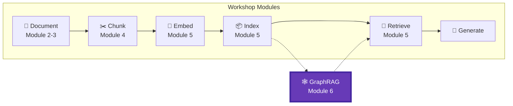
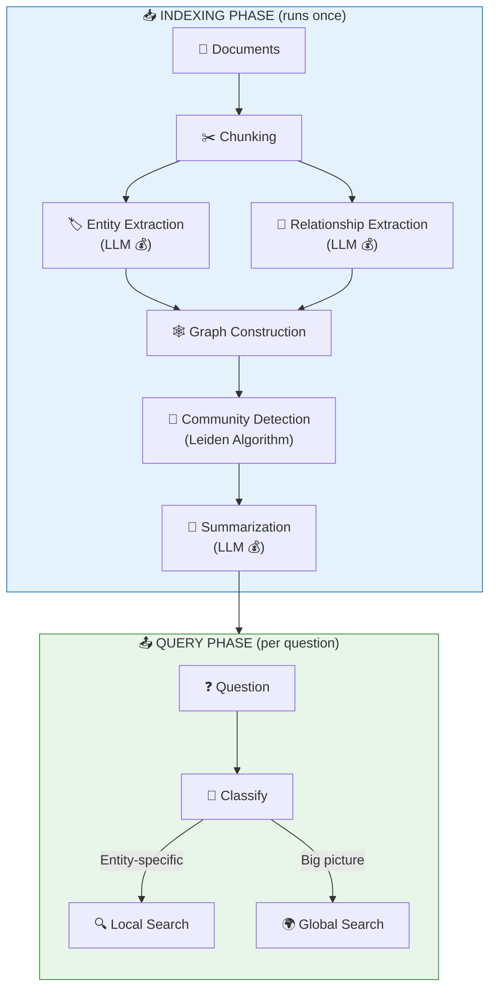

# Module 6 – GraphRAG: Cross-Document Reasoning

## 📍 Where We Are in the Pipeline



**This module adds GRAPH-BASED RETRIEVAL** – when classic vector search fails on "connect the dots" questions, GraphRAG adds relationship-aware retrieval using knowledge graphs.

---

## 🎯 The Problem GraphRAG Solves

Regular RAG (Modules 1-5) finds **similar** content. GraphRAG finds **connected** content.

```
┌─────────────────────────────────────────────────────────────────┐
│                     REGULAR RAG                                 │
├─────────────────────────────────────────────────────────────────┤
│   Question: "What happens if AuthService fails?"               │
│   Process:  Search for chunks about "AuthService"              │
│   Result:   ⚠️ Only finds chunks mentioning AuthService        │
│            ❌ Misses cascade effects to other services         │
└─────────────────────────────────────────────────────────────────┘

┌─────────────────────────────────────────────────────────────────┐
│                     GRAPHRAG                                    │
├─────────────────────────────────────────────────────────────────┤
│   Question: "What happens if AuthService fails?"               │
│   Process:  Find AuthService → Follow DEPENDS_ON edges         │
│   Result:   ✅ API Gateway depends on AuthService              │
│            ✅ User Portal depends on API Gateway               │
│            ✅ Full cascade path identified!                    │
└─────────────────────────────────────────────────────────────────┘
```

---

## Objective
Master graph-based retrieval for cross-document reasoning using Microsoft GraphRAG.

## Learning Outcomes
By the end of this module, participants will be able to:
- ✅ **Identify** when classic RAG fails and GraphRAG is needed
- ✅ **Explain** the GraphRAG architecture (entities, relationships, communities)
- ✅ **Set up** Microsoft GraphRAG with Azure OpenAI
- ✅ **Execute** local queries (entity-centric) and global queries (community-based)
- ✅ **Build** a hybrid RAG + GraphRAG pipeline with automatic query routing
- ✅ **Choose** the right approach based on question type and cost considerations

## Key Message
> When classic RAG fails on "connect the dots" questions, GraphRAG amplifies retrieval with relationships.

---

## 🏗️ GraphRAG Architecture



---

## Topics Covered

### When Classic RAG Breaks
| Question Type | Classic RAG | GraphRAG |
|---------------|-------------|----------|
| "What depends on X?" | ❌ Poor | ✅ Good |
| "Summarize all of Y" | ❌ Poor | ✅ Good |
| "Compare A and B" | ⚠️ Partial | ✅ Good |
| "Impact of changing X?" | ❌ Poor | ✅ Good |
| "List all components that..." | ❌ Poor | ✅ Good |

### GraphRAG Architecture
1. **Indexing Pipeline**
   - Entity extraction (LLM)
   - Relationship extraction (LLM)
   - Graph construction
   - Community detection
   - Community summarization
2. **Key Components**
   - Entities (nodes)
   - Relationships (edges)
   - Communities (clusters)
   - Base chunks (grounding)
3. **Query Patterns**
   - Local search (entity-centric)
   - Global search (community-based)
   - Hybrid (vector + graph)

### Entity and Relationship Extraction
- Entity types for technical docs (systems, APIs, configs, etc.)
- Relationship types (DEPENDS_ON, CONNECTS_TO, etc.)
- Extraction prompt design

### GraphRAG vs Classic RAG
| Aspect | Classic RAG | GraphRAG |
|--------|-------------|----------|
| Query type | Specific facts | Relationships, summaries |
| Indexing cost | Low | **High** (many LLM calls) |
| Query latency | Fast (~1 sec) | Slower (~3-10 sec) |
| Cross-doc reasoning | ❌ | ✅ |
| Global summarization | ❌ | ✅ |

### When to Use GraphRAG

```
✅ USE GRAPHRAG:
├── Architecture documentation
├── Incident investigation ("what caused this?")
├── Compliance traceability
├── Dependency mapping
└── Knowledge base summarization

❌ DON'T USE GRAPHRAG:
├── Simple FAQ systems
├── Real-time chatbots (too slow)
├── Frequently updated content (reindex cost)
└── Single-document Q&A
```

---

## 💰 Cost Considerations

GraphRAG is **expensive** during indexing because it makes many LLM calls:

| Step | LLM Calls | Estimated Tokens |
|------|-----------|------------------|
| Entity Extraction | 1 per chunk | ~50K for 5 docs |
| Relationship Extraction | 1 per chunk | ~30K for 5 docs |
| Community Summaries | 1 per community | ~20K |
| **Total** | | **~100K tokens** |

**Demo Cost**: $0.50 - $2.00 (for our 5 sample documents)  
**Production Warning**: 100+ documents could cost $50-$200+

---

## Hands-on Labs

| Part | Lab | Description |
|------|-----|-------------|
| **Part 0** | Setup | Install GraphRAG and configure Azure OpenAI |
| **Part 1** | Data | Create sample documents with relationships |
| **Part 2** | Configure | Set up entity types and settings.yaml |
| **Part 3** | Index | Run the GraphRAG indexing pipeline |
| **Part 4** | Explore | Visualize entities, relationships, and communities |
| **Part 5** | Query | Execute local and global queries |
| **Part 6** | Compare | Side-by-side Regular RAG vs GraphRAG |
| **Part 7** | Hybrid | Build automatic query router |
| **Part 8** | Summary | Key takeaways and recommendations |

## Requirements
- Python ≥3.11, <3.14
- `graphrag>=2.7.0`
- `pyvis` (for graph visualization)
- Azure OpenAI with GPT-4.1 and text-embedding-3-large deployments

## Estimated Time
- Concepts: 30 minutes
- Hands-on: 90 minutes
- **Total: ~2 hours**

## Files in This Module
| File | Description |
|------|-------------|
| `lab.ipynb` | Guided lab with detailed explanations |
| `README.md` | This file - module overview |
| `images/` | Visual aids and screenshots |
| `graphrag-demo/` | GraphRAG project folder (created during lab) |
| `failure-examples/` | Classic RAG failures that GraphRAG solves |

---

## 🎉 Congratulations!

After completing this module, you will have built a complete **hybrid RAG + GraphRAG pipeline** that automatically routes questions to the best retrieval approach!

**Previous Module**: [Module 5 – Azure AI Search & Retrieval](../module-5-search/README.md)  
**Workshop Complete!** 🎉
