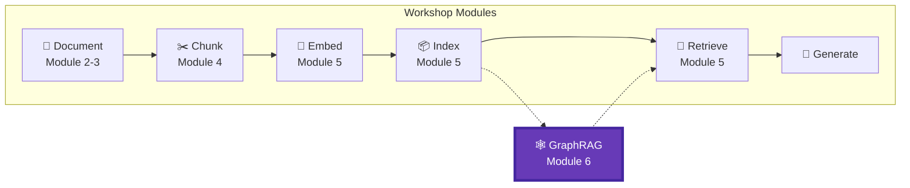
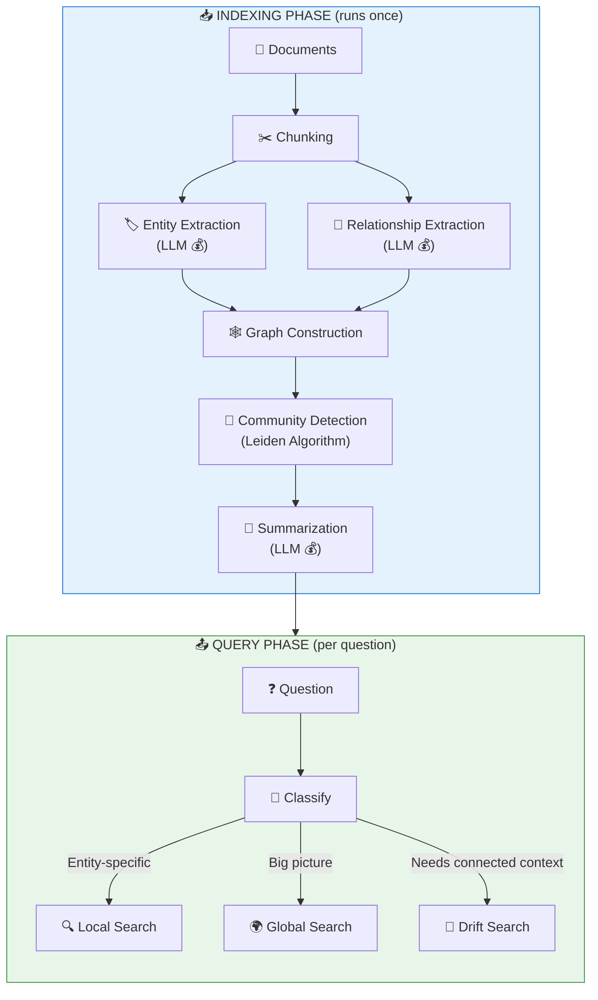
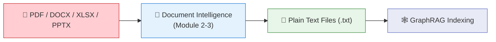
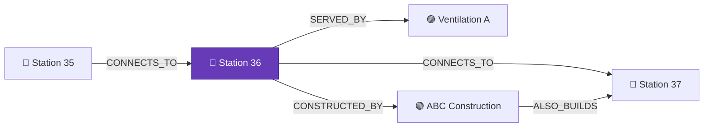
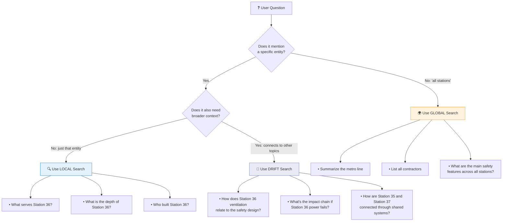
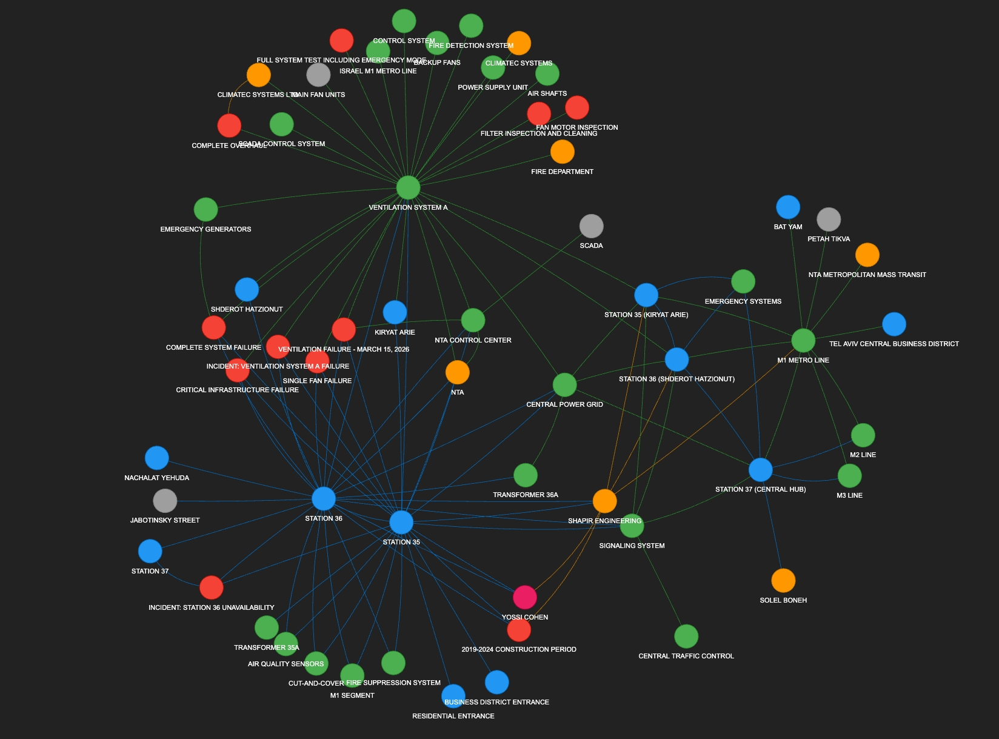

# Module 6 – GraphRAG: Cross-Document Reasoning

## 📍 Where We Are in the Pipeline



**This module adds GRAPH-BASED RETRIEVAL** – when classic vector search fails on "connect the dots" questions, GraphRAG adds relationship-aware retrieval using knowledge graphs.

---

## 🎯 The Problem GraphRAG Solves

Regular RAG (Modules 1-5) finds **similar** content. GraphRAG finds **connected** content.

### Metro M1 Example: Why Regular RAG Fails

Imagine asking about the **Israel M1 Metro Line** documents:

```
┌─────────────────────────────────────────────────────────────────┐
│                     REGULAR RAG                                 │
├─────────────────────────────────────────────────────────────────┤
│   Question: "What stations are affected if Station 36 closes?" │
│   Process:  Search for chunks about "Station 36"               │
│   Result:   ⚠️ Only finds chunks directly mentioning Station 36│
│            ❌ Misses connected stations on the same line       │
│            ❌ Doesn't know Station 35 and 37 are adjacent      │
└─────────────────────────────────────────────────────────────────┘

┌─────────────────────────────────────────────────────────────────┐
│                     GRAPHRAG                                    │
├─────────────────────────────────────────────────────────────────┤
│   Question: "What stations are affected if Station 36 closes?" │
│   Process:  Find Station 36 → Follow CONNECTS_TO edges         │
│   Result:   ✅ Station 35 connects to Station 36               │
│            ✅ Station 36 connects to Station 37                │
│            ✅ Passengers from 35 & 37 would need alternatives  │
│            ✅ Full impact chain identified!                    │
└─────────────────────────────────────────────────────────────────┘
```

### More Metro Examples Where GraphRAG Shines

| Question | Regular RAG | GraphRAG |
|----------|-------------|----------|
| "Which stations share ventilation systems?" | ❌ Can't connect | ✅ Follows SHARES_SYSTEM edges |
| "Summarize all underground stations" | ⚠️ Partial | ✅ Uses community summaries |
| "What's the passenger flow from Station 36?" | ❌ No relationships | ✅ Traverses FEEDS_INTO edges |
| "Which contractors work on multiple stations?" | ❌ Can't aggregate | ✅ Entity-relationship query |

---

## Objective
Master graph-based retrieval for cross-document reasoning using Microsoft GraphRAG.

## Learning Outcomes
By the end of this module, participants will be able to:
- ✅ **Identify** when classic RAG fails and GraphRAG is needed
- ✅ **Explain** the GraphRAG architecture (entities, relationships, communities)
- ✅ **Set up** Microsoft GraphRAG with Azure OpenAI
- ✅ **Execute** local, global, and drift queries and understand when to use each
- ✅ **Build** a hybrid RAG + GraphRAG pipeline with automatic query routing
- ✅ **Choose** the right approach based on question type and cost considerations

## Key Message
> When classic RAG fails on "connect the dots" questions, GraphRAG amplifies retrieval with relationships.

---

## 🏗️ GraphRAG Architecture



---

## ⚠️ What GraphRAG Expects as Input (Common Pitfall!)

> **🚨 GraphRAG cannot read PDFs, Word docs, Excel files, or any binary format.**
> It expects **plain text files** (`.txt`) in an `input/` directory. If you drop a PDF into `input/` and run `graphrag index`, you'll get garbage — binary data, encoded streams, and meaningless entities.

This means you need a **preprocessing step** before GraphRAG can do anything useful:



### The Preparation Steps

1. **Extract text** from your documents using Azure AI Document Intelligence (Modules 2-3)
   - This handles structure, reading order, tables, and Hebrew/RTL content
2. **Save as `.txt` files** in GraphRAG's `input/` directory — one file per document
3. **Configure `settings.yaml`** — set chunk size, entity types, LLM endpoints
4. **Run `graphrag index`** — GraphRAG takes over from here

### Do I Need to Pre-Chunk My Documents?

**No!** This is a key difference from the regular RAG pipeline:

| | Regular RAG (Modules 4-5) | GraphRAG (Module 6) |
|---|---|---|
| **Input format** | Clean text from Document Intelligence | Clean text from Document Intelligence |
| **Chunking** | **You** design the strategy (header-based, semantic, hybrid) | **GraphRAG** chunks internally (you only set `chunk_size` in `settings.yaml`) |
| **What you provide** | Pre-chunked text + your own embeddings | Full text files — GraphRAG handles everything else |
| **Embeddings** | You generate and store them | GraphRAG generates its own |

GraphRAG does its own chunking because it needs overlapping context windows to extract entities and relationships that span chunk boundaries. Your job is just to give it clean, readable text.

### What Happens in Module 7

In the full pipeline (Module 7), this preprocessing is automated: when you upload a PDF, the backend runs Document Intelligence → saves extracted text to GraphRAG's `input/` folder → triggers `graphrag index`. But understanding this flow is critical if you ever want to run GraphRAG independently.

---

## ⚙️ Understanding `settings.yaml` — The GraphRAG Control Panel

The `settings.yaml` file is where you configure **everything** about how GraphRAG processes your data. Getting these settings right directly affects the quality of your knowledge graph.

> 📁 See the full file: [`graphrag-demo/settings.yaml`](graphrag-demo/settings.yaml)

### Key Configuration Sections

#### 1. Models — Which LLMs to Use

```yaml
models:
  default_chat_model:
    type: azure_openai_chat
    model: gpt-4.1
    deployment_name: gpt-4.1
    # ... endpoint, API key, rate limits
    
  default_embedding_model:
    type: azure_openai_embedding
    model: text-embedding-3-large
    deployment_name: text-embedding-3-large
```

GraphRAG uses the **chat model** for entity extraction, relationship extraction, and community summarization. It uses the **embedding model** for vectorizing entities and communities. The rate limits (`requests_per_minute`, `tokens_per_minute`) are important — set them too high and Azure will throttle you; too low and indexing takes forever.

#### 2. Chunking — How GraphRAG Splits Your Text

```yaml
chunking:
  type: tokens
  size: 1200      # tokens per chunk
  overlap: 100    # overlap between chunks
```

**This is not the same as your Module 4 chunking!** GraphRAG does its own internal chunking regardless of how you prepared the text. The key decisions:

| Setting | Our Value | Why |
|---------|-----------|-----|
| `size: 1200` | 1200 tokens | Balances context for entity extraction vs. cost. Too small (300) → LLM misses relationships that span paragraphs. Too large (3000) → more tokens = higher cost, and the LLM may lose focus on individual entities. |
| `overlap: 100` | 100 tokens | Ensures entities mentioned at chunk boundaries aren't lost. If Station 36 is mentioned at the end of one chunk and its ventilation system at the start of the next, the overlap catches the relationship. |

> 💡 **Rule of thumb:** Start with 1200 tokens. If you're getting too few entities, try reducing to 800. If relationships are being missed, try increasing to 1500. Each change requires a full re-index.

#### 3. Entity Types — What GraphRAG Looks For

```yaml
extract_graph:
  entity_types:
    - STATION
    - SYSTEM
    - CONTRACTOR
    - PERSON
    - INCIDENT
  max_gleanings: 1
```

**Entity types are the most impactful setting.** They tell the LLM *what kinds of things* to extract from your text. If you don't include `SYSTEM`, GraphRAG won't extract ventilation systems, power grids, etc. — even if they're clearly mentioned in the text.

- **Too few types** → Misses important entities and relationships
- **Too many types** → Extracts noise, increases cost, dilutes the graph
- **Wrong types** → The LLM extracts irrelevant things while missing what matters

`max_gleanings: 1` means GraphRAG makes a second pass over each chunk to catch entities it missed on the first pass. Set to 0 to save cost (skip the second pass), or increase for higher recall.

#### 4. Community Configuration

```yaml
cluster_graph:
  max_cluster_size: 10    # Max entities per community

community_reports:
  max_length: 2000        # Max tokens per community summary
  max_input_length: 8000  # Max context for summarization
```

These control how communities are formed and summarized:
- `max_cluster_size: 10` — Keeps communities focused. Larger values create broader communities with more general summaries.
- `max_length: 2000` — How detailed each community summary can be. Longer = more informative global search, but higher cost.

### Settings Impact on Quality

| If you change... | Effect on quality | Effect on cost |
|-----------------|-------------------|----------------|
| `chunk size` ↑ | Better relationship detection | 💰 More tokens per LLM call |
| `chunk size` ↓ | More granular entities | 💰 More LLM calls (more chunks) |
| `entity_types` + more | Broader knowledge graph | 💰 More extraction work |
| `entity_types` − fewer | Focused, cleaner graph | 💰 Less extraction work |
| `max_gleanings` 0→1 | Catches missed entities | 💰 ~2x extraction cost |
| `max_cluster_size` ↑ | Broader community themes | 💰 Slightly more summarization |

---

## 📖 GraphRAG Concepts & Terminology

Understanding GraphRAG requires learning a few key concepts. Let's break them down with Metro examples.

### 🏷️ What are Entities?

**Entities** are the "nouns" in your documents – the important things, places, people, or concepts that you want to track.

```
┌─────────────────────────────────────────────────────────────────┐
│                    ENTITIES = GRAPH NODES                       │
├─────────────────────────────────────────────────────────────────┤
│                                                                 │
│   In a Metro document, entities might be:                      │
│                                                                 │
│   🔵 STATION:     "Station 36", "Station 35", "Central Hub"    │
│   🟣 SYSTEM:      "Ventilation A", "Power Grid B"              │
│   🟢 CONTRACTOR:  "ABC Construction", "XYZ Engineering"        │
│   🟠 PERSON:      "Project Manager Sarah", "Chief Engineer"    │
│   🔴 TIMELINE:    "Phase 1", "2026 Opening"                    │
│                                                                 │
│   The LLM reads your documents and extracts these entities     │
│   automatically based on the entity types you configure.       │
│                                                                 │
└─────────────────────────────────────────────────────────────────┘
```

**How entities are extracted:**
1. You define entity types (STATION, SYSTEM, etc.)
2. GraphRAG sends each chunk to the LLM
3. LLM identifies entities matching those types
4. Each entity gets a name and description

### 🔗 What are Relationships?

**Relationships** are the "verbs" connecting entities – how things relate to each other.



**Common relationship types:**

| Relationship | Meaning | Metro Example |
|-------------|---------|---------------|
| `CONNECTS_TO` | Physical/logical connection | Station 35 → Station 36 |
| `DEPENDS_ON` | One needs the other | Station depends on Power Grid |
| `SERVED_BY` | Provides service to | Station served by Ventilation |
| `CONSTRUCTED_BY` | Built by | Station constructed by Contractor |
| `LOCATED_IN` | Geographic containment | Station located in District |
| `PART_OF` | Component relationship | Ventilation part of HVAC System |

### 🏘️ What are Communities?

**Communities** are clusters of related entities that GraphRAG groups together using the **Leiden algorithm**.

```
┌─────────────────────────────────────────────────────────────────┐
│                 COMMUNITIES = ENTITY CLUSTERS                   │
├─────────────────────────────────────────────────────────────────┤
│                                                                 │
│  ┌─────────────────────┐    ┌─────────────────────┐            │
│  │ 🏘️ Community 1:     │    │ 🏘️ Community 2:     │            │
│  │ "Northern Stations" │    │ "Southern Stations" │            │
│  │                     │    │                     │            │
│  │  • Station 35       │    │  • Station 40       │            │
│  │  • Station 36       │    │  • Station 41       │            │
│  │  • Station 37       │    │  • Station 42       │            │
│  │  • Ventilation A    │    │  • Ventilation B    │            │
│  │  • Power Grid North │    │  • Power Grid South │            │
│  └─────────────────────┘    └─────────────────────┘            │
│                                                                 │
│  GraphRAG generates a SUMMARY for each community:              │
│  "The Northern Stations cluster includes Stations 35-37,       │
│   sharing Ventilation System A and connected to Power Grid     │
│   North. These stations serve the downtown business district." │
│                                                                 │
└─────────────────────────────────────────────────────────────────┘
```

**Why communities matter:**
- Enable **global queries** ("Summarize all stations")
- Group related entities for efficient retrieval
- Pre-computed summaries speed up answers

### 🔬 What is the Leiden Algorithm?

The **Leiden algorithm** is a community detection algorithm that groups densely connected nodes.

```
HOW LEIDEN WORKS (simplified):

1. Start: Every entity is its own community
2. Move: Try moving each entity to a neighboring community
3. Check: Does the move improve "modularity" (connectivity density)?
4. Repeat: Keep optimizing until stable
5. Result: Entities in the same community are highly connected

Metro Example:
- Station 35, 36, 37 are highly connected (same line segment)
- They form Community "Northern Stations"
- Station 40, 41, 42 form Community "Southern Stations"
- The algorithm detected these clusters automatically!
```

### 🔍 Local Search vs 🌍 Global Search vs 🌊 Drift Search

Microsoft GraphRAG provides **three** query modes. These are **specific to Microsoft's GraphRAG implementation** — Local and Global were introduced in the [original GraphRAG paper](https://arxiv.org/abs/2404.16130) (2024), and Drift was added later as a hybrid mode. Other graph-based RAG tools (Neo4j GraphRAG, LlamaIndex Knowledge Graphs) have their own traversal strategies, but the local/global/drift terminology and architecture is unique to Microsoft GraphRAG.

---

#### 🔍 Local Search

- **How it works:** Starts from the entities most relevant to your query, then traverses their **immediate neighborhood** in the graph (relationships, connected entities, associated text chunks).
- **Best for:** Specific, focused questions about particular topics, places, systems, or things.
- **Example:** *"What are the underground passages at Station 35?"* → Finds the Station 35 entity, walks its relationships, and answers from that local context.
- **Tradeoff:** Great precision, but may miss broader context that lives in distant parts of the graph.

---

#### 🌍 Global Search

- **How it works:** Uses **community reports** — pre-generated summaries of clusters/communities of entities in the graph. It searches across all community summaries to synthesize a high-level answer.
- **Best for:** Broad, thematic, or summary questions that span the entire corpus.
- **Example:** *"What are the main safety features across all metro stations?"* → Aggregates insights from community summaries covering the whole document set.
- **Tradeoff:** Great for big-picture answers, but less detail on specific entities. Relies on the quality of community detection and summarization.

---

#### 🌊 Drift Search

- **How it works:** A hybrid approach — starts like **local search** (from relevant entities), but then **"drifts" outward** through the graph, following relationships further than local search would. It progressively expands the search radius, collecting context from increasingly distant parts of the graph.
- **Best for:** Questions that need both specific detail AND broader context — especially when the answer requires connecting information across multiple related topics.
- **Example:** *"How does the ventilation system at Station 35 relate to the overall safety design?"* → Starts at Station 35's ventilation, then drifts to safety entities, standards, and cross-station patterns.
- **Tradeoff:** More comprehensive than local, more specific than global, but slower since it explores more of the graph.

> 💡 **Think of it this way:** Local search looks at your entity's front yard. Drift search walks down the street and around the neighborhood. Global search flies over the whole city.

---

### 📊 Query Mode Decision Guide



### ⚡ Quick Comparison Table

| | 🔍 **Local** | 🌊 **Drift** | 🌍 **Global** |
|---|---|---|---|
| **Scope** | Entity + neighbors | Expanding radius | Entire corpus |
| **Speed** | ⚡ Fast | 🐢 Slower | 🐢 Medium-slow |
| **Cost** | 💰 Low | 💰💰 Medium | 💰💰💰 High |
| **Best for** | Specific facts | Connected reasoning | Summaries & themes |
| **Data source** | Entities + relationships | Entities → graph walk | Community summaries |
| **Metro example** | "What serves Station 36?" | "How does Station 36 relate to the safety plan?" | "Summarize all stations" |

### 🧮 What are Embeddings in GraphRAG?

GraphRAG still uses vector embeddings, but differently than regular RAG:

| Component | What Gets Embedded | Purpose |
|-----------|-------------------|---------|
| **Entities** | Entity name + description | Find relevant entities for local search |
| **Communities** | Community summaries | Find relevant communities for global search |
| **Chunks** | Original text chunks | Ground answers in source text |

### 📦 GraphRAG Output Files

After indexing, GraphRAG creates several files:

| File | Contains | Used For |
|------|----------|----------|
| `entities.parquet` | All extracted entities with descriptions | Local queries, visualization |
| `relationships.parquet` | All entity-to-entity connections | Graph traversal |
| `communities.parquet` | Community memberships and summaries | Global queries |
| `chunks.parquet` | Original text chunks | Grounding answers |
| `graph.graphml` | Complete graph structure | Visualization tools |

---

## ✅ When to Use GraphRAG (and When Not To)

| Use GraphRAG ✅ | Stick with Classic RAG ❌ |
|---|---|
| Cross-document reasoning (*"which contractors work on multiple stations?"*) | Simple fact lookup (*"What is Station 36's depth?"*) |
| Impact/dependency analysis (*"what if Station 36 power fails?"*) | Single-document Q&A |
| Summarizing large document sets (*"summarize all underground stations"*) | Real-time chatbots (GraphRAG is too slow) |
| Comparing entities (*"compare Station 35 and Station 37 layouts"*) | Frequently updated content (reindex cost is high) |

---

## 💰 Cost Considerations

GraphRAG is **expensive** during indexing because it makes many LLM calls:

| Step | LLM Calls | Estimated Tokens |
|------|-----------|------------------|
| Entity Extraction | 1 per chunk | ~50K for 5 docs |
| Relationship Extraction | 1 per chunk | ~30K for 5 docs |
| Community Summaries | 1 per community | ~20K |
| **Total** | | **~100K tokens** |

**Demo Cost**: $0.50 - $2.00 (for our 5 sample documents)  
**Production Warning**: Indexing all M1 Metro documents could cost $50-$200+

---

## 📚 The Dataset

The hands-on lab uses fictional sample documents for clearer relationship demonstrations. The concepts apply directly to any real-world dataset — in Module 7, you'll see GraphRAG applied to the **Israel M1 Metro Line** documents from Modules 1-5, where the knowledge graph captures stations, systems, contractors, and their relationships.


---

## Hands-on Labs

| Part | Lab | Description |
|------|-----|-------------|
| **Part 0** | Setup | Install GraphRAG and configure Azure OpenAI |
| **Part 1** | Data | Create sample documents with relationships |
| **Part 2** | Configure | Set up entity types and settings.yaml |
| **Part 3** | Index | Run the GraphRAG indexing pipeline |
| **Part 4** | Explore | Visualize entities, relationships, and communities |
| **Part 5** | Query | Execute local, global, and drift queries |
| **Part 6** | Compare | Side-by-side Regular RAG vs GraphRAG |
| **Part 7** | Hybrid | Build automatic query router |
| **Part 8** | Summary | Key takeaways and recommendations |

---

## 🕸️ Knowledge Graph Visualization

The lab includes an interactive knowledge graph visualization showing entities and their relationships:



**Color Legend:**
| Color | Entity Type | Examples |
|-------|-------------|----------|
| 🔵 Blue | STATION | Station 35, Station 36, Central Hub |
| 🟢 Green | SYSTEM | Ventilation System A, Power Grid |
| 🟠 Orange | CONTRACTOR | Shapir Engineering, Climatec Systems |
| 🩷 Pink | PERSON | Yossi Cohen |
| 🔴 Red | INCIDENT | March 15 ventilation failure |

> 💡 **Tip**: Notice how Station 35 and Station 36 are both connected to Ventilation System A – this is the shared dependency that GraphRAG discovers!

---

## Requirements
- Python ≥3.11, <3.14
- **Microsoft GraphRAG `3.0.1`** (pinned in `requirements.txt`)
- `pyvis` (for graph visualization)
- Azure OpenAI with GPT-4.1 and text-embedding-3-large deployments

## Estimated Time
- Concepts: 30 minutes
- Hands-on: 90 minutes
- **Total: ~2 hours**

## Files in This Module
| File | Description |
|------|-------------|
| `lab.ipynb` | Guided lab with detailed explanations |
| `README.md` | This file - module overview |
| `images/` | Visual aids and screenshots |
| `graphrag-demo/` | GraphRAG project folder (created during lab) |
| `failure-examples/` | Classic RAG failures that GraphRAG solves |

---

## 🎉 Congratulations!

After completing this module, you will have built a complete **hybrid RAG + GraphRAG pipeline** that automatically routes questions to the best retrieval approach!

## Navigation

**Previous**: [Module 5 – Azure AI Search & Retrieval](../module-5-search/README.md)  
**Next**: [Module 7 – Full RAG Pipeline](../module-7-pipeline/README.md)
