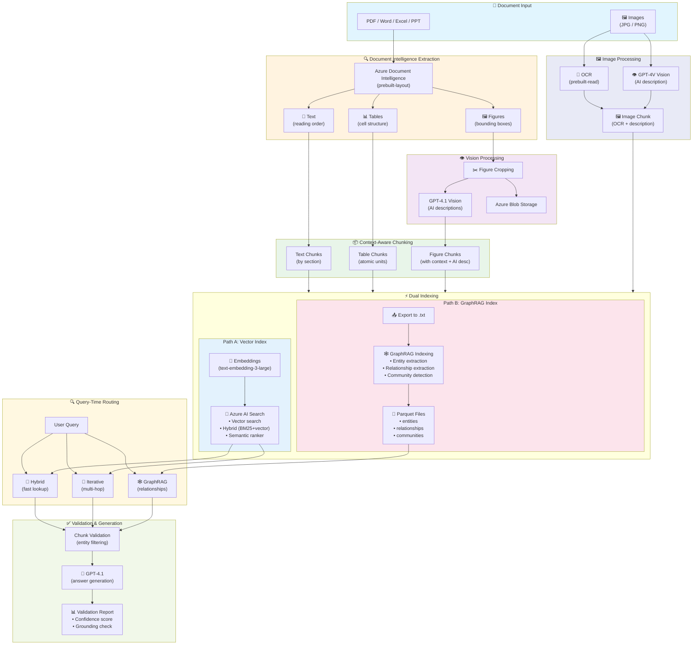
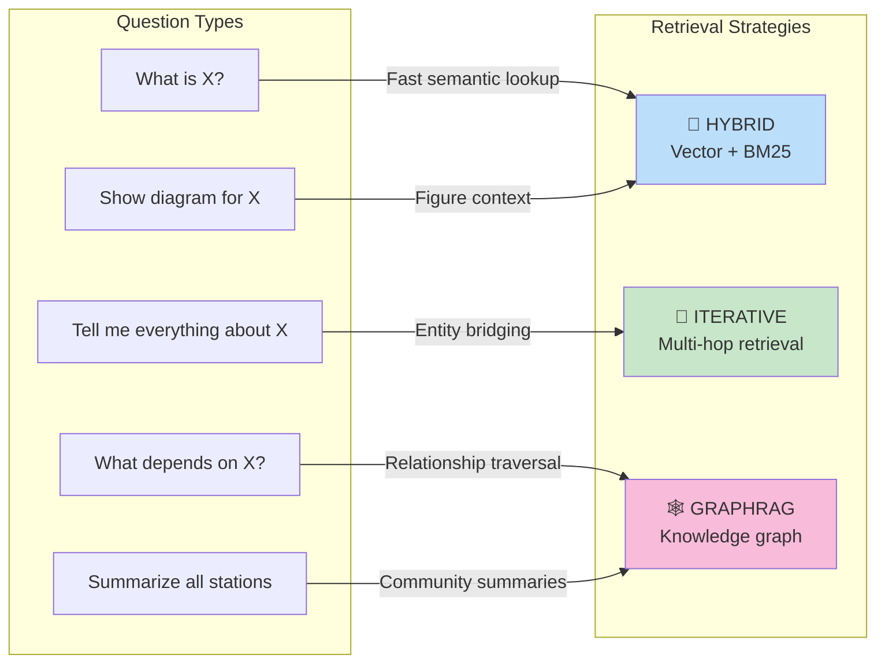
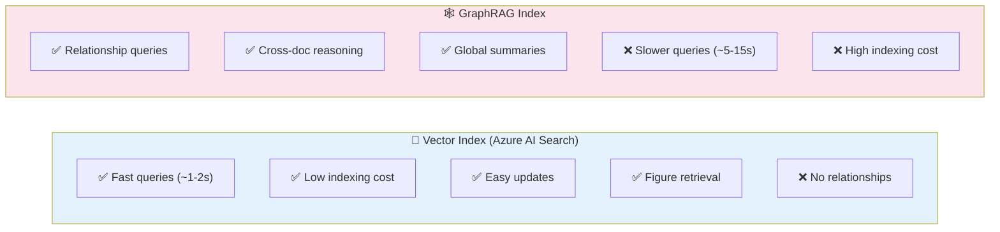
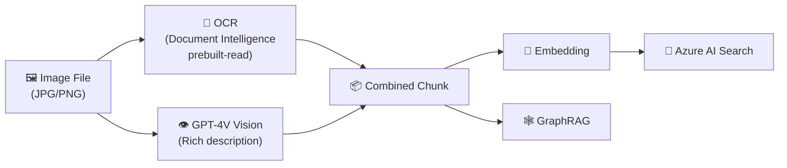

# Module 7 – Production Multimodal RAG Pipeline

## 📍 Overview

This module implements a **production-ready dual-index multimodal RAG pipeline** that processes documents with text, tables, and figures, indexing them to **both** Azure AI Search (vector/hybrid) and **GraphRAG** (knowledge graph).

### Key Insights

1. **Images alone are not enough** – figures need **document context** to be retrievable
2. **Chunking can fragment context** – entity identifiers may be separated from related data
3. **Smart retrieval fixes chunking problems** – iterative entity-aware retrieval reconnects fragmented information
4. **Validation ensures quality** – filter irrelevant chunks and validate answer accuracy
5. **GraphRAG enables relationship queries** – knowledge graphs answer "what depends on X?" questions

---

### 🏗️ Full Pipeline Architecture



---

### �️ Understanding the UI Controls

The query interface has **two levels of configuration**:

#### Level 1: Retrieval Strategy (High-Level)

| Strategy | Description | Uses Azure AI Search? | Uses GraphRAG? |
|----------|-------------|----------------------|----------------|
| **Auto** | LLM analyzes query and picks best strategy | ✅ or ❌ | ✅ or ❌ |
| **Hybrid** | Standard vector + keyword search | ✅ | ❌ |
| **Iterative** | Multi-hop entity-aware retrieval | ✅ | ❌ |
| **Agentic (AI Agent)** | Query decomposition + multi-hop reasoning | ✅ | ❌ |
| **Agentic Search (Azure Native)** | LLM decomposes query into sub-queries, executes each | ✅ | ❌ |
| **GraphRAG** | Knowledge graph traversal for relationships | ❌ | ✅ |

#### Level 2: Azure AI Search Parameters (Low-Level)

These parameters only apply when using Azure AI Search (Hybrid, Iterative, Agentic strategies):

| Parameter | Options | Description |
|-----------|---------|-------------|
| **Search Mode** | Hybrid, Vector Only, Text Only, Semantic | How results are retrieved from the index |
| **Semantic Ranker** | On/Off | L2 reranking using neural model |
| **Top K** | 1-50 | Number of results to return |
| **Min Score** | 0-4 | Filter low-relevance results |
| **Content Filter** | All, Text, Table, Figure | Filter by content type |

#### Search Mode Explanation

| Mode | How It Works | Best For |
|------|--------------|----------|
| **Hybrid (Vector + Text)** | Combines vector similarity with BM25 keyword matching | Most queries - best of both worlds |
| **Vector Only** | Pure semantic similarity using embeddings | Cross-language queries, conceptual search |
| **Text Only (BM25)** | Traditional keyword matching | Exact term matching, IDs, codes |
| **Semantic** | Hybrid + neural reranking | Highest relevance, slightly slower |

#### How They Work Together

```
┌─────────────────────────────────────────────────────────────────────┐
│                    QUERY FLOW EXAMPLE                               │
├─────────────────────────────────────────────────────────────────────┤
│                                                                     │
│  User Query: "What is the passenger count for station 36?"          │
│                                                                     │
│  1. Retrieval Strategy: "Agentic Search"                            │
│     └── LLM decomposes into sub-queries:                            │
│         • "station 36 passenger count"                              │
│         • "station 36 passenger forecast"                           │
│                                                                     │
│  2. For EACH sub-query, Azure AI Search Parameters apply:           │
│     ├── Search Mode: Hybrid (Vector + Text)                         │
│     ├── Semantic Ranker: ON                                         │
│     ├── Top K: 5                                                    │
│     └── Min Score: 0.0                                              │
│                                                                     │
│  3. Results from all sub-queries are merged and deduplicated        │
│                                                                     │
│  4. Final chunks sent to GPT for answer generation                  │
│                                                                     │
└─────────────────────────────────────────────────────────────────────┘
```

**Key Insight**: The **Retrieval Strategy** controls the *orchestration* (how many queries, what reasoning), while **Azure AI Search Parameters** control the *mechanics* of each individual search operation.

---

### �🎯 Retrieval Strategy Selection



---

### 📊 Index Comparison



---

## 📚 Educational Deep Dive: Understanding the Pipeline

This section explains **each step of the pipeline** in detail. Understanding these components is essential for building production-grade RAG systems.

### 🔬 Step 1: Document Extraction with Azure Document Intelligence

**File**: [backend/services/document_processor.py](backend/services/document_processor.py)

**Supported File Formats:**
| Format | Extensions | Notes |
|--------|------------|-------|
| PDF | `.pdf` | Full support including scanned documents |
| Word | `.docx` | Preserves styles, headers, tables |
| Excel | `.xlsx` | Extracts all sheets as tables |
| PowerPoint | `.pptx` | Each slide processed separately |
| **Images** | `.jpg`, `.jpeg`, `.png`, `.bmp`, `.tiff`, `.tif`, `.heif` | **OCR + GPT-4V Vision description** |

#### 🖼️ Image Processing Pipeline

When you upload an image file (JPG, PNG, etc.), a specialized pipeline processes it:



**Use cases for image upload:**
- **Metro maps** – OCR extracts station names, GPT-4V describes routes and connections
- **Floor plans** – OCR extracts labels, GPT-4V describes spatial layout
- **Infographics** – OCR extracts text, GPT-4V describes visual relationships
- **Scanned documents** – Full text extraction when PDF conversion isn't available

**What happens when you upload an image:**
1. **OCR Extraction** – Azure Document Intelligence (`prebuilt-read` model) extracts all visible text
2. **Vision Description** – GPT-4V analyzes the image and generates a rich description including:
   - Image type and purpose
   - Visual elements (colors, shapes, layout)
   - Relationships between elements
   - Key information for semantic search
3. **Combined Indexing** – Both OCR text and AI description are combined into a single searchable chunk
4. **Dual Export** – Indexed to both Azure AI Search and GraphRAG

**What happens:**
1. Document (PDF, Word, Excel, or PowerPoint) is sent to Azure Document Intelligence using the `prebuilt-layout` model
2. DI extracts **structured content** including:
   - Text with **reading order** (not just OCR dump)
   - Tables with **cell structure** (rows, columns, headers)
   - Figures with **bounding box coordinates** (polygon coordinates)
   - Section headings and paragraph boundaries

**Why DI over simple OCR?**
- OCR gives you raw text without structure
- DI understands **document layout** – it knows a table is a table, not random text
- Bounding boxes enable **figure cropping** for vision analysis

```python
# From document_processor.py - DI extraction
# Content type is auto-detected based on file extension
content_type_map = {
    ".pdf": "application/pdf",
    ".docx": "application/vnd.openxmlformats-officedocument.wordprocessingml.document",
    ".xlsx": "application/vnd.openxmlformats-officedocument.spreadsheetml.sheet",
    ".pptx": "application/vnd.openxmlformats-officedocument.presentationml.presentation",
}

poller = self.di_client.begin_analyze_document(
    model_id="prebuilt-layout",
    document=file_content,
    content_type=content_type  # Determined from file extension
)
result = poller.result()
# result.paragraphs, result.tables, result.figures now available
```

---

### 🖼️ Step 2: Figure Processing with Document Context Enrichment

**File**: [backend/services/document_processor.py](backend/services/document_processor.py), [backend/services/chunk_enricher.py](backend/services/chunk_enricher.py)

**The Problem with Naive Figure Handling:**
Simply extracting a cropped image and asking GPT-4.1 "what is this?" produces poor search results. Why?
- The model sees an isolated image with no document context
- It can't know if this diagram is about "Station 36" or "Traffic Analysis"
- The generated description may miss domain-specific terminology

**Our Solution: Multi-Source Context Enrichment**

Each cropped figure receives context from **three sources** before generating its searchable description:

```
┌─────────────────────────────────────────────────────────────────────┐
│                    FIGURE CONTEXT ENRICHMENT                        │
├─────────────────────────────────────────────────────────────────────┤
│                                                                     │
│   ① DOCUMENT STRUCTURE         ② SURROUNDING TEXT                   │
│   ├── Document name           ├── 1000 chars BEFORE figure         │
│   ├── Section path            └── 1000 chars AFTER figure          │
│   ├── Page number                                                   │
│   └── Figure caption (if any)                                       │
│                                                                     │
│                    ┌───────────────┐                                │
│                    │   GPT-4.1     │                                │
│                    │   Vision      │                                │
│                    └───────────────┘                                │
│                           │                                         │
│                    ③ VISUAL ANALYSIS                                │
│                    └── What the image shows                         │
│                                                                     │
│                           ▼                                         │
│              ┌─────────────────────────┐                            │
│              │   CONTEXTUAL CAPTION    │                            │
│              │   (Enriched Description)│                            │
│              └─────────────────────────┘                            │
│                                                                     │
└─────────────────────────────────────────────────────────────────────┘
```

**The Enrichment Process:**

1. **Extract Bounding Box**: Document Intelligence detects figure location
2. **Crop Image**: PIL/Pillow extracts the figure from the source page
3. **Gather Document Context**:
   - Section path (e.g., "Chapter 3 > Station 36 > Architectural Plans")
   - Surrounding text (1000 characters before and after the figure)
   - Any existing figure caption from the document
4. **Upload to Blob Storage**: Image is persisted for display in UI
5. **Generate Contextual Caption**: GPT-4.1 receives ALL context:

```python
# From chunk_enricher.py - The contextual caption prompt
prompt = f"""You are analyzing a figure from a document.

Document: {file_name}
Page: {page_number}
Section: {section_path or "Unknown"}

Visual description (what the image shows):
{visual_description or "Not provided"}

Figure caption (if any):
{figure_caption or "Not provided"}

Surrounding document text:
{surrounding_text[:1500]}

Generate a concise caption (2-3 sentences) that explains this figure IN THE CONTEXT of the document.
"""
```

**Why This Matters:**
- A search for "station 36 entrance design" will find the relevant figure
- The enriched caption contains domain terminology from surrounding text
- Context helps GPT-4.1 understand architectural vs. engineering drawings

---

### 📦 Step 3: Figure = Single Searchable Chunk

**Key Design Decision: Each figure becomes ONE chunk in the search index.**

Unlike text (which may span multiple chunks), each figure is an **atomic unit** containing all its enriched metadata. This ensures:
- Complete context travels with every figure
- No fragmentation of visual content
- Precise retrieval - you get the whole figure or nothing

**The Universal Figure Chunk Schema:**

| Field | Description | Example |
|-------|-------------|---------|
| `chunk_id` | Unique identifier | `metro_pdf_figure_042` |
| `doc_id` | Source document ID | `metro_pdf` |
| `file_name` | Original filename | `metro.pdf` |
| `chunk_type` | Always "figure" | `figure` |
| `page_number` | Source page | `42` |
| `section_path` | Full hierarchy | `Chapter 3 > Station 36 > Entrance` |
| `content` | Visual description | `Architectural rendering of...` |
| `contextual_caption` | **Enriched caption** | `Station 36 entrance design showing glass canopy structure...` |
| `image_url` | Blob storage URL | `https://blob.../figures/fig_042.png` |
| `embedding` | 3072-dim vector | `[0.012, -0.034, ...]` |

**Example Figure Chunk (JSON):**
```json
{
  "chunk_id": "metro_pdf_figure_042",
  "doc_id": "metro_pdf",
  "file_name": "metro.pdf",
  "chunk_type": "figure",
  "page_number": 42,
  "section_path": "Chapter 3 > Station 36 > Architectural Design",
  "content": "Architectural rendering showing modern transit station entrance",
  "contextual_caption": "This figure shows the proposed entrance design for Station 36 (Hazitonut Boulevard). The rendering depicts a glass canopy structure with integrated lighting, pedestrian access ramps, and connection to the underground platform level. Key features include the distinctive wave-pattern roof design that echoes the station's coastal location.",
  "image_url": "https://ragworkshop.blob.core.windows.net/figures/metro_pdf/fig_042.png"
}
```

**Content-Type Chunking Strategy:**

| Content Type | Chunking Strategy | Rationale |
|--------------|-------------------|-----------|
| **Text** | Group by section headers | Keeps coherent topics together |
| **Tables** | Atomic unit (preserve structure) | Splitting rows destroys meaning |
| **Figures** | **Single chunk with all context** | Complete visual + document context |

**Why NOT Split Figures?**
- Fixed-size chunking (500 tokens) would split description from image URL
- Section context would be lost across chunk boundaries  
- Retrieval would return partial information

---

### 🧮 Step 4: Embedding Generation

**File**: [backend/services/embedding_service.py](backend/services/embedding_service.py)

**What happens:**
1. Each chunk's text is sent to `text-embedding-3-large`
2. Returns a **3072-dimensional vector** representing semantic meaning
3. Vector is stored alongside the chunk in Azure AI Search

**Key Detail for Figure Chunks:**
For figures, we embed the **contextual_caption** (not just the raw visual description):

```python
# From embedding_service.py - Smart text selection for embedding
if chunk.get("chunk_type") == "figure":
    # Prefer contextual caption for better retrieval
    caption = chunk.get("contextual_caption") or ""
    content = chunk.get("content") or ""
    text_to_embed = f"{caption}\n{content}" if caption else content
```

This means searches like "Station 36 entrance design" will match figures because:
- The contextual caption contains "Station 36" from document context
- The visual description contains "entrance" from GPT-4.1 analysis

**Why text-embedding-3-large?**
- Best-in-class OpenAI embedding model
- 3072 dimensions capture nuanced semantic meaning
- Supports multilingual content (Hebrew, English, etc.)

```python
# From embedding_service.py
response = self.openai_client.embeddings.create(
    input=text,
    model="text-embedding-3-large"
)
embedding = response.data[0].embedding  # List of 3072 floats
```

---

### 🔎 Step 5: Indexing in Azure AI Search

**File**: [backend/services/search_service.py](backend/services/search_service.py)

**What happens:**
1. Create index schema with fields for all content types
2. Configure **HNSW vector search** for embeddings
3. Configure **semantic ranking** for reranking results
4. Upload chunks with embeddings

**Index Schema Highlights:**
```python
fields = [
    SearchField(name="id", key=True),
    SearchField(name="content", searchable=True),           # For BM25/text search
    SearchField(name="embedding", vector_search_dimensions=3072),  # For vector search
    SearchField(name="content_type", filterable=True),      # text/table/figure
    SearchField(name="section_header", searchable=True),
    SearchField(name="page_numbers", type=Collection(Int32)),
    # Figure-specific
    SearchField(name="image_blob_path"),
    SearchField(name="figure_description", searchable=True),
    # Table-specific
    SearchField(name="table_markdown", searchable=True),
]
```

**Search Capabilities:**
- **Vector search**: Find semantically similar content
- **BM25 (keyword)**: Find exact term matches
- **Hybrid**: Combine both for best results
- **Semantic ranker**: LLM-powered reranking for relevance

---

### 🔄 Step 6: Iterative Entity-Aware Retrieval

**File**: [backend/services/iterative_retriever.py](backend/services/iterative_retriever.py)

**This is the key innovation of Module 7!**

**The Problem it Solves:**
When you search for "Station 36 passenger count", you might find:
- Chunk A: "Station 36 - Hazitonut Boulevard" (has "36")
- But NOT Chunk B: "2,400 passengers at peak" (no "36" mentioned!)

Both chunks are on the same page, but standard search can't connect them.

**The Solution - Iterative Loop:**

```
┌─────────────────────────────────────────────────────────┐
│  ITERATION 1                                             │
│  Query: "Station 36 passenger count"                     │
│  ├── Decompose into aspects: [location, passengers]      │
│  ├── Search: "Station 36"                                │
│  ├── Found: "Station 36 - Hazitonut Boulevard"          │
│  └── Extract entity: {station_name: "Hazitonut"}        │
├─────────────────────────────────────────────────────────┤
│  ITERATION 2                                             │
│  Missing: [passengers]                                   │
│  ├── Rewrite query USING entity: "passengers Hazitonut" │
│  ├── Search: "passengers Hazitonut Boulevard"           │
│  └── Found: "2,400 passengers at peak hours"            │
├─────────────────────────────────────────────────────────┤
│  RESULT: Both chunks found via entity bridging!         │
└─────────────────────────────────────────────────────────┘
```

**Key Code Flow:**
```python
# From iterative_retriever.py
async def retrieve(self, query, max_iterations=3):
    entities = {}
    
    for iteration in range(max_iterations):
        # 1. Generate queries using known entities
        queries = await self._generate_search_queries(
            missing_aspects,
            known_entities=entities  # KEY: use found entities!
        )
        
        # 2. Execute searches
        for q in queries:
            results = await self.search(q)
            chunks.extend(results)
        
        # 3. Extract NEW entities from results
        new_entities = await self._extract_entities(results)
        entities.update(new_entities)  # Accumulate knowledge
        
        # 4. Check coverage - stop if all aspects found
        if not missing_aspects:
            break
```

---

### ✅ Step 7: Answer Validation

**File**: [backend/services/validation_service.py](backend/services/validation_service.py)

**Two-Stage Validation:**

**Stage 1: Pre-Generation Chunk Filtering**
- Extract entities from the user's query (e.g., "Station: 36")
- Check each retrieved chunk for **entity conflicts**
- Filter out chunks about different entities (e.g., Station 37)

```python
# Example: Query asks about Station 36
# Chunk says: "Station 37 has 3,200 passengers"
# → FILTERED OUT (entity conflict: 37 ≠ 36)
```

**Stage 2: Post-Generation Answer Validation**
- Check if answer is **grounded** in the provided chunks
- Identify which **aspects were answered** vs **missing**
- Calculate **confidence score** (low/medium/high)
- Suggest **retry query** if quality is too low

**Validation Report Output:**
```json
{
  "overall_score": 85.0,
  "chunks_filtered": 3,
  "filtered_reasons": [
    {"chunk_id": "abc", "reason": "Entity conflict: Station 37 ≠ 36"}
  ],
  "answer_quality": {
    "is_grounded": true,
    "completeness_score": 90,
    "aspects_answered": ["location", "design"],
    "aspects_missing": ["passenger_forecast"],
    "confidence": "high"
  },
  "retry_suggested": false
}
```

---

### 🤖 Step 8: Grounded Answer Generation

**File**: [backend/services/generation.py](backend/services/generation.py)

**What happens:**
1. Filtered chunks are formatted with source numbers
2. System prompt enforces **grounding** (only use provided context)
3. GPT-4.1 generates answer with **citations**
4. Figures are automatically displayed in the UI

**System Prompt Key Rules:**
```
1. ONLY use information from the provided context
2. If the answer is not in the context, say "I don't have enough information"
3. ALWAYS cite sources using [Source N] format
4. Figures from context will be displayed automatically
```

**Why Grounding Matters:**
- Without grounding, LLMs **hallucinate** plausible-sounding but wrong answers
- Citations let users **verify** the source
- "I don't know" is better than a wrong answer

---

### 🔀 Step 9: Retrieval Strategy Routing

**File**: [backend/services/retrieval_router.py](backend/services/retrieval_router.py)

**Available Strategies:**

| Strategy | When to Use | How It Works |
|----------|-------------|--------------|
| **Hybrid** | Simple factual questions | Vector + BM25 + semantic ranking |
| **Iterative** | Entity lookups, fragmented context | Entity extraction + query rewriting loop |
| **Agentic** | Multi-part questions | Query decomposition + multi-hop reasoning |
| **GraphRAG** | Relationship queries | Graph-based traversal (from Module 6) |
| **Auto** | Let system decide | LLM classifies query complexity |

**Auto-Classification:**
```python
# The router uses GPT to classify query intent
response = self.openai_client.chat.completions.create(
    messages=[{
        "role": "system",
        "content": "Classify query into: hybrid, agentic, or graphrag"
    }, {
        "role": "user", 
        "content": user_query
    }]
)
```

---

## 🎓 Key Takeaways

| Lesson | Explanation |
|--------|-------------|
| **DI > OCR** | Document Intelligence preserves structure that OCR destroys |
| **Context for Figures** | Images need document/section/page context to be searchable |
| **Content-Type Chunking** | Don't split tables or separate figures from context |
| **Entity Bridging** | Extract entities to connect fragmented chunks |
| **Validation is Essential** | Filter entity conflicts, validate grounding |
| **Iterate to Complete** | Multiple retrieval passes find more relevant content |

---

## 🆕 New Features in This Module

### 1. Iterative Entity-Aware Retrieval
Solves the **"fragmented context"** problem where page headers apply to entire pages but chunks don't contain the identifier.

### 2. Answer Validation System
Two-stage validation:
- **Pre-generation**: Filter chunks with entity conflicts
- **Post-generation**: Validate answer quality and completeness

### 3. Dynamic Score Configuration
Min score slider adapts to search mode (0-1 for vector, 0-4 for semantic).

---

## 🎯 Key Insight: Context Fragmentation Problem

### The Problem
When searching for "Station 36 passenger count":
```
Chunk A: "Station 36 - Hazitonut Boulevard..." ✅ Found (has "36")
Chunk B: "Passenger forecast: 2,400 at peak..." ❌ NOT Found (no "36"!)
```

Both chunks are on the same page, but the station identifier only appears once.

### The Solution: Iterative Entity-Aware Retrieval
```
Iteration 1: Search "Station 36"
  → Found: "Station 36 - Hazitonut Boulevard"
  → Extract entity: {station_name: "Hazitonut Boulevard"}

Iteration 2: Search "passengers Hazitonut Boulevard"  ← Uses found entity!
  → Found: "Passenger forecast: 2,400 at peak"
  → ✅ Now we have the passenger data!
```

---

## 🎯 Key Insight: Context-Aware Figure Indexing

### ❌ Wrong: Image Only
```
Figure content: "Black triangle with exclamation mark"
Query: "safety warnings in BenQ manual"
Result: ❌ NO MATCH
```

### ✅ Correct: Image + Document Context
```
Figure content:
  Document: testpdf.pdf
  Section: Safety Instructions
  Page: 6
  Surrounding Context: "To reduce risk of electric shock..."
  Figure Description: "Black warning triangle with exclamation mark"

Query: "safety warnings in BenQ manual"
Result: ✅ MATCH (matches document, section, context)
```

---

## 🏗️ Architecture

### Document Processing Pipeline

```
┌─────────────────────────────────────────────────────────────────────────┐
│                     DOCUMENT PROCESSING PIPELINE                         │
├─────────────────────────────────────────────────────────────────────────┤
│                                                                          │
│  📄 Document Upload (PDF, Word, Excel, PowerPoint)                       │
│       │                                                                  │
│       ▼                                                                  │
│  ┌─────────────────────────────────────────────────────────────────┐    │
│  │  DOCUMENT INTELLIGENCE (prebuilt-layout)                        │    │
│  │  • Extracts text with reading order                              │    │
│  │  • Extracts tables with cell structure                           │    │
│  │  • Extracts figures WITH BOUNDING BOXES                          │    │
│  │  • Identifies section headings                                   │    │
│  └─────────────────────────────────────────────────────────────────┘    │
│       │                                                                  │
│       ├──────────────────────────────────────────┐                      │
│       ▼                                          ▼                      │
│  ┌──────────────────────┐               ┌──────────────────────┐       │
│  │  FIGURE PROCESSOR    │               │  CONTEXT BUILDER     │       │
│  │  • Crop using polygon│               │  • Page → Section map│       │
│  │  • Upload to Blob    │               │  • Nearby text       │       │
│  │  • GPT-4.1 describe   │               │  • Document metadata │       │
│  │  • PARALLEL (5 max)  │               │                      │       │
│  └──────────────────────┘               └──────────────────────┘       │
│       │                                          │                      │
│       └──────────────────────────────────────────┘                      │
│                              │                                          │
│                              ▼                                          │
│  ┌─────────────────────────────────────────────────────────────────┐    │
│  │  CHUNK CREATION                                                  │    │
│  │                                                                  │    │
│  │  TEXT CHUNKS: Paragraphs grouped by section                      │    │
│  │  TABLE CHUNKS: Markdown + HTML with section context              │    │
│  │  FIGURE CHUNKS: Document + Section + Page + Context + Description│    │
│  └─────────────────────────────────────────────────────────────────┘    │
│                              │                                          │
│                              ▼                                          │
│  ┌─────────────────────────────────────────────────────────────────┐    │
│  │  EMBEDDING + INDEXING                                            │    │
│  │  • text-embedding-3-large (3072 dimensions)                      │    │
│  │  • Azure AI Search with hybrid search                            │    │
│  │  • Semantic reranking                                            │    │
│  └─────────────────────────────────────────────────────────────────┘    │
└─────────────────────────────────────────────────────────────────────────┘
```

### Retrieval Pipeline

```
┌─────────────────────────────────────────────────────────────────────────┐
│                        RETRIEVAL PIPELINE                                │
├─────────────────────────────────────────────────────────────────────────┤
│                                                                          │
│  🔍 User Query                                                           │
│       │                                                                  │
│       ▼                                                                  │
│  ┌─────────────────────────────────────────────────────────────────┐    │
│  │  STRATEGY SELECTION                                              │    │
│  │  • Auto (LLM classifies)                                         │    │
│  │  • Hybrid (vector + BM25)                                        │    │
│  │  • Iterative (entity-aware) ← DEFAULT                            │    │
│  │  • Agentic (query decomposition)                                 │    │
│  │  • GraphRAG (relationship queries)                               │    │
│  └─────────────────────────────────────────────────────────────────┘    │
│       │                                                                  │
│       ▼ (if Iterative)                                                  │
│  ┌─────────────────────────────────────────────────────────────────┐    │
│  │  ITERATIVE ENTITY-AWARE RETRIEVAL                                │    │
│  │                                                                  │    │
│  │  Iteration 1:                                                    │    │
│  │  ├── Decompose query into aspects                                │    │
│  │  ├── Search for each aspect                                      │    │
│  │  └── Extract entities from results                               │    │
│  │                                                                  │    │
│  │  Iteration 2-N:                                                  │    │
│  │  ├── Identify missing aspects                                    │    │
│  │  ├── Rewrite queries USING FOUND ENTITIES                        │    │
│  │  ├── Search with rewritten queries                               │    │
│  │  └── Check completeness                                          │    │
│  │                                                                  │    │
│  │  Stop when: all aspects covered OR max iterations OR no new data │    │
│  └─────────────────────────────────────────────────────────────────┘    │
│       │                                                                  │
│       ▼                                                                  │
│  ┌─────────────────────────────────────────────────────────────────┐    │
│  │  VALIDATION (if enabled)                                         │    │
│  │                                                                  │    │
│  │  PRE-GENERATION:                                                 │    │
│  │  ├── Extract query entities (e.g., station: 36)                  │    │
│  │  ├── Check each chunk for entity conflicts                       │    │
│  │  └── Filter out chunks about different entities                  │    │
│  │                                                                  │    │
│  │  POST-GENERATION:                                                │    │
│  │  ├── Check if answer is grounded in chunks                       │    │
│  │  ├── Identify answered vs missing aspects                        │    │
│  │  ├── Detect issues (hallucination, incomplete)                   │    │
│  │  └── Suggest retry query if quality is low                       │    │
│  └─────────────────────────────────────────────────────────────────┘    │
│       │                                                                  │
│       ▼                                                                  │
│  ┌─────────────────────────────────────────────────────────────────┐    │
│  │  ANSWER GENERATION                                               │    │
│  │  • GPT-4.1 with filtered chunks                                  │    │
│  │  • Citations to source documents                                 │    │
│  │  • Quality report returned with answer                           │    │
│  └─────────────────────────────────────────────────────────────────┘    │
└─────────────────────────────────────────────────────────────────────────┘
```

---

## 🎛️ Retrieval Strategies

| Strategy | When to Use | What It Does |
|----------|-------------|--------------|
| **Iterative** (Default) | Complex queries, entity lookups | Entity extraction + query rewriting loop |
| **Hybrid** | Simple factual questions | Vector + BM25 + semantic ranking |
| **Agentic** | Multi-part questions | Query decomposition + multi-hop |
| **Auto** | Let system decide | LLM classifies query complexity |
| **GraphRAG** | Relationship queries | Graph-based reasoning |

---

## ✅ Validation System

### What It Validates

| Check | Description | Example |
|-------|-------------|---------|
| **Entity Conflict** | Chunk mentions different entity | Query: "Station 36" → Chunk: "Station 37" ❌ |
| **Relevance** | Chunk answers the question | Score 0-100% |
| **Grounding** | Answer based on chunks | No hallucinations |
| **Completeness** | All aspects answered | Missing passenger count? |

### Validation Report in UI

```
┌─────────────────────────────────────────────┐
│  Answer Validation Report                    │
├─────────────────────────────────────────────┤
│  ✅ Overall Score: 85%                       │
│  ⚠️ Chunks Filtered: 3/10                    │
│     - Station 37 chunk (entity conflict)     │
│     - Station 35 chunk (entity conflict)     │
│  ✅ Aspects Covered: location, details       │
│  ⚠️ Missing: passenger forecast              │
│  Confidence: Medium                          │
│                                             │
│  [Retry with: "נוסעים שדרות הציונות"]        │
└─────────────────────────────────────────────┘
```

---

## 🎚️ Score Configuration

The Min Score slider adapts to search mode:

| Search Mode | Score Type | Range | Recommended |
|-------------|------------|-------|-------------|
| **Vector** | Cosine similarity | 0 - 1.0 | **0.8** |
| **Semantic** | Reranker score | 0 - 4.0 | **2.5** |
| **Hybrid + Semantic** | Reranker score | 0 - 4.0 | **2.0** |
| **Text (BM25)** | BM25 score | 0 - 10 | **0** |

### Semantic Score Meaning
- **3.0 - 4.0**: Excellent match ✅✅✅
- **2.0 - 3.0**: Good match ✅✅
- **1.5 - 2.0**: Fair match ✅
- **1.0 - 1.5**: Weak match ⚠️
- **< 1.0**: Poor match ❌

---

## 🔬 DI vs CU Comparison

| Aspect | Document Intelligence | Content Understanding |
|--------|----------------------|----------------------|
| **Figure Detection** | ✅ Yes | ✅ Yes (in markdown) |
| **Bounding Boxes** | ✅ Yes (polygon coords) | ❌ No |
| **AI Descriptions** | ❌ No (need GPT-4.1) | ⚠️ Only with custom schema |
| **Image Cropping** | ✅ Yes | ❌ Not possible |
| **Works with ANY PDF** | ✅ Yes | ❌ Needs schema per doc type |

**Decision**: Use **DI + GPT-4.1** for a generic pipeline that works with any document.

---

## 📦 Sample Figure Chunk

This is what a figure chunk looks like after processing:

```json
{
  "id": "metro_pdf_fig_001",
  "content": "Document: metro.pdf\nSection: Station 36 - Hazitonut Boulevard\nPage: 42\n\nSurrounding Context:\nתחנה 36 - שדרות הציונות\nתחנה זו ממוקמת בצומת שדרות הציונות\nעומס נוסעים צפוי: 2,400 נוסעים בשעת שיא\n\nFigure Description:\nArchitectural rendering of metro Station 36 at Hazitonut Boulevard showing the station entrance with glass canopy, underground platform access, and passenger flow areas.",
  "content_type": "figure",
  "document_name": "metro.pdf",
  "page_number": 42,
  "section_header": "Station 36 - Hazitonut Boulevard",
  "figure_url": "https://blob.../figures/metro_pdf/fig_001.png",
  "embedding": [0.0123, -0.0456, ...]
}
```

**Key points:**
- Contains full document context (document name, section, page)
- Includes surrounding text from the page
- Has AI-generated description of the image
- Embedding is created from the combined text

---

## 🚀 Quick Start

### Prerequisites
- Python 3.11+ (required for GraphRAG)
- Node.js 18+
- Azure resources (Document Intelligence, OpenAI, AI Search, Blob Storage)
- `.env` file with credentials (copy from root `.env`)

### Run the Pipeline

```bash
cd modules/module-7-pipeline

# Start both backend and frontend
./run_all.sh

# Access:
# - Frontend: http://localhost:5173
# - Backend API: http://localhost:8000
# - API Docs: http://localhost:8000/docs
```

### UI Features

The frontend provides:
- **Document Upload** - Drag & drop with support for **PDF, Word (.docx), Excel (.xlsx), PowerPoint (.pptx)**
- **Index Status Panels** showing:
  - **Unique document count** with filename list
  - **Total chunks** with breakdown by type (text/table/figure)
  - **GraphRAG progress** with percentage and ETA during indexing
- **Real-time Progress** - GraphRAG indexing runs in background, UI stays responsive
- **Delete Buttons** to clear either index for testing
- **GraphRAG Auto-Index Toggle** to control whether uploaded documents trigger knowledge graph building

### Supported File Formats

| Format | Extension | What Gets Extracted |
|--------|-----------|---------------------|
| PDF | `.pdf` | Text, tables, figures with bounding boxes |
| Word | `.docx` | Text, tables, embedded images |
| Excel | `.xlsx` | Tables (each sheet), charts as figures |
| PowerPoint | `.pptx` | Slides as pages, text, tables, images |

### Test Document Processing

```bash
cd backend
python test_pipeline.py
```

---

## 🔗 Dual-Index Architecture (Vector Search + GraphRAG)

This module implements a **production dual-index pipeline** that indexes documents to **both** Azure AI Search (vector/hybrid) and GraphRAG (knowledge graph):

```
📄 PDF Upload
     │
     ▼
┌─────────────────────────────────────────────────┐
│  Document Intelligence + GPT-4.1 Vision          │
│  (Extract text, tables, figures with context)   │
└─────────────────────────────────────────────────┘
     │
     ▼
┌─────────────────────────────────────────────────┐
│  Enriched Chunks (text + tables + figures)      │
└─────────────────────────────────────────────────┘
     │
     ├──────────────────┬──────────────────────────┐
     ▼                  ▼                          │
┌──────────────┐   ┌──────────────────────────┐   │
│ Vector Index │   │ GraphRAG Knowledge Graph │   │
│ (AI Search)  │   │ (Entities + Relations)   │   │
└──────────────┘   └──────────────────────────┘   │
```

### Query-Time Strategy Selection

Users can choose retrieval strategy in the UI:
- **Hybrid**: Vector + keyword search (fast, good for specific facts)
- **Iterative**: Multi-hop entity-aware retrieval (good for fragmented context)
- **GraphRAG**: Knowledge graph traversal (good for relationship queries)

---

## 📁 Project Structure

```
module-7-pipeline/
├── backend/
│   ├── api/
│   │   └── routes/
│   │       ├── query.py              # Query endpoint with validation
│   │       ├── upload.py             # Document upload + dual indexing
│   │       └── graphrag.py           # GraphRAG status/build/delete APIs
│   ├── services/
│   │   ├── document_processor.py     # DI + GPT-4.1 pipeline
│   │   ├── search_service.py         # Azure AI Search
│   │   ├── blob_service.py           # Azure Blob Storage
│   │   ├── iterative_retriever.py    # Entity-aware retrieval
│   │   ├── validation_service.py     # Answer validation
│   │   ├── graphrag_exporter.py      # Export chunks for GraphRAG (NEW!)
│   │   ├── graphrag_indexer.py       # Run GraphRAG indexing (NEW!)
│   │   ├── graphrag_retriever.py     # Query GraphRAG index (NEW!)
│   │   └── retrieval_router.py       # Strategy routing
│   ├── graphrag-index/               # GraphRAG data directory
│   │   ├── settings.yaml             # GraphRAG v3.0 config (Azure OpenAI)
│   │   ├── input/                    # Exported text files (gitignored)
│   │   ├── output/                   # Parquet files (gitignored)
│   │   ├── cache/                    # LLM cache (gitignored)
│   │   └── logs/                     # Indexing logs (gitignored)
│   ├── config/
│   │   └── settings.py               # Environment configuration
│   └── main.py                       # FastAPI app
├── frontend/
│   └── src/
│       ├── components/
│       │   ├── DocumentUpload.tsx        # Upload + dual index status panels
│       │   ├── RetrievalConfig.tsx       # Strategy selection
│       │   ├── RetrievalDetails.tsx      # Retrieval observability
│       │   └── ValidationReport.tsx      # Validation report panel
│       ├── hooks/
│       │   └── useConfig.ts              # Config state management
│       └── types.ts                      # TypeScript types
├── run_all.sh                        # Start both services
├── run_backend.sh                    # Start backend only
├── run_frontend.sh                   # Start frontend only
└── README.md                         # This file
```

---

## 🔧 Key Components

### IterativeRetriever (`iterative_retriever.py`)

The core innovation for handling fragmented context:

```python
async def retrieve(self, query, max_iterations=3):
    entities = {}
    
    for iteration in range(max_iterations):
        # Generate queries using known entities
        queries = self._generate_search_queries(
            missing_aspects,
            known_entities=entities  # Key: use found entities!
        )
        
        # Search and extract new entities
        for q in queries:
            results = await self.search(q)
            new_entities = self._extract_entities(results)
            entities.update(new_entities)
        
        # Check if all aspects covered
        if not missing_aspects:
            break
    
    return all_chunks, trace
```

### ValidationService (`validation_service.py`)

Two-stage quality control:

```python
# Stage 1: Filter chunks before generation
filtered_chunks, report = await validate_chunks(query, chunks)

# Stage 2: Validate answer after generation
report = await validate_answer(query, answer, filtered_chunks, report)
```

### Default Configuration

The default configuration prioritizes quality:

```typescript
// frontend/src/hooks/useConfig.ts
const DEFAULT_CONFIG = {
  top_k: 5,
  search_mode: 'hybrid',
  semantic_ranker: true,
  min_score: 2.0,              // Good threshold for semantic
  content_type_filter: 'all',
  retrieval_strategy: 'iterative',  // Default to iterative
  enable_validation: true           // Validation on by default
};
```

---

## 💡 Lessons Learned

### 1. Chunking Can't Solve Everything
No matter how you chunk, some context will be fragmented. Smart retrieval compensates.

### 2. Entity Extraction is Powerful
Finding entities in early results enables targeted follow-up queries.

### 3. Semantic Similarity Has Limits
"Station 36" and "Station 37" are almost identical in embedding space. Need explicit validation.

### 4. Validation Catches Errors
Filtering chunks with entity conflicts dramatically improves answer quality.

### 5. Iterative Beats Single-Shot
Multiple retrieval iterations with learning outperforms single search.

---

## 💰 Cost Considerations

| Component | Cost per Document |
|-----------|------------------|
| DI Analysis | ~$0.01 per page |
| GPT-4.1 (per figure) | ~$0.01-0.02 |
| Embeddings | ~$0.0001 per chunk |
| Validation (LLM calls) | ~$0.01-0.02 per query |
| Iterative Retrieval | ~$0.02-0.05 per query |
| **GraphRAG Indexing** | **~$0.50-2.00 per doc** |

**Example: 20-page PDF with 20 figures, then 10 queries**
- Processing: ~$0.50
- Vector index queries with validation: ~$0.30-0.70
- GraphRAG indexing (one-time): ~$0.50-2.00
- GraphRAG queries: ~$0.10-0.30
- **Total: ~$1.40-3.50**

---

## 📚 API Reference

### Query Endpoint

```
POST /api/query

{
  "question": "כל המידע על תחנה 36",
  "top_k": 5,
  "search_mode": "hybrid",
  "semantic_ranker": true,
  "min_score": 2.0,
  "content_type_filter": "all",
  "retrieval_strategy": "iterative",
  "enable_validation": true
}
```

### Response

```json
{
  "answer": "תחנה 36 - שדרות הציונות...",
  "sources": [...],
  "retrieval_metadata": {
    "strategy_used": "iterative",
    "total_chunks_retrieved": 15,
    "iterative_trace": {
      "total_iterations": 2,
      "all_entities": {"station_name": "שדרות הציונות", "line": "M1S"},
      "aspects_covered": ["location", "details"],
      "aspects_missing": []
    }
  },
  "validation_report": {
    "overall_score": 85.0,
    "chunks_filtered": 3,
    "validation_passed": true,
    "answer_quality": {
      "completeness_score": 90,
      "is_grounded": true,
      "confidence": "high"
    }
  }
}
```

### GraphRAG API Endpoints

```
GET /api/graphrag/status
```
Returns the current status of the GraphRAG index, including real-time progress during indexing:
```json
{
  "success": true,
  "status": {
    "ready": true,
    "input_documents": 5,
    "output_exists": true,
    "entities_count": 150,
    "relationships_count": 200,
    "communities_count": 12,
    "has_parquet": true,
    "is_indexing": false,
    "progress_detail": {
      "current_step": "Summarize entity/relationship descriptions",
      "current_progress": 744,
      "total_items": 7834,
      "percentage": 9.5,
      "eta_minutes": 35,
      "steps_completed": ["create_base_text_units", "extract_graph"],
      "steps_remaining": ["summarize", "create_communities", "embed"]
    }
  }
}
```

```
POST /api/graphrag/index
```
Starts GraphRAG indexing in the background (non-blocking). Returns immediately while indexing continues.

```
DELETE /api/graphrag/index
```
Deletes all GraphRAG index files (output, cache, logs, input).

### Index Stats API

```
GET /api/index/stats
```
Returns Azure AI Search index statistics with document details:
```json
{
  "document_count": 191,
  "chunk_count": 191,
  "unique_document_count": 5,
  "indexed_documents": [
    {"filename": "metro.pdf", "doc_id": "metro_pdf", "chunk_count": 159},
    {"filename": "metro4.pdf", "doc_id": "metro4_pdf", "chunk_count": 5},
    {"filename": "metro_m1_data.xlsx", "doc_id": "metro_m1_data_xlsx", "chunk_count": 1},
    {"filename": "Metro_M1_Rishon_Stations_Detailed.pptx", "doc_id": "...", "chunk_count": 8}
  ],
  "storage_size_bytes": 0,
  "content_type_counts": {"text": 60, "table": 15, "figure": 108}
}
```

```
DELETE /api/index/reset
```
Deletes all documents from the Azure AI Search index.

---

## 🔬 GraphRAG Integration (Implemented!)

### ✅ Current State

The Module 7 pipeline now has **full GraphRAG integration** with:
- **Auto-indexing on upload**: Documents are automatically exported to GraphRAG format
- **Knowledge graph building**: Run GraphRAG indexing via UI or CLI
- **Query support**: Select "GraphRAG" in the retrieval strategy dropdown
- **Status monitoring**: UI shows index status, document counts, and entity counts

### GraphRAG Configuration (v3.0.x)

GraphRAG uses `settings.yaml` with this format for Azure OpenAI:

```yaml
# backend/graphrag-index/settings.yaml
completion_models:
  default_completion_model:
    type: litellm
    model_provider: azure
    model: gpt-4.1
    deployment_name: gpt-4.1
    api_base: https://<your-resource>.cognitiveservices.azure.com
    api_version: "2024-02-15-preview"
    api_key: <your-api-key>
    rate_limit:
      requests_per_period: 10
      period: 60

embedding_models:
  default_embedding_model:
    type: litellm
    model_provider: azure
    model: text-embedding-3-large
    deployment_name: text-embedding-3-large
    api_base: https://<your-resource>.cognitiveservices.azure.com
    api_version: "2024-02-15-preview"
    api_key: <your-api-key>
```

### Building the Knowledge Graph

**Option 1: Via UI**
1. Upload a document (auto-exports to GraphRAG input)
2. Click "Build Knowledge Graph" button in the status panel
3. Wait for indexing to complete (can take 10-30 minutes depending on document size)

**Option 2: Via CLI**
```bash
cd modules/module-7-pipeline/backend

# Activate virtual environment
source venv/bin/activate

# Run GraphRAG indexing
python -m graphrag index --root ./graphrag-index

# Monitor progress
tail -f graphrag-indexing.log
```

### GraphRAG Files (GitIgnored)

The following are generated during indexing and excluded from git:
- `graphrag-index/input/` - Exported text files
- `graphrag-index/output/` - Parquet files (entities, relationships, communities)
- `graphrag-index/cache/` - LLM response cache
- `graphrag-index/logs/` - Indexing logs

---

### 📚 Dual-Index Architecture

### 📚 Dual-Index Architecture

**Reuse the hard work from document extraction** (DI + GPT-4.1 figure descriptions) to feed **BOTH** indexes in parallel:

```
┌─────────────────────────────────────────────────────────────────────────────┐
│                    DUAL-INDEX DOCUMENT PROCESSING PIPELINE                   │
├─────────────────────────────────────────────────────────────────────────────┤
│                                                                              │
│  📄 PDF Upload                                                               │
│       │                                                                      │
│       ▼                                                                      │
│  ┌─────────────────────────────────────────────────────────────────────┐    │
│  │  DOCUMENT INTELLIGENCE + GPT-4.1 VISION (Existing Pipeline)          │    │
│  │  • Extract text with reading order                                   │    │
│  │  • Extract tables as markdown                                        │    │
│  │  • Crop figures and generate AI descriptions ← EXPENSIVE WORK       │    │
│  │  • Build section/page context                                        │    │
│  └─────────────────────────────────────────────────────────────────────┘    │
│       │                                                                      │
│       ▼                                                                      │
│  ┌─────────────────────────────────────────────────────────────────────┐    │
│  │  ENRICHED CHUNKS (text + tables + figures with descriptions)        │    │
│  └─────────────────────────────────────────────────────────────────────┘    │
│       │                                                                      │
│       │                                                                      │
│       ├─────────────────────────────┬───────────────────────────────────┐   │
│       │                             │                                   │   │
│       ▼                             ▼                                   │   │
│  ┌──────────────────────┐    ┌──────────────────────────────────────┐  │   │
│  │  PATH A: VECTOR RAG   │    │  PATH B: GRAPHRAG                    │  │   │
│  │                       │    │                                      │  │   │
│  │  1. Generate          │    │  1. Export chunks as .txt files      │  │   │
│  │     embeddings        │    │  2. Run GraphRAG indexing:           │  │   │
│  │     (3072-dim)        │    │     • Entity extraction (LLM)        │  │   │
│  │                       │    │     • Relationship extraction (LLM)  │  │   │
│  │  2. Upload to         │    │     • Community detection (Leiden)   │  │   │
│  │     Azure AI Search   │    │     • Community summaries (LLM)      │  │   │
│  │                       │    │                                      │  │   │
│  │  3. Index fields:     │    │  3. Output Parquet files:            │  │   │
│  │     • content         │    │     • entities.parquet               │  │   │
│  │     • embedding       │    │     • relationships.parquet          │  │   │
│  │     • content_type    │    │     • communities.parquet            │  │   │
│  │     • page_numbers    │    │     • community_reports.parquet      │  │   │
│  │     • figure_url      │    │     • text_units.parquet             │  │   │
│  └──────────────────────┘    └──────────────────────────────────────┘  │   │
│       │                             │                                   │   │
│       ▼                             ▼                                   │   │
│  ┌──────────────────────┐    ┌──────────────────────────────────────┐  │   │
│  │  Azure AI Search     │    │  Local Parquet Files                 │  │   │
│  │  Index               │    │  (GraphRAG knowledge graph)          │  │   │
│  └──────────────────────┘    └──────────────────────────────────────┘  │   │
│                                                                              │
└─────────────────────────────────────────────────────────────────────────────┘
```

### Query-Time: User Selects Search Strategy

```
┌─────────────────────────────────────────────────────────────────────────────┐
│                         QUERY-TIME ROUTING                                   │
├─────────────────────────────────────────────────────────────────────────────┤
│                                                                              │
│  🔍 User Query: "What stations depend on the central power grid?"           │
│       │                                                                      │
│       │  User selects in UI: ☐ Hybrid  ☐ Iterative  ☑ GraphRAG              │
│       │                                                                      │
│       ▼                                                                      │
│  ┌─────────────────────────────────────────────────────────────────────┐    │
│  │  IF retrieval_strategy == "graphrag":                                │    │
│  │      → Load Parquet files                                            │    │
│  │      → Run DRIFT search (local + global)                             │    │
│  │      → Return entities, relationships, community context             │    │
│  │                                                                      │    │
│  │  ELSE (hybrid, iterative, etc.):                                     │    │
│  │      → Query Azure AI Search (existing flow)                         │    │
│  │      → Return vector/hybrid search chunks                            │    │
│  └─────────────────────────────────────────────────────────────────────┘    │
│       │                                                                      │
│       ▼                                                                      │
│  ┌─────────────────────────────────────────────────────────────────────┐    │
│  │  ANSWER GENERATION                                                   │    │
│  │  Same GPT-4.1 generation with different context sources              │    │
│  └─────────────────────────────────────────────────────────────────────┘    │
│       │                                                                      │
│       ▼                                                                      │
│  📊 User can compare answers from different strategies!                     │
│                                                                              │
└─────────────────────────────────────────────────────────────────────────────┘
```

### ✅ Implementation Complete!

**Why it works:**

1. **Reuse Extraction Work**: The expensive DI + GPT-4.1 processing happens once
2. **Parallel Indexing**: Same enriched chunks feed both indexes
3. **UI Supports Strategy Selection**: Dropdown with Hybrid, Iterative, GraphRAG options
4. **Educational Value**: Compare answers side-by-side for same query
5. **Auto-indexing**: Documents automatically exported to GraphRAG on upload

---

### 📦 Implementation Details

#### GraphRAG Exporter (`services/graphrag_exporter.py`)

Exports enriched chunks as text files for GraphRAG indexing:

```python
# services/graphrag_exporter.py
from pathlib import Path
from typing import List, Dict, Any

class GraphRAGExporter:
    """Export enriched chunks to text files for GraphRAG indexing."""
    
    def __init__(self, output_dir: str = "./graphrag-index/input"):
        self.output_dir = Path(output_dir)
        self.output_dir.mkdir(parents=True, exist_ok=True)
    
    def export_chunks_for_graphrag(
        self, 
        chunks: List[Dict[str, Any]], 
        document_name: str
    ) -> Path:
        """
        Convert enriched chunks to a text file for GraphRAG.
        
        Key insight: Include ALL the rich context we extracted:
        - Figure descriptions from GPT-4.1
        - Table markdown
        - Section headers
        - Page context
        """
        output_lines = []
        output_lines.append(f"# Document: {document_name}\n")
        
        current_section = None
        
        for chunk in chunks:
            # Add section header if changed
            section = chunk.get("section_header", "")
            if section and section != current_section:
                output_lines.append(f"\n## {section}\n")
                current_section = section
            
            content_type = chunk.get("content_type", "text")
            
            if content_type == "text":
                output_lines.append(chunk["content"])
                output_lines.append("\n")
                
            elif content_type == "table":
                output_lines.append("\n### Table\n")
                output_lines.append(chunk.get("table_markdown", chunk["content"]))
                output_lines.append("\n")
                
            elif content_type == "figure":
                # THIS IS THE KEY: Include GPT-4.1 description!
                output_lines.append("\n### Figure\n")
                if chunk.get("figure_caption"):
                    output_lines.append(f"Caption: {chunk['figure_caption']}\n")
                if chunk.get("figure_description"):
                    output_lines.append(f"Description: {chunk['figure_description']}\n")
                # Include surrounding context too
                if chunk.get("surrounding_text"):
                    output_lines.append(f"Context: {chunk['surrounding_text']}\n")
                output_lines.append("\n")
        
        # Write to file
        safe_name = document_name.replace("/", "_").replace(" ", "_")
        output_path = self.output_dir / f"{safe_name}.txt"
        output_path.write_text("\n".join(output_lines), encoding="utf-8")
        
        return output_path
```

#### GraphRAG Indexer (`services/graphrag_indexer.py`)

Runs GraphRAG indexing as a background process:

```python
# In services/document_processor.py - add after existing indexing

class DocumentProcessor:
    
    async def process_document_dual_index(
        self, 
        file_content: bytes, 
        file_name: str,
        index_to_search: bool = True,
        index_to_graphrag: bool = True
    ) -> Dict[str, Any]:
        """
        Process document and index to BOTH systems.
        """
        # Step 1: Existing extraction (DI + GPT-4.1) - DONE ONCE
        extraction_result = await self._extract_document(file_content)
        
        # Step 2: Create enriched chunks - DONE ONCE
        chunks = await self._create_enriched_chunks(extraction_result, file_name)
        
        results = {"chunks_created": len(chunks)}
        
        # Step 3A: Index to Azure AI Search (existing flow)
        if index_to_search:
            await self._embed_and_index_chunks(chunks)
            results["search_indexed"] = True
        
        # Step 3B: Export for GraphRAG (NEW!)
        if index_to_graphrag:
            exporter = GraphRAGExporter()
            txt_path = exporter.export_chunks_for_graphrag(chunks, file_name)
            results["graphrag_exported"] = str(txt_path)
        
        return results
```

#### GraphRAG Retriever (`services/graphrag_retriever.py`)

Queries the GraphRAG knowledge graph:

```bash
# After documents are exported, run GraphRAG indexing
cd graphrag-index
graphrag index --root .

# This creates:
# - output/entities.parquet
# - output/relationships.parquet  
# - output/communities.parquet
# - output/community_reports.parquet
# - output/text_units.parquet
```

#### Retrieval Router Integration

```python
# services/retrieval_router.py

class RetrievalRouter:
    def __init__(self):
        self.settings = get_settings()
        self.search_service = SearchService()
        self.graphrag_service = None  # Lazy load
    
    def _get_graphrag_service(self):
        """Lazy load GraphRAG service only when needed."""
        if self.graphrag_service is None:
            from services.graphrag_service import GraphRAGService
            graphrag_root = self.settings.graphrag_index_path or "./graphrag-index"
            self.graphrag_service = GraphRAGService(graphrag_root)
        return self.graphrag_service
    
    async def _retrieve_graphrag(self, query: str, top_k: int) -> Dict[str, Any]:
        """
        GraphRAG retrieval using pre-built index.
        """
        try:
            service = self._get_graphrag_service()
            
            # Use DRIFT search (combines local + global)
            result = await service.search(
                query=query,
                mode="drift",
                community_level=2
            )
            
            # Convert to chunk format for UI consistency
            chunks = self._convert_graphrag_to_chunks(result)
            
            return {
                "chunks": chunks,
                "graphrag_metadata": {
                    "mode": "drift",
                    "entities_found": len(result.get("entities", [])),
                    "relationships_used": len(result.get("relationships", [])),
                    "communities_searched": result.get("communities_searched", 0)
                }
            }
        except Exception as e:
            logger.warning(f"GraphRAG search failed: {e}, falling back to hybrid")
            return await self._retrieve_hybrid(query, top_k, "hybrid", True, 0.0, "all")
    
    def _convert_graphrag_to_chunks(self, graphrag_result: Dict) -> List[Dict]:
        """Convert GraphRAG response to chunk format for consistent UI."""
        chunks = []
        
        # Add entity information as chunks
        for entity in graphrag_result.get("entities", [])[:10]:
            chunks.append({
                "id": f"entity_{entity['name']}",
                "content": f"Entity: {entity['name']}\nType: {entity.get('type', 'N/A')}\nDescription: {entity.get('description', '')}",
                "content_type": "entity",
                "source_document": "GraphRAG Knowledge Graph",
                "section_header": f"Entity: {entity['name']}",
                "@search.score": 1.0
            })
        
        # Add relationship information
        for rel in graphrag_result.get("relationships", [])[:10]:
            chunks.append({
                "id": f"rel_{rel['source']}_{rel['target']}",
                "content": f"Relationship: {rel['source']} → {rel['target']}\nDescription: {rel.get('description', '')}",
                "content_type": "relationship", 
                "source_document": "GraphRAG Knowledge Graph",
                "@search.score": 0.9
            })
        
        # Add community summaries
        for report in graphrag_result.get("community_reports", [])[:3]:
            chunks.append({
                "id": f"community_{report.get('community', 'unknown')}",
                "content": report.get("summary", report.get("full_content", "")),
                "content_type": "community_summary",
                "source_document": "GraphRAG Knowledge Graph",
                "section_header": report.get("title", "Community Summary"),
                "@search.score": 0.85
            })
        
        return chunks
```

#### Step 5: Create GraphRAG Service

```python
# services/graphrag_service.py
import pandas as pd
from pathlib import Path
from typing import Dict, Any, Optional
import logging

logger = logging.getLogger(__name__)

class GraphRAGService:
    """Service for querying pre-built GraphRAG index."""
    
    def __init__(self, graphrag_root: str):
        self.root = Path(graphrag_root)
        self.output_dir = self.root / "output"
        self._loaded = False
        self._entities = None
        self._relationships = None
        self._communities = None
        self._community_reports = None
        self._text_units = None
    
    def _ensure_loaded(self):
        """Lazy load Parquet files."""
        if self._loaded:
            return
        
        if not self.output_dir.exists():
            raise FileNotFoundError(f"GraphRAG output not found: {self.output_dir}")
        
        logger.info(f"Loading GraphRAG index from {self.output_dir}")
        
        self._entities = pd.read_parquet(self.output_dir / "entities.parquet")
        self._relationships = pd.read_parquet(self.output_dir / "relationships.parquet")
        self._communities = pd.read_parquet(self.output_dir / "communities.parquet")
        self._community_reports = pd.read_parquet(self.output_dir / "community_reports.parquet")
        self._text_units = pd.read_parquet(self.output_dir / "text_units.parquet")
        
        self._loaded = True
        logger.info(f"Loaded {len(self._entities)} entities, {len(self._relationships)} relationships")
    
    async def search(
        self, 
        query: str, 
        mode: str = "drift",
        community_level: int = 2
    ) -> Dict[str, Any]:
        """
        Search the GraphRAG index.
        
        Args:
            query: User question
            mode: "local", "global", or "drift"
            community_level: Community hierarchy level to search
        
        Returns:
            Dict with entities, relationships, community_reports, and response
        """
        self._ensure_loaded()
        
        # Import GraphRAG API
        from graphrag.api import local_search, global_search, drift_search
        from graphrag.config import create_graphrag_config
        
        config = create_graphrag_config(root_dir=self.root)
        
        if mode == "local":
            response, context = await local_search(
                config=config,
                entities=self._entities,
                relationships=self._relationships,
                text_units=self._text_units,
                community_level=community_level,
                response_type="Multiple Paragraphs",
                query=query
            )
        elif mode == "global":
            response, context = await global_search(
                config=config,
                entities=self._entities,
                communities=self._communities,
                community_reports=self._community_reports,
                community_level=community_level,
                dynamic_community_selection=True,
                response_type="Multiple Paragraphs",
                query=query
            )
        else:  # drift
            response, context = await drift_search(
                config=config,
                entities=self._entities,
                relationships=self._relationships,
                communities=self._communities,
                community_reports=self._community_reports,
                text_units=self._text_units,
                community_level=community_level,
                response_type="Multiple Paragraphs",
                query=query
            )
        
        return {
            "response": response,
            "entities": context.get("entities", pd.DataFrame()).to_dict("records") if isinstance(context.get("entities"), pd.DataFrame) else [],
            "relationships": context.get("relationships", pd.DataFrame()).to_dict("records") if isinstance(context.get("relationships"), pd.DataFrame) else [],
            "community_reports": context.get("reports", pd.DataFrame()).to_dict("records") if isinstance(context.get("reports"), pd.DataFrame) else [],
            "communities_searched": len(context.get("reports", []))
        }
```

---

### 🎯 The Educational Value

With this architecture, workshop participants can:

1. **Process ONE document** → Creates BOTH indexes
2. **Query with different strategies**:
   - "What is the passenger forecast for Station 36?" → **Hybrid** (fast, fact-based)
   - "What stations depend on the central power grid?" → **GraphRAG** (relationships)
   - "Summarize the entire metro system plan" → **GraphRAG Global** (summaries)
3. **Compare answers side-by-side** → See how different approaches perform
4. **Understand trade-offs** → Cost, latency, accuracy differences

---

### 📊 Comparison Table

| Aspect | Vector/Hybrid Search | GraphRAG |
|--------|---------------------|----------|
| **Indexing Time** | Fast (~10s/doc) | Slow (~5-10min/doc) |
| **Indexing Cost** | Low (~$0.01/doc) | High (~$0.50-2/doc) |
| **Query Latency** | Fast (~1-2s) | Slower (~5-15s) |
| **Best Query Type** | "What is X?" | "What depends on X?" |
| **Multimodal** | ✅ Figures, tables | ⚠️ Text descriptions only |
| **Cross-doc Reasoning** | ❌ Limited | ✅ Excellent |

---

### 🛠️ Files to Create/Modify

| File | Action | Description |
|------|--------|-------------|
| `services/graphrag_exporter.py` | **NEW** | Export chunks to .txt for GraphRAG |
| `services/graphrag_service.py` | **NEW** | Query GraphRAG Parquet files |
| `services/document_processor.py` | **MODIFY** | Add dual-index option |
| `services/retrieval_router.py` | **MODIFY** | Implement `_retrieve_graphrag()` |
| `config/settings.py` | **MODIFY** | Add `graphrag_index_path` setting |
| `api/routes/documents.py` | **MODIFY** | Add `index_to_graphrag` parameter |

---

#### Option 1: Local GraphRAG Integration (Recommended for Workshop)

**How it works:**
- Run GraphRAG indexing **offline** on your document corpus
- Store Parquet files (entities, relationships, communities, text_units)
- Load dataframes at startup and query via GraphRAG Python API

**Pros:**
- No additional Azure services needed
- Full control over the pipeline
- Works with Module 6's existing `graphrag-demo/` output

**Cons:**
- Requires pre-indexing (expensive LLM calls)
- Index updates require full re-indexing
- Not suitable for dynamic/streaming content

**Implementation:**
```python
# In retrieval_router.py
import pandas as pd
from graphrag.api import local_search, global_search, drift_search
from graphrag.config import GraphRagConfig

class RetrievalRouter:
    def __init__(self):
        # Load pre-indexed GraphRAG data
        self.graphrag_data = self._load_graphrag_index()
    
    async def _retrieve_graphrag(self, query: str, mode: str = "drift"):
        if mode == "local":
            response, context = await local_search(...)
        elif mode == "global":
            response, context = await global_search(...)
        else:  # drift (best of both)
            response, context = await drift_search(...)
        
        return {"chunks": self._format_as_chunks(context), "graphrag_response": response}
```

#### Option 2: GraphRAG as Separate Service

**How it works:**
- Deploy GraphRAG API (similar to archived accelerator)
- Module 7 calls GraphRAG API for relationship queries
- Hybrid: Vector search for facts, GraphRAG for relationships

**Pros:**
- Clean separation of concerns
- Can scale independently
- Re-use existing Module 6 setup

**Cons:**
- Additional deployment complexity
- More latency (network hop)
- Need to maintain two services

#### Option 3: Unified Index (Advanced)

**How it works:**
- Extract entities/relationships using GraphRAG
- Store in Azure AI Search alongside vector index
- Query both in parallel and merge results

**Pros:**
- Single query interface
- Can filter by entity type
- Leverages existing search infrastructure

**Cons:**
- Custom schema required
- Complex merge logic
- Loses community-based global search

---

### 🎯 Recommended Integration Strategy

For this educational workshop, we recommend **Option 1 with DRIFT Search**:

```
┌─────────────────────────────────────────────────────────────────┐
│                    HYBRID RAG + GRAPHRAG FLOW                    │
├─────────────────────────────────────────────────────────────────┤
│                                                                  │
│  User Query                                                      │
│       │                                                          │
│       ▼                                                          │
│  ┌─────────────────────────────────────────┐                    │
│  │  QUERY CLASSIFIER (LLM)                 │                    │
│  │  Classify into: simple | relationship   │                    │
│  └─────────────────────────────────────────┘                    │
│       │                                                          │
│       ├── "simple" ───────────────────────┐                      │
│       │                                   ▼                      │
│       │                    ┌─────────────────────────┐          │
│       │                    │  VECTOR + HYBRID SEARCH │          │
│       │                    │  (Azure AI Search)      │          │
│       │                    │  Fast, good for facts   │          │
│       │                    └─────────────────────────┘          │
│       │                                   │                      │
│       │                                   ▼                      │
│       │                          Text/Table/Figure Chunks        │
│       │                                                          │
│       └── "relationship" ────────────────┐                       │
│                                          ▼                       │
│                    ┌─────────────────────────────────┐          │
│                    │  GRAPHRAG DRIFT SEARCH          │          │
│                    │  (Local + Global combined)      │          │
│                    │  Good for "what depends on X?"  │          │
│                    └─────────────────────────────────┘          │
│                                          │                       │
│                                          ▼                       │
│                              Relationship Context                │
│                                                                  │
│                              │                                   │
│                              ▼                                   │
│                    ┌─────────────────────────────────┐          │
│                    │  MERGE & DEDUPLICATE            │          │
│                    │  Combine both result sets       │          │
│                    └─────────────────────────────────┘          │
│                              │                                   │
│                              ▼                                   │
│                    ┌─────────────────────────────────┐          │
│                    │  GENERATE ANSWER (GPT-4.1)      │          │
│                    │  With citations from both       │          │
│                    └─────────────────────────────────┘          │
└─────────────────────────────────────────────────────────────────┘
```

---

### 📋 Implementation Steps (Future Enhancement)

**Step 1: Prepare GraphRAG Index**
```bash
# In module-6-graphrag/graphrag-demo/
graphrag index --root .
```

**Step 2: Create GraphRAG Service**
```python
# services/graphrag_service.py
import pandas as pd
from pathlib import Path
from graphrag.api import local_search, global_search, drift_search
from graphrag.config import create_graphrag_config

class GraphRAGService:
    def __init__(self, graphrag_root: str):
        self.root = Path(graphrag_root)
        self.config = create_graphrag_config(root_dir=self.root)
        self._load_index_data()
    
    def _load_index_data(self):
        output_dir = self.root / "output"
        self.entities = pd.read_parquet(output_dir / "entities.parquet")
        self.relationships = pd.read_parquet(output_dir / "relationships.parquet")
        self.communities = pd.read_parquet(output_dir / "communities.parquet")
        self.community_reports = pd.read_parquet(output_dir / "community_reports.parquet")
        self.text_units = pd.read_parquet(output_dir / "text_units.parquet")
    
    async def search(self, query: str, mode: str = "drift") -> dict:
        if mode == "local":
            return await local_search(
                config=self.config,
                entities=self.entities,
                relationships=self.relationships,
                # ... more params
            )
        elif mode == "global":
            return await global_search(
                config=self.config,
                entities=self.entities,
                communities=self.communities,
                community_reports=self.community_reports,
                # ... more params
            )
        else:  # drift - combines local + global
            return await drift_search(
                config=self.config,
                entities=self.entities,
                relationships=self.relationships,
                communities=self.communities,
                community_reports=self.community_reports,
                text_units=self.text_units,
                # ... more params
            )
```

**Step 3: Update Retrieval Router**
```python
# In retrieval_router.py
from services.graphrag_service import GraphRAGService

class RetrievalRouter:
    def __init__(self):
        # ... existing init
        self.graphrag_service = GraphRAGService(
            graphrag_root="../module-6-graphrag/graphrag-demo"
        )
    
    async def _retrieve_graphrag(self, query: str, top_k: int) -> Dict[str, Any]:
        result = await self.graphrag_service.search(query, mode="drift")
        
        # Convert GraphRAG response to chunk format for UI consistency
        chunks = self._convert_graphrag_to_chunks(result)
        
        return {
            "chunks": chunks,
            "graphrag_metadata": {
                "mode": "drift",
                "entities_found": result.get("entities", []),
                "communities_used": result.get("communities", [])
            }
        }
```

---

### ⚠️ Important Considerations

| Aspect | Vector RAG | GraphRAG |
|--------|------------|----------|
| **Indexing Cost** | Low (~$0.01/doc) | **HIGH** (~$0.50-2/doc) |
| **Query Latency** | Fast (~1-2s) | Slower (~5-15s) |
| **Best For** | "What is X?" | "What depends on X?" |
| **Index Updates** | Easy (add/delete docs) | Full re-index required |
| **Storage** | Vector embeddings | Parquet files + LanceDB |

### When to Use Each Strategy

| Question Type | Recommended Strategy |
|---------------|---------------------|
| "What is the passenger forecast for Station 36?" | **Hybrid** - Fast lookup |
| "Tell me everything about Station 36" | **Iterative** - Multi-hop retrieval |
| "What services depend on AuthService?" | **GraphRAG** - Relationship queries |
| "Summarize the entire metro system plan" | **GraphRAG** - Global reasoning |
| "Show me the safety warnings diagram" | **Hybrid** - Figure retrieval |
| "What happens if Station 36 construction is delayed?" | **GraphRAG** - Impact analysis |

---

## 🔮 Future Enhancements

- **LazyGraphRAG**: Microsoft is developing a more cost-effective approach that defers expensive LLM calls until query time. Watch [Issue #1935](https://github.com/microsoft/graphrag/issues/1935).
- **Hybrid Strategy**: Automatically route queries to the best strategy based on query analysis.
- **Incremental GraphRAG**: Update knowledge graph without full re-index.

---

## 🎓 Module Summary

| Module | Focus |
|--------|-------|
| Module 1 | Naive RAG (problem demonstration) |
| Module 2 | Document Intelligence fundamentals |
| Module 3 | Content Understanding (semantic extraction) |
| Module 4 | Chunking strategies + multimodal content |
| Module 5 | Azure AI Search & retrieval |
| Module 6 | GraphRAG (cross-document reasoning) |
| **Module 7** | **Production pipeline + dual-index + validation** |

---

**Previous Module**: [Module 6 – GraphRAG](../module-6-graphrag/README.md)  
**🎓 Workshop Complete!**
