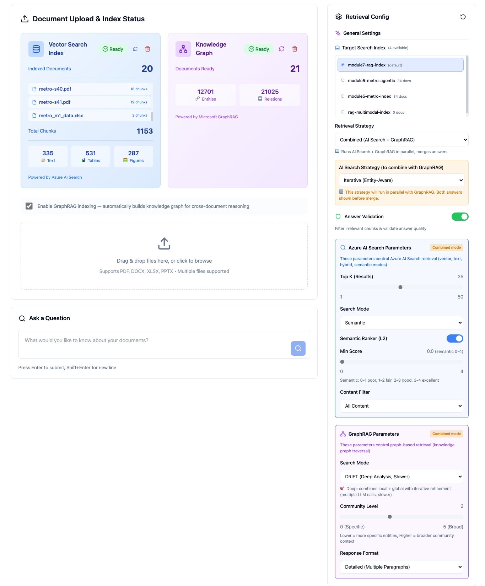
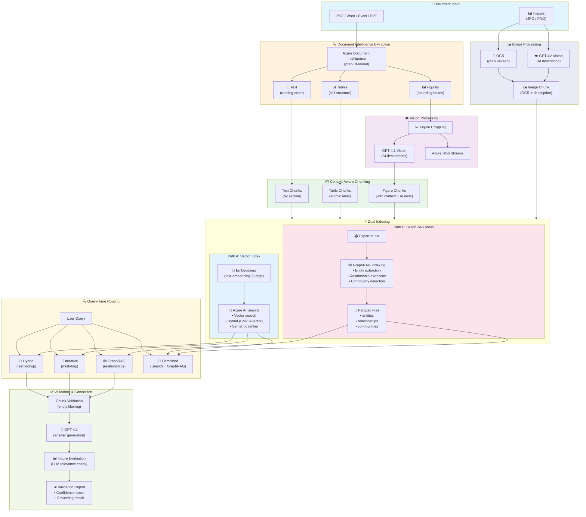

# Module 7 – Production Multimodal RAG Pipeline

## 📍 Overview

This module brings everything together into a **production-ready dual-index multimodal RAG pipeline**. It processes documents containing text, tables, and figures, indexes them to **both** Azure AI Search (vector/hybrid) and **GraphRAG** (knowledge graph), and provides an interactive UI with multiple retrieval strategies.

### Why This Module Exists

Modules 1–6 taught individual techniques. Module 7 shows what happens when you combine them into a real system — and the new challenges that emerge:

| Insight | What We Learned |
|---------|----------------|
| **Images alone aren't enough** | Figures need document context (section, page, surrounding text) to be retrievable |
| **Chunking fragments context** | Entity identifiers can be separated from related data across chunks |
| **Smart retrieval compensates** | Iterative entity-aware retrieval reconnects fragmented information |
| **Validation prevents errors** | Filtering entity conflicts and checking grounding catches hallucinations |
| **Different questions need different tools** | Fact lookups → vector search; relationship queries → GraphRAG |

### Application Screenshot



---

## 🏗️ Pipeline Architecture



---

## 📚 Pipeline Stages Explained

### Stage 1: Document Extraction

Documents are sent to **Azure Document Intelligence** (`prebuilt-layout` model), which extracts structured content — not just raw OCR text, but text with reading order, tables with cell structure, and figures with bounding box coordinates. This structure is what makes downstream processing possible.

**Supported formats:** PDF, Word (.docx), Excel (.xlsx), PowerPoint (.pptx), and images (JPG, PNG, BMP, TIFF, HEIF).

For **image files** (photos, maps, scanned documents), a dedicated pipeline runs: OCR via Document Intelligence (`prebuilt-read`) extracts visible text, while GPT-4V Vision generates a rich semantic description. Both are combined into a single searchable chunk — so a metro map image becomes findable by station names, route descriptions, and visual layout.

### Stage 2: Figure Context Enrichment

Simply cropping a figure and asking "what is this?" produces poor results. The model sees an isolated image with no document context — it can't know if the diagram is about "Station 36" or "Traffic Analysis."

Our pipeline enriches each figure with context from **three sources** before generating its description:

1. **Document structure** — document name, section path, page number, existing captions
2. **Surrounding text** — 1000 characters before and after the figure on the page
3. **Visual analysis** — GPT-4.1 Vision interprets the image content

This means a search for "station 36 entrance design" finds relevant figures because the enriched description contains domain terminology from surrounding text combined with visual understanding.

### Stage 3: Content-Aware Chunking

Chunking strategy is an **architectural decision**, not a parameter:

| Content Type | Strategy | Rationale |
|-------------|----------|-----------|
| **Text** | Group by section headers | Keeps coherent topics together |
| **Tables** | Atomic unit (preserve full structure) | Splitting rows destroys meaning |
| **Figures** | Single chunk with all context | Complete visual + document context in one unit |

Each figure becomes **one chunk** containing its enriched metadata, ensuring complete context travels with every figure — no fragmentation of visual content.

### Stage 4: Dual Indexing

The same enriched chunks feed **both** indexes in parallel — the expensive extraction work happens only once:

| Aspect | Vector Index (Azure AI Search) | GraphRAG Index |
|--------|-------------------------------|----------------|
| **What it stores** | Embeddings (3072-dim) + metadata | Entities, relationships, communities |
| **Indexing time** | Fast (~10s/doc) | Slow (~5–10min/doc) |
| **Indexing cost** | Low (~$0.01/doc) | High (~$0.50–2/doc) |
| **Query latency** | Fast (~1–2s) | Slower (~5–15s) |
| **Best for** | "What is X?" — fact lookups | "What depends on X?" — relationships |
| **Multimodal** | ✅ Figures, tables, images | Text descriptions only |
| **Updates** | Easy (add/delete docs) | Full re-index required |

### Stage 5: Query-Time Retrieval

Users choose a retrieval strategy (or let the system auto-select). Each strategy searches your documents differently — pick the one that matches your question type, or use **Auto** to let the system decide.

| Strategy | When to Use | How It Works | Example Question | Speed |
|----------|-------------|--------------|------------------|-------|
| **Hybrid** | Simple factual questions | Combines **keyword search** (BM25) with **vector similarity** — finds documents that match your words AND your meaning. Optional semantic reranking boosts the best results to the top. | _"What is the depth of Station 36?"_ | ⚡ Fast (~2–5s) |
| **Iterative** | Entity lookups, fragmented context | Runs Hybrid search first, then **extracts entities** (names, places, numbers) from the results and **rewrites your query** to find related information that the first search missed. Repeats 2–3 times until context is complete. | _"How many passengers use Station 36?"_ (finds the station first, then the passenger data on the same page) | 🔄 Medium (~5–10s) |
| **Agentic** | Complex multi-part questions | An **AI agent breaks your question** into smaller sub-questions, searches for each one independently, then combines all results into a single comprehensive context for the final answer. | _"Compare the entrance designs of stations 36 and 38"_ | 🐢 Slower (~10–20s) |
| **Agentic Search** | Azure-native query decomposition | Same idea as Agentic, but **Azure AI Search handles the decomposition** natively on the server side. Requires S1+ tier index. Faster than custom Agentic because no extra LLM calls for decomposition. | _"What are the construction phases and timelines for stations 35–38?"_ | ⚡ Medium (~5–10s) |
| **GraphRAG** | Relationship and impact questions | Searches a **knowledge graph** of entities and relationships (not document text). Traverses connections between stations, lines, organizations, and locations. Three modes: **Local** ⚡ (direct relationships), **Global** 🌍 (big-picture summaries), **DRIFT** 🎯 (deep iterative analysis, slow). | _"What services depend on Station 36?"_, _"How are the metro lines connected?"_ | 🕸️ Varies (5–60s) |
| **Combined** | Get the best of both worlds | Runs **any AI Search strategy + GraphRAG in parallel**. Produces an **LLM-merged** answer shown first with relevant figures, plus a collapsible "How this answer was generated" section with individual AI Search and GraphRAG answers for comparison. | _"Tell me everything about Station 36 and its connections"_ | 🐢 Slowest (~15–40s) |
| **Auto** | Not sure which to pick | An **LLM analyzes your question** and automatically picks the best strategy. Simple questions → Hybrid, complex → Agentic, relationships → GraphRAG. | Any question — the system decides for you | 🎯 Depends on pick |

### Stage 6: Validation, Generation & Figure Evaluation

A multi-stage quality control process ensures answer reliability:

#### Generation Quality

The generation prompt enforces **12 rules** for answer quality:
- **Document grounding** — every claim must come from provided context
- **Citation accuracy** — each `[Source N]` cited only for claims that source supports
- **No language escalation** — never say "infeasible" or "prohibitive" unless the source does
- **Trade-off framing** — architecture comparisons framed as trade-offs, not dominance
- **Figure relevance** — only reference figures that directly illustrate the answer

For **Combined mode**, a separate merge prompt with **8 rules** synthesizes the AI Search and GraphRAG answers into one unified narrative organized by concept — never exposing the two-source structure to the reader.

#### Three-Layer Figure Filtering

Figures pass through three filters before reaching the user:

| Layer | What It Does | Why |
|-------|-------------|-----|
| **Score filter** (50%) | Removes figures scoring below 50% of the top figure score | Eliminates low-relevance candidates early |
| **Combined-path filter** | Keeps only figures that both AI Search and GraphRAG agree on | Cross-validates relevance across retrieval methods |
| **LLM semantic evaluator** | GPT-4.1 evaluates each figure against the question and answer | Catches the hard case: a figure that's topically related but doesn't provide visual evidence for the answer's claims |

---

## 🔍 Retrieval Strategies Explained

The pipeline offers **7 retrieval strategies**. Each approaches your question differently — there is no single "best" strategy, the right choice depends on what you're asking.

### 🔄 Hybrid (AI Search)

**Best for:** Quick factual questions — _"What is Station 36?"_, _"Show me the specs for the entrance design."_

Searches your documents using **both** keyword matching (like a search engine) and semantic similarity (understanding meaning). Fast and reliable for straightforward lookups. This is the workhorse strategy for most questions.

### 🔁 Iterative (Entity-Aware)

**Best for:** Questions where context is fragmented — _"How many passengers use Station 36?"_

Standard search may find "Station 36 — Hazitonut Boulevard" but miss the passenger count on the same page because it doesn't mention "36". Iterative retrieval solves this: it **extracts entities** from initial results (e.g., the street name "Hazitonut"), then **rewrites the query** to find related chunks. Runs 2–3 search iterations automatically.

### 🤖 Agentic (AI Agent)

**Best for:** Complex multi-part questions — _"Compare the entrance designs of stations 36 and 38."_

An AI agent **decomposes** your question into sub-questions, searches for each separately, and synthesizes the results. More thorough than single-shot search, but slower and uses more tokens.

### ⚡ Agentic Search (Azure Native)

**Best for:** Same as Agentic, but uses Azure AI Search's **built-in** query decomposition. Requires an S1+ tier search index. Faster than the custom Agentic strategy because the decomposition happens inside Azure.

### 🕸️ GraphRAG (Knowledge Graph)

**Best for:** Relationship questions — _"What services depend on Station 36?"_, _"How are the metro lines connected?"_

Searches a **knowledge graph** of entities and relationships extracted from your documents. Instead of finding text chunks, it traverses connections between entities (stations, lines, organizations, locations). Three modes available:

| Mode | Speed | Description |
|------|-------|-------------|
| **Local** ⚡ | ~5–10s | Finds the most relevant entities and follows their direct relationships. Fast and recommended for most questions. |
| **Global** 🌍 | ~5–10s | Uses pre-computed community summaries for big-picture questions like "Summarize the entire metro plan." |
| **DRIFT** 🎯 | ~30–60s | Combines local + global with iterative refinement. Deepest analysis but significantly slower. |

### 🔀 Combined (AI Search + GraphRAG)

**Best for:** Getting the most comprehensive answer — _"Tell me everything about Station 36 and its connections."_

Runs **any AI Search strategy** (Hybrid, Iterative, Agentic, or Agentic Search) **in parallel** with GraphRAG. The **merged answer** is displayed first with relevant figures, followed by a collapsible **"How this answer was generated"** section showing:

1. **AI Search answer** — from document chunks (text, tables, figures)
2. **GraphRAG answer** — from the knowledge graph (entities, relationships)

The merge prompt synthesizes both into one unified narrative organized by concept, with strict rules against exposing the two-source structure. Pick the base AI Search strategy in the config panel — the default is Iterative (Entity-Aware).

> 💡 **Tip:** Combined mode takes longer (both strategies run in parallel, plus a merge step) but gives the most complete answers because it draws from both document content and entity relationships.

### 🎯 Auto

**Best for:** When you're not sure which strategy to pick.

An LLM analyzes your question and picks the best strategy automatically. Simple questions get Hybrid, complex ones get Agentic, relationship questions get GraphRAG.

---

## 📊 Strategy Evaluation: Real Results

We ran **12 questions** across **6 strategies** (72 API calls) to measure which strategy actually wins for each question type. Below are the real results with actual answers.

> Run the full evaluation yourself: `python strategy_eval.py --quick`

### Results Summary

| Category | Best Strategy | Avg Score | Runner-Up | Key Finding |
|----------|--------------|-----------|-----------|-------------|
| 📋 Factual Lookup | **Combined** (1.00) | 0.85 | GraphRAG Global (0.90) | All strategies answer correctly, but Combined and GraphRAG provide richer context |
| 🔗 Entity-Fragmented | **Iterative** (0.83) | 0.70 | Agentic (0.83) | Iterative bridges disconnected chunks via entity extraction |
| ⚖️ Multi-Part Comparison | **Iterative** (1.00) | 0.93 | Agentic, GraphRAG, Combined (1.00) | Hybrid fails when it can't find both stations in one search (0.75) |
| 🕸️ Relationship | **GraphRAG Global** (0.90) | 0.68 | Iterative, GraphRAG Local (0.73) | **Biggest gap!** GraphRAG finds organizations & roles that AI Search completely misses |
| 🌍 Cross-Document | **Hybrid** (0.57) | 0.52 | Combined (0.57) | All strategies struggle — keyword scoring shows none covers all 7 stations in one answer |
| 🔀 Comprehensive | **GraphRAG Global** (1.00) | 0.87 | Iterative, Agentic, GraphRAG Local (0.90) | GraphRAG adds organizational context that AI Search lacks |

### 🏆 The Killer Example: Where GraphRAG Wins Big

**Question:** <bdi dir="rtl">"אילו ארגונים מעורבים בתכנון תחנות המטרו ומה התפקיד של כל אחד?"</bdi><br/>
_(Which organizations are involved in planning metro stations and what is each one's role?)_

| Strategy | Score | Time | Key Difference |
|----------|-------|------|----------------|
| **GraphRAG Global** 🏆 | **1.00** | 128s | Found **<bdi dir="rtl">נת"ע</bdi>, <bdi dir="rtl">מנספלד-קהת</bdi>, MIS** — all 3 organizations with roles |
| Iterative | 0.67 | 30s | Found <bdi dir="rtl">נת"ע</bdi> and architects, missed MIS |
| GraphRAG Local | 0.67 | 19s | Found 2 of 3 organizations |
| **Hybrid** ❌ | **0.33** | 13s | Only found <bdi dir="rtl">נת"ע</bdi> — couldn't connect organizations across documents |
| **Agentic** ❌ | **0.33** | 13s | Same as Hybrid — sub-queries didn't help here |

**Why?** AI Search finds text chunks containing organization names, but can't connect _which organization does what_. GraphRAG has explicit `ORGANIZATION → STATION` relationships in its knowledge graph, so it can enumerate all involved parties and their roles.

### 💪 Where Iterative Wins: Entity Bridging

**Question:** <bdi dir="rtl">"מהם ייעודי הקרקע הקיימים בסביבת תחנת קפלן?"</bdi><br/>
_(What are the existing land use designations around Kaplan Station?)_

| Strategy | Score | Time | Key Difference |
|----------|-------|------|----------------|
| **Iterative** 🏆 | **1.00** | 31s | Found "35" + "<bdi dir="rtl">קפלן</bdi>" + all land use data |
| Agentic | 1.00 | 29s | Also decomposed effectively |
| **Hybrid** ❌ | **0.67** | 13s | Searched "<bdi dir="rtl">קפלן</bdi>" but missed chunks labeled "<bdi dir="rtl">תחנה</bdi> 35" |
| GraphRAG Global ❌ | 0.67 | 114s | Slow + less specific land use details |

**Why?** The question says "Kaplan Station" but the land use data is indexed under "Station 35". Hybrid can't bridge this gap. Iterative extracts `{station_number: 35}` from the first result and rewrites the query.

### ⚠️ Where Hybrid Fails: Multi-Station Comparisons

**Question:** <bdi dir="rtl">"מה ההבדלים בתכניות הפיתוח בין תחנה 37 לתחנה 38?"</bdi><br/>
_(What are the development plan differences between Station 37 and 38?)_

| Strategy | Score | Time | Answer Quality |
|----------|-------|------|----------------|
| **Iterative** 🏆 | **1.00** | 66s | Detailed comparison with specific numbers (1,500 units, areas) |
| Combined | 1.00 | 21s | Most comprehensive (2,203 chars) combining both sources |
| **Hybrid** ❌ | **0.75** | 13s | _"<bdi dir="rtl">אין לי מספיק מידע</bdi>"_ (I don't have enough info) for Station 37 |

**Why?** Hybrid retrieves 5 chunks in one pass — it found Station 38 data but not enough Station 37 context. Iterative runs multiple passes, and Agentic decomposes into separate per-station queries.

### ⏱️ Speed vs Quality Tradeoff

| Strategy | Avg Time | Quality (Avg Score) | Best Use Case |
|----------|----------|--------------------:|---------------|
| **Hybrid** | **17s** ⚡ | 0.69 | Quick factual lookups — fastest and cheapest |
| **Combined** | **28s** | 0.81 | Best overall quality — but costs 2 API calls |
| **Agentic** | **34s** | 0.77 | Multi-part comparisons |
| **Iterative** | **41s** | 0.79 | Entity bridging, fragmented context |
| **GraphRAG Local** | **41s** | 0.78 | Specific relationship queries |
| **GraphRAG Global** | **116s** 🐢 | 0.78 | Organization/summary questions — slowest but finds things others miss |

---

**Pre-generation filtering** — extracts entities from the user's query (e.g., "Station: 36") and checks each retrieved chunk for conflicts. Chunks about Station 37 are filtered out before the LLM ever sees them.

**Post-generation figure evaluation** — after the answer is generated, an LLM evaluates each candidate figure against the question and answer. Figures that are topically related but don't provide visual evidence for the answer's claims are removed. For example, a taxonomy of Transformer variants is removed when the question asks about the self-attention bottleneck — the figure shows responses to the problem, not the problem itself.

**Post-generation validation** — checks whether the answer is grounded in the provided chunks, identifies which aspects were answered vs. missing, calculates a confidence score, and suggests a retry query if quality is low.

The final answer is generated by GPT-4.1 with strict grounding rules — only information from provided chunks, explicit citations using `[Source N]` format, trade-off framing for comparisons, and "I don't have enough information" when context is insufficient.

---

## 🎯 Key Innovation: Iterative Entity-Aware Retrieval

This is the core technique that makes Module 7 different from a standard RAG pipeline.

**The problem:** When you search for "Station 36 passenger count", you might find _"Station 36 — Hazitonut Boulevard"_ (it contains "36"), but NOT _"2,400 passengers at peak hours"_ (no "36" mentioned). Both chunks are on the same page, but standard search can't connect them.

**The solution — iterative entity bridging:**

| Step | What Happens |
|------|-------------|
| **Iteration 1** | Search "Station 36" → find _"Station 36 — Hazitonut Boulevard"_ → extract entity `{station_name: "Hazitonut"}` |
| **Iteration 2** | Rewrite query using found entity: "passengers Hazitonut Boulevard" → find _"2,400 passengers at peak hours"_ ✅ |

The retriever accumulates entities across iterations and uses them to rewrite follow-up queries. It stops when all query aspects are covered, max iterations are reached, or no new information is found.

---

## 🕹️ Understanding the UI Controls

The query interface has **two levels of configuration**:

**Level 1: Retrieval Strategy** controls the _orchestration_ — how many queries to run, what reasoning to apply, which index to use.

**Level 2: Search Parameters** control the _mechanics_ of each individual search operation against Azure AI Search:

| Parameter | Description |
|-----------|-------------|
| **Search Mode** | Hybrid (vector + BM25), Vector Only, Text Only, or Semantic (default: **Semantic**) |
| **Semantic Ranker** | Neural reranking for relevance (default: **on**) |
| **Top K** | Number of results per search, 1–50 (default: **26**) |
| **Min Score** | Filter threshold, 0–1 for vector, 0–4 for semantic (default: **0.0**) |
| **Content Filter** | Restrict to text, table, or figure chunks (default: **all**) |

For example, an **Agentic Search** with **Hybrid mode** means the LLM decomposes your question into sub-queries, and each sub-query runs as a hybrid (vector + keyword) search with the configured parameters.

### Semantic Score Guide

| Score Range | Meaning |
|------------|---------|
| 3.0 – 4.0 | Excellent match ✅✅✅ |
| 2.0 – 3.0 | Good match ✅✅ |
| 1.5 – 2.0 | Fair match ✅ |
| 1.0 – 1.5 | Weak match ⚠️ |
| < 1.0 | Poor match ❌ |

---

## 🚀 Quick Start

### Prerequisites

- Python 3.11+ (required for GraphRAG)
- Node.js 18+
- Azure resources: Document Intelligence, OpenAI, AI Search, Blob Storage
- `.env` file with credentials (copy from root `.env`)

### Run the Pipeline

```bash
cd modules/module-7-pipeline

# Start both backend and frontend
./run_all.sh

# Access:
# - Frontend: http://localhost:5173
# - Backend API: http://localhost:8000
# - API Docs: http://localhost:8000/docs
```

### UI Features

- **Document Upload** — drag & drop for PDF, Word, Excel, PowerPoint, and images
- **Index Status Panels** — unique document count, total chunks by type, GraphRAG progress
- **Retrieval Strategy Selector** — switch between Hybrid, Iterative, Agentic, GraphRAG, Combined
- **Combined Mode** — merged answer + figures first, collapsible details showing individual AI Search and GraphRAG answers
- **LaTeX Math Rendering** — mathematical notation like $O(T^2 \cdot D)$ renders as proper equations via KaTeX
- **Citation Linking** — `[Source N]` citations are clickable, with comma-separated groups expanded automatically
- **Figure Evaluation** — 3-layer filtering ensures only figures that directly illustrate the answer are shown
- **Validation Reports** — confidence scores, entity conflict detection, grounding checks
- **Delete Controls** — reset either index independently for testing

### Building the Knowledge Graph

Upload documents through the UI (they auto-export to GraphRAG format), then click **"Build Knowledge Graph"** in the status panel. Indexing runs in the background and typically takes 10–30 minutes depending on document size. The UI shows real-time progress with step tracking and ETA.

---

## 📁 Project Structure

```
module-7-pipeline/
├── backend/
│   ├── services/
│   │   ├── document_processor.py     # DI extraction + GPT-4.1 vision
│   │   ├── chunk_enricher.py         # Figure context enrichment
│   │   ├── search_service.py         # Azure AI Search operations
│   │   ├── blob_service.py           # Azure Blob Storage + SAS URLs
│   │   ├── generation.py             # LLM answer generation, merging & figure evaluation
│   │   ├── iterative_retriever.py    # Entity-aware multi-hop retrieval
│   │   ├── retrieval_router.py       # Strategy routing + SAS enrichment
│   │   ├── validation_service.py     # Pre/post-generation validation
│   │   ├── graphrag_exporter.py      # Export chunks → text for GraphRAG
│   │   ├── graphrag_indexer.py       # Run GraphRAG indexing (background)
│   │   └── graphrag_retriever.py     # Query GraphRAG knowledge graph
│   ├── api/routes/
│   │   ├── query.py                  # Query endpoint with validation
│   │   ├── documents.py              # Document upload + dual indexing
│   │   ├── config.py                 # Configuration get/set/reset
│   │   ├── system.py                 # Health check + restart
│   │   └── graphrag.py               # GraphRAG status/build/delete
│   ├── graphrag-index/               # GraphRAG data (input/, output/, cache/)
│   ├── config/settings.py            # Environment configuration
│   └── main.py                       # FastAPI application
├── frontend/
│   └── src/components/
│       ├── DocumentUpload.tsx         # Upload + dual index status
│       ├── AnswerDisplay.tsx          # Answer with inline figures
│       ├── RetrievalConfig.tsx        # Strategy & parameter selection
│       ├── RetrievalDetails.tsx       # Retrieval observability
│       └── ValidationReport.tsx       # Validation report panel
├── run_all.sh                         # Start both services
├── run_backend.sh                     # Backend only
└── run_frontend.sh                    # Frontend only
```

---

## 💰 Cost Considerations

| Component | Cost |
|-----------|------|
| Document Intelligence | ~$0.01 per page |
| GPT-4.1 Vision (per figure) | ~$0.01–0.02 |
| Embeddings | ~$0.0001 per chunk |
| Iterative retrieval (per query) | ~$0.02–0.05 |
| Validation (per query) | ~$0.01–0.02 |
| **GraphRAG indexing (per doc)** | **~$0.50–2.00** |
| GraphRAG queries | ~$0.10–0.30 |

**Example:** A 20-page PDF with 20 figures, followed by 10 queries — processing + vector indexing ~$0.50, queries with validation ~$0.50, GraphRAG indexing (one-time) ~$1.00. **Total: ~$2.00**

---

## 🎓 Key Takeaways

| Lesson | Why It Matters |
|--------|---------------|
| **DI > OCR** | Document Intelligence preserves structure that OCR destroys |
| **Context for figures** | Images need document/section/page context to be searchable |
| **Content-type chunking** | Don't split tables or separate figures from their context |
| **Entity bridging** | Extract entities from early results to find related fragments |
| **Validation is essential** | Filter entity conflicts and validate grounding before answering |
| **Iterate to complete** | Multiple retrieval passes find more than single-shot search |
| **Right tool for the question** | Vector search for facts, GraphRAG for relationships |
| **Combined for completeness** | Merging AI Search + GraphRAG gives the most comprehensive answers |

---

## 🔮 Future Enhancements

- **LazyGraphRAG** — defers expensive LLM calls until query time for lower indexing cost
- **Incremental GraphRAG** — update the knowledge graph without full re-indexing
- **Auto-combined routing** — automatically trigger Combined mode when the question would benefit from both sources
- **Streaming answers** — stream merged answers token-by-token for faster perceived latency
- **Evaluation benchmarks** — automated answer quality scoring against gold-standard Q&A pairs

---

## 📝 שאלות לדוגמה: שילוב GraphRAG + AI Search (Combined)

השאלות הבאות מדגימות את העוצמה של אסטרטגיית **Combined** — שילוב תוצאות חיפוש וקטורי (AI Search) עם גרף ידע (GraphRAG) לתשובות מקיפות שאף אסטרטגיה בודדת לא יכולה לספק.

> 💡 **למה Combined?** AI Search מוצא פרטים ספציפיים מתוך מסמכי התחנות (כניסות, מפלסים, תכניות). GraphRAG מוצא קשרים בין ישויות (תחנות סמוכות, השתייכות לרשויות, ארגונים מתכננים). השילוב נותן תמונה מלאה.

---

### שאלה 1: זיהוי תחנות סמוכות, שיוך לרשות מקומית, וממצא תכנוני

<div dir="rtl">

**שאלה:**

תחנה מס' 36, "שדרות הציונות", מהווה נקודת חיבור בין הציר הראשי של קו M1 לשלוחה דרומית.
בהתבסס על מפת הקו, קובץ הנתונים הטבלאי, ודוח תחנה 36:
1. זהה את שלוש התחנות הסמוכות ישירות לשדרות הציונות – תחנה אחת לכל כיוון רלוונטי.
2. קבע האם התחנות שעל השלוחה הדרומית משתייכות לאותה רשות מקומית, וציין איזו.
3. הוסף ממצא תכנוני אחד ודוגמה לקישוריות תחבורתית מיידית כפי שמופיעים בדוח התחנה.

**תשובה מצופה:**

1. שלוש התחנות הסמוכות ישירות לתחנה מס' 36 "שדרות הציונות" הן:
   - מצפון על הציר הראשי: תחנת "יוסף בורג" (תחנה מס' 37)
   - מדרום על השלוחה הדרומית: תחנת "הרצוג" (תחנה מס' 38)
   - תחנה שלישית בכיוון הצפון-מערבי על הקו הראשי: תחנת "קפלן" (תחנה מס' 35)

2. כל התחנות שעל השלוחה הדרומית, כולל תחנה 36 ("שדרות הציונות"), תחנה 37 ("יוסף בורג") ותחנה 38 ("הרצוג"), שייכות לרשות המקומית של **ראשון לציון**. התחנות ממוקמות בתחום השיפוט העירוני של ראשון לציון, באזור שכונת נחלת יהודה והמב"ת צפון, ואין חציית גבולות מוניציפליים באזור זה.

3. **ממצא תכנוני:** תחנת "שדרות הציונות" היא תחנה תת-קרקעית עם מספר מפלסים הכוללים רציף רכבת, מזנין וקונקורס, הממוקמת בין שדרות הציונות לדרך המכבים, ומשולבת במרקם העירוני הכולל מגורים ותעסוקה.
   
   **קישוריות תחבורתית מיידית:** התחנה כוללת שלוש כניסות – כניסה מערבית המשרתת את שכונות המגורים ממערב, ושתי כניסות מזרחיות משני עברי דרך המכבים, שהן גם מעברי הולכי רגל תת-קרקעיים המחברים בין אזור המגורים המערבי לאזור התעסוקה ממזרח. בנוסף, קיימים שבילי אופניים קיימים ומתוכננים וצירי הולכי רגל ראשיים ומשניים בסביבת התחנה, התומכים בקישוריות תחבורתית מגוונת.

</div>

| מרכיב בתשובה | מקור הנתונים | למה צריך Combined? |
|---|---|---|
| תחנות סמוכות וכיוונים | GraphRAG (קשרי ישויות בין תחנות) + AI Search (מפת הקו) | GraphRAG יודע לעקוב אחרי קשרי שכנות בין תחנות |
| שיוך לרשות מקומית | GraphRAG (ישות עיר ↔ תחנות) | AI Search לבד לא תמיד מחבר בין כל התחנות לעיר |
| ממצאים תכנוניים וכניסות | AI Search (טקסט ותמונות מדוח תחנה 36) | פרטי עומק מתוך המסמך המקורי |

---

### שאלה 2: ניווט בין תחנות ופרט תכנוני ייחודי

<div dir="rtl">

**שאלה:**

בהתבסס על מפת קו M1, דוחות תחנות 36–38 וקובץ הנתונים הטבלאי:
1. כמה תחנות יש לעבור מתחנה 36 "שדרות הציונות" כדי להגיע לתחנה "הרצוג"?
2. מהי התחנה האמצעית בדרך?
3. האם כל התחנות במסלול הזה שייכות לאותה רשות מקומית?
4. ציין פרט תכנוני אחד ייחודי לתחנה 36 שאינו מופיע בדוחות התחנות האחרות במסלול.

**תשובה מצופה:**

1. כדי להגיע מתחנה 36 "שדרות הציונות" לתחנה 38 "הרצוג", יש לעבור תחנה אחת בלבד – תחנה 37 "יוסף בורג".

2. התחנה האמצעית בדרך היא תחנה 37 "יוסף בורג".

3. כל התחנות במסלול זה – 36 ("שדרות הציונות"), 37 ("יוסף בורג") ו-38 ("הרצוג") – שייכות לאותה רשות מקומית, **עיריית ראשון לציון**.

4. פרט תכנוני ייחודי לתחנה 36 "שדרות הציונות" הוא שיש לה **שלוש כניסות**: כניסה מערבית לשכונות המגורים, ושתי כניסות מזרחיות הממוקמות משני צדי דרך המכבים, שהן גם **מנהרות להולכי רגל תת-קרקעיות** המקשרות בין אזורי המגורים למרכזי התעסוקה מבלי הצורך לחצות רחובות עמוסים. פרט זה של מנהרות הולכי רגל תת-קרקעיות וכניסות מרובות אינו מופיע בדוחות התחנות 37 ו-38.

</div>

| מרכיב בתשובה | מקור הנתונים | למה צריך Combined? |
|---|---|---|
| סדר תחנות וניווט | GraphRAG (מעבר על גרף הקשרים בין תחנות) | GraphRAG "רואה" את הטופולוגיה של הקו |
| שיוך לרשות מקומית | GraphRAG (ישות ראשון לציון ↔ תחנות) | חיבור בין ישויות שלא תמיד מופיע באותו chunk |
| פרט תכנוני ייחודי | AI Search (השוואת תוכן מדוחות 36, 37, 38) | נדרשת קריאה מעמיקה של המסמכים המקוריים |

---

### שאלה 3: מעברי הולכי רגל, רשות מקומית, ותכנון עירוני

<div dir="rtl">

**שאלה:**

בהתבסס על דוחות תחנות 36–38 וקובץ הנתונים הטבלאי:
1. אילו מהתחנות כוללות מעבר הולכי רגל תת-קרקעי כחלק מתכנון הכניסות?
2. האם כל התחנות הללו משתייכות לאותה רשות מקומית?
3. איזו מהתחנות הללו ממוקמת באזור שבו לא מקודמות תכניות ברדיוס 800 מ'?
4. הסבר מהו ההבדל התכנוני המרכזי בין תחנה זו לבין התחנות האחרות שנבדקו.

**תשובה מצופה:**

1. בין התחנות 36 (שדרות הציונות), 37 (יוסף בורג) ו-38 (הרצוג), מעבר הולכי רגל תת-קרקעי כחלק מתכנון הכניסות מתוכנן ב**תחנה 36 (שדרות הציונות) בלבד**. בתחנה זו מתוכננות שלוש כניסות, כאשר הכניסות המזרחיות משני עברי דרך המכבים ישמשו גם כמעבר הולכי רגל תת-קרקעי שיקשר את השכונה לאזור התעסוקה ממזרח לה. אין אזכור למעבר הולכי רגל תת-קרקעי כחלק מהכניסות בתחנות 37 ו-38.

2. כל התחנות 36, 37 ו-38 משתייכות לאותה רשות מקומית – **עיריית ראשון לציון**.

3. **תחנה 36 (שדרות הציונות)** היא התחנה שממוקמת באזור שבו לא מקודמות תכניות תכנון עירוניות ברדיוס של 800 מטר. עבור תחנה זו מצוין במפורש כי לא מקודמות תכניות ברדיוס זה, בניגוד לתחנות 37 ו-38 שבהן קיימות תכניות מאושרות ופעילות תכנונית משמעותית.

4. ההבדל התכנוני המרכזי הוא שתחנה 36 נמצאת ב**אזור יציב** יחסית ללא תכניות מקודמות או פעילות תכנונית משמעותית ברדיוס 800 מטר, ומתמקדת בתפקידה כנקודת חיבור בין אזורי מגורים ממערב לאזורי תעסוקה ממזרח, עם דגש על תשתיות הולכי רגל תת-קרקעיות לשיפור הנגישות והבטיחות. לעומת זאת, תחנות 37 ו-38 משולבות באזורים עם **פעילות תכנונית ערה** הכוללת תכניות מאושרות ועתידיות לדיור, תעסוקה ומרחבים ציבוריים, כאשר תחנה 38 משולבת בתכנית פיתוח רחבה הכוללת אלפי יחידות דיור, אזורי תעסוקה גדולים ומרחבים ירוקים משמעותיים.

</div>

| מרכיב בתשובה | מקור הנתונים | למה צריך Combined? |
|---|---|---|
| זיהוי מעברי הולכי רגל | AI Search (פרטים מדוחות תחנות 36, 37, 38) | נדרשת סריקה טקסטואלית מעמיקה של כל דוח |
| שיוך לרשות מקומית | GraphRAG (ישויות ↔ קשרים גאוגרפיים) | חיבור מהיר דרך גרף הידע |
| סטטוס תכניות ברדיוס 800 מ' | AI Search (תוכן ספציפי מכל דוח) | מידע מפורט שמופיע בחלקים שונים של המסמכים |
| הבדלים תכנוניים | Combined (סינתזה של AI Search + GraphRAG) | ההשוואה דורשת גם פרטי עומק וגם הבנת הקשרים |

---

> 🧪 **נסו בעצמכם:** העתיקו את השאלות לממשק, בחרו באסטרטגיית **Combined** (עם Iterative כבסיס), והשוו את התשובות לתשובות המצופות. שימו לב איך התשובה הממוזגת משלבת פרטים ספציפיים מ-AI Search עם הבנת קשרים מ-GraphRAG.

---

## Navigation

**Previous**: [Module 6 – GraphRAG](../module-6-graphrag/README.md)  
**🎓 Workshop Complete!**
