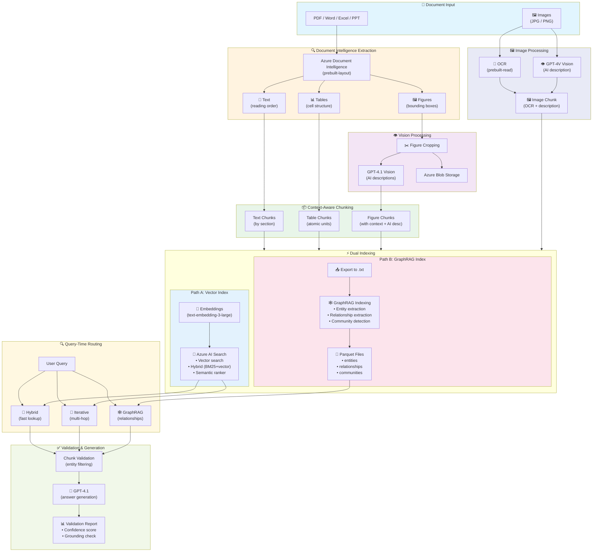

# Module 7 – Production Multimodal RAG Pipeline

## 📍 Overview

This module brings everything together into a **production-ready dual-index multimodal RAG pipeline**. It processes documents containing text, tables, and figures, indexes them to **both** Azure AI Search (vector/hybrid) and **GraphRAG** (knowledge graph), and provides an interactive UI with multiple retrieval strategies.

### Why This Module Exists

Modules 1–6 taught individual techniques. Module 7 shows what happens when you combine them into a real system — and the new challenges that emerge:

| Insight | What We Learned |
|---------|----------------|
| **Images alone aren't enough** | Figures need document context (section, page, surrounding text) to be retrievable |
| **Chunking fragments context** | Entity identifiers can be separated from related data across chunks |
| **Smart retrieval compensates** | Iterative entity-aware retrieval reconnects fragmented information |
| **Validation prevents errors** | Filtering entity conflicts and checking grounding catches hallucinations |
| **Different questions need different tools** | Fact lookups → vector search; relationship queries → GraphRAG |

---

## 🏗️ Pipeline Architecture



---

## 📚 Pipeline Stages Explained

### Stage 1: Document Extraction

Documents are sent to **Azure Document Intelligence** (`prebuilt-layout` model), which extracts structured content — not just raw OCR text, but text with reading order, tables with cell structure, and figures with bounding box coordinates. This structure is what makes downstream processing possible.

**Supported formats:** PDF, Word (.docx), Excel (.xlsx), PowerPoint (.pptx), and images (JPG, PNG, BMP, TIFF, HEIF).

For **image files** (photos, maps, scanned documents), a dedicated pipeline runs: OCR via Document Intelligence (`prebuilt-read`) extracts visible text, while GPT-4V Vision generates a rich semantic description. Both are combined into a single searchable chunk — so a metro map image becomes findable by station names, route descriptions, and visual layout.

### Stage 2: Figure Context Enrichment

Simply cropping a figure and asking "what is this?" produces poor results. The model sees an isolated image with no document context — it can't know if the diagram is about "Station 36" or "Traffic Analysis."

Our pipeline enriches each figure with context from **three sources** before generating its description:

1. **Document structure** — document name, section path, page number, existing captions
2. **Surrounding text** — 1000 characters before and after the figure on the page
3. **Visual analysis** — GPT-4.1 Vision interprets the image content

This means a search for "station 36 entrance design" finds relevant figures because the enriched description contains domain terminology from surrounding text combined with visual understanding.

### Stage 3: Content-Aware Chunking

Chunking strategy is an **architectural decision**, not a parameter:

| Content Type | Strategy | Rationale |
|-------------|----------|-----------|
| **Text** | Group by section headers | Keeps coherent topics together |
| **Tables** | Atomic unit (preserve full structure) | Splitting rows destroys meaning |
| **Figures** | Single chunk with all context | Complete visual + document context in one unit |

Each figure becomes **one chunk** containing its enriched metadata, ensuring complete context travels with every figure — no fragmentation of visual content.

### Stage 4: Dual Indexing

The same enriched chunks feed **both** indexes in parallel — the expensive extraction work happens only once:

| Aspect | Vector Index (Azure AI Search) | GraphRAG Index |
|--------|-------------------------------|----------------|
| **What it stores** | Embeddings (3072-dim) + metadata | Entities, relationships, communities |
| **Indexing time** | Fast (~10s/doc) | Slow (~5–10min/doc) |
| **Indexing cost** | Low (~$0.01/doc) | High (~$0.50–2/doc) |
| **Query latency** | Fast (~1–2s) | Slower (~5–15s) |
| **Best for** | "What is X?" — fact lookups | "What depends on X?" — relationships |
| **Multimodal** | ✅ Figures, tables, images | Text descriptions only |
| **Updates** | Easy (add/delete docs) | Full re-index required |

### Stage 5: Query-Time Retrieval

Users choose a retrieval strategy (or let the system auto-select):

| Strategy | When to Use | How It Works |
|----------|-------------|--------------|
| **Hybrid** | Simple factual questions | Vector + BM25 + optional semantic ranking |
| **Iterative** | Entity lookups, fragmented context | Entity extraction → query rewriting loop |
| **Agentic** | Complex multi-part questions | LLM decomposes query into sub-queries |
| **Agentic Search** | Azure-native query decomposition | Azure AI Search handles sub-queries natively |
| **GraphRAG** | Relationship and impact queries | Knowledge graph traversal (DRIFT search) |
| **Auto** | Let the system decide | LLM classifies query complexity and picks strategy |

### Stage 6: Validation & Generation

A two-stage quality control process ensures answer reliability:

**Pre-generation filtering** — extracts entities from the user's query (e.g., "Station: 36") and checks each retrieved chunk for conflicts. Chunks about Station 37 are filtered out before the LLM ever sees them.

**Post-generation validation** — checks whether the answer is grounded in the provided chunks, identifies which aspects were answered vs. missing, calculates a confidence score, and suggests a retry query if quality is low.

The final answer is generated by GPT-4.1 with strict grounding rules — only information from provided chunks, explicit citations using `[Source N]` format, and "I don't have enough information" when context is insufficient.

---

## 🎯 Key Innovation: Iterative Entity-Aware Retrieval

This is the core technique that makes Module 7 different from a standard RAG pipeline.

**The problem:** When you search for "Station 36 passenger count", you might find _"Station 36 — Hazitonut Boulevard"_ (it contains "36"), but NOT _"2,400 passengers at peak hours"_ (no "36" mentioned). Both chunks are on the same page, but standard search can't connect them.

**The solution — iterative entity bridging:**

| Step | What Happens |
|------|-------------|
| **Iteration 1** | Search "Station 36" → find _"Station 36 — Hazitonut Boulevard"_ → extract entity `{station_name: "Hazitonut"}` |
| **Iteration 2** | Rewrite query using found entity: "passengers Hazitonut Boulevard" → find _"2,400 passengers at peak hours"_ ✅ |

The retriever accumulates entities across iterations and uses them to rewrite follow-up queries. It stops when all query aspects are covered, max iterations are reached, or no new information is found.

---

## 🕹️ Understanding the UI Controls

The query interface has **two levels of configuration**:

**Level 1: Retrieval Strategy** controls the _orchestration_ — how many queries to run, what reasoning to apply, which index to use.

**Level 2: Search Parameters** control the _mechanics_ of each individual search operation against Azure AI Search:

| Parameter | Description |
|-----------|-------------|
| **Search Mode** | Hybrid (vector + BM25), Vector Only, Text Only, or Semantic |
| **Semantic Ranker** | Neural reranking for relevance (on/off) |
| **Top K** | Number of results per search (1–50) |
| **Min Score** | Filter threshold (0–1 for vector, 0–4 for semantic) |
| **Content Filter** | Restrict to text, table, or figure chunks |

For example, an **Agentic Search** with **Hybrid mode** means the LLM decomposes your question into sub-queries, and each sub-query runs as a hybrid (vector + keyword) search with the configured parameters.

### Semantic Score Guide

| Score Range | Meaning |
|------------|---------|
| 3.0 – 4.0 | Excellent match ✅✅✅ |
| 2.0 – 3.0 | Good match ✅✅ |
| 1.5 – 2.0 | Fair match ✅ |
| 1.0 – 1.5 | Weak match ⚠️ |
| < 1.0 | Poor match ❌ |

---

## 🚀 Quick Start

### Prerequisites

- Python 3.11+ (required for GraphRAG)
- Node.js 18+
- Azure resources: Document Intelligence, OpenAI, AI Search, Blob Storage
- `.env` file with credentials (copy from root `.env`)

### Run the Pipeline

```bash
cd modules/module-7-pipeline

# Start both backend and frontend
./run_all.sh

# Access:
# - Frontend: http://localhost:5173
# - Backend API: http://localhost:8000
# - API Docs: http://localhost:8000/docs
```

### UI Features

- **Document Upload** — drag & drop for PDF, Word, Excel, PowerPoint, and images
- **Index Status Panels** — unique document count, total chunks by type, GraphRAG progress
- **Retrieval Strategy Selector** — switch between Hybrid, Iterative, Agentic, GraphRAG
- **Validation Reports** — confidence scores, entity conflict detection, grounding checks
- **Delete Controls** — reset either index independently for testing

### Building the Knowledge Graph

Upload documents through the UI (they auto-export to GraphRAG format), then click **"Build Knowledge Graph"** in the status panel. Indexing runs in the background and typically takes 10–30 minutes depending on document size. The UI shows real-time progress with step tracking and ETA.

---

## 📁 Project Structure

```
module-7-pipeline/
├── backend/
│   ├── api/routes/
│   │   ├── query.py                  # Query endpoint with validation
│   │   ├── documents.py              # Document upload + dual indexing
│   │   └── graphrag.py               # GraphRAG status/build/delete
│   ├── services/
│   │   ├── document_processor.py     # DI extraction + GPT-4.1 vision
│   │   ├── chunk_enricher.py         # Figure context enrichment
│   │   ├── search_service.py         # Azure AI Search operations
│   │   ├── blob_service.py           # Azure Blob Storage + SAS URLs
│   │   ├── iterative_retriever.py    # Entity-aware multi-hop retrieval
│   │   ├── retrieval_router.py       # Strategy routing + SAS enrichment
│   │   ├── validation_service.py     # Pre/post-generation validation
│   │   ├── graphrag_exporter.py      # Export chunks → text for GraphRAG
│   │   ├── graphrag_indexer.py       # Run GraphRAG indexing (background)
│   │   └── graphrag_retriever.py     # Query GraphRAG knowledge graph
│   ├── graphrag-index/               # GraphRAG data (input/, output/, cache/)
│   ├── config/settings.py            # Environment configuration
│   └── main.py                       # FastAPI application
├── frontend/
│   └── src/components/
│       ├── DocumentUpload.tsx         # Upload + dual index status
│       ├── AnswerDisplay.tsx          # Answer with inline figures
│       ├── RetrievalConfig.tsx        # Strategy & parameter selection
│       ├── RetrievalDetails.tsx       # Retrieval observability
│       └── ValidationReport.tsx       # Validation report panel
├── run_all.sh                         # Start both services
├── run_backend.sh                     # Backend only
└── run_frontend.sh                    # Frontend only
```

---

## 💰 Cost Considerations

| Component | Cost |
|-----------|------|
| Document Intelligence | ~$0.01 per page |
| GPT-4.1 Vision (per figure) | ~$0.01–0.02 |
| Embeddings | ~$0.0001 per chunk |
| Iterative retrieval (per query) | ~$0.02–0.05 |
| Validation (per query) | ~$0.01–0.02 |
| **GraphRAG indexing (per doc)** | **~$0.50–2.00** |
| GraphRAG queries | ~$0.10–0.30 |

**Example:** A 20-page PDF with 20 figures, followed by 10 queries — processing + vector indexing ~$0.50, queries with validation ~$0.50, GraphRAG indexing (one-time) ~$1.00. **Total: ~$2.00**

---

## 🎓 Key Takeaways

| Lesson | Why It Matters |
|--------|---------------|
| **DI > OCR** | Document Intelligence preserves structure that OCR destroys |
| **Context for figures** | Images need document/section/page context to be searchable |
| **Content-type chunking** | Don't split tables or separate figures from their context |
| **Entity bridging** | Extract entities from early results to find related fragments |
| **Validation is essential** | Filter entity conflicts and validate grounding before answering |
| **Iterate to complete** | Multiple retrieval passes find more than single-shot search |
| **Right tool for the question** | Vector search for facts, GraphRAG for relationships |

---

## 🔮 Future Enhancements

- **LazyGraphRAG** — defers expensive LLM calls until query time for lower indexing cost
- **Incremental GraphRAG** — update the knowledge graph without full re-indexing
- **Hybrid auto-routing** — automatically combine vector and graph results for complex queries

---

**Previous Module**: [Module 6 – GraphRAG](../module-6-graphrag/README.md)
**🎓 Workshop Complete!**
