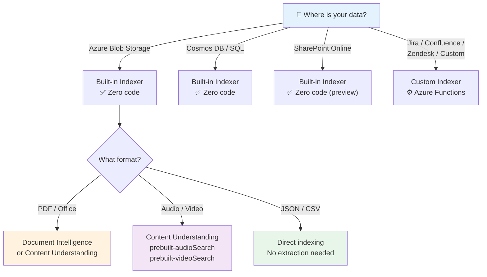
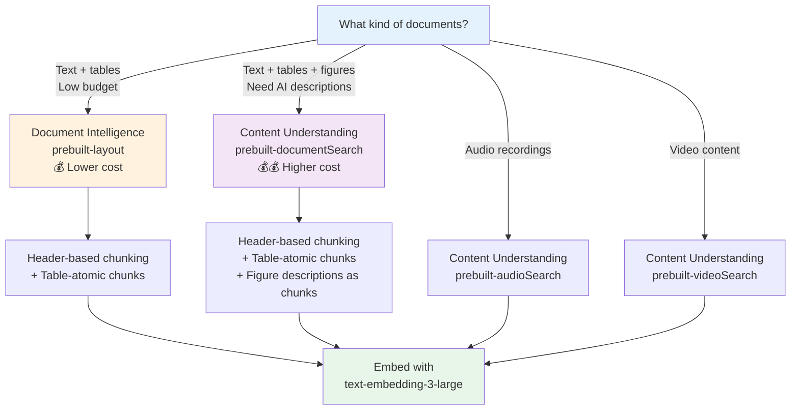
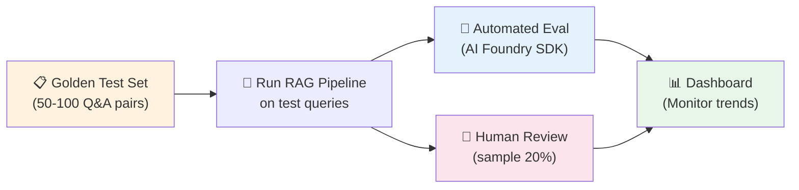

# Module: RAG System Design Considerations

## 📍 Where We Are in the Pipeline


**You've built a complete RAG pipeline.** Now step back and ask: *How would I design one from scratch for a real production scenario?*

---

## Objective

Learn to ask the right questions **before writing a single line of code**. This module is a design checklist — use it as an architect's guide when planning a RAG system for your organization.

## Learning Outcomes

By the end of this module, participants will be able to:
- Identify the key design decisions that shape a RAG system
- Map each decision to the relevant Azure service or configuration
- Avoid common architectural mistakes that are expensive to fix later
- Create a design document for a new RAG project

## Key Message

> Building a RAG system is 20% code and 80% design decisions. The questions you ask **before** building determine whether the system succeeds or fails in production.

---

## 🏗️ The Design Checklist

Before you build a RAG system, go through each section below. For every question, we map the answer to a concrete Azure decision.

---

## 1. 📊 Scale & Volume

These numbers drive your entire architecture — from index design to pricing.

| Question | Why It Matters | Azure Impact |
|----------|---------------|--------------|
| How many **concurrent users**? (100 vs 100K) | Determines search tier and replicas | Azure AI Search: Basic (small) vs Standard S2/S3 (large), replica count |
| How many **documents** to ingest? (10K vs 10M) | Affects index size, partition count, ingestion pipeline design | Azure AI Search: partition count, storage limits per tier |
| Average **document size**? (2-page memo vs 500-page contract) | Large docs need smarter chunking, more tokens per doc | Content Understanding for long docs, chunking strategy (Module 4) |
| **Ingestion frequency**? (one-time bulk vs continuous) | Real-time needs event-driven pipeline | Azure Functions + Event Grid for continuous; batch script for one-time |
| **Query rate**? (10/min vs 10K/sec) | High QPS needs caching, replicas, throttle handling | Azure AI Search replicas, Azure API Management for throttling |

### Understanding Azure AI Search Capacity: Replicas, Partitions & Search Units

Before choosing a tier, you need to understand how Azure AI Search capacity works. These three concepts determine your service's performance, storage, and cost:

```
┌─────────────────────────────────────────────────────────────────────────┐
│                    AZURE AI SEARCH CAPACITY MODEL                       │
│                                                                         │
│   Your search service is made up of SEARCH UNITS (SU).                 │
│   Each search unit is a combination of replicas and partitions.        │
│                                                                         │
│   Formula:   Replicas  ×  Partitions  =  Search Units (billing unit)   │
│                                                                         │
│   Example:   3 replicas × 2 partitions = 6 SU                         │
│              (you pay for 6 search units)                               │
│                                                                         │
│   Maximum:   36 SU per service (Standard tiers)                        │
└─────────────────────────────────────────────────────────────────────────┘
```

#### What is a Replica?

A **replica** is a copy of your entire search index running on a dedicated instance.

Think of it like **cashiers in a supermarket**: each cashier (replica) can serve a customer (query) independently. More cashiers = more customers served simultaneously = faster service.

```
                        ┌─────────────┐
           Query A ───→ │  Replica 1  │ ──→ Results
                        │ (full copy  │
           Query B ───→ │  of index)  │ ──→ Results     ← 1 replica = all queries
                        └─────────────┘        go to the same instance
           Query C ───→     (queued)


                        ┌─────────────┐
           Query A ───→ │  Replica 1  │ ──→ Results
                        └─────────────┘
                        ┌─────────────┐
           Query B ───→ │  Replica 2  │ ──→ Results     ← 3 replicas = queries
                        └─────────────┘        distributed across copies
                        ┌─────────────┐
           Query C ───→ │  Replica 3  │ ──→ Results
                        └─────────────┘
```

**When to add replicas:**
- High query volume (many concurrent users)
- Need for high availability (SLA requires 2+ replicas for read, 3+ for read/write)
- Slow query response times under load

#### What is a Partition?

A **partition** is a slice of your index storage. It determines how much data your service can hold.

Think of it like **shelves in a warehouse**: each shelf (partition) holds a portion of your inventory (index data). More shelves = more storage capacity. When you search, all shelves are searched in parallel.

```
   1 Partition (all data in one place):        3 Partitions (data split across three):

   ┌───────────────────────┐                   ┌─────────┐ ┌─────────┐ ┌─────────┐
   │  Docs 1-100,000       │                   │ Docs    │ │ Docs    │ │ Docs    │
   │  (entire index)       │                   │ 1-33K   │ │ 34K-66K │ │ 67K-100K│
   │                       │                   │         │ │         │ │         │
   │  Storage: 25 GB       │                   │  ~8 GB  │ │  ~8 GB  │ │  ~8 GB  │
   └───────────────────────┘                   └─────────┘ └─────────┘ └─────────┘
                                                    ↓           ↓           ↓
                                               searched in parallel → merged results
```

**When to add partitions:**
- Your index is too large for the current storage
- Indexing (write) operations are slow
- You need more I/O throughput for large indexes

#### What is a Search Unit (SU)?

A **search unit** is the billing unit. It's simply `replicas × partitions`.

Every service starts with **1 SU** (1 replica × 1 partition). You scale by adding replicas, partitions, or both.

```
   Example configurations and their search units:

   ┌────────────┬─────────────┬────────────┬──────────────────────────────┐
   │  Replicas  │ Partitions  │    SU      │  What you get                │
   ├────────────┼─────────────┼────────────┼──────────────────────────────┤
   │     1      │      1      │    1 SU    │  Minimum (dev/test)          │
   │     2      │      1      │    2 SU    │  Query HA (SLA for reads)    │
   │     3      │      1      │    3 SU    │  Full HA (SLA for R+W)       │
   │     3      │      2      │    6 SU    │  HA + double storage         │
   │     3      │      3      │    9 SU    │  HA + triple storage         │
   │     6      │      6      │   36 SU    │  Maximum (Standard tier)     │
   └────────────┴─────────────┴────────────┴──────────────────────────────┘

   💰 Cost = SU count × per-unit price of your tier
      (e.g., S1 at ~$250/SU/month → 6 SU = ~$1,500/month)
```

#### Tier Selection Guide

| Tier | Storage per Partition | Max Partitions | Max Replicas | Max SU | Best For |
|------|----------------------|---------------|-------------|--------|----------|
| **Free** | 50 MB | 1 | 1 | 1 | Learning, prototyping |
| **Basic** | 2 GB | 3 | 3 | 9 | Small workloads, dev/test |
| **S1** | 25 GB | 12 | 12 | 36 | Most production workloads |
| **S2** | 100 GB | 12 | 12 | 36 | Large indexes, high throughput |
| **S3** | 200 GB | 12 | 12 | 36 | Very large indexes |
| **L1** | 1 TB | 12 | 12 | 36 | Huge storage, fewer queries |
| **L2** | 2 TB | 12 | 12 | 36 | Maximum storage |

> **SLA Requirements:**
> - **2+ replicas** → SLA for query (read) operations
> - **3+ replicas** → SLA for query AND indexing (read/write) operations
> - Partitions do **not** affect SLA — only replicas matter for availability

#### Quick Decision: Replicas vs Partitions

```
   "My queries are slow"
        └── Is your index large (>50% of partition)? 
             ├── YES → Add PARTITIONS (more I/O for large data)
             └── NO  → Add REPLICAS  (more capacity for concurrent queries)

   "I'm getting HTTP 429 (Too many requests)"  
        └── Add REPLICAS (more query throughput)

   "I'm getting HTTP 503 (Service unavailable)"
        └── Add REPLICAS (service overloaded)

   "Index is running out of storage"
        └── Add PARTITIONS (more storage) or upgrade TIER

   "Indexing is too slow"
        └── Add PARTITIONS (more write I/O)
```

> 📖 **Official docs**: [Estimate and manage capacity of a search service](https://learn.microsoft.com/en-us/azure/search/search-capacity-planning)

### Design Patterns by Scale

```
┌─────────────────────────────────────────────────────────────────┐
│                    Small Scale (<1K docs, <100 users)            │
│  Azure AI Search Basic │ Single replica │ GPT-4.1-mini          │
│  Simple pipeline       │ No caching     │ Direct SDK calls      │
├─────────────────────────────────────────────────────────────────┤
│                    Medium Scale (1K-100K docs, <10K users)       │
│  Azure AI Search Standard S1/S2 │ 2-3 replicas                 │
│  Content Understanding pipeline │ Async ingestion               │
│  Semantic ranker enabled        │ Response caching              │
├─────────────────────────────────────────────────────────────────┤
│                    Large Scale (100K+ docs, 10K+ users)         │
│  Azure AI Search Standard S3 │ Multiple replicas + partitions   │
│  Azure Functions for ingestion │ Azure Redis for caching        │
│  API Management for throttling │ Multiple indexes (sharding)    │
│  GPT-4.1 for complex │ GPT-4.1-mini for simple (cost router)   │
└─────────────────────────────────────────────────────────────────┘
```

### Multi-Tenancy: Serving Multiple Customers from One RAG System

If you're building a SaaS product or serving multiple departments/organizations, you must decide how to isolate tenant data in Azure AI Search. This decision affects cost, security, performance, and operational complexity.

#### The Core Question

> Will multiple tenants (customers, departments, business units) share the same RAG system?

If yes, you need a multi-tenancy strategy. There are three patterns:

#### Pattern 1: Index-per-Tenant (Shared Service)

Each tenant gets their own index inside a single Azure AI Search service.

```
┌─────────────────────────────────────────────────────────────────┐
│                   Azure AI Search Service (S1)                  │
│                                                                 │
│   ┌──────────────┐  ┌──────────────┐  ┌──────────────┐         │
│   │  Index:       │  │  Index:       │  │  Index:       │        │
│   │  tenant-A     │  │  tenant-B     │  │  tenant-C     │        │
│   │  (5K docs)    │  │  (2K docs)    │  │  (10K docs)   │        │
│   └──────────────┘  └──────────────┘  └──────────────┘         │
│                                                                 │
│   Shared replicas, partitions, and billing                      │
└─────────────────────────────────────────────────────────────────┘
```

| Pros | Cons |
|------|------|
| Cost-efficient (share infrastructure) | Noisy neighbor risk (one tenant's heavy queries affect others) |
| Easy to manage (single service) | Index count limits per tier (e.g., Basic: 15, S1: 50) |
| Good for many small tenants | Can't scale tenants independently |
| Variable cost model | Moving indexes between services requires data copy |

**Best for**: Many small tenants with similar workloads, startup SaaS products.

#### Pattern 2: Service-per-Tenant (Dedicated)

Each tenant gets their own Azure AI Search service.

```
┌──────────────────┐  ┌──────────────────┐  ┌──────────────────┐
│ Search Service A  │  │ Search Service B  │  │ Search Service C  │
│ (Tenant A)        │  │ (Tenant B)        │  │ (Tenant C)        │
│                   │  │                   │  │                   │
│ Own replicas      │  │ Own replicas      │  │ Own replicas      │
│ Own partitions    │  │ Own partitions    │  │ Own partitions    │
│ Own billing       │  │ Own billing       │  │ Own billing       │
└──────────────────┘  └──────────────────┘  └──────────────────┘
```

| Pros | Cons |
|------|------|
| Full isolation (data + performance) | Higher cost (paying per service) |
| Independent scaling per tenant | More services to manage |
| Meets strict compliance requirements | No resource sharing |
| Easy regional deployment per tenant | Can't upgrade tier in-place |

**Best for**: Enterprise customers with large workloads, strict compliance requirements, or global distribution.

#### Pattern 3: Filter-per-Tenant (Single Index)

All tenants share a single index, with a `tenant_id` field used to filter results at query time.

```
┌─────────────────────────────────────────────────────────────────┐
│                   Azure AI Search Service (S1)                  │
│                                                                 │
│   ┌─────────────────────────────────────────────────────┐       │
│   │  Index: shared-rag-index                             │      │
│   │                                                       │      │
│   │  doc_1: { tenant_id: "A", content: "..." }           │      │
│   │  doc_2: { tenant_id: "B", content: "..." }           │      │
│   │  doc_3: { tenant_id: "A", content: "..." }           │      │
│   │  doc_4: { tenant_id: "C", content: "..." }           │      │
│   │                                                       │      │
│   │  Query: search("question", filter="tenant_id eq 'A'")│      │
│   └─────────────────────────────────────────────────────┘       │
└─────────────────────────────────────────────────────────────────┘
```

| Pros | Cons |
|------|------|
| Simplest architecture | Relevance scores computed across ALL tenants (not tenant-specific) |
| Lowest cost (single index) | Risk of data leakage if filter is missing |
| Easy to implement | Large index = slower queries |
| No index count concerns | All tenants share the same schema |

**Best for**: Internal multi-department use, low-risk scenarios where relevance scoring across tenants is acceptable.

> **Warning**: With the filter approach, search relevance (TF-IDF, BM25) is computed across **all** tenants' data, not per-tenant. A term that's rare for Tenant A but common across all tenants won't score as high. For most RAG use cases this is acceptable, but for precision-critical search it may not be.

#### Pattern 4: Hybrid (Recommended for SaaS)

Combine patterns based on tenant size:

```
   ┌──────────────────────────────────────────────────────────┐
   │                    Tenant Router                          │
   │                                                           │
   │   Enterprise (Tenant A, B)  →  Dedicated Service each    │
   │   Medium (Tenant C, D, E)   →  Shared Service, own index │
   │   Small (Tenant F-Z)        →  Shared index + filter     │
   └──────────────────────────────────────────────────────────┘
```

#### Multi-Tenancy Decision Matrix

| Factor | Filter-per-Tenant | Index-per-Tenant | Service-per-Tenant |
|--------|-------------------|------------------|--------------------|
| **Isolation** | Low (filter only) | Medium (separate index) | High (separate service) |
| **Cost** | Lowest | Medium | Highest |
| **Max tenants** | Unlimited | Limited by tier (15-200) | Limited by budget |
| **Relevance accuracy** | Shared statistics | Per-tenant statistics | Per-tenant statistics |
| **Compliance** | Shared service | Shared service | Full isolation |
| **Scaling** | Uniform | Uniform | Per-tenant |
| **Operational complexity** | Low | Medium | High |
| **S3 HD tier** | N/A | Ideal (up to 1000 indexes) | N/A |

> **S3 HD (High Density)**: A special tier designed specifically for multi-tenant scenarios. It trades partition scaling for higher index count — up to **1000 indexes** per service. Ideal for the index-per-tenant pattern with many small tenants (each index ~50-80 GB max).

> 📖 **Official docs**: [Design patterns for multitenant SaaS applications](https://learn.microsoft.com/en-us/azure/search/search-modeling-multitenant-saas-applications)

---

## 2. 📁 Data Sources & Formats

Where your data lives and what it looks like determines your ingestion pipeline.

| Question | Why It Matters | Azure Impact |
|----------|---------------|--------------|
| Where does the data live? (SharePoint, Blob Storage, databases) | Determines connectors and authentication | Azure AI Search **indexers** have built-in connectors for Blob Storage, Cosmos DB, SQL, SharePoint |
| What **file types**? (PDF, Word, Excel, PowerPoint, images, audio, video) | Different extractors for different formats | **Document Intelligence** for PDF/Office, **Content Understanding** for multimodal (audio, video, images) |
| Structured or unstructured? | Structured data may not need chunking | SQL/Cosmos DB indexers for structured; DI/CU pipeline for unstructured |
| Do we need **custom connectors**? | Some systems (Jira, Confluence, Zendesk) need custom crawlers | Azure Functions as custom indexers, or use Azure AI Search **custom skills** |
| Are there **tables, charts, diagrams** in the documents? | Naive text extraction destroys tabular/visual data | Content Understanding `prebuilt-documentSearch` for AI descriptions; DI `prebuilt-layout` for bounding boxes |

### Azure Connector Decision Map



---

## 3. 🔒 Security & Authorization

Security decisions are **impossible to retrofit**. Get them right from day one.

| Question | Why It Matters | Azure Impact |
|----------|---------------|--------------|
| Are documents restricted to **specific groups/roles**? | Need per-document access control | Azure AI Search **security filters** — store `allowed_groups` in each document's index, filter at query time |
| Do we need **document-level security** (row-level)? | Users should only see documents they're authorized for | Add `group_ids` field to index; filter with `$filter=group_ids/any(g: g eq '{user_group}')` at query time |
| Is there **PII/PHI** in the documents? | HIPAA, GDPR, data residency requirements | Azure AI Search with **customer-managed keys (CMK)**, data residency in specific Azure regions, consider **Azure Confidential Computing** |
| Can the LLM see **all documents** or only authorized ones? | Prevents data leakage through the LLM | Always filter **before** sending to LLM — never rely on the LLM to enforce access control |
| Do we need **audit logging**? | Track who asked what, which docs were retrieved | Azure Monitor + Log Analytics; log query, retrieved doc IDs, and response |
| **Authentication method**? | Keys vs managed identity | Always prefer **Microsoft Entra ID (DefaultAzureCredential)** over API keys in production |

### Security Architecture Pattern

```
┌─────────────────────────────────────────────────────────────────┐
│                     User Query Flow with Security               │
│                                                                 │
│  1. User authenticates via Microsoft Entra ID                   │
│  2. App retrieves user's group memberships (Microsoft Graph)    │
│  3. Query Azure AI Search WITH security filter:                 │
│     search.filter = "group_ids/any(g: g eq 'finance-team')"    │
│  4. Only authorized documents returned                          │
│  5. Send filtered docs to Azure OpenAI                          │
│  6. Log: user_id, query, doc_ids, timestamp → Log Analytics    │
│                                                                 │
│  ⚠️  NEVER send all documents to LLM and ask it to filter!     │
└─────────────────────────────────────────────────────────────────┘
```

---

## 4. ⏱️ Response Time & User Experience

Query latency determines whether users love or abandon your system.

| Question | Why It Matters | Azure Impact |
|----------|---------------|--------------|
| **Interactive** (<3 sec) or **batch** (minutes OK)? | Drives model choice, caching, and search tier | Interactive: GPT-4.1-mini + caching + semantic ranker. Batch: GPT-4.1 for max quality |
| Is **streaming** acceptable? | Shows partial answers while generating | Azure OpenAI supports streaming responses — reduces perceived latency significantly |
| Should it **cite sources**? | Users need to verify answers | Store `document_name`, `page_number`, `section_header` in index — return as metadata with each chunk |
| Are "I don't know" answers OK? | Some domains require always-attempt | System prompt design: instruct to say "I don't have enough information" vs always generating |
| Do we need **conversation memory**? | Multi-turn vs single Q&A | Azure AI Search **agentic retrieval** (knowledge bases) for built-in conversation; or manage chat history in app layer |

### Latency Budget Breakdown

```
Typical interactive RAG query (~2-4 seconds total):

┌──────────────────────────────────────────────────────────┐
│ Embedding query text          │  ~100ms                  │
│ Azure AI Search (hybrid)      │  ~200-500ms              │
│ Semantic ranker (reranking)   │  ~200-400ms              │
│ LLM generation (GPT-4.1-mini)│  ~1-2s (streaming)       │
│ Network overhead              │  ~100ms                  │
├──────────────────────────────────────────────────────────┤
│ TOTAL                         │  ~1.5-3.5s               │
└──────────────────────────────────────────────────────────┘

Tips to reduce latency:
  • Use GPT-4.1-mini instead of GPT-4.1 for 2-3x faster responses
  • Enable streaming to show partial answers immediately
  • Cache frequent queries with Azure Redis Cache
  • Use semantic ranker only when quality justifies the extra ~300ms
```

---

## 5. 🗣️ Domain Language & Terminology

Every organization has its own language. Your RAG system must speak it.

| Question | Why It Matters | Azure Impact |
|----------|---------------|--------------|
| Does the org have **internal jargon**, acronyms, product names? | Search misses if terms don't match | Azure AI Search **synonym maps** — map "K8s" → "Kubernetes", "SLA" → "service level agreement" |
| Do we need a **custom glossary**? | Improves both search precision and LLM answers | Add synonyms to the search index + include glossary in the system prompt |
| Should we **fine-tune embeddings**? | Off-the-shelf embeddings may not capture domain-specific semantics | Usually NOT needed — `text-embedding-3-large` works well for most domains. Fine-tuning is expensive and rarely worth it |
| Are there **multiple languages**? | Need multilingual search and generation | Azure AI Search supports multilingual analyzers; Azure OpenAI handles 100+ languages natively; Content Understanding handles multilingual OCR |
| Is there **RTL content** (Hebrew, Arabic)? | Affects reading order, chunking, and UI | Document Intelligence preserves reading order; ensure UTF-8 throughout; test chunking with mixed LTR/RTL |

### Synonym Map Example (Azure AI Search)

```json
{
  "name": "domain-synonyms",
  "format": "solr",
  "synonyms": "
    K8s, Kubernetes, k8s\n
    AKS, Azure Kubernetes Service\n
    SLA, service level agreement\n
    DI, Document Intelligence, doc intelligence\n
    CU, Content Understanding\n
    LLM, large language model\n
  "
}
```

---

## 6. ✅ Quality, Validation & Risk

The cost of a wrong answer varies enormously by domain.

| Question | Why It Matters | Azure Impact |
|----------|---------------|--------------|
| Who are the **users**? (doctors, lawyers, engineers, HR) | Different accuracy and liability requirements | Determines whether you need human-in-the-loop, confidence thresholds, or disclaimers |
| What's the **cost of a wrong answer**? | Medical/legal advice vs internal wiki lookup — very different risk | High-risk: add confidence scoring, source citations, human review. Low-risk: direct LLM response OK |
| Is there a **domain expert** to evaluate quality? | Human eval is still the gold standard | Set up evaluation pipeline: sample queries → expert review → score |
| How do we **measure quality**? | Need metrics to improve over time | Automated: relevance scoring, groundedness checks. Human: thumbs up/down, expert review panels |
| Do we need **human-in-the-loop**? | Some answers must be reviewed before delivery | Route high-stakes queries (detected by classifier) to human review queue |
| Can users **flag bad answers**? | Feedback drives improvement | Store user feedback → analyze patterns → adjust prompts, re-index, or add to evaluation set |

### Quality Measurement Framework

```
┌─────────────────────────────────────────────────────────────────┐
│                    RAG Evaluation Metrics                        │
│                                                                 │
│  1. Retrieval Quality                                           │
│     • Precision@K: Are the top-K retrieved chunks relevant?     │
│     • Recall: Did we find ALL relevant chunks?                  │
│     • MRR (Mean Reciprocal Rank): Is the answer in chunk #1?    │
│                                                                 │
│  2. Generation Quality                                          │
│     • Groundedness: Is the answer based on retrieved context?   │
│     • Faithfulness: Does it accurately represent the source?    │
│     • Relevance: Does it answer the user's actual question?     │
│     • Completeness: Is anything missing from the answer?        │
│                                                                 │
│  3. User Satisfaction                                           │
│     • Thumbs up/down ratio                                      │
│     • "Answer not helpful" click rate                           │
│     • Follow-up question rate (lower = better first answer)     │
│                                                                 │
│  Tool: Azure AI Foundry Evaluation SDK                          │
│        (automated groundedness + relevance scoring)             │
└─────────────────────────────────────────────────────────────────┘
```

---

## 7. 🔄 Data Freshness & Update Strategy

Stale data = wrong answers. How fresh must your index be?

| Question | Why It Matters | Azure Impact |
|----------|---------------|--------------|
| How **stale** can answers be? | If a policy changed yesterday, must today's answer reflect it? | Azure AI Search **indexer schedule**: run every 5 min, hourly, or daily |
| Is this a **one-time load** or **continuous updates**? | Drives pipeline complexity | One-time: batch script. Continuous: Azure Functions + Blob trigger + indexer |
| How do we handle **document versioning**? | Users may need answers from a specific version | Store `version`, `last_modified` in index; filter by version or always use latest |
| What happens when a document is **deleted**? | Stale answers reference non-existent docs | Azure AI Search indexer with **change detection** and **soft-delete** policy |

### Update Patterns

| Pattern | Freshness | Complexity | When to Use |
|---------|-----------|-----------|-------------|
| Manual re-index | Hours-days | Low | Static knowledge bases, documentation |
| Scheduled indexer | Minutes-hours | Medium | Regularly updated SharePoint, Blob Storage |
| Event-driven (Blob trigger) | Seconds-minutes | Medium-High | Real-time document updates |
| Hybrid (scheduled + on-demand) | Minutes | Medium | Best balance for most production systems |

---

## 8. 🧩 Extraction & Chunking Strategy

This is where Modules 2-4 of the workshop come together. The right extraction and chunking strategy depends on your documents.

| Question | Why It Matters | Azure Decision |
|----------|---------------|----------------|
| Are documents **text-heavy** or **visual-heavy**? | Visual docs need multimodal extraction | Text-heavy: DI `prebuilt-layout`. Visual-heavy: CU `prebuilt-documentSearch` for AI descriptions |
| Do documents contain **complex tables**? | Naive extraction destroys table structure | Treat tables as atomic chunks; use DI/CU markdown table output (Module 4) |
| Are there **charts, diagrams, architecture drawings**? | Need AI-generated descriptions for search | CU generates descriptions + Chart.js/Mermaid.js code automatically |
| How **long** are the documents? | Long docs need hierarchical chunking | Short (<10 pages): simple header-based. Long (>50 pages): hierarchical with section context |
| Do documents have **clear structure** (headers, sections)? | Structured → header-based chunking. Unstructured → semantic chunking | DI/CU paragraph roles (`sectionHeading`, `title`) enable header-based chunking |

### Extraction Decision Tree



---

## 9. 🔍 Search & Retrieval Strategy

How you search determines what the LLM sees — and therefore the answer quality.

| Question | Why It Matters | Azure Decision |
|----------|---------------|----------------|
| Do users ask in **natural language** or use **keywords**? | Natural language → vector search. Keywords → keyword search | **Hybrid search** (vector + BM25) covers both — this is the default recommendation |
| Do queries involve **mixed content types**? (text + tables + figures) | Need to search across content types | Add `content_type` field to index; use filtered search when targeting specific types |
| Are questions **simple** or **complex multi-part**? | Complex questions need decomposition | Simple: direct hybrid search. Complex: **agentic retrieval** or query decomposition |
| How many chunks should we retrieve? | Too few = missing context. Too many = noise | Start with `top=5`, tune based on evaluation. Use semantic ranker to improve relevance |
| Do users ask **cross-document** questions? | "Compare X across all documents" | **GraphRAG** for entity/relationship extraction and cross-document reasoning (Module 6) |

### Search Strategy Selection Guide

| User Query Pattern | Recommended Strategy | Azure Feature |
|--------------------|---------------------|--------------|
| Simple factual question | Hybrid search + semantic ranker | Azure AI Search: hybrid + `queryType=semantic` |
| Question about a specific table/figure | Filtered search by content type | `$filter=content_type eq 'table'` |
| Complex multi-part question | Agentic retrieval | Azure AI Search Knowledge Bases (preview) |
| "Compare X across documents" | GraphRAG | Microsoft GraphRAG + Azure AI Search |
| Question with internal jargon | Hybrid search + synonym map | Azure AI Search synonym maps |
| Ambiguous or vague question | Agentic retrieval with query rewriting | Azure AI Search agentic retrieval with chat history |

---

## 10. 💰 Cost Optimization

RAG systems have multiple cost components. Optimize each independently.

| Cost Component | What Drives It | How to Optimize |
|----------------|---------------|-----------------|
| **Azure AI Search** | Tier, replicas, partitions, semantic ranker usage | Start with Basic/S1; scale up only when needed. Use semantic ranker selectively |
| **Azure OpenAI (generation)** | Tokens per query × query volume | Use GPT-4.1-mini for simple queries, GPT-4.1 for complex. Implement a cost router |
| **Azure OpenAI (embeddings)** | Number of chunks × re-embedding frequency | Embed once, store vectors. Only re-embed changed documents |
| **Document Intelligence** | Pages processed per month | Process each document once; cache results. DI pricing is per page |
| **Content Understanding** | Pages + AI features (descriptions, Chart.js) | Use CU only for docs that need AI descriptions; use DI for text-only docs |
| **Storage** | Index size, blob storage for source docs | Compress stored content; use `retrievable=false` for fields only needed for search |

### Cost Router Pattern

```
┌─────────────────────────────────────────────────────────────────┐
│                     Smart Cost Router                           │
│                                                                 │
│  User Query → Classifier (GPT-4.1-mini, ~0.001$)               │
│       │                                                         │
│       ├── Simple factual → GPT-4.1-mini   (~0.01$ per query)   │
│       ├── Complex reasoning → GPT-4.1     (~0.05$ per query)   │
│       └── Multi-document → GraphRAG + GPT-4.1 (~0.10$ per q)  │
│                                                                 │
│  Savings: 60-80% vs using GPT-4.1 for everything               │
└─────────────────────────────────────────────────────────────────┘
```

---

## 11. 🏛️ Compliance & Data Residency

For regulated industries, these aren't optional — they're requirements.

| Question | Why It Matters | Azure Decision |
|----------|---------------|----------------|
| Can data **leave the enterprise boundary**? | Some orgs require on-premises or specific regions | Azure AI Search and OpenAI available in specific regions; check [Azure products by region](https://azure.microsoft.com/explore/global-infrastructure/products-by-region/) |
| Which **Azure region**? | Latency, data residency, service availability | `swedencentral` for EU data residency + Content Understanding support. Check availability for each service |
| Do we need **customer-managed encryption keys (CMK)**? | Required by some compliance frameworks | Azure AI Search supports CMK; Azure OpenAI supports CMK |
| Is there a **network isolation** requirement? | VNet, private endpoints, no public access | Azure AI Search + Azure OpenAI both support **Private Endpoints** and VNet integration |
| **Logging and retention** requirements? | Some industries require audit trails for years | Azure Monitor → Log Analytics workspace with configurable retention (30 days to 2 years) |

---

## 12. 🧪 Testing & Evaluation Strategy

You can't improve what you don't measure.

| Question | Why It Matters | Azure Decision |
|----------|---------------|----------------|
| Do we have a **golden test set**? | Need ground truth to measure quality | Create 50-100 question-answer pairs from domain experts; use as evaluation benchmark |
| How often do we **evaluate**? | Quality can degrade as data changes | Run evaluation after every index rebuild; set up alerts for quality drops |
| **Automated vs human** evaluation? | Both are needed | Automated: Azure AI Foundry evaluation SDK. Human: expert review on sampled queries |
| What are the **acceptance criteria**? | Define "good enough" before building | Example: >80% groundedness, >85% relevance, <5% hallucination rate |

### Evaluation Pipeline



---

## 📋 RAG Design Canvas

Use this template when starting a new RAG project. Fill it in with your stakeholders before writing any code.

```
┌─────────────────────────────────────────────────────────────────┐
│                     RAG DESIGN CANVAS                           │
├─────────────────────────────────────────────────────────────────┤
│                                                                 │
│  PROJECT: _______________    DATE: _______________              │
│  ARCHITECT: _____________    TEAM: _______________              │
│                                                                 │
├──────────────────────────┬──────────────────────────────────────┤
│  SCALE                   │  SECURITY                           │
│  • Users: ____           │  • Auth: Entra ID / API Key         │
│  • Documents: ____       │  • Doc-level security: Y / N        │
│  • Avg doc size: ____    │  • PII/PHI: Y / N                   │
│  • Query rate: ____/min  │  • Audit logging: Y / N             │
│  • Ingestion: batch/cont │  • Network isolation: Y / N         │
│                          │                                      │
├──────────────────────────┼──────────────────────────────────────┤
│  DATA SOURCES            │  EXTRACTION                         │
│  • Source: ____________  │  • Extractor: DI / CU / Both        │
│  • Formats: ___________  │  • Multimodal: Y / N                │
│  • Languages: _________  │  • Chunking: header / semantic      │
│  • Connectors: built-in  │  • Table handling: atomic / split   │
│    / custom              │                                      │
│                          │                                      │
├──────────────────────────┼──────────────────────────────────────┤
│  SEARCH                  │  GENERATION                         │
│  • Type: hybrid/vector   │  • Model: GPT-4.1 / GPT-4.1-mini   │
│  • Semantic ranker: Y/N  │  • Streaming: Y / N                 │
│  • Agentic: Y / N       │  • Citations: Y / N                  │
│  • GraphRAG: Y / N      │  • Max latency: ____ sec             │
│  • Synonyms: Y / N      │  • Cost router: Y / N                │
│                          │                                      │
├──────────────────────────┼──────────────────────────────────────┤
│  QUALITY                 │  COMPLIANCE                         │
│  • Risk level: low/med/  │  • Region: ________________         │
│    high                  │  • Data residency: ________         │
│  • Eval method: auto /   │  • CMK encryption: Y / N            │
│    human / both          │  • Private endpoints: Y / N         │
│  • Acceptance criteria:  │  • Log retention: ____ days         │
│    ___________________   │                                      │
│                          │                                      │
├──────────────────────────┴──────────────────────────────────────┤
│  AZURE SERVICES SELECTED                                       │
│  □ Azure AI Search (tier: ____)                                │
│  □ Azure OpenAI (models: ____)                                 │
│  □ Document Intelligence                                       │
│  □ Content Understanding                                       │
│  □ Azure AI Foundry                                            │
│  □ Azure Functions (ingestion)                                 │
│  □ Azure Blob Storage                                          │
│  □ Azure Monitor / Log Analytics                               │
│  □ Microsoft GraphRAG                                          │
│  □ Azure API Management                                        │
│                                                                 │
├─────────────────────────────────────────────────────────────────┤
│  ESTIMATED MONTHLY COST:  $______                              │
│  NOTES: ________________________________________________       │
│  _______________________________________________________       │
└─────────────────────────────────────────────────────────────────┘
```

---

## 🔗 Connecting Back to the Workshop

Every section of this design checklist maps to a module you've already completed:

| Design Question | Workshop Module |
|-----------------|-----------------|
| What extraction method to use? | [Module 2 – Document Intelligence](../module-2-doc-intelligence/README.md), [Module 3 – Content Understanding](../module-3-content-understanding/README.md) |
| How to chunk documents? | [Module 4 – Chunking Strategies](../module-4-chunking/README.md) |
| How to search and retrieve? | [Module 5 – Search & Retrieval](../module-5-search/README.md) |
| When to use GraphRAG? | [Module 6 – GraphRAG](../module-6-graphrag/README.md) |
| How to build the full pipeline? | [Module 7 – Full Pipeline](../module-7-pipeline/README.md) |
| Why design matters? | [Module 1 – Naive RAG](../module-1-naive-rag/README.md) showed you what happens without design |

---

## Estimated Time
- Read & discuss: 30 minutes
- Fill in RAG Design Canvas for a real project: 30 minutes
- **Total: ~1 hour**

---

## Navigation

**Previous**: [Module 8 – GitHub RAG](../module-8-github-rag/README.md)  
**Start Over**: [Module 0 – Setup](../module-0-setup/README.md)
