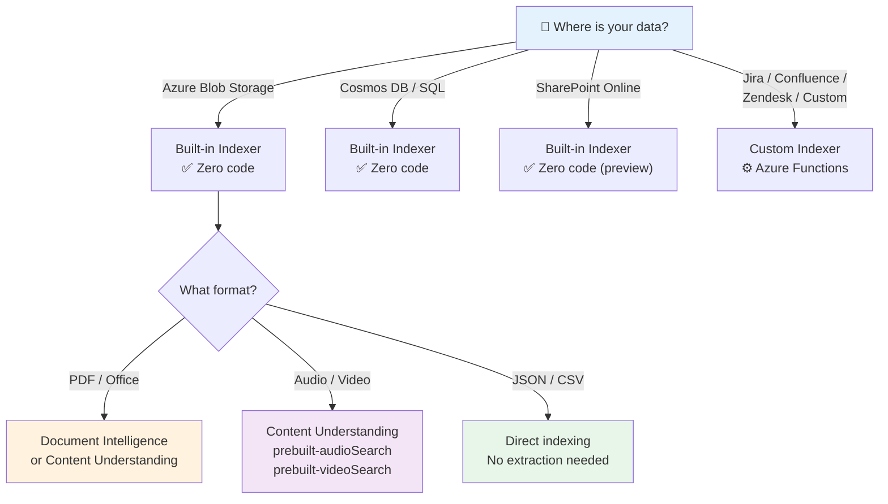
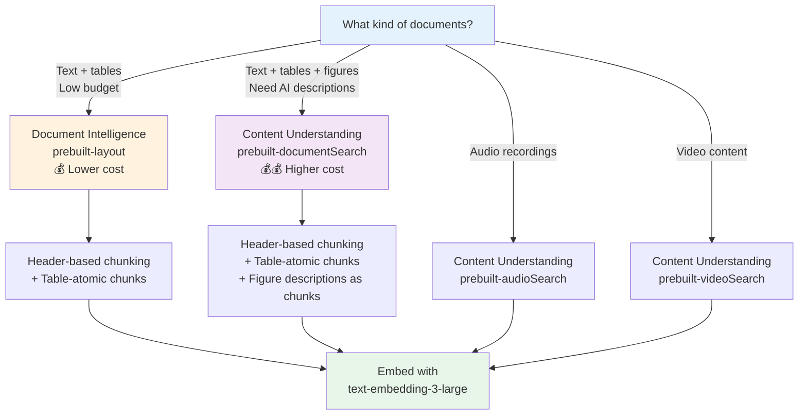
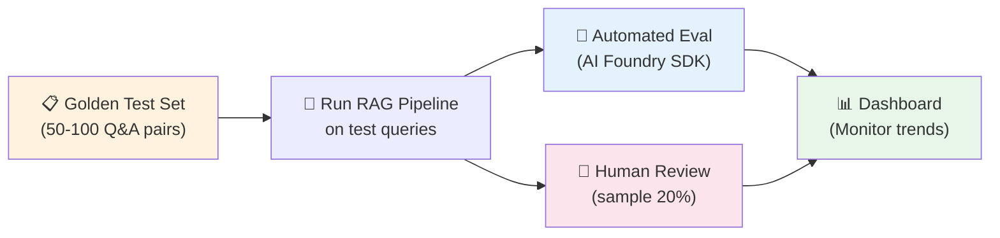

# Module: RAG System Design Considerations

## 📍 Where We Are in the Pipeline


**You've built a complete RAG pipeline.** Now step back and ask: *How would I design one from scratch for a real production scenario?*

---

## Objective

Learn to ask the right questions **before writing a single line of code**. This module is a design checklist — use it as an architect's guide when planning a RAG system for your organization.

## Learning Outcomes

By the end of this module, participants will be able to:
- Identify the key design decisions that shape a RAG system
- Map each decision to the relevant Azure service or configuration
- Avoid common architectural mistakes that are expensive to fix later
- Create a design document for a new RAG project

## Key Message

> Building a RAG system is 20% code and 80% design decisions. The questions you ask **before** building determine whether the system succeeds or fails in production.

---

## 🏗️ The Design Checklist

Before you build a RAG system, go through each section below. For every question, we map the answer to a concrete Azure decision.

---

## 0. 🎯 Business Goal & Use Case Definition

Before any technical decisions, clarify what the RAG system is actually for. Different use cases demand fundamentally different architectures.

| Question | Why It Matters | Azure Impact |
|----------|---------------|--------------|
| What exact **business problem** is the RAG system solving? (fact lookup, summarization, comparison, decision support) | Architecture depends on the job to be done. Fact lookup isn't designed like summarization, comparison, or high-risk guidance | Fact lookup → hybrid retrieval + GPT-4.1-mini. Summarization → larger context windows + GPT-4.1. Comparison → GraphRAG or multi-step orchestration. High-risk → Azure AI Foundry evaluations + human-in-the-loop |
| What does a **successful answer** look like? (short with citations, comparison table, structured JSON, executive summary, exact quote) | "Good answer" is not universal. The output contract changes retrieval granularity, prompt design, metadata needs, and evaluation criteria | Exact quotes → precise chunk boundaries + citation spans. Structured JSON → schema-constrained generation in Azure OpenAI. Comparison tables → multi-document retrieval. Parent-child chunking for both precision and readable output |
| Who are the **user personas**, and how do they differ? (HR, engineers, executives, analysts) | Different users need different retrieval depth, terminology handling, answer format, and latency expectations | Persona-specific system prompts and orchestration paths. Search profile tuning in Azure AI Search. Synonym maps for expert/internal vocabulary |
| What kinds of **questions** will users actually ask? (factual, troubleshooting, comparison, temporal, unanswerable) | Question patterns drive retrieval strategy more than document count alone | Factual → hybrid search. Troubleshooting → procedure-aware chunking. Comparison → multi-document retrieval. Temporal → version metadata + recency handling. Evaluation set must include each major query type |

### Use Case → Architecture Map

| Use Case | Retrieval Style | Model | Special Requirements |
|----------|----------------|-------|---------------------|
| Internal FAQ / policy lookup | Hybrid search + semantic ranker | GPT-4.1-mini | Synonym maps for internal jargon |
| Technical support assistant | Hybrid search + content type filtering | GPT-4.1-mini or GPT-4.1 | Procedure-aware chunking |
| Contract / legal review | Precise chunk retrieval + citations | GPT-4.1 | Clause-level chunking, exact span citations, human review |
| Cross-document comparison | GraphRAG or multi-document retrieval | GPT-4.1 | Entity extraction, structured aggregation |
| Executive knowledge assistant | Section-level retrieval + summarization | GPT-4.1 | Larger context windows, concise output prompts |
| High-risk decision support (medical, financial) | Hybrid + strict grounding | GPT-4.1 | Confidence controls, abstention, audit logs, human-in-the-loop |

---

## 1. 📊 Scale & Volume

These numbers drive your entire architecture — from index design to pricing.

| Question | Why It Matters | Azure Impact |
|----------|---------------|--------------|
| How many **concurrent users**? (100 vs 100K) | Determines search tier and replicas | Azure AI Search: Basic (small) vs Standard S2/S3 (large), replica count |
| How many **documents** to ingest? (10K vs 10M) | Affects index size, partition count, ingestion pipeline design | Azure AI Search: partition count, storage limits per tier |
| Average **document size**? (2-page memo vs 500-page contract) | Large docs need smarter chunking, more tokens per doc | Content Understanding for long docs, chunking strategy (Module 4) |
| **Ingestion frequency**? (one-time bulk vs continuous) | Real-time needs event-driven pipeline | Azure Functions + Event Grid for continuous; batch script for one-time |
| **Query rate**? (10/min vs 10K/sec) | High QPS needs caching, replicas, throttle handling | Azure AI Search replicas, Azure API Management for throttling |

### Understanding Azure AI Search Capacity: Replicas, Partitions & Search Units

Before choosing a tier, you need to understand how Azure AI Search capacity works. These three concepts determine your service's performance, storage, and cost:

```
┌─────────────────────────────────────────────────────────────────────────┐
│                    AZURE AI SEARCH CAPACITY MODEL                       │
│                                                                         │
│   Your search service is made up of SEARCH UNITS (SU).                 │
│   Each search unit is a combination of replicas and partitions.        │
│                                                                         │
│   Formula:   Replicas  ×  Partitions  =  Search Units (billing unit)   │
│                                                                         │
│   Example:   3 replicas × 2 partitions = 6 SU                         │
│              (you pay for 6 search units)                               │
│                                                                         │
│   Maximum:   36 SU per service (Standard tiers)                        │
└─────────────────────────────────────────────────────────────────────────┘
```

#### What is a Replica?

A **replica** is a copy of your entire search index running on a dedicated instance.

Think of it like **cashiers in a supermarket**: each cashier (replica) can serve a customer (query) independently. More cashiers = more customers served simultaneously = faster service.

```
                        ┌─────────────┐
           Query A ───→ │  Replica 1  │ ──→ Results
                        │ (full copy  │
           Query B ───→ │  of index)  │ ──→ Results     ← 1 replica = all queries
                        └─────────────┘        go to the same instance
           Query C ───→     (queued)


                        ┌─────────────┐
           Query A ───→ │  Replica 1  │ ──→ Results
                        └─────────────┘
                        ┌─────────────┐
           Query B ───→ │  Replica 2  │ ──→ Results     ← 3 replicas = queries
                        └─────────────┘        distributed across copies
                        ┌─────────────┐
           Query C ───→ │  Replica 3  │ ──→ Results
                        └─────────────┘
```

**When to add replicas:**
- High query volume (many concurrent users)
- Need for high availability (SLA requires 2+ replicas for read, 3+ for read/write)
- Slow query response times under load

#### What is a Partition?

A **partition** is a slice of your index storage. It determines how much data your service can hold.

Think of it like **shelves in a warehouse**: each shelf (partition) holds a portion of your inventory (index data). More shelves = more storage capacity. When you search, all shelves are searched in parallel.

```
   1 Partition (all data in one place):        3 Partitions (data split across three):

   ┌───────────────────────┐                   ┌─────────┐ ┌─────────┐ ┌─────────┐
   │  Docs 1-100,000       │                   │ Docs    │ │ Docs    │ │ Docs    │
   │  (entire index)       │                   │ 1-33K   │ │ 34K-66K │ │ 67K-100K│
   │                       │                   │         │ │         │ │         │
   │  Storage: 25 GB       │                   │  ~8 GB  │ │  ~8 GB  │ │  ~8 GB  │
   └───────────────────────┘                   └─────────┘ └─────────┘ └─────────┘
                                                    ↓           ↓           ↓
                                               searched in parallel → merged results
```

**When to add partitions:**
- Your index is too large for the current storage
- Indexing (write) operations are slow
- You need more I/O throughput for large indexes

#### What is a Search Unit (SU)?

A **search unit** is the billing unit. It's simply `replicas × partitions`.

Every service starts with **1 SU** (1 replica × 1 partition). You scale by adding replicas, partitions, or both.

```
   Example configurations and their search units:

   ┌────────────┬─────────────┬────────────┬──────────────────────────────┐
   │  Replicas  │ Partitions  │    SU      │  What you get                │
   ├────────────┼─────────────┼────────────┼──────────────────────────────┤
   │     1      │      1      │    1 SU    │  Minimum (dev/test)          │
   │     2      │      1      │    2 SU    │  Query HA (SLA for reads)    │
   │     3      │      1      │    3 SU    │  Full HA (SLA for R+W)       │
   │     3      │      2      │    6 SU    │  HA + double storage         │
   │     3      │      3      │    9 SU    │  HA + triple storage         │
   │     6      │      6      │   36 SU    │  Maximum (Standard tier)     │
   └────────────┴─────────────┴────────────┴──────────────────────────────┘

   💰 Cost = SU count × per-unit price of your tier
      (e.g., S1 at ~$250/SU/month → 6 SU = ~$1,500/month)
```

#### Tier Selection Guide

| Tier | Storage per Partition | Max Partitions | Max Replicas | Max SU | Best For |
|------|----------------------|---------------|-------------|--------|----------|
| **Free** | 50 MB | 1 | 1 | 1 | Learning, prototyping |
| **Basic** | 2 GB | 3 | 3 | 9 | Small workloads, dev/test |
| **S1** | 25 GB | 12 | 12 | 36 | Most production workloads |
| **S2** | 100 GB | 12 | 12 | 36 | Large indexes, high throughput |
| **S3** | 200 GB | 12 | 12 | 36 | Very large indexes |
| **L1** | 1 TB | 12 | 12 | 36 | Huge storage, fewer queries |
| **L2** | 2 TB | 12 | 12 | 36 | Maximum storage |

> **SLA Requirements:**
> - **2+ replicas** → SLA for query (read) operations
> - **3+ replicas** → SLA for query AND indexing (read/write) operations
> - Partitions do **not** affect SLA — only replicas matter for availability

#### Quick Decision: Replicas vs Partitions

```
   "My queries are slow"
        └── Is your index large (>50% of partition)? 
             ├── YES → Add PARTITIONS (more I/O for large data)
             └── NO  → Add REPLICAS  (more capacity for concurrent queries)

   "I'm getting HTTP 429 (Too many requests)"  
        └── Add REPLICAS (more query throughput)

   "I'm getting HTTP 503 (Service unavailable)"
        └── Add REPLICAS (service overloaded)

   "Index is running out of storage"
        └── Add PARTITIONS (more storage) or upgrade TIER

   "Indexing is too slow"
        └── Add PARTITIONS (more write I/O)
```

> 📖 **Official docs**: [Estimate and manage capacity of a search service](https://learn.microsoft.com/en-us/azure/search/search-capacity-planning)

### Design Patterns by Scale

```
┌─────────────────────────────────────────────────────────────────┐
│                    Small Scale (<1K docs, <100 users)            │
│  Azure AI Search Basic │ Single replica │ GPT-4.1-mini          │
│  Simple pipeline       │ No caching     │ Direct SDK calls      │
├─────────────────────────────────────────────────────────────────┤
│                    Medium Scale (1K-100K docs, <10K users)       │
│  Azure AI Search Standard S1/S2 │ 2-3 replicas                 │
│  Content Understanding pipeline │ Async ingestion               │
│  Semantic ranker enabled        │ Response caching              │
├─────────────────────────────────────────────────────────────────┤
│                    Large Scale (100K+ docs, 10K+ users)         │
│  Azure AI Search Standard S3 │ Multiple replicas + partitions   │
│  Azure Functions for ingestion │ Azure Redis for caching        │
│  API Management for throttling │ Multiple indexes (sharding)    │
│  GPT-4.1 for complex │ GPT-4.1-mini for simple (cost router)   │
└─────────────────────────────────────────────────────────────────┘
```

### Multi-Tenancy: Serving Multiple Customers from One RAG System

If you're building a SaaS product or serving multiple departments/organizations, you must decide how to isolate tenant data in Azure AI Search. This decision affects cost, security, performance, and operational complexity.

#### The Core Question

> Will multiple tenants (customers, departments, business units) share the same RAG system?

If yes, you need a multi-tenancy strategy. There are three patterns:

#### Pattern 1: Index-per-Tenant (Shared Service)

Each tenant gets their own index inside a single Azure AI Search service.

```
┌─────────────────────────────────────────────────────────────────┐
│                   Azure AI Search Service (S1)                  │
│                                                                 │
│   ┌──────────────┐  ┌──────────────┐  ┌──────────────┐         │
│   │  Index:       │  │  Index:       │  │  Index:       │        │
│   │  tenant-A     │  │  tenant-B     │  │  tenant-C     │        │
│   │  (5K docs)    │  │  (2K docs)    │  │  (10K docs)   │        │
│   └──────────────┘  └──────────────┘  └──────────────┘         │
│                                                                 │
│   Shared replicas, partitions, and billing                      │
└─────────────────────────────────────────────────────────────────┘
```

| Pros | Cons |
|------|------|
| Cost-efficient (share infrastructure) | Noisy neighbor risk (one tenant's heavy queries affect others) |
| Easy to manage (single service) | Index count limits per tier (e.g., Basic: 15, S1: 50) |
| Good for many small tenants | Can't scale tenants independently |
| Variable cost model | Moving indexes between services requires data copy |

**Best for**: Many small tenants with similar workloads, startup SaaS products.

#### Pattern 2: Service-per-Tenant (Dedicated)

Each tenant gets their own Azure AI Search service.

```
┌──────────────────┐  ┌──────────────────┐  ┌──────────────────┐
│ Search Service A  │  │ Search Service B  │  │ Search Service C  │
│ (Tenant A)        │  │ (Tenant B)        │  │ (Tenant C)        │
│                   │  │                   │  │                   │
│ Own replicas      │  │ Own replicas      │  │ Own replicas      │
│ Own partitions    │  │ Own partitions    │  │ Own partitions    │
│ Own billing       │  │ Own billing       │  │ Own billing       │
└──────────────────┘  └──────────────────┘  └──────────────────┘
```

| Pros | Cons |
|------|------|
| Full isolation (data + performance) | Higher cost (paying per service) |
| Independent scaling per tenant | More services to manage |
| Meets strict compliance requirements | No resource sharing |
| Easy regional deployment per tenant | Can't upgrade tier in-place |

**Best for**: Enterprise customers with large workloads, strict compliance requirements, or global distribution.

#### Pattern 3: Filter-per-Tenant (Single Index)

All tenants share a single index, with a `tenant_id` field used to filter results at query time.

```
┌─────────────────────────────────────────────────────────────────┐
│                   Azure AI Search Service (S1)                  │
│                                                                 │
│   ┌─────────────────────────────────────────────────────┐       │
│   │  Index: shared-rag-index                             │      │
│   │                                                       │      │
│   │  doc_1: { tenant_id: "A", content: "..." }           │      │
│   │  doc_2: { tenant_id: "B", content: "..." }           │      │
│   │  doc_3: { tenant_id: "A", content: "..." }           │      │
│   │  doc_4: { tenant_id: "C", content: "..." }           │      │
│   │                                                       │      │
│   │  Query: search("question", filter="tenant_id eq 'A'")│      │
│   └─────────────────────────────────────────────────────┘       │
└─────────────────────────────────────────────────────────────────┘
```

| Pros | Cons |
|------|------|
| Simplest architecture | Relevance scores computed across ALL tenants (not tenant-specific) |
| Lowest cost (single index) | Risk of data leakage if filter is missing |
| Easy to implement | Large index = slower queries |
| No index count concerns | All tenants share the same schema |

**Best for**: Internal multi-department use, low-risk scenarios where relevance scoring across tenants is acceptable.

> **Warning**: With the filter approach, search relevance (TF-IDF, BM25) is computed across **all** tenants' data, not per-tenant. A term that's rare for Tenant A but common across all tenants won't score as high. For most RAG use cases this is acceptable, but for precision-critical search it may not be.

#### Pattern 4: Hybrid (Recommended for SaaS)

Combine patterns based on tenant size:

```
   ┌──────────────────────────────────────────────────────────┐
   │                    Tenant Router                          │
   │                                                           │
   │   Enterprise (Tenant A, B)  →  Dedicated Service each    │
   │   Medium (Tenant C, D, E)   →  Shared Service, own index │
   │   Small (Tenant F-Z)        →  Shared index + filter     │
   └──────────────────────────────────────────────────────────┘
```

#### Multi-Tenancy Decision Matrix

| Factor | Filter-per-Tenant | Index-per-Tenant | Service-per-Tenant |
|--------|-------------------|------------------|--------------------|
| **Isolation** | Low (filter only) | Medium (separate index) | High (separate service) |
| **Cost** | Lowest | Medium | Highest |
| **Max tenants** | Unlimited | Limited by tier (15-200) | Limited by budget |
| **Relevance accuracy** | Shared statistics | Per-tenant statistics | Per-tenant statistics |
| **Compliance** | Shared service | Shared service | Full isolation |
| **Scaling** | Uniform | Uniform | Per-tenant |
| **Operational complexity** | Low | Medium | High |
| **S3 HD tier** | N/A | Ideal (up to 1000 indexes) | N/A |

> **S3 HD (High Density)**: A special tier designed specifically for multi-tenant scenarios. It trades partition scaling for higher index count — up to **1000 indexes** per service. Ideal for the index-per-tenant pattern with many small tenants (each index ~50-80 GB max).

> 📖 **Official docs**: [Design patterns for multitenant SaaS applications](https://learn.microsoft.com/en-us/azure/search/search-modeling-multitenant-saas-applications)

---

## 2. 📁 Data Sources & Formats

Where your data lives and what it looks like determines your ingestion pipeline.

| Question | Why It Matters | Azure Impact |
|----------|---------------|--------------|
| Where does the data live? (SharePoint, Blob Storage, databases) | Determines connectors and authentication | Azure AI Search **indexers** have built-in connectors for Blob Storage, Cosmos DB, SQL, SharePoint |
| What **file types**? (PDF, Word, Excel, PowerPoint, images, audio, video) | Different extractors for different formats | **Document Intelligence** for PDF/Office, **Content Understanding** for multimodal (audio, video, images) |
| Structured or unstructured? | Structured data may not need chunking | SQL/Cosmos DB indexers for structured; DI/CU pipeline for unstructured |
| Do we need **custom connectors**? | Some systems (Jira, Confluence, Zendesk) need custom crawlers | Azure Functions as custom indexers, or use Azure AI Search **custom skills** |
| Are there **tables, charts, diagrams** in the documents? | Naive text extraction destroys tabular/visual data | Content Understanding `prebuilt-documentSearch` for AI descriptions; DI `prebuilt-layout` for bounding boxes |

### Azure Connector Decision Map



### Source Authority & Data Quality

Not all data should be treated equally. Before indexing, clarify trust levels and data quality.

| Question | Why It Matters | Azure Impact |
|----------|---------------|--------------|
| Which sources are **authoritative**, and which are only supporting context? | Retrieval and ranking should prefer authoritative sources. Conflicting answers must be resolved using source authority rules | Add `source_type`, `authority_level`, `approved_status` metadata to index. Use scoring profiles or reranking in Azure AI Search. Instruct prompt to prioritize approved sources |
| Is the answer expected from **unstructured documents, structured records, or both**? | Pure vector search is not always the right answer — structured records may need SQL/Cosmos retrieval | Azure AI Search for unstructured content. SQL/Cosmos DB retrieval path for structured data. Separate indexes or `content_type` filtering. Agent/tool orchestration for mixed evidence |
| How much **duplication, contradiction, or stale content** exists in the corpus? | Retrieval quality degrades badly with redundant or conflicting content | Add `version`, `effective_date`, `is_latest` fields. Filter outdated docs at query time. Ingestion pipeline logic to collapse duplicates before indexing |

---

## 3. 🔒 Security & Authorization

Security decisions are **impossible to retrofit**. Get them right from day one.

| Question | Why It Matters | Azure Impact |
|----------|---------------|--------------|
| Are documents restricted to **specific groups/roles**? | Need per-document access control | Azure AI Search **security filters** — store `allowed_groups` in each document's index, filter at query time |
| Do we need **document-level security** (row-level)? | Users should only see documents they're authorized for | Add `group_ids` field to index; filter with `$filter=group_ids/any(g: g eq '{user_group}')` at query time |
| Is there **PII/PHI** in the documents? | HIPAA, GDPR, data residency requirements | Azure AI Search with **customer-managed keys (CMK)**, data residency in specific Azure regions, consider **Azure Confidential Computing** |
| Can the LLM see **all documents** or only authorized ones? | Prevents data leakage through the LLM | Always filter **before** sending to LLM — never rely on the LLM to enforce access control |
| Do we need **audit logging**? | Track who asked what, which docs were retrieved | Azure Monitor + Log Analytics; log query, retrieved doc IDs, and response |
| **Authentication method**? | Keys vs managed identity | Always prefer **Microsoft Entra ID (DefaultAzureCredential)** over API keys in production |

### Security Architecture Pattern

```
┌─────────────────────────────────────────────────────────────────┐
│                     User Query Flow with Security               │
│                                                                 │
│  1. User authenticates via Microsoft Entra ID                   │
│  2. App retrieves user's group memberships (Microsoft Graph)    │
│  3. Query Azure AI Search WITH security filter:                 │
│     search.filter = "group_ids/any(g: g eq 'finance-team')"    │
│  4. Only authorized documents returned                          │
│  5. Send filtered docs to Azure OpenAI                          │
│  6. Log: user_id, query, doc_ids, timestamp → Log Analytics    │
│                                                                 │
│  ⚠️  NEVER send all documents to LLM and ask it to filter!     │
└─────────────────────────────────────────────────────────────────┘
```

### Retrieved Content Trust

RAG systems are vulnerable not only through user prompts, but also through the documents they retrieve.

| Question | Why It Matters | Azure Impact |
|----------|---------------|--------------|
| Can retrieved content contain **prompt injection**, hidden instructions, or malicious text? | Untrusted corpora require content sanitization, prompt shielding, and stricter orchestration. Agentic RAG with tools becomes riskier if retrieved content can influence tool use | Content filtering and instruction-isolation patterns. Prompt templates that treat retrieved text as **data**, not instructions. Azure AI Content Safety for sanitization pipeline. Evaluation scenarios for prompt injection resistance |
| Is tenant isolation only **logical**, or must it also be **operational / regulatory**? | Multi-tenancy is not only a cost question — it is often a compliance, performance, and operational isolation question | Logical filtering → shared index with tenant filter. Regulatory → index-per-tenant or service-per-tenant. S3 HD for many small tenant indexes. Define noisy neighbor risk tolerance |

---

## 4. ⏱️ Response Time & User Experience

Query latency determines whether users love or abandon your system.

| Question | Why It Matters | Azure Impact |
|----------|---------------|--------------|
| **Interactive** (<3 sec) or **batch** (minutes OK)? | Drives model choice, caching, and search tier | Interactive: GPT-4.1-mini + caching + semantic ranker. Batch: GPT-4.1 for max quality |
| Is **streaming** acceptable? | Shows partial answers while generating | Azure OpenAI supports streaming responses — reduces perceived latency significantly |
| Should it **cite sources**? | Users need to verify answers | Store `document_name`, `page_number`, `section_header` in index — return as metadata with each chunk |
| Are "I don't know" answers OK? | Some domains require always-attempt | System prompt design: instruct to say "I don't have enough information" vs always generating |
| Do we need **conversation memory**? | Multi-turn vs single Q&A | Azure AI Search **agentic retrieval** (knowledge bases) for built-in conversation; or manage chat history in app layer |

### Latency Budget Breakdown

```
Typical interactive RAG query (~2-4 seconds total):

┌──────────────────────────────────────────────────────────┐
│ Embedding query text          │  ~100ms                  │
│ Azure AI Search (hybrid)      │  ~200-500ms              │
│ Semantic ranker (reranking)   │  ~200-400ms              │
│ LLM generation (GPT-4.1-mini)│  ~1-2s (streaming)       │
│ Network overhead              │  ~100ms                  │
├──────────────────────────────────────────────────────────┤
│ TOTAL                         │  ~1.5-3.5s               │
└──────────────────────────────────────────────────────────┘

Tips to reduce latency:
  • Use GPT-4.1-mini instead of GPT-4.1 for 2-3x faster responses
  • Enable streaming to show partial answers immediately
  • Cache frequent queries with Azure Redis Cache
  • Use semantic ranker only when quality justifies the extra ~300ms
```

### Answer Contract & Citation Design

The format and behavior of the answer is a design decision, not a prompt afterthought.

| Question | Why It Matters | Azure Impact |
|----------|---------------|--------------|
| What is the required **citation granularity**? (document-level, section, page, exact span) | Citation requirements directly affect chunking, metadata, and UI design. Fine-grained citations increase ingestion complexity but improve user trust | Store `page_number`, `section_title`, `source_url`, anchor IDs. Preserve document structure during extraction. UI must render citation metadata clearly |
| Is this **single-shot Q&A**, multi-turn chat, or **persistent user memory** across sessions? | Conversation state changes orchestration, storage, privacy, and retrieval behavior | Stateless → simplest, safest. Multi-turn → session state + prior-turn grounding. Persistent memory → privacy governance + user memory lifecycle. Azure AI Search agentic retrieval for built-in conversation support |
| Can we **cache** anything safely, and at what layer? (retrieval results, final answers, nothing) | Caching improves latency and cost but can create stale or cross-user leakage risks | Azure Redis Cache. Cache key must include tenant/security scope. TTL strategy based on source freshness. Per-tenant boundaries may be required |

---

## 5. 🗣️ Domain Language & Terminology

Every organization has its own language. Your RAG system must speak it.

| Question | Why It Matters | Azure Impact |
|----------|---------------|--------------|
| Does the org have **internal jargon**, acronyms, product names? | Search misses if terms don't match | Azure AI Search **synonym maps** — map "K8s" → "Kubernetes", "SLA" → "service level agreement" |
| Do we need a **custom glossary**? | Improves both search precision and LLM answers | Add synonyms to the search index + include glossary in the system prompt |
| Should we **fine-tune embeddings**? | Off-the-shelf embeddings may not capture domain-specific semantics | Usually NOT needed — `text-embedding-3-large` works well for most domains. Fine-tuning is expensive and rarely worth it |
| Are there **multiple languages**? | Need multilingual search and generation | Azure AI Search supports multilingual analyzers; Azure OpenAI handles 100+ languages natively; Content Understanding handles multilingual OCR |
| Is there **RTL content** (Hebrew, Arabic)? | Affects reading order, chunking, and UI | Document Intelligence preserves reading order; ensure UTF-8 throughout; test chunking with mixed LTR/RTL |

### Synonym Map Example (Azure AI Search)

```json
{
  "name": "domain-synonyms",
  "format": "solr",
  "synonyms": "
    K8s, Kubernetes, k8s\n
    AKS, Azure Kubernetes Service\n
    SLA, service level agreement\n
    DI, Document Intelligence, doc intelligence\n
    CU, Content Understanding\n
    LLM, large language model\n
  "
}
```

---

## 6. ✅ Quality, Validation & Risk

The cost of a wrong answer varies enormously by domain.

| Question | Why It Matters | Azure Impact |
|----------|---------------|--------------|
| Who are the **users**? (doctors, lawyers, engineers, HR) | Different accuracy and liability requirements | Determines whether you need human-in-the-loop, confidence thresholds, or disclaimers |
| What's the **cost of a wrong answer**? | Medical/legal advice vs internal wiki lookup — very different risk | High-risk: add confidence scoring, source citations, human review. Low-risk: direct LLM response OK |
| Is there a **domain expert** to evaluate quality? | Human eval is still the gold standard | Set up evaluation pipeline: sample queries → expert review → score |
| How do we **measure quality**? | Need metrics to improve over time | Automated: relevance scoring, groundedness checks. Human: thumbs up/down, expert review panels |
| Do we need **human-in-the-loop**? | Some answers must be reviewed before delivery | Route high-stakes queries (detected by classifier) to human review queue |
| Can users **flag bad answers**? | Feedback drives improvement | Store user feedback → analyze patterns → adjust prompts, re-index, or add to evaluation set |

### Conflict Handling & Abstention Design

How the system behaves when evidence is weak, conflicting, or missing is a design decision — not just a prompt detail.

| Question | Why It Matters | Azure Impact |
|----------|---------------|--------------|
| What should the system do when evidence is **weak, conflicting, or missing**? (say "I don't know", best-effort with warning, escalate to human) | Abstention-first systems need confidence thresholds. Best-effort systems need disclaimers. High-risk systems may need escalation paths | Prompt instructions for abstention. Confidence heuristics. Human review workflow. Evaluation set must include unanswerable and conflicting queries |
| How should the system handle **conflicting sources**? (latest wins, authoritative source wins, show both, require human review) | Conflict is common in enterprise content and must be resolved intentionally, not left to LLM discretion | Metadata for `version`, `approved_status`, `effective_date`, `authority_level`. Ranking and filtering rules. Evaluation scenarios for contradiction handling |

### 📏 How to Measure RAG Success — The Complete Guide

RAG evaluation is **not** a single metric. A RAG system has two stages — **retrieval** and **generation** — and each can fail independently. You must measure both.

```
┌─────────────────────────────────────────────────────────────────────────┐
│                    WHERE THINGS CAN GO WRONG                            │
│                                                                         │
│   User Question                                                         │
│        │                                                                │
│        ▼                                                                │
│   ┌─────────────┐     ┌─────────────┐     ┌─────────────┐             │
│   │  Retrieval  │ ──→ │   Context   │ ──→ │ Generation  │             │
│   │  (Search)   │     │  (Chunks)   │     │   (LLM)     │             │
│   └─────────────┘     └─────────────┘     └─────────────┘             │
│        │                    │                    │                      │
│   Can fail:            Can fail:            Can fail:                   │
│   • Wrong chunks       • Too few chunks     • Hallucination            │
│   • Missing chunks     • Too many (noise)   • Partial answer           │
│   • Irrelevant         • Wrong content      • Wrong interpretation     │
│     results              type                                           │
│                                                                         │
│   You MUST measure each stage separately to know where to fix!         │
└─────────────────────────────────────────────────────────────────────────┘
```

### Stage 1: Retrieval Metrics — "Did we find the right chunks?"

These metrics measure whether Azure AI Search returned the right documents **before** the LLM ever sees them. Think of it like this: if the search brings back garbage, even the smartest LLM will give a garbage answer.

#### Setup for All Examples Below

Imagine our index has **1,000 chunks** from metro station documents. For the question **"What is the fare for a single metro ride?"**, there are exactly **3 chunks** in the entire index that contain relevant fare information:

```
   Total chunks in index: 1,000
   Relevant chunks (ground truth): 3 chunks contain fare info
     • Chunk #47:  "A single ride costs 5.90 ILS..."
     • Chunk #203: "Monthly pass costs 198 ILS. Single ride: 5.90 ILS..."
     • Chunk #891: "Student reduced fare is 2.95 ILS for a single ride..."

   We ask Azure AI Search to return top 5 results (K=5).
   Here's what came back:
```

```
   Azure AI Search returned these 5 chunks (ranked by relevance score):

   ┌──────┬──────────────────────────────────────────────┬───────────┐
   │ Rank │ Chunk Content                                │ Relevant? │
   ├──────┼──────────────────────────────────────────────┼───────────┤
   │  #1  │ "Metro station has 3 entrances: North,      │    ❌     │
   │      │  South, and West..."                         │           │
   │  #2  │ "Single ride costs 5.90 ILS. Rav-Kav card   │    ✅     │
   │      │  required for all rides..."    (= Chunk #47) │           │
   │  #3  │ "Train frequency is every 6 minutes during  │    ❌     │
   │      │  rush hour..."                               │           │
   │  #4  │ "Monthly pass costs 198 ILS. Single ride:   │    ✅     │
   │      │  5.90 ILS..." (= Chunk #203)                 │           │
   │  #5  │ "Station ventilation system uses 3 fans..." │    ❌     │
   └──────┴──────────────────────────────────────────────┴───────────┘

   We found 2 relevant chunks out of 5 returned.
   But we MISSED chunk #891 (student fare) — it wasn't in the top 5.
```

Now let's calculate each metric:

---

#### Precision@K — "How much noise is in my results?"

**Plain English**: Out of the K chunks you asked for, how many were actually useful?

**Analogy**: You ordered 5 dishes at a restaurant. Only 2 were what you actually wanted. The rest were wrong orders. That's 40% precision — the kitchen is sloppy.

```
   Formula:  Precision@K = (relevant chunks in top K) / K

   Precision@5 = 2 relevant / 5 returned = 0.40 = 40%
                 ↑                          ↑
                 chunks #2 and #4           out of 5 total results

   Precision@3 = 1 relevant / 3 returned = 0.33 = 33%
                 ↑                          ↑
                 only chunk #2 in top 3     out of 3 total results
```

```
   What do different Precision@5 scores feel like?

   100%  ★★★★★  All 5 chunks are relevant → LLM gets perfect context
    80%  ★★★★☆  4 of 5 relevant → Great, minimal noise
    60%  ★★★☆☆  3 of 5 relevant → OK, some noise but workable
    40%  ★★☆☆☆  2 of 5 relevant → Too much noise, LLM may get confused ← WE ARE HERE
    20%  ★☆☆☆☆  1 of 5 relevant → Mostly garbage, answer quality degrades
     0%  ☆☆☆☆☆  0 of 5 relevant → Complete miss, LLM will hallucinate
```

**Why it matters for RAG**: Every irrelevant chunk you send to the LLM is wasted tokens AND potential confusion. The LLM might pick up on irrelevant information and include it in the answer.

---

#### Recall — "Did we find everything?"

**Plain English**: Out of ALL the relevant chunks that exist in the index, how many did we actually find?

**Analogy**: There are 3 puzzle pieces you need. You found 2 of them. You're missing one. That's 67% recall — your answer might be incomplete.

```
   Formula:  Recall = (relevant chunks found) / (total relevant chunks that exist)

   Recall = 2 found / 3 exist = 0.67 = 67%
            ↑                   ↑
            chunks #47 and #203  chunk #891 (student fare) was MISSED

   We missed the student fare chunk! If the user asked specifically about
   student fares, our answer would be incomplete.
```

```
   What do different Recall scores feel like?

   100%  Found ALL relevant chunks → Complete answer possible
    67%  Found 2 of 3 → Answer is partially correct but missing info ← WE ARE HERE
    33%  Found 1 of 3 → Answer is mostly incomplete
     0%  Found nothing → LLM has no context, will hallucinate
```

**Why it matters for RAG**: Low recall means the LLM doesn't have all the information it needs. Even if it generates a good answer from what it has, the answer will be **incomplete**. The user won't know something is missing.

**Precision vs Recall — The Tradeoff**:
```
   If you retrieve MORE chunks (K=10 instead of K=5):
     • Recall goes UP    (more chance to find all 3 relevant chunks)
     • Precision goes DOWN (more noise mixed in)

   If you retrieve FEWER chunks (K=3 instead of K=5):
     • Precision goes UP   (less noise)
     • Recall goes DOWN    (might miss relevant chunks)

   The sweet spot: Use hybrid search + semantic ranker to get
   high precision AND high recall. Start with K=5, tune from there.
```

---

#### MRR (Mean Reciprocal Rank) — "How quickly did we find the answer?"

**Plain English**: At what position did the **first** relevant chunk appear? Higher is better.

**Analogy**: You're searching for your keys. If they're in the first drawer you open, that's great (MRR=1.0). If you had to open 5 drawers before finding them, that's bad (MRR=0.2). The name "reciprocal rank" just means 1 divided by the position.

```
   Formula:  MRR = 1 / (position of first relevant chunk)

   In our example, the first relevant chunk appeared at position #2:

   Rank #1: "Metro station has 3 entrances..."  ← ❌ not relevant
   Rank #2: "Single ride costs 5.90 ILS..."     ← ✅ FIRST relevant chunk!

   MRR = 1/2 = 0.50

   If the relevant chunk had been at rank #1:  MRR = 1/1 = 1.00 (perfect!)
   If it had been at rank #3:                  MRR = 1/3 = 0.33
   If it had been at rank #5:                  MRR = 1/5 = 0.20 (bad!)
```

```
   What do different MRR scores mean?

   1.00  First result is relevant → Perfect ranking
   0.50  Relevant result at #2   → Good but not ideal        ← WE ARE HERE
   0.33  Relevant result at #3   → User/LLM has to dig
   0.20  Relevant result at #5   → Search ranking is poor
```

**Why it matters for RAG**: In many RAG systems, the LLM pays more attention to the first chunks (they appear first in the prompt). If the relevant chunk is buried at position #4 or #5, the LLM might rely more on the irrelevant chunks that came first.

**"Mean"** in MRR means you calculate this for **many queries** and average the scores. One query might get MRR=1.0, another MRR=0.33. The average across all test queries is your MRR score.

---

#### Hit Rate — "Did we find ANYTHING relevant?"

**Plain English**: For this query, did at least one relevant chunk appear in the results? Yes or no.

```
   Formula:  Hit Rate = 1 if any relevant chunk found, 0 if none

   In our example: We found chunks #47 and #203 → Hit = 1 (yes)

   Over many queries:
   Hit Rate = (queries where we found ≥1 relevant chunk) / (total queries)

   Example with 10 test queries:
   Query 1: Found relevant chunk → Hit     ┐
   Query 2: Found relevant chunk → Hit     │
   Query 3: Found NOTHING relevant → Miss  │   Hit Rate = 8/10 = 80%
   Query 4: Found relevant chunk → Hit     │
   Query 5: Found relevant chunk → Hit     │   ⚠️ Two complete misses!
   Query 6: Found NOTHING relevant → Miss  │   Need to investigate why.
   Query 7: Found relevant chunk → Hit     │
   Query 8: Found relevant chunk → Hit     │
   Query 9: Found relevant chunk → Hit     │
   Query 10: Found relevant chunk → Hit    ┘
```

**Why it matters for RAG**: A Hit Rate below 95% means your system regularly returns **zero** relevant context for some queries. The LLM will either hallucinate or say "I don't know" — both are bad user experiences. Investigate every miss.

---

#### Summary: All Retrieval Metrics for Our Example

```
   Question: "What is the fare for a single metro ride?"
   Relevant chunks in index: 3 (chunks #47, #203, #891)
   Returned by search (K=5): chunks ranked #1-#5
   Relevant in results: 2 (chunks #47 at rank 2, #203 at rank 4)

   ┌────────────────┬────────┬──────────────────────────────────────┐
   │ Metric         │ Score  │ Interpretation                       │
   ├────────────────┼────────┼──────────────────────────────────────┤
   │ Precision@5    │ 40%    │ Too much noise (3 irrelevant chunks) │
   │ Recall         │ 67%    │ Missed student fare chunk            │
   │ MRR            │ 0.50   │ Best result at rank #2, not #1       │
   │ Hit Rate       │ 100%   │ At least one relevant (good)         │
   └────────────────┴────────┴──────────────────────────────────────┘

   Diagnosis: Retrieval is WORKING but not WELL.
   The LLM will probably give a decent answer, but:
    • It might miss student fares (low recall)
    • It might get confused by ventilation/entrance noise (low precision)
    • The answer might not be the first thing it sees (MRR < 1)

   Fixes to try:
   ┌────────────────────────────────────────────────────────────────┐
   │ Problem              │ Fix                                     │
   ├──────────────────────┼─────────────────────────────────────────┤
   │ Low Precision (40%)  │ Enable semantic ranker to filter noise  │
   │                      │ Add content_type filter for "pricing"   │
   │                      │ Improve chunking: separate pricing from │
   │                      │ infrastructure content                  │
   ├──────────────────────┼─────────────────────────────────────────┤
   │ Low Recall (67%)     │ Increase K from 5 to 8                  │
   │                      │ Check if "student fare" chunk has the   │
   │                      │ right keywords/embedding                │
   │                      │ Try hybrid search (vector + keyword)    │
   ├──────────────────────┼─────────────────────────────────────────┤
   │ Low MRR (0.50)       │ Enable semantic ranker (reranking)      │
   │                      │ Tune vector weights vs keyword weights  │
   └────────────────────────────────────────────────────────────────┘
```

### Stage 2: Generation Metrics — "Did the LLM answer correctly?"

These metrics measure the quality of the final answer **given** the retrieved context. Even with perfect retrieval, the LLM can still mess up the answer.

| Metric | What It Measures | What It Catches | Good Target |
|--------|-----------------|-----------------|-------------|
| **Groundedness** | Is every claim in the answer supported by the retrieved context? | Hallucination — LLM making up facts not in the chunks | >90% |
| **Faithfulness** | Does the answer accurately represent what the source says? | Distortion — LLM misinterpreting or twisting the source | >90% |
| **Relevance** | Does the answer address the user's actual question? | Tangential — correct info but wrong topic | >85% |
| **Completeness** | Does the answer include all important information from the context? | Partial answers — LLM skipping key details | >80% |
| **Coherence** | Is the answer well-structured and readable? | Garbled, repetitive, or incoherent text | >90% |

```
   Example: User asks "What is the fare for a single metro ride?"

   Context chunk: "A single ride on the Metro costs 5.90 ILS.
                   Reduced fare for students is 2.95 ILS."

   ┌─────────────────────────────────────────────────────────────────┐
   │  ANSWER A (Good):                                               │
   │  "A single metro ride costs 5.90 ILS. Students pay              │
   │   a reduced fare of 2.95 ILS."                                  │
   │                                                                  │
   │  Groundedness: ✅ (all facts from context)                       │
   │  Faithfulness: ✅ (accurately represents source)                 │
   │  Relevance:    ✅ (answers the question)                         │
   │  Completeness: ✅ (includes student fare too)                    │
   ├─────────────────────────────────────────────────────────────────┤
   │  ANSWER B (Hallucination):                                       │
   │  "A single metro ride costs 5.90 ILS. Children                   │
   │   under 5 ride free. Seniors get 50% discount."                  │
   │                                                                  │
   │  Groundedness: ❌ (children/seniors info NOT in context!)        │
   │  Faithfulness: ⚠️ (first fact OK, rest invented)                 │
   │  Relevance:    ✅ (topic is correct)                              │
   │  Completeness: ❌ (missed student fare, added fake info)          │
   ├─────────────────────────────────────────────────────────────────┤
   │  ANSWER C (Irrelevant):                                          │
   │  "The metro system was designed by XYZ Engineering               │
   │   and construction began in 2019."                                │
   │                                                                  │
   │  Groundedness: ? (may or may not be in context)                  │
   │  Faithfulness: ? (may be accurate but wrong topic)               │
   │  Relevance:    ❌ (doesn't answer the fare question!)            │
   │  Completeness: ❌ (completely missed the answer)                  │
   └─────────────────────────────────────────────────────────────────┘
```

#### Deep Dive: How Groundedness is Actually Measured

Groundedness answers one simple question: **"Did the LLM make up anything that's NOT in the retrieved chunks?"**

You take the LLM's answer and break it into individual **claims** (statements of fact). Then you check each claim against the context chunks. If a claim can be traced back to something in the context — it's grounded. If it can't — it's a hallucination.

```
   Context (what search returned):
     "A single ride on the Metro costs 5.90 ILS.
      Reduced fare for students is 2.95 ILS."

   LLM Answer:
     "A single metro ride costs 5.90 ILS. Children under 5 ride free.
      Seniors get a 50% discount."

   Step 1: Break the answer into individual claims:
   ┌────┬──────────────────────────────────┬──────────────────────┐
   │ #  │ Claim                            │ Found in context?    │
   ├────┼──────────────────────────────────┼──────────────────────┤
   │ 1  │ "Single ride costs 5.90 ILS"     │ ✅ YES — "costs      │
   │    │                                  │   5.90 ILS"          │
   │ 2  │ "Children under 5 ride free"     │ ❌ NO — nowhere in   │
   │    │                                  │   the context!       │
   │ 3  │ "Seniors get 50% discount"       │ ❌ NO — nowhere in   │
   │    │                                  │   the context!       │
   └────┴──────────────────────────────────┴──────────────────────┘

   Step 2: Calculate groundedness:
     Grounded claims: 1 out of 3
     Groundedness = 1/3 = 33%  ← Very bad! Two hallucinations.
```

**How Azure AI Foundry does this automatically**: You don't check this by hand. Azure AI Foundry uses **GPT-4 as a judge**. You provide the question, the context (retrieved chunks), and the answer. GPT-4 reads the answer, identifies each claim, checks it against the context, and returns a score from 1 (not grounded at all) to 5 (fully grounded).

| Score | Meaning | Example |
|-------|---------|---------|
| **5** | Every single claim is in the context | "Ride costs 5.90 ILS, students pay 2.95 ILS" |
| **4** | Almost all claims are grounded, minor addition | "Ride costs 5.90 ILS, paid via Rav-Kav card" (card not in context but reasonable) |
| **3** | Mix of grounded and ungrounded claims | "Ride costs 5.90 ILS. Children ride free." (50/50) |
| **2** | Most claims are not in the context | "Children free, seniors 50% off, monthly pass 198 ILS" (mostly invented) |
| **1** | Answer is completely made up | "The metro is free for all residents" (total hallucination) |

#### Deep Dive: Groundedness vs Faithfulness — What's the Difference?

People confuse these two. Here's a clear example:

```
   Context: "The metro carries 50,000 passengers daily."

   Answer:  "The metro carries 500,000 passengers daily."
                                ↑
                             extra zero!

   Groundedness: ✅ (the claim IS about something in the context — passenger numbers)
   Faithfulness:  ❌ (the number is WRONG — 500K instead of 50K)
```

- **Groundedness** = "Did you ONLY use information from the context?" (catches invented facts)
- **Faithfulness** = "Did you get the information RIGHT?" (catches distortion of facts)

An answer can be grounded but unfaithful (it references the right source but gets the number wrong). Or it can be ungrounded but faithful to general knowledge (it adds true facts that aren't in the context).

#### Two Types of Hallucination

"Hallucination" is a broad term. In RAG, there are two distinct subtypes with different root causes and different fixes:

```
   ┌──────────────────────────────────────────────────────────────────┐
   │                                                                  │
   │  HALLUCINATION (broad term, two subtypes):                      │
   │                                                                  │
   │  1. FABRICATION (= ungrounded)                                  │
   │     LLM invents facts that don't exist anywhere in the context  │
   │     Example: Context has no passenger data →                    │
   │              LLM says "500,000 passengers daily"                │
   │     Caught by: Groundedness metric                              │
   │                                                                  │
   │  2. DISTORTION (= unfaithful)                                  │
   │     LLM references real context but gets it wrong               │
   │     Example: Context says "50,000" →                            │
   │              LLM says "500,000" (wrong number)                  │
   │     Caught by: Faithfulness metric                              │
   │                                                                  │
   │  Both are "hallucinations" in the broad sense.                  │
   │  But they have DIFFERENT root causes and DIFFERENT fixes.       │
   │                                                                  │
   │  Fabrication fix: Better system prompt ("only use context")     │
   │  Distortion fix:  Better chunking (tables as atomic units),     │
   │                   lower temperature, structured output          │
   └──────────────────────────────────────────────────────────────────┘
```

> **Key takeaway**: Groundedness alone won't catch everything. You need **both** Groundedness (catches fabrication) and Faithfulness (catches distortion) to fully detect hallucinations.

### Stage 3: End-to-End Metrics — "Is the system working for users?"

These metrics measure the overall user experience.

| Metric | What It Measures | How to Collect |
|--------|-----------------|----------------|
| **User satisfaction** (thumbs up/down) | Did the user find the answer helpful? | UI feedback buttons |
| **Abandonment rate** | Did the user give up and stop asking? | Session analytics |
| **Follow-up question rate** | Did the user need to rephrase/ask again? | Chat history analysis (lower = better) |
| **Time to answer** | How long did the user wait? | Application telemetry |
| **Escalation rate** | Did the user escalate to a human? | Support ticket correlation |
| **Answer citation click rate** | Did users verify sources? | UI click tracking |

### How to Evaluate Automatically with Azure AI Foundry

Azure AI Foundry provides an **Evaluation SDK** that scores RAG answers automatically using GPT-4 as a judge.

```
┌─────────────────────────────────────────────────────────────────┐
│              Azure AI Foundry Evaluation Pipeline               │
│                                                                 │
│  INPUT:                                                         │
│  ┌────────────────────────────────────────────────┐             │
│  │  {                                              │             │
│  │    "question": "What is the metro fare?",       │             │
│  │    "context": ["chunk1...", "chunk2..."],        │             │
│  │    "answer": "A single ride costs 5.90 ILS...", │             │
│  │    "ground_truth": "5.90 ILS single, 2.95 ..."  │ ← optional │
│  │  }                                              │             │
│  └────────────────────────────────────────────────┘             │
│                                                                 │
│  EVALUATORS:                                                    │
│  ┌──────────────┬──────────────┬──────────────────┐            │
│  │ Groundedness │ Relevance    │ Coherence        │            │
│  │ Score: 1-5   │ Score: 1-5   │ Score: 1-5       │            │
│  ├──────────────┼──────────────┼──────────────────┤            │
│  │ Faithfulness │ Fluency      │ Similarity       │            │
│  │ Score: 1-5   │ Score: 1-5   │ Score: 0-1       │            │
│  └──────────────┴──────────────┴──────────────────┘            │
│                                                                 │
│  OUTPUT:                                                        │
│  Average scores per metric + per-question breakdown             │
│  Export to Azure AI Foundry portal for dashboards               │
└─────────────────────────────────────────────────────────────────┘
```

### Real-World Example: Azure AI Foundry Evaluation Output

Here's an actual evaluation result from Azure AI Foundry. The user asked **"What are the employee benefits?"** and the RAG system answered with details about vacation, paid leave, and professional development at Acme Corp.

#### The RAG Answer Being Evaluated

```
Question: "What are the employee benefits?"

RAG Answer:
  "Employee benefits at Acme Corp include:
   - Annual Leave: Full-time employees get 22 vacation days per year.
     Part-time employees receive prorated vacation days. Up to 5 unused
     days may carry over.
   - Paid Leave: 8 weeks at full salary. Additional 4 weeks unpaid
     available upon request.
   - Professional Development: $3,000 annual budget per employee.
     Up to 5 days paid study leave for certifications."
```

#### Quality Metrics (How good is the answer?)

```
┌─────────────────────┬────────┬───────┬──────────────────────────────────────┐
│ Metric              │ Result │ Score │ Why this score?                       │
├─────────────────────┼────────┼───────┼──────────────────────────────────────┤
│ Coherence           │ ✅ Pass │ 4/5  │ Clear, organized, uses bullet points.│
│                     │        │       │ Easy for reader to understand.        │
├─────────────────────┼────────┼───────┼──────────────────────────────────────┤
│ Fluency             │ ✅ Pass │ 4/5  │ Well-articulated, good grammar,      │
│                     │        │       │ varied vocabulary, minor issues only. │
├─────────────────────┼────────┼───────┼──────────────────────────────────────┤
│ Intent Resolution   │ ✅ Pass │ 5/5  │ Fully addresses the user's intent.   │
│                     │        │       │ Covers all benefit categories.        │
│                     │        │       │ Invites follow-up questions.          │
├─────────────────────┼────────┼───────┼──────────────────────────────────────┤
│ Relevance           │ ✅ Pass │ 5/5  │ Complete, accurate, no extraneous    │
│                     │        │       │ information. Directly answers the     │
│                     │        │       │ question.                             │
├─────────────────────┼────────┼───────┼──────────────────────────────────────┤
│ Task Adherence      │ ✅ Pass │  —   │ Response aligns with user's request. │
│                     │        │       │ Complete and accurate based on        │
│                     │        │       │ retrieved documents. No safety or     │
│                     │        │       │ privacy issues.                       │
└─────────────────────┴────────┴───────┴──────────────────────────────────────┘
```

#### Safety Metrics (Is the answer safe?)

Azure AI Foundry also evaluates safety — these are **not just nice-to-have**, they're critical for enterprise deployments.

```
┌─────────────────────┬────────┬───────┬──────────────────────────────────────┐
│ Safety Metric       │ Result │ Score │ What it checks                       │
├─────────────────────┼────────┼───────┼──────────────────────────────────────┤
│ Hate & Unfairness   │ ✅ Pass │ 0/7  │ No hateful language, no targeting    │
│                     │        │       │ of identity groups.                   │
├─────────────────────┼────────┼───────┼──────────────────────────────────────┤
│ Indirect Attack     │ ✅ Pass │  —   │ No prompt injection detected.        │
│ (Prompt Injection)  │        │       │ No manipulation, intrusion, or       │
│                     │        │       │ information gathering attempts.       │
├─────────────────────┼────────┼───────┼──────────────────────────────────────┤
│ Self Harm           │ ✅ Pass │ 0/7  │ No references to self-harm.          │
├─────────────────────┼────────┼───────┼──────────────────────────────────────┤
│ Sexual              │ ✅ Pass │ 0/7  │ No sexual content.                   │
├─────────────────────┼────────┼───────┼──────────────────────────────────────┤
│ Violence            │ ✅ Pass │ 0/7  │ No violent content or references.    │
├─────────────────────┼────────┼───────┼──────────────────────────────────────┤
│ Code Vulnerability  │ ✅ Pass │  —   │ No sensitive data exposed, no        │
│                     │        │       │ injection or exploitation risks.      │
└─────────────────────┴────────┴───────┴──────────────────────────────────────┘
```

#### Reading the Results — What Would Concern You?

```
   This answer scored well:
   ✅ Coherence 4/5     — well structured
   ✅ Fluency 4/5       — well written
   ✅ Intent Resolution 5/5  — fully answers the question
   ✅ Relevance 5/5     — no irrelevant info
   ✅ All safety checks passed

   What would a BAD result look like?

   ⚠️ Coherence 2/5     → Answer is disorganized, hard to follow
                           Fix: Adjust system prompt for structure
   ⚠️ Relevance 2/5     → Answer talks about wrong topic
                           Fix: Improve retrieval (wrong chunks found)
   ⚠️ Intent Resolution 2/5 → Doesn't answer what user asked
                           Fix: Improve query understanding
   🚨 Hate & Unfairness 4/7 → Contains biased or unfair content
                           Fix: Add content filters, review system prompt
   🚨 Indirect Attack: FAIL → Prompt injection detected in context!
                           Fix: Sanitize retrieved chunks, add guardrails
```

#### The Full Evaluation Picture

Notice that Azure AI Foundry evaluates **three dimensions** in a single run:

```
┌─────────────────────────────────────────────────────────────────┐
│              Azure AI Foundry Evaluation Dimensions             │
│                                                                 │
│  1. QUALITY (Is the answer good?)                               │
│     Coherence, Fluency, Relevance, Intent Resolution,           │
│     Groundedness, Faithfulness, Completeness                    │
│                                                                 │
│  2. SAFETY (Is the answer safe?)                                │
│     Hate & Unfairness, Self Harm, Sexual, Violence,             │
│     Indirect Attack (prompt injection detection)                │
│                                                                 │
│  3. OPERATIONAL (Is the system working?)                        │
│     Task Adherence, Code Vulnerability,                         │
│     Token usage (718 input + 248 output = 966 total)            │
│                                                                 │
│  All three matter for production RAG systems.                   │
│  A system that gives great answers but fails safety checks      │
│  is NOT ready for production.                                   │
└─────────────────────────────────────────────────────────────────┘
```

### The Golden Test Set: Your Most Important Asset

A golden test set is a curated collection of **question-answer pairs** with known correct answers. It's the benchmark against which you measure everything.

```
   How to build a golden test set:

   1. Collect 50-100 real questions users would ask
   2. Have a domain expert write the correct answer for each
   3. Identify which document(s) and page(s) contain the answer
   4. Categorize by difficulty:
      • Simple factual (1 chunk needed)
      • Multi-fact (2-3 chunks needed)  
      • Cross-document (needs info from multiple docs)
      • Table/figure (answer is in a table or image)
      • Unanswerable (answer is NOT in any document)

   ┌────┬──────────────────────────┬────────────────────┬──────────┐
   │ #  │ Question                 │ Expected Answer    │ Category │
   ├────┼──────────────────────────┼────────────────────┼──────────┤
   │ 1  │ Metro fare for single    │ 5.90 ILS           │ Simple   │
   │    │ ride?                    │                    │          │
   │ 2  │ How many entrances does  │ 3 (North, South,   │ Simple   │
   │    │ Station 36 have?         │ West)              │          │
   │ 3  │ Compare ventilation      │ Station 36: X,     │ Cross-   │
   │    │ across stations          │ Station 42: Y...   │ document │
   │ 4  │ What's in Figure 5?     │ Architecture       │ Figure   │
   │    │                          │ diagram showing... │          │
   │ 5  │ What color is the CEO's │ "I don't have      │ Un-      │
   │    │ car?                    │ this information"   │ answerable│
   └────┴──────────────────────────┴────────────────────┴──────────┘

   ⚠️  Include 10-15% UNANSWERABLE questions!
       This tests whether your system hallucinates when it shouldn't answer.
```

### What Scores Mean — Interpreting Results

| Score Range | What It Tells You | Action Required |
|-------------|-------------------|-----------------|
| **>90% all metrics** | Excellent — production ready | Monitor for drift, run eval weekly |
| **80-90%** | Good — acceptable for most use cases | Identify weak areas, tune incrementally |
| **70-80%** | Needs improvement | Common issues: wrong chunking, missing context, weak prompts |
| **<70%** | Not production ready | Major rework needed: re-evaluate extraction, chunking, search strategy |

### Common Failure Patterns and Fixes

| Symptom | Root Cause | Fix |
|---------|-----------|-----|
| Low **groundedness** | LLM hallucinating beyond context | Improve system prompt: "Only use provided context" |
| Low **relevance** | Wrong chunks retrieved | Tune search: hybrid mode, add semantic ranker, adjust `top` parameter |
| Low **completeness** | Context too short or split across chunks | Increase `top` K, improve chunking to keep related info together |
| Low **faithfulness** | LLM misinterpreting tables/figures | Better table chunking (atomic), add figure descriptions via CU |
| High on test, low in production | Test set doesn't reflect real queries | Collect real user queries, expand golden test set |
| Good retrieval, bad generation | System prompt too vague | Add explicit instructions: format, length, citation requirements |

---

## 7. 🔄 Data Freshness & Update Strategy

Stale data = wrong answers. How fresh must your index be?

| Question | Why It Matters | Azure Impact |
|----------|---------------|--------------|
| How **stale** can answers be? | If a policy changed yesterday, must today's answer reflect it? | Azure AI Search **indexer schedule**: run every 5 min, hourly, or daily |
| Is this a **one-time load** or **continuous updates**? | Drives pipeline complexity | One-time: batch script. Continuous: Azure Functions + Blob trigger + indexer |
| How do we handle **document versioning**? | Users may need answers from a specific version | Store `version`, `last_modified` in index; filter by version or always use latest |
| What happens when a document is **deleted**? | Stale answers reference non-existent docs | Azure AI Search indexer with **change detection** and **soft-delete** policy |

### Update Patterns

| Pattern | Freshness | Complexity | When to Use |
|---------|-----------|-----------|-------------|
| Manual re-index | Hours-days | Low | Static knowledge bases, documentation |
| Scheduled indexer | Minutes-hours | Medium | Regularly updated SharePoint, Blob Storage |
| Event-driven (Blob trigger) | Seconds-minutes | Medium-High | Real-time document updates |
| Hybrid (scheduled + on-demand) | Minutes | Medium | Best balance for most production systems |

---

## 8. 🧩 Extraction & Chunking Strategy

This is where Modules 2-4 of the workshop come together. The right extraction and chunking strategy depends on your documents.

| Question | Why It Matters | Azure Decision |
|----------|---------------|----------------|
| Are documents **text-heavy** or **visual-heavy**? | Visual docs need multimodal extraction | Text-heavy: DI `prebuilt-layout`. Visual-heavy: CU `prebuilt-documentSearch` for AI descriptions |
| Do documents contain **complex tables**? | Naive extraction destroys table structure | Treat tables as atomic chunks; use DI/CU markdown table output (Module 4) |
| Are there **charts, diagrams, architecture drawings**? | Need AI-generated descriptions for search | CU generates descriptions + Chart.js/Mermaid.js code automatically |
| How **long** are the documents? | Long docs need hierarchical chunking | Short (<10 pages): simple header-based. Long (>50 pages): hierarchical with section context |
| Do documents have **clear structure** (headers, sections)? | Structured → header-based chunking. Unstructured → semantic chunking | DI/CU paragraph roles (`sectionHeading`, `title`) enable header-based chunking |

### Extraction Decision Tree



### Retrieval Unit & Hierarchical Retrieval

The wrong retrieval unit causes either missing context or too much noise.

| Question | Why It Matters | Azure Impact |
|----------|---------------|--------------|
| What is the right **retrieval unit**: chunk, full section, full document, table, figure, record, or entity? | Clause-level for contracts, section-level for policies, full table for financial data, entity/relationship for cross-document analysis | Chunk schema design in Azure AI Search. Content type metadata. GraphRAG when entity relationships are primary retrieval unit |
| Do we need **parent-child or hierarchical retrieval**? (retrieve small chunk for precision, answer from larger section) | Flat chunking often loses context while large chunks reduce retrieval precision. Hierarchical retrieval is especially important in long documents with section structure | Store `parent_id` / `section_id` metadata. Maintain both searchable and retrievable content units. Application logic for second-hop context expansion after retrieval |

---

## 9. 🔍 Search & Retrieval Strategy

How you search determines what the LLM sees — and therefore the answer quality.

| Question | Why It Matters | Azure Decision |
|----------|---------------|----------------|
| Do users ask in **natural language** or use **keywords**? | Natural language → vector search. Keywords → keyword search | **Hybrid search** (vector + BM25) covers both — this is the default recommendation |
| Do queries involve **mixed content types**? (text + tables + figures) | Need to search across content types | Add `content_type` field to index; use filtered search when targeting specific types |
| Are questions **simple** or **complex multi-part**? | Complex questions need decomposition | Simple: direct hybrid search. Complex: **agentic retrieval** or query decomposition |
| How many chunks should we retrieve? | Too few = missing context. Too many = noise | Start with `top=5`, tune based on evaluation. Use semantic ranker to improve relevance |
| Do users ask **cross-document** questions? | "Compare X across all documents" | **GraphRAG** for entity/relationship extraction and cross-document reasoning (Module 6) |

### Search Strategy Selection Guide

| User Query Pattern | Recommended Strategy | Azure Feature |
|--------------------|---------------------|--------------|
| Simple factual question | Hybrid search + semantic ranker | Azure AI Search: hybrid + `queryType=semantic` |
| Question about a specific table/figure | Filtered search by content type | `$filter=content_type eq 'table'` |
| Complex multi-part question | Agentic retrieval | Azure AI Search Knowledge Bases (preview) |
| "Compare X across documents" | GraphRAG | Microsoft GraphRAG + Azure AI Search |
| Question with internal jargon | Hybrid search + synonym map | Azure AI Search synonym maps |
| Ambiguous or vague question | Agentic retrieval with query rewriting | Azure AI Search agentic retrieval with chat history |

### Query Enhancement & Reranking Design

| Question | Why It Matters | Azure Impact |
|----------|---------------|--------------|
| Do we need **query rewriting, acronym expansion, or decomposition** before retrieval? | Poor query formulation makes even a good index look bad. Acronym-heavy environments or multi-part questions need pre-processing | Synonym maps in Azure AI Search. Query rewriting in app logic or agentic retrieval flow. Additional orchestration step before search |
| Do we need **reranking**, and based on what criteria? (semantic relevance only, relevance + authority + recency, none) | Initial retrieval is often not enough for production quality. Authority and freshness may matter as much as semantic similarity | Azure AI Search semantic ranker for relevance. Metadata-aware custom reranking in app layer. Additional latency budget required |

---

## 10. 💰 Cost Optimization

RAG systems have multiple cost components. Optimize each independently.

| Cost Component | What Drives It | How to Optimize |
|----------------|---------------|-----------------|
| **Azure AI Search** | Tier, replicas, partitions, semantic ranker usage | Start with Basic/S1; scale up only when needed. Use semantic ranker selectively |
| **Azure OpenAI (generation)** | Tokens per query × query volume | Use GPT-4.1-mini for simple queries, GPT-4.1 for complex. Implement a cost router |
| **Azure OpenAI (embeddings)** | Number of chunks × re-embedding frequency | Embed once, store vectors. Only re-embed changed documents |
| **Document Intelligence** | Pages processed per month | Process each document once; cache results. DI pricing is per page |
| **Content Understanding** | Pages + AI features (descriptions, Chart.js) | Use CU only for docs that need AI descriptions; use DI for text-only docs |
| **Storage** | Index size, blob storage for source docs | Compress stored content; use `retrievable=false` for fields only needed for search |

### Cost Router Pattern

```
┌─────────────────────────────────────────────────────────────────┐
│                     Smart Cost Router                           │
│                                                                 │
│  User Query → Classifier (GPT-4.1-mini, ~0.001$)               │
│       │                                                         │
│       ├── Simple factual → GPT-4.1-mini   (~0.01$ per query)   │
│       ├── Complex reasoning → GPT-4.1     (~0.05$ per query)   │
│       └── Multi-document → GraphRAG + GPT-4.1 (~0.10$ per q)  │
│                                                                 │
│  Savings: 60-80% vs using GPT-4.1 for everything               │
└─────────────────────────────────────────────────────────────────┘
```

---

## 11. 🏛️ Compliance & Data Residency

For regulated industries, these aren't optional — they're requirements.

| Question | Why It Matters | Azure Decision |
|----------|---------------|----------------|
| Can data **leave the enterprise boundary**? | Some orgs require on-premises or specific regions | Azure AI Search and OpenAI available in specific regions; check [Azure products by region](https://azure.microsoft.com/explore/global-infrastructure/products-by-region/) |
| Which **Azure region**? | Latency, data residency, service availability | `swedencentral` for EU data residency + Content Understanding support. Check availability for each service |
| Do we need **customer-managed encryption keys (CMK)**? | Required by some compliance frameworks | Azure AI Search supports CMK; Azure OpenAI supports CMK |
| Is there a **network isolation** requirement? | VNet, private endpoints, no public access | Azure AI Search + Azure OpenAI both support **Private Endpoints** and VNet integration |
| **Logging and retention** requirements? | Some industries require audit trails for years | Azure Monitor → Log Analytics workspace with configurable retention (30 days to 2 years) |

---

## 12. 🧪 Testing & Evaluation Strategy

You can't improve what you don't measure.

| Question | Why It Matters | Azure Decision |
|----------|---------------|----------------|
| Do we have a **golden test set**? | Need ground truth to measure quality | Create 50-100 question-answer pairs from domain experts; use as evaluation benchmark |
| How often do we **evaluate**? | Quality can degrade as data changes | Run evaluation after every index rebuild; set up alerts for quality drops |
| **Automated vs human** evaluation? | Both are needed | Automated: Azure AI Foundry evaluation SDK. Human: expert review on sampled queries |
| What are the **acceptance criteria**? | Define "good enough" before building | Example: >80% groundedness, >85% relevance, <5% hallucination rate |

### Evaluation Pipeline



### Operations, Ownership & Feedback Loop

Many RAG systems fail not at launch, but after launch due to unclear ownership and missing feedback loops.

| Question | Why It Matters | Azure Impact |
|----------|---------------|--------------|
| Who **owns** the content quality, taxonomy, and ongoing tuning after go-live? | Without named owners, corpus quality and evaluation drift over time. Different owners may require different operational workflows | Logging dashboards + content governance workflow. Operational playbooks for reindex, rollback, and quality review. Azure Monitor for alerts |
| How will we **detect failure** in production? (low-feedback answers, empty retrievals, grounding drops, indexing failures) | Evaluation before launch is not enough. Need observability across ingestion, retrieval, generation, and user feedback | Azure Monitor + Log Analytics. Dashboards for empty hits, citation failures, latency, feedback trends. Alert rules for indexing failures |
| How will **user feedback** be captured and turned into system improvements? (thumbs up/down, free text, expert review, failed queries → golden set) | Feedback is one of the only reliable ways to improve real production RAG. Without this, the system stagnates | Store feedback events. Feed failed queries into Azure AI Foundry evaluation datasets. Dashboards for recurring failure patterns |
| What are the explicit **go-live acceptance criteria**? (groundedness >85%, citation accuracy >90%, P95 latency <4s, zero tenant leakage) | "Looks good" is not a production criterion. Acceptance criteria define tuning priorities and clarify tradeoffs between quality, latency, and cost | Azure AI Foundry evaluation pipeline with defined gates. Telemetry dashboards. Release gates in CI/CD or deployment review process |

---

## 📋 RAG Design Canvas

Use this template when starting a new RAG project. Fill it in with your stakeholders before writing any code.

```
┌─────────────────────────────────────────────────────────────────┐
│                     RAG DESIGN CANVAS                           │
├─────────────────────────────────────────────────────────────────┤
│                                                                 │
│  PROJECT: _______________    DATE: _______________              │
│  ARCHITECT: _____________    TEAM: _______________              │
│                                                                 │
├──────────────────────────┬──────────────────────────────────────┤
│  BUSINESS GOAL           │  USERS & PERSONAS                   │
│  • Use case: __________ │  • Primary persona: __________      │
│  • Answer contract:      │  • Query types: factual /           │
│    short / detailed /    │    comparison / temporal /           │
│    structured / summary  │    troubleshooting                   │
│  • Risk level: low/med/  │  • Answer format per persona:       │
│    high                  │    ________________________          │
│                          │                                      │
├──────────────────────────┼──────────────────────────────────────┤
│  SCALE                   │  SECURITY                           │
│  • Users: ____           │  • Auth: Entra ID / API Key         │
│  • Documents: ____       │  • Doc-level security: Y / N        │
│  • Avg doc size: ____    │  • PII/PHI: Y / N                   │
│  • Query rate: ____/min  │  • Audit logging: Y / N             │
│  • Ingestion: batch/cont │  • Network isolation: Y / N         │
│                          │  • Content trust: trusted /          │
│                          │    untrusted / mixed                 │
│                          │  • Tenant isolation: logical /       │
│                          │    index / service                   │
│                          │                                      │
├──────────────────────────┼──────────────────────────────────────┤
│  DATA SOURCES            │  EXTRACTION                         │
│  • Source: ____________  │  • Extractor: DI / CU / Both        │
│  • Formats: ___________  │  • Multimodal: Y / N                │
│  • Languages: _________  │  • Chunking: header / semantic      │
│  • Connectors: built-in  │  • Table handling: atomic / split   │
│    / custom              │  • Retrieval unit: chunk /           │
│  • Source authority:      │    section / table / entity         │
│    defined / undefined   │  • Hierarchical: Y / N              │
│  • Dedup needed: Y / N  │                                      │
│                          │                                      │
├──────────────────────────┼──────────────────────────────────────┤
│  SEARCH                  │  GENERATION                         │
│  • Type: hybrid/vector   │  • Model: GPT-4.1 / GPT-4.1-mini   │
│  • Semantic ranker: Y/N  │  • Streaming: Y / N                 │
│  • Agentic: Y / N       │  • Citation level: doc / section     │
│  • GraphRAG: Y / N      │    / page / span                     │
│  • Synonyms: Y / N      │  • Max latency: ____ sec             │
│  • Query rewriting: Y/N │  • Cost router: Y / N                │
│  • Reranking criteria:   │  • Abstention policy: strict /      │
│    relevance / authority │    best-effort / escalate            │
│    / recency / none      │  • Conflict handling: latest /      │
│                          │    authority / show both             │
│                          │                                      │
├──────────────────────────┼──────────────────────────────────────┤
│  QUALITY                 │  COMPLIANCE                         │
│  • Eval method: auto /   │  • Region: ________________         │
│    human / both          │  • Data residency: ________         │
│  • Acceptance criteria:  │  • CMK encryption: Y / N            │
│    ___________________   │  • Private endpoints: Y / N         │
│  • Go-live gates defined:│  • Log retention: ____ days         │
│    Y / N                 │                                      │
│                          │                                      │
├──────────────────────────┼──────────────────────────────────────┤
│  OPERATIONS              │  CONVERSATION                       │
│  • Content owner: _____ │  • Mode: stateless / multi-turn     │
│  • Feedback capture:     │    / persistent memory               │
│    thumbs / text / none  │  • Caching: retrieval / answer      │
│  • Prod observability:   │    / none                            │
│    Y / N                 │  • Session storage: ________        │
│  • Failure alerting:     │                                      │
│    Y / N                 │                                      │
│                          │                                      │
├──────────────────────────┴──────────────────────────────────────┤
│  AZURE SERVICES SELECTED                                       │
│  □ Azure AI Search (tier: ____)                                │
│  □ Azure OpenAI (models: ____)                                 │
│  □ Document Intelligence                                       │
│  □ Content Understanding                                       │
│  □ Azure AI Foundry                                            │
│  □ Azure Functions (ingestion)                                 │
│  □ Azure Blob Storage                                          │
│  □ Azure Monitor / Log Analytics                               │
│  □ Microsoft GraphRAG                                          │
│  □ Azure API Management                                        │
│                                                                 │
├─────────────────────────────────────────────────────────────────┤
│  ESTIMATED MONTHLY COST:  $______                              │
│  NOTES: ________________________________________________       │
│  _______________________________________________________       │
└─────────────────────────────────────────────────────────────────┘
```

---

## 🔗 Connecting Back to the Workshop

Every section of this design checklist maps to a module you've already completed:

| Design Question | Workshop Module |
|-----------------|-----------------|
| What extraction method to use? | [Module 2 – Document Intelligence](../module-2-doc-intelligence/README.md), [Module 3 – Content Understanding](../module-3-content-understanding/README.md) |
| How to chunk documents? | [Module 4 – Chunking Strategies](../module-4-chunking/README.md) |
| How to search and retrieve? | [Module 5 – Search & Retrieval](../module-5-search/README.md) |
| When to use GraphRAG? | [Module 6 – GraphRAG](../module-6-graphrag/README.md) |
| How to build the full pipeline? | [Module 7 – Full Pipeline](../module-7-pipeline/README.md) |
| Why design matters? | [Module 1 – Naive RAG](../module-1-naive-rag/README.md) showed you what happens without design |

---

## Estimated Time
- Read & discuss: 30 minutes
- Fill in RAG Design Canvas for a real project: 30 minutes
- **Total: ~1 hour**

---

## Navigation

**Previous**: [Module 8 – GitHub RAG](../module-8-github-rag/README.md)  
**Start Over**: [Module 0 – Setup](../module-0-setup/README.md)
